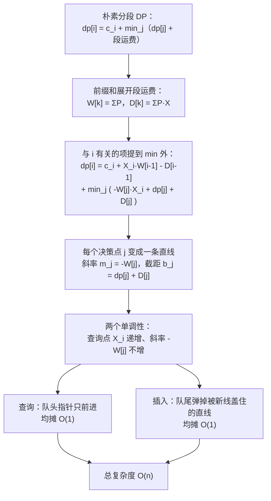

[[TOC]]

## 形式化题目

给定 $N$ 个位置 $0 = X_1 < X_2 < \dots < X_N$，每个位置 $i$ 有产品数 $P_i \geqslant 0$ 和建仓费用 $C_i \geqslant 0$。
选择一个下标集合 $S$ 建仓库，其余位置的产品只能运往编号更大的仓库。若 $i \notin S$，
令 $t(i)$ 为 $S$ 中大于 $i$ 的最小下标（因为 $t(N)$ 不存在，所以 $S$ **必须包含 $N$**），则代价为

$$
\sum_{i \in S} C_i \;+\; \sum_{i \notin S} P_i \,(X_{t(i)} - X_i)
$$

（每件产品运送 1 个单位距离费用为 1。）求这个代价的最小值。

把 $S$ 写为 $j_1 < j_2 < \dots < j_k = N$（另设哨兵 $j_0 = 0$），就得到等价表述：用若干**连续段**
$(j_{t-1}, j_t]$ 覆盖 $1 \dots N$，每段的产品全部运到段尾 $j_t$，求总代价最小。

## 正解

### 思路

先明确"每个工厂的产品去哪"。因为产品只能往编号更大的方向运，所以工厂 $i$ 的产品一定会
停在下游最近的那个仓库里——不可能越过一个仓库再往下送，那样只会多花运费。于是任何方案都把
工厂序列切成若干连续段，每段的产品运到段尾那个仓库。

设 $dp[i]$ 表示"前 $i$ 个工厂都处理完，且第 $i$ 个工厂**一定**建仓库"的最小费用，枚举**上一个仓库** $j$：

$$
dp[i] = C_i + \min_{0 \leqslant j < i}\Big\{ dp[j] + \text{将 } (j, i) \text{ 的产品运到 } X_i \text{ 的运费} \Big\}
$$

用前缀和表示运费。记

$$
W_k = \sum_{t \leqslant k} P_t, \qquad D_k = \sum_{t \leqslant k} P_t X_t
$$

则第 $(j, i)$ 段（不含端点 $j$，含 $i$ 之前的全部）的运费是

$$
\sum_{t=j+1}^{i-1} P_t (X_i - X_t) = X_i \,(W_{i-1} - W_j) - (D_{i-1} - D_j)
$$

注意 $dp$ 的下标是"仓库位置"，所以运输费里出现的是 $W_{i-1}, D_{i-1}$：产品从 $j+1$ 到 $i-1$ 运过来，
$i$ 自己的产品本来就在仓库里，运费为 0。（因为 $N$ 必须有仓库，答案就是 $dp[N]$；
第 $N$ 个工厂的产品也永远不会被运走。）

下面这张表用题面样例（$N=3$，$X=(0,5,9)$，$P=(5,3,6)$，$C=(10,100,10)$）把每个 $dp[i]$ 的
全部候选算出来。表中"运输费"列就是上面的公式，"$dp_j + \cdots$"列是候选值：

| $i$ | 候选 $j$ | 建仓费 $C_i$ | 运输费 $X_i(W_{i-1}-W_j)-(D_{i-1}-D_j)$ | $dp_j+\cdots$ |
| --- | --- | --- | --- | --- |
| 1 | 0 | 10 | 0 | 10 |
| 1 | **取最小** | | | $dp_1=10$（$j=0$） |
| 2 | 0 | 100 | 25 | 125 |
| 2 | 1 | 100 | 0 | 110 |
| 2 | **取最小** | | | $dp_2=110$（$j=1$） |
| 3 | 0 | 10 | 57 | 67 |
| 3 | 1 | 10 | 12 | 32 |
| 3 | 2 | 10 | 0 | 120 |
| 3 | **取最小** | | | $dp_3=32$（$j=1$） |

表的最后一行正好复现题面样例说明的两种方案：$j=0$ 表示只在工厂 3 建仓，运费
$9 \times 5 - 0 = 57$，总费用 $10 + 57 = 67$；$j=1$ 表示工厂 1、3 建仓，落在 $(1,3)$ 区间里的
工厂 2 把 3 件产品运到 9，运费 $9 \times (8-5) - (15-0) = 12$，总费用 $10 + 10 + 12 = 32$，
正是样例输出；$j=2$ 表示工厂 2、3 都建仓，没有运输费，但要付两次建仓费 $110 + 10 = 120$。
答案就是 $dp[N]$。

**瓶颈**：每个 $i$ 要枚举全部 $j < i$，共 $N(N-1)/2$ 次转移。$N = 10^6$ 时约 $5 \times 10^{11}$ 次，
必须消掉枚举。

**线性化**。把转移式里与 $j$ 有关的项单独拿出来，与 $i$ 有关的项提到 $\min$ 外面：

$$
dp[i] = \underbrace{C_i + X_i W_{i-1} - D_{i-1}}_{\text{只与 } i \text{ 有关}}
      + \min_{0 \leqslant j < i}\Big\{ \underbrace{(-W_j)}_{\text{斜率 } m_j} \cdot X_i + \underbrace{(dp[j] + D_j)}_{\text{截距 } b_j} \Big\}
$$

现在每个决策点 $j$ 对应一条直线 $y = m_j x + b_j$，而在 $i$ 处的代价就是
"这些直线在 $x = X_i$ 处的最小值"。这可以用**下凸壳**维护。把上面的样例继续算下去，
每条直线的参数与它在查询点上的取值是：

| $i$ | 查询点 $x_i$ | 队头起的壳上直线 $(m,b)$ | 各线在 $x_i$ 处的取值 | 胜出 | $dp_i$ |
| --- | --- | --- | --- | --- | --- |
| 1 | 0 | $(0,0)$ | $0 \times 0 + 0 = 0$ | $(0,0)$ | 10 |
| 2 | 5 | $(-5,10)$ | $-5 \times 5 + 10 = -15$ | $(-5,10)$ | 110 |
| 3 | 9 | $(-5,10)$、$(-8,125)$ | $-35$、$53$ | $(-5,10)$ | 32 |

两条直线的交点在 $x = \frac{125-10}{8-5} = \frac{115}{3} \approx 38.3$，远大于查询点 $x_3 = 9$，
所以在 $x_3 = 9$ 上旧线 $-5x+10$ 仍然更小：新线留在凸壳上，但暂时不是队头（一旦后面的
$X_i$ 越过 $38.3$，队头就会自动移到新线上）。$dp_3$ 由队头取值加上只与 $i$ 有关的量得到：

$$
dp_3 = C_3 + X_3 W_2 - D_2 + \min_{\text{队头}} = 10 + 9 \times 8 - 15 + (-35) = 32
$$

**为什么单调队列就够**。本题有两个单调性：

1. 题面保证各厂位置递增，$X_1 < X_2 < \dots < X_N$，所以**查询点单调不减**：
   队头某条线一旦不优于第二条，之后更不可能翻身，队头指针只前进、不回头。
2. $P_i \geqslant 0$ 使 $W_j = \sum_{t \leqslant j} P_t$ 单调不减，所以**插入的斜率 $-W_j$ 单调不增**：
   新线永远插在凸壳尾部，队尾只需检查"最后一条线的生效区间是否被新交点截空"。

两个条件都满足，于是不需要二分、不需要平衡树，凸壳用一条"队尾 `append`/`pop`、
队头用下标推进"的单调队列即可，每条直线最多进出一次，均摊 $O(1)$。

实现上还有两点：转移只依赖 $dp[i-1]$，所以不用保存整张 $dp$ 表，一个变量滚动即可；
$W, D$ 也是边读边累加的，因此连 $X, P, C$ 数组都不用存。判据用交叉相乘代替除法：两条旧线的
交点横坐标是 $x_{12}=\tfrac{b_2-b_1}{m_1-m_2}$，末线与新线的交点是 $x_{23}=\tfrac{b-b_2}{m_2-m}$，
当 $x_{12} \geqslant x_{23}$ 时末线被完全盖住。斜率单调不增即 $m_1 \geqslant m_2 \geqslant m$：
严格递减时两个分母都为正，两边同乘 $(m_1-m_2)(m_2-m)$（仍是正数）得到代码里的整数比较
`(b2 - b1) * (m2 - m) >= (b - b2) * (m1 - m2)`；出现相等斜率时，同一判据恰好退化为
"保留截距较小的那条直线"，结论不变。整个过程不做除法，没有浮点误差。

### 代码

@include-code(./main.py, python)

### 复杂度

- 时间复杂度：$O(N)$。外层扫描 $N$ 次，凸壳中每条直线最多入队、出队各一次，均摊 $O(1)$。
- 空间复杂度：$O(N)$，只用于两棵凸壳数组 `slope` / `intercept`；$W, D, dp$ 都是单个标量。
  读入按 1 MiB 分块处理，避免一次性留下全部 token。

## 总结

- 关键第一步是**看清方案的形状**：产品只能往山下运，所以每个仓库承接的必然是一段连续工厂，
  问题化为"把 $1 \dots N$ 切段、段内运到段尾"的一维线性 DP。
- 第二步是**前缀和展开**：把段运费写成 $X_i(W_{i-1}-W_j) - (D_{i-1}-D_j)$，
  于是与 $j$ 有关的只剩 $-W_j X_i + D_j$。
- 第三步是**斜率优化**：$dp[i] = C_i + X_i W_{i-1} - D_{i-1} + \min_j\{-W_j X_i + dp[j]+D_j\}$，
  决策点变成直线，查询变成"$x = X_i$ 处取最小"。
- 因为 $X_i$ 递增、$W_j$ 递增，查询点与斜率都单调，单调队列凸壳就能 $O(N)$ 解决；
  判据用整数乘法，无精度问题。
- 本题必须建工厂 $N$ 的仓库，这一点已经写进 $dp[N]$ 的定义里；$N = 1$ 时答案为 $C_1$。

## 图示解析

把上面的推导压缩成一条路线，方便读完后复盘：

图中上半部分是建模与化简：先有分段 DP，再用前缀和把转移拆成"只与 $i$ 有关"和"若干直线在
$X_i$ 处的最小值"。下半部分是数据结构的依据：两个单调性分别让查询和插入都只需要移动指针，
不需要二分与平衡树，最终把 $O(N^2)$ 降到 $O(N)$。
