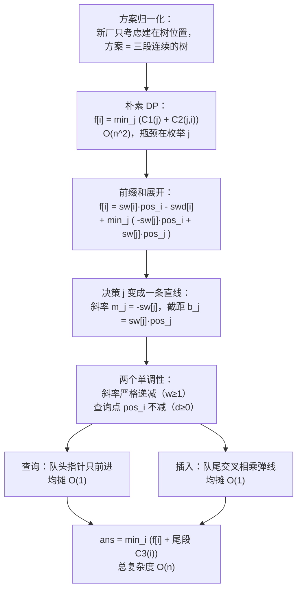

[[TOC]]

## 形式化题目

沿直线从山顶到山脚种着 $n$ 棵树，树 $i$ 重量为 $w_i$；$d_i$ 是树 $i$ 与树 $i+1$ 的间距，$d_n$ 是树 $n$ 到山脚的距离。记

$$
pos_1 = 0,\qquad pos_i = \sum_{k<i} d_k,\qquad pos_{n+1} = pos_n + d_n \ \text{（山脚）}.
$$

山脚已有一个锯木厂，还要在山路上**恰好**新修两个。木材只能向山下运，每棵树由它下游方向**最近**的那个锯木厂承接；每公斤每米运费 1 分。求所有新厂位置中总运费的最小值。

样例（$n=9$）：

```text
山顶
 │
 1(1)─2─2(2)─1─3(3)★─3─4(1)─1─5(3)─2─6(1)★─6─7(2)─1─8(1)─2─9(1)─1→山脚锯木厂
```

图中 `树号(重量)`，连线上的数字是间距，★ 是最优的两个新厂。运费分三段：树 1..3 运到 $pos=3$ 的厂得 $1{\times}3+2{\times}1+3{\times}0=5$，树 4..6 运到 $pos=9$ 的厂得 $1{\times}3+3{\times}2+1{\times}0=9$，树 7..9 运到山脚 $pos=19$ 得 $2{\times}4+1{\times}3+1{\times}1=12$，合计 $5+9+12=26$。

## 正解

### 思路

**1. 方案的形状：归一化到树位置。** 承接「最低一棵树 $b$」的厂，其费用 $\sum_k w_k(p-pos_k)$ 关于位置 $p$ 单调不减，而它必须放在 $p \geqslant pos_b$ 处，所以放 $p = pos_b$（树 $b$ 处）最优——新厂只需考虑建在树下。又因为木材只能下行，每个厂承接的必然是一段**连续**的树：若两个新厂位于树 $j < i$，则树 $1..j$ 运到厂 $j$、树 $j{+}1..i$ 运到厂 $i$、树 $i{+}1..n$ 运到山脚厂。

**2. 朴素 DP。** 记前缀和

$$
sw[i]=\sum_{k\leqslant i} w_k,\qquad swd[i]=\sum_{k\leqslant i} w_k\,pos_k,
$$

则三段运费分别是

$$
C_1(j)=sw[j]\,pos_j - swd[j],\quad
C_2(j,i)=(sw[i]-sw[j])\,pos_i - (swd[i]-swd[j]),\quad
C_3(i)=(sw[n]-sw[i])\,pos_{n+1}-(swd[n]-swd[i]).
$$

固定**较低**的厂 $i$，把「上一个厂 $j$」作为决策，定义 $f[i]=\min_{j<i}\{C_1(j)+C_2(j,i)\}$，最后

$$
\text{ans}=\min_{2\leqslant i\leqslant n}\big\{f[i]+C_3(i)\big\}
$$

（$i\geqslant 2$ 因为较低的厂必须在较高的厂下游；$i=n$ 时尾段为空 $C_3=0$）。每个 $f[i]$ 枚举 $i-1$ 个 $j$，总 $O(n^2)$；$n=2\times10^5$ 时约 $2\times10^{10}$ 次转移，这是瓶颈。

**3. 线性化：转移是直线族取最小。** 把 $C_1(j)+C_2(j,i)$ 整体展开，按「含 $j$ / 不含 $j$」分组（$-swd[j]$ 与 $+swd[j]$ 相消）：

$$
f[i]=\underbrace{sw[i]\,pos_i - swd[i]}_{\text{只与 } i \text{ 有关}}
+\min_{j<i}\Big\{\underbrace{(-sw[j])}_{\text{斜率 } m_j}\cdot pos_i + \underbrace{sw[j]\,pos_j}_{\text{截距 } b_j}\Big\}.
$$

$\min$ 里每个决策 $j$ 对应一条直线 $y_j(x)=m_jx+b_j$，问题变成「若干条固定直线在 $x=pos_i$ 处取最小值」，可用下凸壳维护。

**4. 为什么单调队列就够（双单调）。** 本题有两个单调性：

- $w_k\geqslant 1$ ⇒ $sw[j]$ 严格递增 ⇒ 斜率 $m_j=-sw[j]$ **严格递减**：新直线永远从壳尾进入，队尾只需判断末线是否被新线完全盖住；
- $d_i\geqslant 0$ ⇒ $pos_i$ 单调不减 ⇒ **查询点单调**：队头某条线一旦输给下一条，之后不可能翻身，队头指针只前进。

两个条件同时成立，凸壳两端都只移动指针，每条直线入队、出队各一次，均摊 $O(1)$，不需要二分或平衡树。判据用交点交叉相乘做整数比较，全程无浮点误差。

下面用样例展示每个 $i$ 的转移结果（$f[6]$ 的候选值依次为 $j=1..5$：$41,\ 29,\ 14,\ 29,\ 30$）：

| $i$ | $f[i]=\min_j\{C_1(j)+C_2(j,i)\}$ | 最优 $j$ | 尾段 $C_3(i)$ | $f[i]+C_3(i)$ |
| --- | --- | --- | --- | --- |
| 2 | 0 | 1 | 119 | 119 |
| 3 | 2 | 1 | 71 | 73 |
| 4 | 5 | 3 | 58 | 63 |
| 5 | 6 | 3 | 22 | 28 |
| 6 | 14 | 3 | 12 | **26** |
| 7 | 36 | 5 | 4 | 40 |
| 8 | 39 | 5 | 1 | 40 |
| 9 | 47 | 5 | 0 | 47 |

表中每行是「第二个厂建在树 $i$」时的最优代价，列含义依次为：转移最小值、达到最小值的上一个厂 $j$、树 $i{+}1..n$ 运到山脚的费用、二者之和。最小值 $26$ 出现在 $i=6$、$j=3$，正是形式化题目里 ★ 的方案；而 $i=7,8$ 时尾段更短但前两段运费更高，说明**必须同时权衡三段**，不能贪心地让某个厂独吞下游。

**5. 实现要点。** 边读入边推进 $pos$（读完第 $i$ 行的 $d_i$ 后 `pos += d` 恰好得到 $pos_{i+1}$，读完最后一行即山脚 $pos_{n+1}$）；对每个 $i\geqslant 2$ 先用队头算 $f[i]$，**再**入队直线 $(-sw[i],\ sw[i]pos_i)$，保证查询只用 $j<i$；读完全部数据后再逐个加 $C_3(i)$ 取最小。

### 代码

@include-code(./main.py, python)

### 复杂度

- 时间复杂度：$O(n)$。一次线性扫描，凸壳中每条直线最多入队、出队各一次，均摊 $O(1)$。对比朴素 DP 的 $O(n^2)$，$n=2\times10^5$ 时从约 $2\times10^{10}$ 次运算降到 $2\times10^5$ 次。
- 空间复杂度：$O(n)$。`sw`、`swd`、`f`、`tail` 各一个长度 $n{+}1$ 的数组（$n=2\times10^5$ 时实测峰值约 85 MB，在 128 MB 内），凸壳最多存 $n$ 条直线。

## 总结

- 运费模型的关键是**连续三段**：木材只能下行 ⇒ 每个厂承接一段连续的树 ⇒ 枚举「较低厂 $i$ + 上一个厂 $j$」覆盖全部方案，得到以 $j$ 为决策的一维 DP。
- **前缀和展开**是线性化的前提：$C_1+C_2$ 中所有含 $j$ 的项恰好凑成 $-sw[j]\,pos_i + sw[j]\,pos_j$，即一条斜率为 $-sw[j]$、截距为 $sw[j]pos_j$ 的直线在 $x=pos_i$ 处的值。
- **双单调**（斜率递减、查询点不减）让下凸壳退化为单调队列，队头队尾各一个指针，均摊 $O(1)$；判据用整数交叉相乘，无精度隐患。
- 边界：$n=2$ 时唯一方案 $j=1,i=2$；$d_i=0$ 时 $pos$ 非严格递增，仍满足查询单调；答案可达 $10^{10}$ 量级，需要 64 位整数（Python 天然支持）。

## 图示解析

把全文推导压缩成一条路线，方便读完后复盘：



上半部分是建模与化简：先确定方案的三段形状，再用前缀和把转移拆成「只与 $i$ 有关」加「直线族在 $pos_i$ 处取最小」。下半部分是数据结构依据：双单调性让插入与查询都只移动指针，最终把 $O(n^2)$ 降到 $O(n)$。
