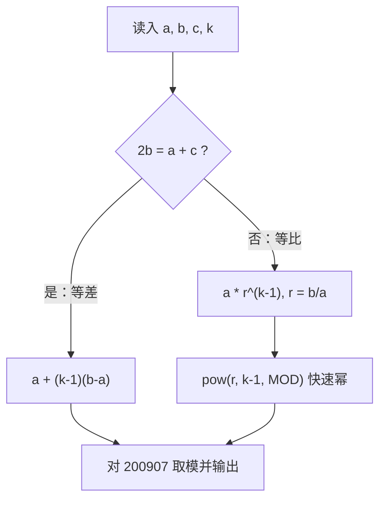

[[TOC]]

## 形式化题目

给定整数 $a, b, c, k$。已知某数列前三项依次为 $a, b, c$，且该数列**或者是等差数列，或者是等比数列**（二者必居其一）。求第 $k$ 项对 $M = 200907$ 取模的值。多组数据。

样例恰好一组等差、一组等比，先用表格看清判型与计算路径：

| 组 | 前三项 $(a, b, c)$ | $k$ | 判型依据 | 计算过程 | 输出 |
| --- | --- | --- | --- | --- | --- |
| 1 | $(1, 2, 3)$ | 5 | $2 \times 2 = 1 + 3$ → 等差 | $1 + (5-1) \times 1 = 5$ | 5 |
| 2 | $(1, 2, 4)$ | 5 | $2 \times 2 \neq 1 + 4$ → 等比 | $1 \times 2^{4} \bmod 200907 = 16$ | 16 |

读表要点：判断只用前三项的中项关系；等差走加法通项，等比走乘方通项，乘方必须在模 $200907$ 意义下计算。

## 正解

### 思路

**朴素想法：逐项递推。** 判型之后从首项出发，等差每次加公差 $d$、等比每次乘公比 $r$，走 $k-1$ 步得到第 $k$ 项。这个做法有两个致命瓶颈：

1. $k \leqslant 10^9$，$O(k)$ 步递推在 $1000$ ms 内约需 $10^9$ 次操作，完全不可行；
2. 等比分支即使能跑，中间值也指数爆炸（$a, r$ 可达 $10^9$，乘几十次位数就失控），必须随时落在模 $M$ 的范围内。

于是优化方向非常明确：**步数从 $k$ 压到 $O(\log k)$ 以内 → 通项公式；中间值恒有界 → 边算边取模**。两件事分别由"等差/等比通项"和"二进制快速幂"解决。

**第一步：判型。** 前三项等差的充要条件是 $2b = a + c$。题面保证序列非等差即等比，所以该条件为假时必为等比，两个分支互斥且完备，$O(1)$。

**第二步：等差通项，$O(1)$。** 公差 $d = b - a$（由 $a \leqslant b$ 知 $d \geqslant 0$），通项

$$a_k = a + (k-1)d$$

一次乘加即得。$(k-1)d$ 可达 $10^{18}$ 量级，Python 的任意精度整数天然安全，最后对 $M$ 取模即可。

**第三步：等比通项 + 二进制快速幂。** 公比 $r = b/a$（官方数据均整除），通项 $a_k = a \cdot r^{k-1}$。指数 $k-1$ 可达 $10^9 - 1$，连乘不可行；二进制快速幂把指数拆成二进制位：底数反复平方、遇到指数为 1 的位就把底数累乘进答案，**每一步都取模**，乘法次数从 $k-1$ 次降到 $\lceil \log_2 k \rceil \leqslant 30$ 次。Python 三参数 `pow(r, k - 1, MOD)` 底层正是这一过程。

**第四步：取模时机。** 由模乘同余性质 $(x \cdot y) \bmod M = ((x \bmod M)(y \bmod M)) \bmod M$，所以等比分支写成 `a % MOD * pow(r, k-1, MOD) % MOD`：先把首项折进模，再乘快速幂结果，最后一次取模收尾——全程中间值不超过 $M^2 \approx 4 \times 10^{10}$。

下图是每组数据的全部控制流，一次比较决定分支，两个分支各套一个通项：

**边界核对：** $k = 1$ 时等差式中 $(k-1) = 0$ 自然退化为首项，等比 `pow(r, 0, MOD) = 1` 也返回 $a \bmod M$；$a = b = c$ 时 $2b = a + c$ 成立，走等差分支且 $d = 0$，结果恒为 $a \bmod M$（与等比 $r = 1$ 的答案一致，无歧义）。

**样例验算：** 第一组 $2 \times 2 = 1 + 3$ 判等差，$1 + 4 \times 1 = 5$；第二组 $2 \times 2 \neq 1 + 4$ 判等比，$r = 2/1 = 2$，$1 \times 2^4 \bmod 200907 = 16$，与题面输出一致。

### 代码

@include-code(./main.py, python)

### 复杂度

每组数据判型与等差分支均为 $O(1)$，等比分支快速幂 $O(\log k)$ 次乘法，总时间 $O(T \log k)$（最坏约 $100 \times 30$ 次乘法），与 C++ 手写快速幂正解同阶；额外空间 $O(1)$。实测官方 10 组数据全部 PASS，单点约 0.018 s、峰值 14.6 MB，对 1000 ms / 128 MB 的限制余量很大。

## 总结

- 判型只看一件事：$2b = a + c$ 则等差，否则等比（题面保证必居其一）。
- 朴素逐项递推的瓶颈是 $k$ 高达 $10^9$ 且等比中间值爆炸；通项公式把步数降到 $O(1)$ / $O(\log k)$，模意义快速幂保证中间值恒有界。
- 大指数幂取模用快速幂，Python 里就是三参数 `pow(r, k - 1, MOD)`，一行完成 $O(\log k)$ 次乘法。
- 取模时机：首项先 `% MOD`，乘幂结果后再 `% MOD` 收尾。
