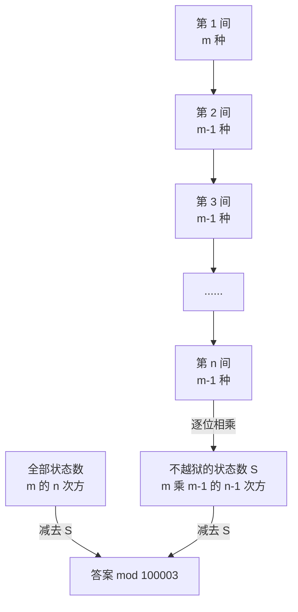

[[TOC]]

## 形式化题目

有 $n$ 个连续编号的房间，每个房间关押一名犯人，每人信仰 $m$ 种宗教中的一种。一个**状态**就是一个序列 $a = (a_1, a_2, \dots, a_n)$，其中 $a_i \in [m] = \{1, 2, \dots, m\}$ 表示第 $i$ 个房间的宗教。

若存在 $i \in \{1, 2, \dots, n-1\}$ 使 $a_i = a_{i+1}$，称该状态**可能越狱**。求

$$
\#\bigl\{\, a \in [m]^n \;:\; \exists\, i,\ a_i = a_{i+1} \,\bigr\} \bmod 100003 .
$$

以样例 $m = 2$、$n = 3$ 为例，$2^3 = 8$ 个状态逐个判定如下（把两种宗教记作 $0$ 和 $1$）：

| 状态 | 相邻对 $(a_1,a_2)$ | 相邻对 $(a_2,a_3)$ | 可能越狱 |
| --- | --- | --- | --- |
| $000$ | 相同 | 相同 | 是 |
| $001$ | 相同 | 不同 | 是 |
| $010$ | 不同 | 不同 | **否** |
| $011$ | 不同 | 相同 | 是 |
| $100$ | 不同 | 相同 | 是 |
| $101$ | 不同 | 不同 | **否** |
| $110$ | 相同 | 不同 | 是 |
| $111$ | 相同 | 相同 | 是 |

注意 $8$ 个状态里只有 $010$ 和 $101$ 两行「两列全是不同」，这两个状态恰好就是**不越狱**的全部情形；剩下的 $8 - 2 = 6$ 个都越狱，与样例输出 `6` 一致。这个观察提示我们：从「不越狱」这一侧数会容易得多。

## 正解

### 思路

#### 1. 朴素做法卡在哪里

最直接的做法就是照着定义数：枚举所有 $m^n$ 个状态，逐个检查是否存在相邻相同。

```
枚举 a ∈ [m]^n            # 共 m^n 个状态
    若存在 i 使 a[i] == a[i+1]：ans += 1
输出 ans mod 100003
```

这里的瓶颈不是常数，而是**枚举本身**：$m$ 最大 $10^8$、$n$ 最大 $10^{12}$，$m^n$ 是一个天文数字，连生成一个状态都需要 $10^{12}$ 步，根本走不到「检查」那一步。所以本题不能靠优化常数过关，必须换一种不枚举状态的计数方式。

就算把规模缩小到能枚举，正面数也还有一层麻烦：「$\exists i$ 使 $a_i = a_{i+1}$」这种「出现一次就成立」的条件，用容斥正面数要把 $n-1$ 个事件 $A_i = \{a_i = a_{i+1}\}$ 做多层交并，一个状态有三对相邻相同时会被重复计入，很容易数错。

#### 2. 正难则反：先数「不越狱」

朴素的瓶颈在于存在量词，那就取补集，把 $\exists$ 换成 $\forall$。记

$$
S = \bigl\{\, a \in [m]^n \;:\; \forall\, i \in \{1,\dots,n-1\},\ a_i \neq a_{i+1} \,\bigr\}
$$

即**任何相邻两个房间宗教都不同**的状态集合。由 $S$ 与所求集合互补：

$$
\text{ans} = m^n - |S| \pmod{100003} .
$$

#### 3. 补集里逐位独立，乘法原理直接相乘

$S$ 里的条件 $a_i \neq a_{i+1}$ 只涉及相邻两位，是一组**局部约束**。按 $a_1, a_2, \dots, a_n$ 的顺序逐位确定：

- $a_1$ 没有任何限制，$m$ 种选法；
- 只要 $a_i$ 定了，$a_{i+1}$ 就只需避开 $a_i$ 这一个值，恰好有 $m - 1$ 种选法。

关键在于**这个「$m-1$」与 $a_i$ 究竟取了哪个值无关**：无论 $a_i$ 是哪一个宗教，被排除的都只有一个值。所以从第 2 位到第 $n$ 位，每个位置的可选数都恒为 $m-1$，各层的选择数相同，可以整段相乘：

$$
|S| = m \cdot (m-1)^{n-1} .
$$

下面这张图的上半部分是「不越狱」状态的逐位决策链，下半部分是答案如何由两个计数相减得到：



图中上半部分的链说明 $|S|$ 是怎么来的：链上每一格的候选数只和「上一格选了什么」有关，且恒为 $m-1$，所以把它们乘起来就得到 $m(m-1)^{n-1}$。下半部分说明最终答案是全集 $m^n$ 减去补集 $|S|$，两步都只需在模意义下算出两个幂。

#### 4. 两个幂用快速幂

$n$ 可以到 $10^{12}$，朴素地连乘 $n-1$ 次会超时。快速幂把指数按二进制拆分，只做 $O(\log n)$ 次模乘；Python 的内建函数 `pow(base, exp, mod)` 就是模快速幂，直接调用即可：

```python
all_states = pow(m, n, MOD)                 # m^n mod 100003
safe_states = m * pow(m - 1, n - 1, MOD)    # m(m-1)^(n-1) mod 100003
print((all_states - safe_states) % MOD)
```

注意 `safe_states` 里的 `m *` 不需要先取模：$m \leqslant 10^8$，乘一个小于 $100003$ 的余数最多到 $10^{13}$，Python 的整数不会溢出；而 `(x) % MOD` 对负数也返回非负余数，所以「全集减补集」这一步不必额外写 `+ MOD`。

### 代码

@include-code(./main.py, python)

### 复杂度

- 时间复杂度：$O(\log n)$。两次模快速幂各需 $O(\log n)$ 次模乘（$n \leqslant 10^{12}$ 时约 $40$ 次），其余为 $O(1)$ 运算；与 $m$ 无关。若不用快速幂而写成 $n-1$ 次循环连乘，复杂度会退化为 $O(n)$，在 $n = 10^{12}$ 时必然超时。
- 空间复杂度：$O(1)$。只保存 `m`、`n`、两个中间结果和模数常量，没有数组与递归。

## 总结

- 「至少一对相邻相同」带存在量词，正面数要处理重复与容斥；**正难则反**取补集后条件变成「所有相邻都不同」的全称形式。
- 补集内的约束是**逐位局部**的：只要前一位定了，后一位的可选数恒为 $m-1$，与具体取值无关，于是乘法原理给出 $|S| = m(m-1)^{n-1}$。
- 答案 $= m^n - m(m-1)^{n-1} \pmod{100003}$，两个幂用 `pow(a, b, mod)` 求，整体复杂度 $O(\log n)$。
- 边界自检：$n = 1$ 时公式给出 $0$（无相邻对）；$m = 1$、$n \geqslant 2$ 时给出 $1$（唯一状态即越狱）。
