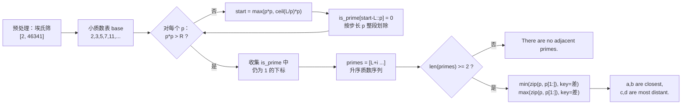

[[TOC]]

## 形式化题目

给定整数 $L, R$，记闭区间 $[L, R]$ 内的质数按升序为

$$
p_1 < p_2 < \cdots < p_k .
$$

要求找出相邻两项之差最小的一对，以及差最大的一对，即求

$$
\arg\min_{1 \le i < k}\ (p_{i+1} - p_i), \qquad \arg\max_{1 \le i < k}\ (p_{i+1} - p_i).
$$

当极值被多对同时取得时，输出下标 $i$ 更小（即数值更靠前）的那一对。若 $k < 2$，则不存在相邻质数对。

约束：$1 \leqslant L < R < 2^{31}$，$R - L \leqslant 10^6$，多组数据直到输入结束。

## 正解

### 思路

#### 1. 朴素做法：逐个试除

最直接的写法是枚举 $[L, R]$ 中的每个数 $n$，用 $2 \sim \sqrt{n}$ 试除判断它是不是质数：

```python
for n in range(L, R + 1):
    if all(n % d for d in range(2, int(n ** 0.5) + 1)):  # 不可行
        primes.append(n)
```

它的代价是 $O\big((R-L)\sqrt{R}\big)$。代入最坏情况 $R-L = 10^6$、$\sqrt{R} \approx 46341$，约为 $4.6 \times 10^{10}$ 次取模，必然超时。问题出在**同一个 $n$ 被反复地从零开始试除**，前面所有数试除得到的信息全被丢弃了。

#### 2. 为什么不能直接筛到 $R$

换一个思路：用埃氏筛一次性筛出 $[2, R]$ 的质数表，再批量取相邻质数。但这里 $R$ 可以接近 $2^{31}$，布尔数组需要 $2^{31}$ 字节 $\approx 2\ \text{GB}$，远超 128 MB 的内存限制，连开都开不出来。

**这就是本题的核心矛盾：数值上界极大（$2^{31}$），但区间长度极小（$10^6$）。**

#### 3. 关键观察：合数的小质因子一定很小

设 $n \leqslant R$ 是合数，把它分解为 $n = a \times b$（$2 \leqslant a \leqslant b$），则

$$
a \leqslant \sqrt{n} \leqslant \sqrt{R} < 46341 .
$$

也就是说：**$[L, R]$ 中任何一个合数，都一定能被某个不超过 $46341$ 的质数整除。** 反过来，只要把 $[2, 46341]$ 内的质数全部取来，用它们去"划掉"$[L, R]$ 中的倍数，剩下的就全是质数——而 $[2, 46341]$ 的筛只需要 46 KB。

于是算法分成两层：

| 层 | 作用域 | 数据量 | 内存 |
| --- | --- | --- | --- |
| 预处理：埃氏筛 | $[2,\ 46341]$ | 46342 个候选 | 46 KB |
| 主体：分段筛 | $[L,\ R]$，长度 $\leqslant 10^6$ | 最多 $10^6+1$ 个候选 | 1 MB |

内存由"区间长度"而非"数值上界"决定，矛盾就此化解。

#### 4. 分段筛的划除细节

开一个长度为 $R - L + 1$ 的布尔数组 `is_prime`，**下标 $i$ 代表数字 $L + i$**，初值全部置 1（先假定都是质数）。对预处理的每个小质数 $p$：

1. 若 $p^2 > R$，说明 $p$ 已经大到无法在区间内构成合数（最小的候选是 $p^2$ 本身），后面的 $p$ 只会更大，直接 `break`。
2. 找出第一个要划掉的倍数位置：

$$
\text{start} = \max\big(p^2,\ \lceil L/p \rceil \cdot p\big).
$$

   两个下界各有道理：$p^2$ 以下的部分早就被更小的质数划过了，不必重划；$\lceil L/p \rceil \cdot p$ 则是把起点抬进区间 $[L, R]$。取 $\max$ 同时满足两者——当 $p \geqslant L$ 时它就是 $p^2$，避免把质数 $p$ 自己误划。
3. 从 `start` 起，每 $p$ 个位置划一次，即把 `is_prime[start-L::p]` 整段置 0。

最后单独处理 $L = 1$ 的情形：数字 1 既不是质数也不是合数，但按上面的流程它永远不会被任何 $p$ 划掉，需要手工把下标 0 置 0。做完这些，`is_prime` 中为 1 的位置对应的数字就是 $[L, R]$ 的全部质数。

#### 5. 样例推演

以样例 `2 17` 为例，$R = 17 < 46341$，小质数表为 $2, 3, 5, 7, 11, 13, \dots$，逐个划除：

| 小质数 $p$ | $p^2 > R$? | start $=\max(p^2,\lceil L/p\rceil p)$ | 被划掉的数字 | 剩余候选 |
| --- | --- | --- | --- | --- |
| 2 | 否 | $\max(4, 4) = 4$ | 4, 6, 8, 10, 12, 14, 16 | 2,3,5,7,9,11,13,15,17 |
| 3 | 否 | $\max(9, 9) = 9$ | 9, 15 | 2,3,5,7,11,13,17 |
| 5 | **是**（$25 > 17$） | — | 循环在此 break | 2,3,5,7,11,13,17 |

得到质数序列 $2, 3, 5, 7, 11, 13, 17$，相邻差依次为

$$
1,\ 2,\ 2,\ 4,\ 2,\ 4 .
$$

最小差 $1$ 对应 $(2, 3)$，最大差 $4$ 第一次出现在 $(7, 11)$，与样例输出一致。

再看第二个样例 `14 17`：区间内质数只有 $17$ 一个，$k = 1 < 2$，输出 `There are no adjacent primes.`，同样吻合。

#### 6. 取最值对：并列取靠前

`primes` 已经升序，相邻差就是 `primes[i+1] - primes[i]`。Python 的 `max` / `min` 在遇到多个极值时返回**第一个**达到极值的元素，这恰好就是题面要求的"输出靠前的素数对"，不需要额外写判等逻辑：

```python
choose = max if want_max else min
return choose(zip(primes, primes[1:]), key=lambda pair: pair[1] - pair[0])
```

以 `2 17` 为例，`zip(primes, primes[1:])` 给出 $(2,3),(3,5),(5,7),(7,11),(11,13),(13,17)$，键分别为 $1,2,2,4,2,4$；`max` 返回第一个键为 4 的 $(7,11)$，`min` 返回第一个键为 1 的 $(2,3)$。

最后按 `a,b are closest, c,d are most distant.` 的格式输出即可。

### 代码

@include-code(./main.py, python)

### 复杂度

- 时间复杂度：预处理部分 $O(\sqrt{R} \log\log R)$，只做一次；之后每组数据的分段筛为 $O\big((R-L+1)\log\log R\big)$。代入 $R-L \leqslant 10^6$、$\sqrt{R} \approx 46341$，远优于逐个试除的 $O\big((R-L)\sqrt{R}\big)$，二者在 $R-L = 10^6$ 时相差约 $4.6 \times 10^4$ 倍。
- 空间复杂度：$O(\sqrt{R} + (R - L + 1))$，即 46 KB 的小质数表加上最大 1 MB 的区间标记数组，与直接筛到 $R$ 所需的 $O(R) \approx 2\ \text{GB}$ 相比是决定性的差异。

## 图示解析

下图给出 $L = 10^9$、$R = 10^9 + 20$ 这一小段区间的分段筛全流程。上排是 $[2, 46341]$ 预处理得到的小质数，下排是区间内每个位置的标记状态；箭头表示某质数正在划除它的倍数。



下表展示这一段的筛除过程（`·` 表示仍被标记为质数候选，`×` 表示已被划掉），可以清楚看到区间长度只有 21，全部工作都在这一小段内完成：

| 数字 | 1000000000 | … | 1000000007 | 1000000008 | 1000000009 | 1000000010 | … | 1000000020 |
| --- | --- | --- | --- | --- | --- | --- | --- | --- |
| 被 $p=7$ 划 | × | × | · | × | · | × | × | × |
| 被 $p=11$ 划 | × | × | · | × | · | × | × | × |
| 最终 `is_prime` | 0 | … | **1** | 0 | **1** | 0 | … | 0 |

划除结束后只剩 $1000000007$ 与 $1000000009$ 两个质数，它们就是这段区间里唯一的相邻质数对，因此既是最近的也是……实际上是唯一的一对，差为 2。这组数据正好出现在本题的测试点 `1000000000 1001000000` 中——该点的答案 $1000000007,1000000009$ 正是最小的那一对。

## 总结

本题是"分段筛（区间筛）"的模板题，它的全部内容可以浓缩成一句观察：

> 若 $n \leqslant R$ 是合数，则 $n$ 必有不超过 $\sqrt{R}$ 的质因子。

由此把一次不可能的"筛到 $R$"拆成两次可行的筛：一次在极小的 $[2, \sqrt{R}]$ 上建立质数表，一次在极小的 $[L, R]$ 上标记合数。当题面同时给出**巨大的数值上界**和**极小的区间长度**时，这几乎总是标准出路——内存和时间的开销都应该绑定在区间长度上，而不是数值本身上。

实现上还有两个 Python 细节值得记住：用 `bytearray` 的扩展切片赋值（`is_prime[start-L::p] = 0`）完成整段划除，循环体在 C 层执行，比手写 `for` 快两个数量级；取"并列最靠前"的一对时直接依赖 `min`/`max` 返回首个极值的语义，不必额外比较下标。
