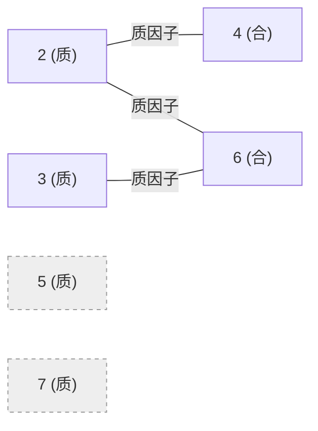

[[TOC]]

## 形式化题目

给定整数 $n$，考虑价值集合

$$
V = \{2, 3, \dots, n+1\}.
$$

若 $p$ 是质数、$p \mid v$ 且 $p \neq v$，则称价值 $p$ 与价值 $v$ 冲突。冲突是相互的，于是得到一张无向图 $G_n = (V, E)$。

求 $G_n$ 的染色数 $k$（所需颜色数的最小值），并给出一种使用恰好 $k$ 种颜色的染色方案。

## 正解

### 思路

#### 1. 朴素做法的两个瓶颈

照字面做，需要枚举每一对价值判断是否冲突，建出图，再求图的染色数。这里有**两处**会卡住：

- 建图要检查约 $n^2/2$ 对价值，$n = 10^5$ 时约 $5 \times 10^9$ 对；
- 更致命的是，一般图的染色数是 NP-hard 问题。就算把建图优化到 $O(n)$，只要还打算「对图跑染色搜索」，算法复杂度依然是错的。

所以正解不能来自「更快的建图 + 通用染色搜索」，必须先手算出这张图长什么样。

#### 2. 关键观察：每条边都是「质数 — 合数」

看冲突的定义：$p$ 必须是**质数**且 $p \mid v$、$p \neq v$。这意味着 $v = p \cdot t$ 且 $t \geqslant 2$，于是 $v$ 必定是**合数**。

- 不会有「质数—质数」边：两个不同质数互不整除，而 $p \mid p$ 被 $p \neq v$ 排除；
- 不会有「合数—合数」边：合数不满足「是质因子」的条件，没有资格当除数端。

也就是说，$G_n$ 里每条边都是一端质数、一端合数，这正是二分图的形状。按「质数 / 合数」两类分色，天然满足所有约束：

$$
c(v) = \begin{cases} 1, & v \text{ 是质数},\\ 2, & v \text{ 是合数}.\end{cases}
$$

下面画出 $n = 6$（价值 $2 \sim 7$）时的冲突图，边只从质数连向它的倍数。

观察重点：$2, 3, 5, 7$ 全是质数，它们之间没有任何边，可以共用一种颜色；所有边都终止在合数 $4, 6$ 上，它们共用另一种颜色；像 $5$ 与 $7$ 这样「没有倍数落在范围内」的质数是孤立点，随便涂哪一色都合法。这张图说明了 $G_n$ 为什么是二分图，而「一种颜色不够」的原因就藏在 $2$ 与 $4$ 之间那条边上。

#### 3. 颜色数 $k$ 到底是 1 还是 2

上面的方案用了 2 种颜色，但它未必最优——如果图中根本没有边，1 种颜色就够了。

- $n = 1$：$V = \{2\}$，没有边，$k = 1$；
- $n = 2$：$V = \{2, 3\}$，$2 \nmid 3$ 且 $3 \nmid 2$，没有边，$k = 1$；
- $n \geqslant 3$：$V$ 同时包含 $2$ 和 $4$，而 $2$ 是 $4$ 的质因子，二者必须异色，所以 $k \geqslant 2$；上面的方案恰好用 2 色，于是 $k = 2$。

$n \geqslant 3$ 时下界与上界在 2 处相遇，方案就是最优方案。

#### 4. 样例推演

以题面样例 $n = 3$ 为例，价值为 $2, 3, 4$：

| 珠宝编号 $i$ | 价值 $v = i+1$ | 是质数？ | 颜色 |
| --- | --- | --- | --- |
| 1 | 2 | 是 | 1 |
| 2 | 3 | 是 | 1 |
| 3 | 4 | 否（$2 \mid 4$） | 2 |

颜色数 $k = 2$，输出 `2` 与 `1 1 2`，与样例一致；约束边只有 $(2,4)$ 一条，两端颜色 $1 \neq 2$，合法。

再看样例 2，$n = 4$ 时多出价值 $5$（质数，涂 1 号色），输出 `2` 与 `1 1 2 1`，同样合法。

#### 5. 剩下的事：快速判断质数

价值的上界只有 $n + 1 \leqslant 100001$。可以直接对每个 $v$ 试除到 $\sqrt v$，但那是 $O(n\sqrt n) \approx 3\times 10^7$ 次 Python 层取模。改用埃氏筛，令 $p$ 只扫到 $\lfloor \sqrt{n+1} \rfloor$，把 $p$ 从 $p^2$ 起的倍数整片划掉：

- 起点取 $p^2$：$p$ 更小的倍数已被更小的质数划掉，重复划没有意义；
- 上界取 $\lfloor \sqrt{n+1} \rfloor$：更大的 $p$ 满足 $p^2 > n+1$，一个位置也划不到。

#### 6. 边界情况

| $n$ | $V$ | 边 | $k$ | 输出第二行 |
| --- | --- | --- | --- | --- |
| 1 | $\{2\}$ | 无 | 1 | `1` |
| 2 | $\{2,3\}$ | 无 | 1 | `1 1` |
| 3 | $\{2,3,4\}$ | $(2,4)$ | 2 | `1 1 2` |
| 4 | $\{2,3,4,5\}$ | $(2,4)$ | 2 | `1 1 2 1` |

$n = 1$ 与 $n = 2$ 是仅有的两种退化情况，此时第二行全是 1、第一行是 `1`；$n \geqslant 3$ 起第一行固定为 `2`。代码里的 `count = 2 if n >= 3 else 1` 处理的正是这个分界。

### 代码

@include-code(./main.py, python)

### 复杂度

- **时间**：$O(n \log\log n)$。埃氏筛的划除次数为

$$
\sum_{p \leqslant \sqrt{n+1}} \frac{n+1}{p} = O(n \log\log n),
$$

  且切片赋值在 C 层完成；生成颜色与输出各是 $O(n)$。对比朴素试除的 $O(n\sqrt n)$，$n = 10^5$ 时内层操作从 $3 \times 10^7$ 次降到可忽略，实测单组数据 0.02--0.03 s（限时 1000 ms）。

- **空间**：$O(n)$。质数标记表是 $n + 2$ 字节的 `bytearray`（约 98 KB），颜色列表约 0.8 MB，实测峰值约 17 MB（限 128 MB）。

## 总结

本题的难点不在代码量，而在**先看清图的形状再动手**：

1. 冲突边的定义已经写死了方向——除数端必须是质数、被除数端必然是合数，所以 $G_n$ 一定是二分图；
2. 二分图的染色数只有 1 和 2 两种可能，取哪个完全由「有没有边」决定，而 $n \geqslant 3$ 时 $2$ 与 $4$ 之间必然有边；
3. 于是答案退化成一句判质数：质数涂 1、合数涂 2，$n \leqslant 2$ 时退化成全 1。

想清楚这一点之后，题目只剩下「筛出 $[2, n+1]$ 里的质数」这一件机械工作。本题使用 special judge，只要 $k$ 正确、每条约束边两端异色，任何方案都会被接受。
