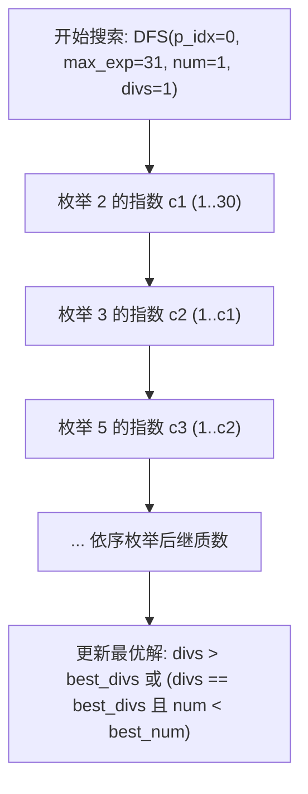

[[TOC]]

## 形式化题目

对于正整数 $x$，记 $d(x)$ 为 $x$ 的正约数个数。若对所有满足 $1 \leqslant y < x$ 的正整数 $y$，均有 $d(y) < d(x)$，则称 $x$ 为反素数（Antiprime）。

给定正整数 $n$（$1 \leqslant n \leqslant 2 \times 10^9$），求出满足 $x \leqslant n$ 的最大反素数 $x$。

## 正解

### 思路

#### 1. 问题等价转化

反素数要求任何严格小于它的数，约数个数都严格小于它。由此可得出以下两条关键性质：
1. **约数个数最多**：在区间 $[1, n]$ 内，不存在任何数的约数个数严格大于最终所求反素数。若存在某个 $y \leqslant n$ 使得 $d(y) > d(x)$，则在区间 $[x+1, n]$ 中必然能找到约数个数超过 $d(x)$ 的数，与 $x$ 是不超过 $n$ 的最大反素数矛盾。
2. **相同约数个数取最小**：若有多个数的约数个数相同且达到最大值，反素数必然是其中数值最小的那一个。因为如果选了较大的数 $z > x$ 且 $d(z) = d(x)$，那么根据定义，存在比 $z$ 小的数 $x$ 使得 $d(x) \geqslant d(z)$，则 $z$ 本身就不是反素数。

因此，**求不超过 $n$ 的最大反素数，等价于在 $[1, n]$ 中寻找约数个数最多、且数值尽可能小的数**。

#### 2. 质因子与指数单调性

根据算术基本定理，任何正整数 $x$ 都可以唯一分解为若干质因子的乘积：
$$x = \prod_{i=1}^k p_i^{c_i} = 2^{c_1} \cdot 3^{c_2} \cdot 5^{c_3} \cdots p_k^{c_k}$$
其正约数个数公式为：
$$d(x) = \prod_{i=1}^k (c_i + 1) = (c_1 + 1)(c_2 + 1)\cdots(c_k + 1)$$

观察约数个数公式可以发现：约数个数只与指数多重集 $\{c_i\}$ 有关，与具体的质数底数无关。
若存在 $i < j$（即质数 $p_i < p_j$）使得指数 $c_i < c_j$，我们只需交换指数 $c_i$ 与 $c_j$，构成新数：
$$x' = x \cdot \left(\frac{p_i}{p_j}\right)^{c_j - c_i}$$
由于 $p_i < p_j$ 且 $c_j - c_i > 0$，必有 $x' < x$。
同时 $d(x') = d(x)$。也就是说，我们找到了一个严格更小的数 $x'$，其约数个数与 $x$ 完全相同。根据前面的分析，数值更大的 $x$ 绝不可能是反素数。

由此得到核心推论：**反素数的质因子必由前若干个连续素数构成，且质因子指数单调不增**：
$$c_1 \geqslant c_2 \geqslant c_3 \geqslant \dots \geqslant c_k \geqslant 0$$

#### 3. 搜索范围与剪枝

1. **素数个数上界**：
   前 10 个素数的乘积为：
   $$2 \times 3 \times 5 \times 7 \times 11 \times 13 \times 17 \times 19 \times 23 \times 29 = 6{,}469{,}693{,}230 > 2 \times 10^9$$
   因此在 $n \leqslant 2 \times 10^9$ 的范围内，任何候选数最多包含前 10 个素数。
2. **最大指数上界**：
   因为 $2^{31} > 2 \times 10^9$，所以最小素数 $2$ 的指数 $c_1 \leqslant 30$。
3. **DFS 搜索流程**：
   从最小素数 $2$ 开始按序递归枚举每个素数的指数：
   - 当前素数 $p_{idx}$ 的指数 $c$ 必须满足 $0 \leqslant c \leqslant c_{idx-1}$（保证指数单调不增）；
   - 累乘过程中如果超出 $n$ 则立即剪枝回溯；
   - 遍历完或无法继续乘时，比较当前累积约数个数与全局最优解：优先选择约数个数更大者；约数个数相同时选择数值更小者。

### 可视化解析

以 $n=1000$ 为例，前几个连续素数为 $[2, 3, 5, 7, 11]$。搜索树只在非递增指数序列上展开，候选形态如下表所示：

| 质因子分解 | 对应数值 $x$ | 指数序列 | 约数个数 $d(x)$ | 是否更优 / 说明 |
| :--- | :--- | :--- | :--- | :--- |
| $2^9$ | $512$ | $[9]$ | $10$ | 初始较优 |
| $2^5 \times 3^2$ | $288$ | $[5, 2]$ | $6 \times 3 = 18$ | 约数更多 |
| $2^4 \times 3^2 \times 5^1$ | $720$ | $[4, 2, 1]$ | $5 \times 3 \times 2 = 30$ | 约数更多 |
| $2^3 \times 3^1 \times 5^1 \times 7^1$ | $840$ | $[3, 1, 1, 1]$ | $4 \times 2 \times 2 \times 2 = 32$ | **最优解（全局最多）** |
| $2^2 \times 3^2 \times 5^1 \times 7^1$ | $1260$ | $[2, 2, 1, 1]$ | $3 \times 3 \times 2 \times 2 = 36$ | $> 1000$，剪枝超出范围 |

状态转移逻辑如下图所示：

### 代码

Python 版：

@include-code(./main.py, python)

C++ 版（同一算法）：

@include-code(./main.cpp, cpp)

### 复杂度

- **时间复杂度**：满足 $\prod_{i=1}^k p_i^{c_i} \leqslant 2 \times 10^9$ 且 $c_1 \geqslant c_2 \geqslant \dots$ 的搜索状态数极其有限（合法状态总数不足几千个）。DFS 实际访问节点极少，运行耗时低于 $0.03\text{ s}$。
- **空间复杂度**：递归深度不超过质数个数（最多 10 层），空间复杂度为 $O(1)$。

## 总结

反素数的核心在于将题目要求的“小于它的数约数个数均严格小于它”转化为“在 $[1, n]$ 中求约数最多、数值最小的正整数”。再通过因数个数公式中底数与指数的对称性，利用反证法推导得出“质因子底数必为连续前缀素数且指数单调不增”。利用这一强剪枝条件，庞大的枚举空间被压缩到极小的规模，直接 DFS 即可在极短时间内得出正解。
