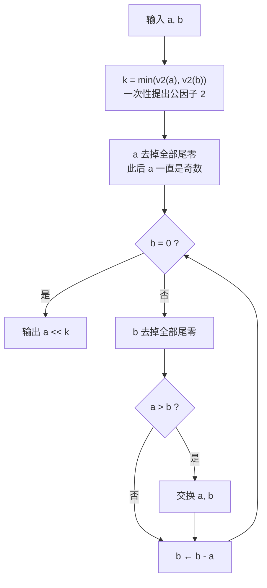

[[TOC]]

## 形式化题目

给定两个正整数 $A$ 和 $B$（$0 < A, B \leqslant 10^{10000}$），求它们的最大公约数 $\gcd(A, B)$。

输入两行，每行一个十进制大整数；输出一行，即 $\gcd(A, B)$。

## 暴力解法

### 思路

最容易想到的是标准的**欧几里得算法**：

$$\gcd(A, B) = \gcd(B, A \bmod B)$$

对普通大小的整数它非常快。但本题 $A, B$ 最多有约 $10001$ 位十进制数字，**一次取模就是一次完整的大数除法**：C++ 里需要手写高精度除法，Python 里虽然 `math.gcd` 帮你封装好了，但除法本身在这类量级上代价依然很高。瓶颈清晰可见——**取模 = 大数除法**。

### 代码

<!-- 略：暴力层仅作思路对照，Python 直接内置大整数除法，无需单独实现 -->

### 复杂度

单次取模 $O(n^2)$（$n$ 为位数），总复杂度 $O(n^2 \log \max(A,B))$ 量级，且实现繁重。

### 瓶颈

欧几里得算法的核心运算"取模"无法回避大数除法。要消除它，就必须找一个只用**移位、比较、减法**的 gcd 算法。

## 正解

### 思路

Stein 二进制 GCD（又称"移位减法 GCD"）正是为这个瓶颈设计的。它基于三条 gcd 性质：

1. $\gcd(2a, 2b) = 2\cdot\gcd(a, b)$——公因子 2 可以直接提出；
2. $\gcd(2a, b) = \gcd(a, b)$（$b$ 为奇数时）——只有一个数是偶数时，因子 2 不贡献 gcd，直接去掉；
3. $\gcd(a, b) = \gcd(a, b - a)$（$a, b$ 均为奇数时）——两个奇数之差是**偶数**。

在二进制下，"除以 2"就是右移一位，代价远低于一次除法。算法流程如下：

- 第一步统计 $v_2$（2 的幂次）用位技巧 `(x & -x).bit_length() - 1` 一次完成；
- 循环中只给 $b$ 去尾零、$a$ 保持奇数，这样每轮只做一次比较和一次减法；
- 关键在第 3 条性质：两个奇数相减必得偶数，所以 $b$ 减完之后下一轮**至少还能再右移一位**——这就是规模快速下降、总轮数维持在 $O(\log \max(A,B))$ 量级的原因。

用一个具体的二进制例子走一遍（求 $\gcd(48, 36)$，$k=2$）：

| 轮次 | 操作 | a（二进制） | b（二进制） | 说明 |
| --- | --- | --- | --- | --- |
| 初始 | 提出 $2^2$，a 去尾零 | `11` | `1001` | $48=2^2\cdot12$，$36=2^2\cdot9$ |
| 1 | b 去尾零；b − a | `11` | `110` | `1001 − 11 = 110`（偶数） |
| 2 | b 去尾零 | `11` | `11` | 相等了 |
| 3 | b − a = 0 | `11` | `0` | 循环结束 |
| 输出 | a 左移 $k=2$ 位 | — | — | $\gcd = 3 \times 4 = 12$ ✓ |

观察点：每次"减法 → 尾零 → 右移"的组合都在把 $b$ 的有效位数往下压；$a$ 从头到尾保持奇数，省掉一半工作量。

还有一个 Python 特有的坑：Python 3.11 起，`int` 与字符串互转默认有 **4300 位**的上限，$10^{10000}$ 级的输入会直接抛 `ValueError`。必须先执行 `sys.set_int_max_str_digits(0)` 解除限制，再读入大数。

### 代码

@include-code(./main.py, python)

### 复杂度

- 时间：每轮的尾零统计、比较、减法都是 $O(n)$（$n$ 为当前位数），总轮数 $O(\log \max(A,B))$ 量级，合计 $O(n \log \max(A,B))$。对 $n \approx 33000$ 个二进制位（$10^{10000}$）大约是百万级位操作，实测最大测例仅 0.05 s。
- 空间：$O(n)$，存放两个大整数。

## 总结

- 本题唯一难点是 $10^{10000}$ 量级的大数 gcd：欧几里得算法的取模意味着大数除法，成为瓶颈。
- Stein 二进制 GCD 用"提出公因子 2 + 去尾零 + 奇数相减"三条性质，把除法完全替换成移位、比较、减法，复杂度 $O(n \log \max(A,B))$。
- Python 实现要点：`(x & -x).bit_length() - 1` 求尾零个数；`sys.set_int_max_str_digits(0)` 解除大数读入上限。
