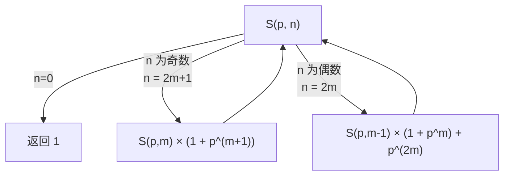

[[TOC]]

## 形式化题目

给定整数 $A,B$（$0 \le A,B \le 5\times 10^7$），求 $A^B$ 的所有正约数之和，对 $9901$ 取模。

即设 $A=\prod_{i} p_i^{e_i}$（$p_i$ 为不同素数），求

$$\sigma(A^B)=\prod_i \bigl(1+p_i+p_i^2+\cdots+p_i^{e_iB}\bigr) \bmod 9901 .$$

样例：$A=2,B=3$，$2^3=8$，约数 $1,2,4,8$，和 $15$。

## 正解

### 思路

**一句话本质**：先分解 $A$，把问题拆成若干个等比级数求和，再用倍增递推 $O(\log)$ 地算出每个级数——全程只有模乘和模加，不需要求逆元。

**第一步：把约数和拆成等比级数。**

$A^B$ 的约数必定形如 $\prod_i p_i^{t_i}$，其中每个指数独立地取 $0 \le t_i \le e_iB$。由乘法原理，所有约数之和就是把每个质因子的全部幂次相乘累加：

$$\sigma(A^B)=\prod_i\bigl(1+p_i+p_i^2+\cdots+p_i^{e_iB}\bigr).$$

记 $S(p,n)=1+p+\cdots+p^n$，我们只需要会算 $S(p,n)\bmod 9901$，其中 $n=e_iB$。

**朴素做法**：对每个质因子写一个循环，逐项累加 $n+1$ 项。分解 $A$ 只需 $O(\sqrt A)$ 次试除（$A\le5\times10^7$，约 $7000$ 次），很便宜；但 $n=e_iB$ 可以到千万量级，逐项累加就是 $O(B)$ 次乘法，单测上千万次运算，太慢。

**问题？** 等比数列求和有现成公式 $\dfrac{p^{n+1}-1}{p-1}$，模意义下直接乘 $(p-1)$ 的逆元不就行了？

这正是本题唯一的陷阱。$9901$ 确实是素数，模素数下非零元才可逆——而 $p-1$ 未必非零：当 $p\equiv 1\pmod{9901}$ 时 $p-1\equiv0$，逆元**根本不存在**。这样的素数确实能被 $A$ 取到，例如 $59407=9901\times6+1$ 是素数。

| $A$ | $B$ | 真值 $S(A,B)$ | 除法公式 $(p^{n+1}-1)(p-1)^{-1}$ |
| --- | --- | --- | --- |
| $59407$ | $1000$ | $1001$ | $0$（错） |

$p\equiv1$ 时每一项 $p^k\equiv1$，所以真值就是项数 $B+1=1001$，而除法公式给出 $0$。可见除法公式会在这一类数据上直接算错，必须换一种不依赖除法的求法。

**第二步：倍增递推求等比和。**

把 $S(p,n)$ 按 $n$ 的奇偶拆成两半，每层规模减半：

$$S(p,n)=
\begin{cases}
1, & n=0,\\[4pt]
S(p,m)\bigl(1+p^{m+1}\bigr), & n=2m+1,\\[4pt]
S(p,m-1)\bigl(1+p^{m}\bigr)+p^{2m}, & n=2m>0.
\end{cases}$$

**问题？** 这两个式子为什么成立？

奇数情形 $n=2m+1$，把 $0\ldots 2m+1$ 从中间切开：前半是 $S(p,m)$，后半是 $p^{m+1}+p^{m+2}+\cdots+p^{2m+1}=p^{m+1}\cdot S(p,m)$，两半合并提出公因式即得 $S(p,m)(1+p^{m+1})$。

偶数情形 $n=2m$，先写成 $S(2m-1)+p^{2m}$，对前面的奇数项用上式（此时 $2m-1=2(m-1)+1$）即得 $S(p,m-1)(1+p^m)+p^{2m}$。

以 $p=2,n=3$ 演示，答案应为 $1+2+4+8=15$：

| 调用 | 形态 | 展开 | 结果 |
| --- | --- | --- | --- |
| $S(2,3)$ | $n=2m+1,\ m=1$ | $S(2,1)\cdot(1+2^{2})=S(2,1)\cdot5$ | $15$ |
| $\hookrightarrow S(2,1)$ | $n=2m+1,\ m=0$ | $S(2,0)\cdot(1+2^{1})=1\cdot3$ | $3$ |
| $\hookrightarrow S(2,0)$ | 基础 | $1$ | $1$ |

验证：$S(2,1)=1+2=3$ ✓，$S(2,3)=3\times5=15$ ✓。

每层 $n$ 减半，递归深度 $O(\log n)$；幂用 `pow(p, k, 9901)` 快速幂，每层 $O(\log n)$，故单个质因子 $O(\log^2 n)$。整个过程只用乘、加、取模，$p-1$ 是否可逆与结果无关。

**第三步：合并与边界。**

各质因子的 $S(p_i,e_iB)$ 相乘即得答案。边界有三种：

- $B=0$ 或 $A=1$：$A^B=1$，唯一约数是 $1$，输出 $1$（真实测点 $A=1,B=49999999$ 即为 $1$）。
- $A=0,B>0$：$0^B=0$，约定输出 $0$。
- $A=B=0$：$0^0=1$，输出 $1$。

分解时试除到 $\sqrt A$ 即可；循环结束后若残留 $a>1$，说明它是大于 $\sqrt{}$ 的素因子，指数必为 $1$，单独登记。

### 代码

`factorize` 返回 $A$ 的质因子及其指数；`geometric` 即上面的 $S(p,n)$ 倍增递推；`solve` 把两者相乘得到 $\sigma(A^B)$。

Python 版：

@include-code(./main.py, python)

C++ 版（同一算法）：

@include-code(./main.cpp, cpp)

### 复杂度

- 时间复杂度：分解 $O(\sqrt A)$ 次试除（$A\le5\times10^7$ 时约 $7000$ 次）；每个质因子 $O(\log^2(eB))$，$\omega(A)\le 8$，合计 $O(\sqrt A+\omega(A)\log^2(eB))$。$n\le 5\times10^7\times 24<2^{31}$，递归深度不超过 $31$ 层。
- 空间复杂度：$O(1)$（不计递归栈；栈深 $O(\log n)\le 31$）。
- 实测 20 组真实数据全部通过，单点约 $0.017$ s、峰值内存 $14.6$ MB，相对 $1000$ ms / $128$ MB 很宽裕。

## 总结

本题的骨架是**约数和公式**：$\sigma(A^B)=\prod_i(1+p_i+\cdots+p_i^{e_iB})$，把大数问题化成若干等比级数求和。真正的坑在"求和用什么公式"：模素数 $9901$ 下除法公式 $(p^{n+1}-1)/(p-1)$ 只在 $p\not\equiv1$ 时成立，而 $p=59407$ 这类 $p\equiv1\pmod{9901}$ 的输入会让逆元不存在、答案错误。改用倍增递推后，只依赖乘法和加法，对任意 $p$ 都正确，且把 $O(B)$ 降到 $O(\log^2(eB))$。这个"模意义下能否用除法"的判断，是数论题里的通用检查点。
