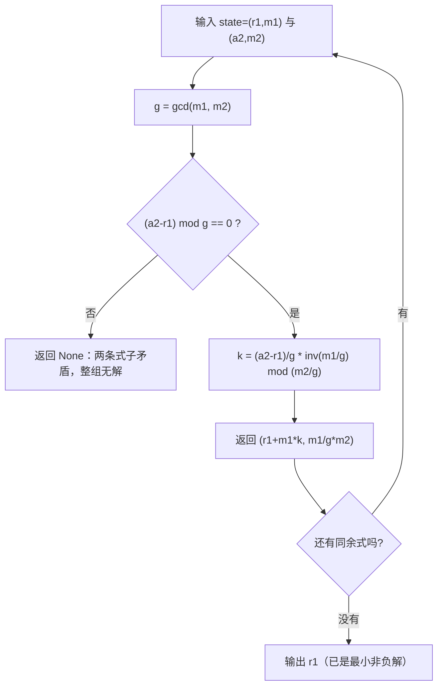

[[TOC]]

## 形式化题目

给定 $n$ 条同余式

$$x \equiv a_i \pmod{m_i},\qquad i=1,2,\dots,n,$$

求满足全部同余式的最小非负整数 $x$；若不存在这样的 $x$，输出 $-1$。
同一次运行会依次给出多组互相独立的 $(n,a_1,m_1,\dots,a_n,m_n)$，每组各自回答一次。

题面**不保证** $m_i$ 两两互质，这是本题与教科书上的中国剩余定理最大的差别；
真实数据里就出现了同一组内 $m_1=m_2=40$ 而 $a$ 不同、以及 $m=4$ 与 $m=6$ 这样的组合。

样例 $n=2$，两条式子为 $x\equiv7\pmod 8$ 与 $x\equiv9\pmod{11}$：

| 步骤 | 已合并的同余式 | 含义 |
| --- | --- | --- |
| 初始 | $x\equiv0\pmod 1$ | 没有约束，任何 $x$ 都满足 |
| 合并 $x\equiv7\pmod 8$ | $x\equiv7\pmod 8$ | 解集 $\{\dots,7,15,23,31,\dots\}$ |
| 合并 $x\equiv9\pmod{11}$ | $x\equiv31\pmod{88}$ | 两个解集的交集，最小元素是 $31$ |

所以答案是 `31`。表中第三行说明本题的目标可以改写成：**把 $n$ 条同余式折叠成一条**。

## 正解

### 思路

**先看朴素做法为什么不行。** 最直接的想法是枚举 $x$：由前两条式子可知解一定落在
$[0,\operatorname{lcm}(m_1,\dots,m_n))$ 内，逐个试即可。或者稍微聪明一点，由 $x\equiv a_1\pmod{m_1}$
写成 $x=a_1+km_1$，只枚举 $k$，再检验其余同余式。样例 $\operatorname{lcm}(8,11)=88$ 只要试不到 88 次，
看起来完全可行。

但 $n$ 最大到 $10^5$，模数几乎互质时 $\operatorname{lcm}$ 就是 $10^5$ 个数的乘积，位数以十万计，
枚举量是天文数字。真实数据里仅 `data/6.in` 一个文件就有 $453043$ 条同余式，按这个做法一组都跑不完。
**瓶颈不在「检验一条同余式太慢」，而在于把「满足所有条件」当成了「逐个试」**——
所有解其实构成一个同余类，本可以用代数方法直接算出来。

**关键观察：两条同余式可以合并成一条。** 记状态 $(r,m)$ 表示同余式 $x\equiv r\pmod m$，
则「同时满足 $(r_1,m_1)$ 与 $(a_2,m_2)$」与某一条 $x\equiv r\pmod{\operatorname{lcm}(m_1,m_2)}$
的解集完全相同。只要能算出这个新的 $r$，就可以从单位元 $(0,1)$（$x\equiv0\pmod1$ 恒成立）
出发，把 $n$ 条式子从左到右折叠成一条，最后的 $r$ 就是答案。

**把合并化成线性同余方程。** 设 $x=r_1+m_1k$（这是「满足第一条」的全部解），
代入第二条：

$$r_1+m_1k\equiv a_2\pmod{m_2}\quad\Longleftrightarrow\quad m_1k\equiv a_2-r_1\pmod{m_2}.$$

这就是标准形式 $ak\equiv b\pmod n$（$a=m_1,\ b=a_2-r_1,\ n=m_2$），有现成的判据与解法：

1. 令 $g=\gcd(a,n)$。方程有解 $\iff g\mid b$。这里即 $g=\gcd(m_1,m_2)$ 必须整除 $a_2-r_1$；
   否则两条式子互相矛盾，整组无解，直接输出 $-1$。
2. $g\mid b$ 时两边同除 $g$，得 $\dfrac{m_1}{g}k\equiv\dfrac{a_2-r_1}{g}\pmod{\dfrac{m_2}{g}}$。
   此时 $\gcd\!\left(\dfrac{m_1}{g},\dfrac{m_2}{g}\right)=1$，系数可逆：
   $k_0=\dfrac{a_2-r_1}{g}\cdot\left(\dfrac{m_1}{g}\right)^{-1}\bmod\dfrac{m_2}{g}$。
3. 取 $k\equiv k_0\pmod{\frac{m_2}{g}}$ 的最小非负代表，新的状态就是
   $\left(r_1+m_1k,\ \dfrac{m_1}{g}m_2\right)$。

**为什么这样得到的 $r$ 已经是最小解。** $k$ 取模 $\frac{m_2}{g}$ 的最小非负代表后，
$r_1+m_1k$ 必落在 $[0,\operatorname{lcm})$ 内，正是合并后同余式的最小非负解，
也必然是原系统的最小非负解（否则减去一个 $\operatorname{lcm}$ 会得到更小的解）。
所以全部合并完后直接输出 $r$ 即可，**不需要再取一次最小值**。

**不用手写扩展欧几里得。** Python 的 `pow(x, -1, m)` 直接给出模逆元，
所以 `merge` 只有三行：`gcd` 判整除、约分求逆元、算出新状态。

样例的逐步合并过程如下，表中 $(r,m)$ 是每一步之后的状态：

| 步骤 | 待合并的同余式 | 合并前 $(r,m)$ | $g=\gcd(m,m_i)$ | $m_i/g$ | 新 $k$ | 合并后 $(r,m)$ | 判定 |
| --- | --- | --- | --- | --- | --- | --- | --- |
| 0 | 无 | — | — | — | — | $(0,1)$ | 初始，$x\equiv 0\pmod 1$ 恒成立 |
| 1 | $x\equiv 7\pmod{8}$ | $(0,1)$ | 1 | 8 | 7 | $(7,8)$ | 合并成功 |
| 2 | $x\equiv 9\pmod{11}$ | $(7,8)$ | 1 | 11 | 3 | $(31,88)$ | 合并成功 |

第 1 步的 $k=7$ 把「$x\equiv0\pmod1$ 的解」$\{x=0+k\cdot1\}$ 变成 $x=0+7=7$；
第 2 步解 $8k\equiv 9-7=2\pmod{11}$ 得 $k=3$（因为 $8^{-1}\equiv7\pmod{11}$，$2\times7=14\equiv3$），
于是 $r=7+8\times3=31$。

**两条最容易被漏掉的判断。** 模数不互质时结果分两种，用反例区分：

| 例子 | 合并过程 | 结论 |
| --- | --- | --- |
| $x\equiv0\pmod4$、$x\equiv2\pmod6$ | $g=\gcd(4,6)=2\mid(2-0)$，$k=(1)\cdot 2^{-1}\bmod3=2$ | 合并为 $x\equiv8\pmod{12}$，有解 |
| $x\equiv0\pmod4$、$x\equiv1\pmod6$ | $g=2\nmid(1-0)$ | 无解，输出 $-1$ |

第一行说明**不互质不等于无解**：$x=8$ 同时满足 $8\bmod4=0$ 与 $8\bmod6=2$。
第二行说明**不互质也不等于有解**：$x\equiv0\pmod4$ 要求 $x$ 是偶数，$x\equiv1\pmod6$ 要求 $x$ 是奇数，
矛盾。这正是必须显式检查 $g\mid b$ 的原因，也是不能直接套互质版 CRT 的原因——
在 $m_1=4$ 对模 $6$ 不可逆时，乘积公式连第一步都算不下去。

`merge` 内部的全部走向可以概括成下图。



图中只有一条「失败出口」：$g\nmid(a_2-r_1)$。只要它不触发，合并就一定能继续，
并且每次合并都把两条式子的解集精确地压成一条，信息没有丢失。

### 代码

@include-code(./main.py, python)

### 复杂度

- 每条同余式一次 `merge`：一次 `gcd` 加一次模逆元，$O(\log\max_i m_i)$。
- 单组 $O\!\left(n\log\max_i m_i\right)$，全部数据 $O\!\left(\sum n\cdot\log\max_i m_i\right)$。
  与 $\operatorname{lcm}$ 的数值大小无关，这是相对枚举的本质优势。
- 额外空间：单组 $O(n)$（`pairs` 列表；状态本身只有两个整数），
  另有 $O(\text{输入长度})$ 的 `read()` 缓冲和 $O(\text{组数})$ 的输出列表。
- 实测 `data/6.in`（15 组、453043 条同余式）0.16--0.20s、峰值内存 51.5MB，时限 1000ms、内存 128MB 内充分。

## 总结

- 只要读到「求满足 $x\equiv a_i\pmod{m_i}$ 的最小 $x$」，就先问一句：**$m_i$ 互质吗？**
  本题不互质，所以要用可判无解的合并式 CRT，而不是乘积公式。
- 核心公式只有一条：把 $x=r_1+m_1k$ 代入第二条得 $m_1k\equiv a_2-r_1\pmod{m_2}$；
  $\gcd$ 不整除差值即无解，否则约去公因子求逆元，新模数是 $\operatorname{lcm}$。
- 每步都取**最小非负**的 $k$，新余数就一定落在 $[0,\operatorname{lcm})$ 内，
  所以最后直接输出，不必再取最小值。
- 多组数据要读到 EOF；某组已判无解时仍要把该组剩下的输入读完，否则后续数据会错位。

## 图示解析

下面这张图把整道题的路线压成一条主线：从 $n$ 条同余式出发，反复做同一个动作，直到剩一条。

```text
n 条同余式  x ≡ a_i (mod m_i)
   │  初始 state = (0, 1)          # x ≡ 0 (mod 1) 恒成立，是合并的单位元
   ▼
┌─────────────────── 对每条 (a_i, m_i) 重复 ───────────────────┐
│  state = (r, m)                                              │
│     │  解 r + m·k ≡ a_i (mod m_i)                            │
│     ├─ g = gcd(m, m_i)                                       │
│     │                                                        │
│     ├─ g ∤ (a_i - r)  ──────────► state = None（无解定型）    │
│     │                                                        │
│     └─ g | (a_i - r)                                         │
│           k = (a_i-r)/g · (m/g)⁻¹ mod (m_i/g)   # 最小非负     │
│           state = (r + m·k,  m/g · m_i)         # 模数变 lcm  │
└──────────────────────────────────────────────────────────────┘
   │
   ▼
state = None ?  ──是──►  输出 -1
   │
   否
   ▼
输出 r    # r ∈ [0, lcm)，已是最小非负解
```

两点值得注意：一是**唯一的失败判定在合并内部**（$g$ 是否整除差值），
不需要额外的前置检查；二是模数在合并过程中不断变成 $\operatorname{lcm}$，
所以「解的上界」增长极快，这正是枚举法失效、而代数合并仍然只花 $O(\log m)$ 的原因。
