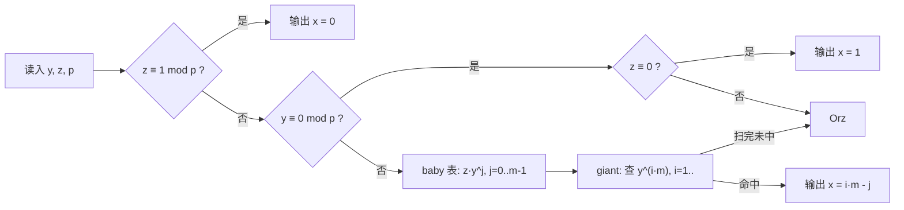

[[TOC]]

## 形式化题目

给定质数 $p$ 和正整数 $y,z$（$1 \leqslant y,z,p \leqslant 10^9$），按询问类型完成下列三件事之一：

1. 计算 $y^z \bmod p$；
2. 求最小非负整数 $x$，满足 $x \cdot y \equiv z \pmod p$；
3. 求最小非负整数 $x$，满足 $y^x \equiv z \pmod p$。

第 2、3 类无解时输出 `Orz, I cannot find x!`。

本题的三个任务互相独立，但共享同一个关键结构：**$p$ 是质数**。质数保证了「非零即互质」，这一句话同时打开了任务 2（费马小定理求逆元）和任务 3（BSGS 中 $y^m$ 可逆）的大门。下面逐个任务推导。

## 正解

### 思路

**任务 1：快速幂。** 计算 $y^z \bmod p$ 就是标准的快速幂，Python 内置的三参数 `pow(y, z, p)` 直接完成，单次 $O(\log z)$。

**任务 2：解线性同余方程 $x \cdot y \equiv z \pmod p$。**

朴素做法是枚举 $x \in [0, p)$ 逐个验证，$O(p)$ 在 $p \leqslant 10^9$ 下不可行。转成代数消元：

- 若 $y \bmod p \neq 0$：由 $p$ 是质数知 $\gcd(y, p) = 1$，费马小定理给出 $y^{p-1} \equiv 1 \pmod p$，于是逆元为 $y^{p-2}$，方程两边同乘它得
  $$x \equiv z \cdot y^{p-2} \pmod p$$
  这个等价类 $[0, p)$ 内只有一个代表元，就是最小非负解。
- 若 $y \bmod p = 0$：左边 $x \cdot y$ 恒为 $0$，所以 $z \bmod p = 0$ 时**任何** $x$ 都是解，最小取 $0$；否则无解。

**任务 3：离散对数 $y^x \equiv z \pmod p$（BSGS / 大步小步）。**

同样先想朴素：从 $x = 0$ 起逐个乘 $y$ 碰 $z$，$O(p)$ 不可行。BSGS 的核心观察是：**把指数 $x$ 拆成两段，使两侧各枚举 $\sqrt p$ 个值，再在中间用哈希表对接。**

先处理退化情形，避免逆元讨论失效：

- $z \equiv 1 \pmod p$：$x = 0$ 时 $y^0 = 1$，直接取最小解 $0$；
- $y \equiv 0 \pmod p$：此时 $x \geqslant 1$ 都有 $y^x \equiv 0$，故 $z \equiv 0$ 时解为 $1$，否则无解。

其余情况 $\gcd(y, p) = 1$，$y$ 的任意幂都可逆。取块长 $m = \lfloor\sqrt{p-1}\rfloor + 1$，由费马小定理，若解存在则可落在 $x \in [0, p-1]$ 内，而这段区间能被写成

$$x = i \cdot m - j, \quad 1 \leqslant i,\ 0 \leqslant j < m$$

的形式（$i \cdot m$ 每跨一步前进 $m$，$j$ 在块内向回退）。把 $x = i \cdot m - j$ 代入并用 $y^m$ 的逆元移项：

$$y^{i \cdot m} \equiv z \cdot y^{j} \pmod p$$

于是：

- **小步（baby）**：枚举 $j = 0 \dots m-1$，把 $z \cdot y^j \bmod p$ 存进哈希表。由于 $x = i\cdot m - j$，同一个值保留**最大**的 $j$ 才对应最小的 $x$——Python 字典按插入顺序覆盖，从 $j=0$ 到 $m-1$ 顺序写入恰好留下最大 $j$；
- **大步（giant）**：枚举 $i = 1, 2, \dots$，查 $y^{i \cdot m}$ 是否在表中，命中即返回 $x = i \cdot m - j$。

最小性：$i$ 每增加 1，$x$ 的候选区间向右平移 $m$ 且互不重叠，所以**第一个命中的 $i$** 已保证区间序；再取该块内**最大**的 $j$，就得到全局最小 $x$。覆盖性：$i$ 走到 $\lceil (p-1)/m \rceil \leqslant m$ 时已覆盖 $x \leqslant p-1$ 的全部取值（$y$ 的阶至多为 $p-1$），代码里多留一档 $i = m+1$ 作为保险，整层扫完仍未命中即无解。

整体流程如下：

### 代码

Python 版：

@include-code(./main.py, python)

C++ 版（同一算法）：

@include-code(./main.cpp, cpp)

### 复杂度

三个任务各一次询问的计算量为：任务 1 $O(\log z)$，任务 2 一次快速幂 $O(\log p)$，任务 3 建表与扫描各 $O(\sqrt p)$ 次模乘，空间 $O(\sqrt p)$。$T \leqslant 10$，总计约 $10 \times 3\times 10^4$ 次模乘，Python 下远在时限之内。

## 总结

- **质数 $p$ 是全部三个任务的共同支点**：任务 2 靠费马小定理把「解方程」变成「乘逆元」，任务 3 靠 $\gcd(y,p)=1$ 保证 $y^m$ 可逆、方程能左右改写。
- **BSGS 的两个正确性细节**最容易写错：一是 baby 表同值要保留最大 $j$（$x = i\cdot m - j$，$j$ 越大 $x$ 越小）；二是 $i$ 的候选区间互不重叠，首个命中的 $i$ 才给出最小 $x$。本次实现初期把两侧公式写反（表存 $y^j$ 却拿 $y^{-j}$ 查），在真实数据 `calc12` 上暴露为「答案偏小的假解」，已按标准形式修正。
- **退化情形要先行处理**：$z \equiv 1$（解为 0）、$y \equiv 0$（任务 2 中 $z\equiv 0$ 解为 0 / 任务 3 中 $z\equiv 0$ 解为 1），否则逆元推导对 $y \equiv 0$ 失效。
