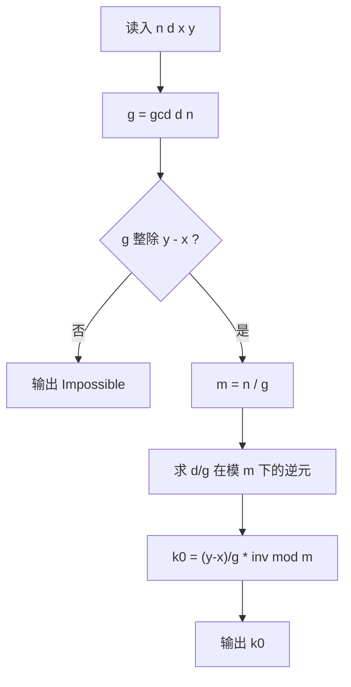

[[TOC]]

## 形式化题目

给定长度为 $n$ 的环，位置编号 $0,1,\dots,n-1$ 逆时针递增。初始位于 $x$，每次操作把位置加 $d$ 后对 $n$ 取模（只能沿逆时针方向跳，不能反向）。

求最小的非负整数 $k$，使得
$$(x + k\,d) \bmod n = y;$$
若不存在这样的 $k$，输出 `Impossible`。

输入含 $T$ 组询问，每组给出 $n, d, x, y$，其中 $2 < n < 10^9$，$0 < d < n$，$0 \le x, y < n$。

样例 $n=3, d=2$ 时从 $0$ 出发的轨迹（位置按跳跃次数排列）：

| $k$ | 0 | 1 | 2 | 3 | … |
| :---: | :---: | :---: | :---: | :---: | :---: |
| 位置 | 0 | 2 | 1 | 0 | 周期 3 |

可见第 1 次到 $2$，第 2 次到 $1$，与样例输出 `1`、`2` 一致。

## 正解

### 思路

设跳了 $k$ 次，因为每跳一次位置就增加 $d$ 并对 $n$ 取模，所以落点是 $(x + k\,d) \bmod n$。
要求它等于 $y$，移项即得**一元线性同余方程**

$$k\,d \equiv y - x \pmod n. \tag{1}$$

于是问题从“模拟跳跃”变成了“解一个同余方程”，答案就是 (1) 的最小非负整数解。

**第一步：判断有没有解。** 记 $g = \gcd(d, n)$。由于 $kd$ 一定是 $g$ 的倍数，$kd \bmod n$ 也只能取到
$g$ 的倍数，所以由裴蜀定理，方程 (1) 有整数解当且仅当

$$g \mid (y - x).$$

若不整除，大圣的落脚点是一串永远踩不到 $y$ 的位置，输出 `Impossible`。

**第二步：约简到系数可逆。** 当 $g \mid (y-x)$ 时，把 (1) 的两侧与模数同时除以 $g$：

$$\frac{d}{g}\,k \equiv \frac{y-x}{g} \pmod{m},\qquad m = \frac{n}{g}. \tag{2}$$

此时 $\gcd\!\left(\frac{d}{g}, m\right) = 1$，系数在模 $m$ 下可逆，且 (2) 与 (1) 同解。

**第三步：取最小非负解。** 两边乘上逆元：

$$k \equiv \frac{y-x}{g} \cdot \left(\frac{d}{g}\right)^{-1} \pmod m .$$

方程的全部整数解是 $k_0 + t\,m$（$t \in \mathbb{Z}$，$k_0$ 为最小非负剩余）。跳跃次数必须非负：
$t \ge 0$ 时解不小于 $k_0$，$t \le -1$ 时解至多为 $k_0 - m < 0$。所以 $k_0$ 就是最少的跳跃次数。

Python 中这一串推导可以合成为一个表达式：`gcd(d, n)` 给出 $g$，`(y - x) % g` 做整除判定，
`pow(d // g, -1, m)` 直接给出模逆元（内建实现同样是扩展欧几里得，复杂度 $O(\log m)$）。
不必手写 exgcd 迭代，也不必特判负数——Python 的 `%` 对负数返回非负余数，自动把结果调进 $[0, m)$。

### 代码

@include-code(./main.py, python)

### 复杂度

- 时间复杂度：$O(T \log n)$。每组数据一次 `gcd` 加一次模逆元，各为 $O(\log n)$，其余为 $O(1)$ 算术。
- 空间复杂度：$O(1)$ 额外空间（不含读入缓冲），与 $n$ 无关。

## 总结

题目把「圆环上单向等步长行走」抽象成一个同余方程 $kd \equiv y-x \pmod n$。$\gcd(d,n)$ 决定
可达性，约去公因子后系数可逆，模逆元直接给出唯一的最小非负解。核心结论是：答案只可能落在
$[0,\ n/\gcd(d,n))$ 内，一步模拟都不需要，$n$ 到 $10^9$ 也能瞬间出解。

## 图示解析

下图给出每组询问的判定与求解流程，重点看两条分支：不可达分支在 $\gcd$ 判定处直接结束，
可达分支的答案由模 $m = n/g$ 的逆元运算一次性给出。

流程中唯一的“复杂”运算是模逆元；它对应 (2) 式两侧同乘逆元这一步。$m$ 既是模数也是解的周期，
所以 `k0` 一旦求出就是最终答案，无需再回代验证。
