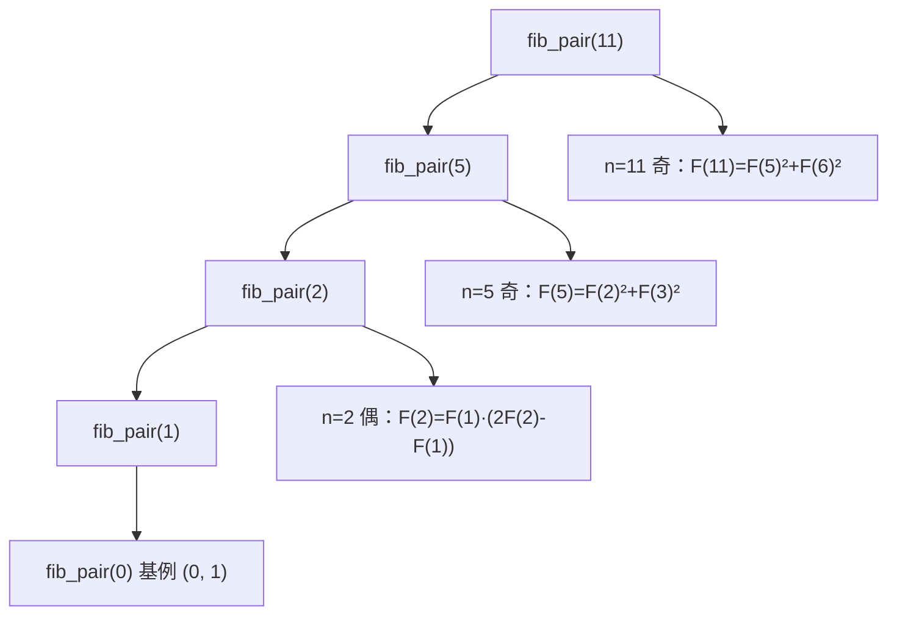

[[TOC]]

## 形式化题目

设 Fibonacci 数列 $F_1 = F_2 = 1$，$F_i = F_{i-1} + F_{i-2}$。给定整数 $n, m$（$1 \leqslant n, m \leqslant 2^{31}-1$），求

$$T(n) = \left( \sum_{i=1}^{n} i \cdot F_i \right) \bmod m$$

的值。输入一行两个整数 $n, m$，输出一行 $T(n)$。

### 样例推演

$n = 5$ 时逐项累加的过程如下：

| $i$ | 1 | 2 | 3 | 4 | 5 |
| --- | --- | --- | --- | --- | --- |
| $F_i$ | 1 | 1 | 2 | 3 | 5 |
| $i \cdot F_i$ | 1 | 2 | 6 | 12 | 25 |
| $T(i)=\sum_{j \leqslant i} jF_j$ | 1 | 3 | 9 | 21 | 46 |

最后一格 $46 \bmod 5 = 1$，正是样例输出。

表格的观察重点是最后一行：$T(i)$ 是关于 $i$ 的"前缀和"，但它的值只由 $F_i$ 附近的一小段数决定——$46 = 5 \times 13 - 21 + 2 \times 5 + 7$ 这种"由末尾几个 Fibonacci 值拼出来"的感觉，正是下一节要证明的封闭形式。

## 正解

### 思路

**朴素做法为什么不行。** 最直接的做法是递推整个数列：边算 $F_i$ 边累加 $i \cdot F_i$，复杂度 $O(n)$。它只能通过 $n \leqslant 1000$ 的前 30% 数据；而本题 $n$ 高达 $2^{31}-1 \approx 2.1 \times 10^9$，即使每步只花 1ns 也要 2 秒以上，线性递推这条路被数据范围彻底堵死。

**优化方向：把前缀和压成封闭形式。** 既然 $T(n)$ 不能逐项累加，就要问：$T(n)$ 能不能只由**常数个** Fibonacci 数表示出来？观察 $n = 1, 2, 3, 4$ 时的 $T(n)$ 值（1, 3, 9, 21）与同时期的 Fibonacci 数，可以猜出封闭形式

$$\boxed{T(n) = n \cdot F_{n+2} - F_{n+3} + 2}$$

先用小值验证：$n=1$ 时 $1 \cdot F_3 - F_4 + 2 = 2 - 3 + 2 = 1 = T(1)$ ✓；$n=2$ 时 $2F_4 - F_5 + 2 = 6 - 5 + 2 = 3 = T(2)$ ✓；$n=5$ 时 $5F_7 - F_8 + 2 = 65 - 21 + 2 = 46$ ✓，与样例一致。

再证归纳步。假设 $T(n) = nF_{n+2} - F_{n+3} + 2$，则

$$T(n+1) = T(n) + (n+1)F_{n+1} = nF_{n+2} + (n+1)F_{n+1} - F_{n+3} + 2$$

用 $F_{n+3} = F_{n+2} + F_{n+1}$ 消去 $-F_{n+3}$：

$$T(n+1) = (n-1)F_{n+2} + nF_{n+1} + 2$$

另一方面，把目标形式 $(n+1)F_{n+3} - F_{n+4} + 2$ 用同样的两个递推关系展开：

$$(n+1)F_{n+3} - F_{n+4} + 2 = (n+1)F_{n+3} - (F_{n+3} + F_{n+2}) + 2 = nF_{n+3} - F_{n+2} + 2 = (n-1)F_{n+2} + nF_{n+1} + 2$$

两条路结果相同，归纳成立。所以只要求出 $F_{n+2}$ 和 $F_{n+3}$，$T(n)$ 一行代入即可。

**怎么在 $O(\log n)$ 内求出 $F_{n+2}, F_{n+3}$：快速倍增。** 递归定义"求一对相邻值"：由 $F(k), F(k+1)$ 用倍增恒等式（$k$ 为 $n$ 向下取整的一半）一步翻倍：

$$F(2k) = F(k)\,\big(2F(k+1) - F(k)\big), \qquad F(2k+1) = F(k)^2 + F(k+1)^2$$

递归树大致如下（以 $n = 11$ 为例）：

每层只做常数次乘法，递归深度 $O(\log n)$；返回对 $(F(n), F(n+1))$ 后再各推一步得到 $F_{n+2}, F_{n+3}$。取模全程进行，Python 的 `%` 保证结果非负，减法出负也不怕。

### 代码

@include-code(./main.py, python)

### 复杂度

- 时间复杂度 $O(\log n)$：快速倍增每层常数次大整数乘法，$n \leqslant 2^{31}-1$ 时约 31 层。
- 空间复杂度 $O(\log n)$：递归栈深度。

## 总结

- 数据范围 $n \leqslant 2^{31}-1$ 直接否决 $O(n)$ 递推，逼出"前缀和的封闭形式 + 快速倍增"这条路线。
- 核心恒等式 $T(n) = nF_{n+2} - F_{n+3} + 2$，用待定系数猜形式、数学归纳法严格证明。
- 快速倍增用"返回相邻对 $(F(n), F(n+1))$"的设计，恒等式只需两个平方项，比矩阵快速幂的 8 次乘法更省。
- 边界：$m = 1$ 时基例返回 $(0, 0)$ 全链归零；中间量约 $(2^{31})^2 \approx 4.6 \times 10^{18}$，Python 任意精度无溢出。
