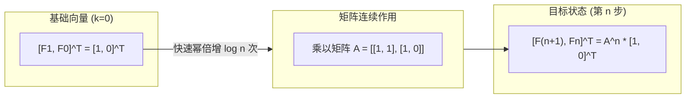

[[TOC]]

## 形式化题目

给定若干个独立的查询，每个查询包含一个非负整数 $n$。已知斐波那契数列的递推关系为：
$$
F_0 = 0, \quad F_1 = 1, \quad F_k = F_{k-1} + F_{k-2} \quad (k \ge 2)
$$
对每个查询，计算并输出 $F_n \bmod 10^4$ 的值。

## 正解

### 思路

对于 $n \le 10^9$ 的数据范围，朴素按定义循环递推 $F_k = (F_{k-1} + F_{k-2}) \bmod 10^4$ 的时间复杂度为 $O(n)$，在 $n$ 较大时会严重超时。

观察斐波那契数列的线性递推关系：
$$
\begin{cases}
F_{k+1} = 1 \cdot F_k + 1 \cdot F_{k-1} \\
F_k = 1 \cdot F_k + 0 \cdot F_{k-1}
\end{cases}
$$

将状态向量表示为列向量 $\begin{pmatrix} F_{k+1} \\ F_k \end{pmatrix}$，上述递推可以用 $2 \times 2$ 的转移矩阵表示：
$$
\begin{pmatrix} F_{k+1} \\ F_k \end{pmatrix} = \begin{pmatrix} 1 & 1 \\ 1 & 0 \end{pmatrix} \begin{pmatrix} F_k \\ F_{k-1} \end{pmatrix}
$$

连续应用该矩阵变换，得到：
$$
\begin{pmatrix} F_{n+1} \\ F_n \end{pmatrix} = \begin{pmatrix} 1 & 1 \\ 1 & 0 \end{pmatrix}^n \begin{pmatrix} F_1 \\ F_0 \end{pmatrix} = \begin{pmatrix} 1 & 1 \\ 1 & 0 \end{pmatrix}^n \begin{pmatrix} 1 \\ 0 \end{pmatrix}
$$

更进一步，利用数学归纳法可知：
$$
\begin{pmatrix} 1 & 1 \\ 1 & 0 \end{pmatrix}^n = \begin{pmatrix} F_{n+1} & F_n \\ F_n & F_{n-1} \end{pmatrix}
$$

因此，记转移矩阵 $A = \begin{pmatrix} 1 & 1 \\ 1 & 0 \end{pmatrix}$，只要利用**矩阵快速幂**求出 $A^n \pmod{10^4}$，其第 0 行第 1 列（0-indexed）的元素恰好就是 $F_n \bmod 10^4$。

当 $n = 0$ 时，直接输出 $0$（或者依据 $A^0 = I = \begin{pmatrix} 1 & 0 \\ 0 & 1 \end{pmatrix}$，右上角元素同样为 $0$）。

### 代码

Python 版：

@include-code(./main.py, python)

C++ 版（同一算法）：

@include-code(./main.cpp, cpp)

### 复杂度

- **时间复杂度**：设询问组数为 $T$。对于每个询问 $n$，二进制位数为 $\lfloor \log_2 n \rfloor + 1$。每次 $2 \times 2$ 矩阵乘法仅包含 $8$ 次乘法和 $4$ 次加法取模，耗时为常数 $O(1)$。因此单次计算复杂度为 $O(\log n)$，整体时间复杂度为 $O(T \log n)$。
- **空间复杂度**：仅需常数级别的变量存储 $2 \times 2$ 矩阵，空间复杂度为 $O(1)$。

## 总结

线性递推式的核心优化手段是构建状态转移矩阵，将单步 $O(1)$ 的状态推进提升为矩阵乘法，进而利用矩阵快速幂将 $O(n)$ 的线性递推压制到 $O(\log n)$。

在实现时，2 阶方阵状态较小，使用展平的元组或简单的常数循环即可高效完成乘法，每步对 $10^4$ 取模保证数值不溢出。

## 图示解析

状态向量与转移矩阵关系如下：

矩阵乘法规则（对模 $10^4$ 取模）：
$$
\begin{pmatrix} a_{00} & a_{01} \\ a_{10} & a_{11} \end{pmatrix} \times \begin{pmatrix} b_{00} & b_{01} \\ b_{10} & b_{11} \end{pmatrix} = \begin{pmatrix} (a_{00}b_{00} + a_{01}b_{10})\bmod M & (a_{00}b_{01} + a_{01}b_{11})\bmod M \\ (a_{10}b_{00} + a_{11}b_{10})\bmod M & (a_{10}b_{01} + a_{11}b_{11})\bmod M \end{pmatrix}
$$
