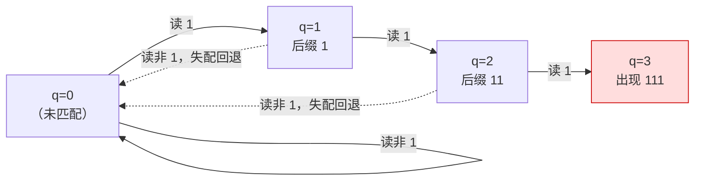

[[TOC]]

## 形式化题目

给定整数 $n, m, K$ 与一个由 $m$ 个十进制数字组成的串 $A = A_1A_2\cdots A_m$（$A_i \in \{0,\dots,9\}$，允许前导 $0$），统计满足以下条件的数字串 $X = X_1X_2\cdots X_n$ 的个数：

$$X_i \in \{0,\dots,9\},\qquad A \text{ 不是 } X \text{ 的子串（连续一段）}$$

即 $X$ 中不存在下标 $p$ 使 $X_pX_{p+1}\cdots X_{p+m-1} = A$。答案对 $K$ 取模后输出。

注意长度必须**恰好**为 $n$（含前导 $0$），且 $X_1$ 与 $A_1$ 都可以是 $0$——本题不排除前导零，整个搜索空间是 $10^n$。

数据范围：$1 \leqslant n \leqslant 10^9$，$1 \leqslant m \leqslant 20$，$2 \leqslant K \leqslant 1000$。

## 暴力解法

### 思路

把号码从左到右一位一位地考虑，维护一个数 $q$：**当前已经匹配了 $A$ 的前 $q$ 位**，也就是"$X$ 当前后缀中，是 $A$ 前缀的最长的那一段"的长度。

每读入一位数字 $d$，$q$ 就按 KMP 的规则更新为新长度 $q'$。只要某一步 $q' = m$，说明 $A$ 完整出现，这个号码不合要求，直接丢弃。

关键观察是：**$q$ 已经把"过去"中一切有用的信息压缩完了**。判断未来会不会凑出 $A$，只需要知道当前最长匹配了 $A$ 的前几位，更久远的历史不再有用。因此 $q$ 是一个合适的 DP 状态，长度分层就是一个自然的 DP。

设 $f_{i,q}$ 表示长度为 $i$、从未出现 $A$、且当前匹配长度为 $q$ 的号码数，则

$$f_{0,0} = 1,\qquad f_{i+1,q'} \mathrel{+}= f_{i,q}\quad (\text{对每个 } q,\ d)\ \text{，只保留 } q' < m$$

答案 $= \sum_{q=0}^{m-1} f_{n,q}$。

### 代码

本题不提供暴力代码文件（任务要求 `--no-brute --no-gen`，教学上只需理解状态定义与转移，`brute.cpp` 并非必要），完整可运行实现见下方正解的 `main.py`；暴力解法不单独给出代码。

### 复杂度

时间 $O(nm)$（每位枚举 $q$ 与 $d$，$d$ 固定 10 种），空间 $O(m)$。

### 瓶颈

瓶颈不在 $m$（只有 20），而在 $n$ 可以是 $10^9$：$O(nm) \approx 2\times 10^{10}$ 次运算，任何语言都无法在 1 秒内完成。真正的耗时来源就是"逐位推进 $n$ 次"这个循环本身。

## 正解

### 思路

**一句话本质**：转移规则与位数 $i$ 无关，每一步都在做**同一个**线性变换，于是"做 $n$ 次变换"可以打包成"求变换的 $n$ 次幂"。

**第一步：看清状态转移的结构。**

对固定的 $i$，$f_{i+1}$ 的每个分量都是 $f_i$ 各分量的固定线性组合。例如当 $A=$`111` 时，$f_{i+1,0} = 9f_{i,0} + 9f_{i,1} + 9f_{i,2}$——任何状态下只要读入的不是 `1`，匹配长度就清零，这样的数字有 9 个。

只要系数与 $i$ 无关，就能把递推写成矩阵形式。记 $v^{(i)}$ 为行向量 $(f_{i,0}, f_{i,1}, \dots, f_{i,m})$，$T$ 为 $(m+1)\times(m+1)$ 的**转移矩阵**，其中

$$T[q][q'] = \#\{\, d \in \{0,\dots,9\} \mid \text{从匹配长度 } q \text{ 读入 } d \text{ 后变成 } q' \,\}\quad (q' < m)$$

则 $v^{(i)} = v^{(i-1)}T$，反复代入得

$$v^{(n)} = v^{(0)}\,T^{\,n},\qquad v^{(0)} = (1, 0, \dots, 0)$$

$v^{(0)}$ 的含义是：还没填任何位时，匹配长度必然是 0，方案数 1。

**第二步：怎样填出 $T$。**

$T[q][q']$ 的构造就是 KMP 自动机：从当前匹配长度 $q$ 出发读数字 $d$，

1. 若 $q>0$ 且 $A_q \neq d$，说明"继续延长当前匹配"走不通，于是沿失配指针回退 $q \leftarrow \text{fail}[q]$，直到回退到一个能让 $A_q = d$ 的前缀；
2. 回退停止后，若 $A_q = d$ 则新长度 $q' = q+1$（成功多匹配一位），否则 $q' = 0$（一位都没匹配上）；
3. 只有当 $q' < m$ 时才把这条转移记进 $T[q][q']$——$q'=m$ 意味着不吉利数字已经出现，这条路径必须被排除。

状态 $m$ 是**吸收态**（一旦进入就出局），所以矩阵的第 $m$ 行全为 0，后面不必再清理。

下面用样例 $A = $ `111` 走一遍。它的失配数组是 `fail = [0, 0, 1, 2]`（`fail[i]` 表示 $A$ 前 $i$ 位的最长真前后缀长度，例如 `11` 的最长真前后缀是 `1`，故 `fail[2] = 1`）。四个状态与读入 `1` 时的走向如下：

观察重点：只有读入 `1` 才会沿主链前进一位，读入其余 9 个数字都会把匹配长度清零；红色的 $q=3$ 是吸收态，一旦到达就代表号码含 `111`，不再计数。回退虚线体现了 `fail` 链的作用：$q=2$ 失配时先退到 `fail[2] = 1`（后缀 `1` 仍是 `A` 的前缀），但此时要接的新数字仍不是 `1`，于是继续退到 `fail[1] = 0`，最终匹配长度归零。

据此填出转移矩阵（行 = 当前 $q$，列 = 读一位后的 $q'$，格值 = 能做到这件事的数字个数）：

| $q$ \ $q'$ | 0 | 1 | 2 | 3 |
| --- | --- | --- | --- | --- |
| 0 | **9** | 1 | 0 | 0 |
| 1 | **9** | 0 | 1 | 0 |
| 2 | **9** | 0 | 0 | 0 |
| 3 | 0 | 0 | 0 | 0 |

读表方法：$q=0$ 行中，读非 `1` 的 9 个数字留在 $q'=0$，读 `1` 进入 $q'=1$；$q=1$ 行同理，读 `1` 前进到 $q'=2$，其余 9 个回到 $q'=0$；$q=2$ 行中，读 `1` 会变成 $q'=3$（被丢弃，所以该格不出现），其余 9 个数字回到 $q'=0$，故整行只有 `9`。最后一行全 0，正是吸收态。

**第三步：用矩阵快速幂处理 $n \le 10^9$。**

把 $n$ 按二进制分解，反复平方 $T$（$T^2, T^4, T^8, \dots$），只把二进制为 1 的位对应的幂乘进结果，得到 $T^n$，再与 $v^{(0)}$ 相乘。每层矩阵乘法是 $(m+1)^3 \le 21^3 \approx 9\times10^3$ 次乘加，共 $\log_2 10^9 \approx 30$ 层，总计约 $3\times10^5$ 次运算。

**样例验证。** 用样例 $n=4,\ m=3,\ A=$`111`、$K=100$ 逐位推进 $v$（元素依次对应 $q=0,1,2,3$，每一步都已对 $100$ 取模）：

| 已填位数 $i$ | $v_0$ | $v_1$ | $v_2$ | $v_3$ | $\sum_{q<3} v_q$ |
| --- | --- | --- | --- | --- | --- |
| 0 | 1 | 0 | 0 | 0 | 1 |
| 1 | 9 | 1 | 0 | 0 | 10 |
| 2 | 90 | 9 | 1 | 0 | 100 |
| 3 | 0 | 90 | 9 | 0 | 99 |
| 4 | 91 | 0 | 90 | 0 | **181** |

$181 \bmod 100 = 81$，与样例输出一致（若只看累加过程本身：准确计数依次是 $10, 100, 999, 9981$，$9981 \bmod 100 = 81$，与逐步取模的 $181 \bmod 100 = 81$ 等价）。注意第 3 行 $v_0 = 0$：这一步任何不读 `1` 的号码都会丢掉匹配长度 2，而唯一保持匹配的选择——读 `1`——会凑齐 `111` 被剔除，所以长度为 3 的合法号码只剩 99 个。这正是"吸收态被排除"在数据上的直接体现。

### 代码

`build_fail` 求失配数组，`build_transition` 用失配链建出矩阵 $T$，`mat_pow` 做 $T^n$，`solve` 完成 $v^{(0)}T^n$ 并输出非吸收态之和。

Python 版：

@include-code(./main.py, python)

C++ 版（同一算法）：

@include-code(./main.cpp, cpp)

### 复杂度

- 时间复杂度：$O(m^3 \log n)$。构造自动机 $O(m^2)$ 量级，矩阵快速幂共 $\log n$ 层、每层 $O(m^3)$。代入 $m \leqslant 20$、$n \leqslant 10^9$：约 $3\times10^5$ 次乘加。
- 空间复杂度：$O(m^2)$，保存常数个 $(m+1)\times(m+1)$ 矩阵，$m=20$ 时不到 400 个整数。实测峰值内存 14.9 MB。

## 总结

本题的关键不是"数数"，而是**找到能把历史压缩成一个数的状态**：号码当前后缀与不吉利数字的最长公共前缀长度 $q$。有了 $q$，长度分层 DP 的转移就与位数无关，$n \le 10^9$ 的超长循环随即变成 $O(m^3\log n)$ 的矩阵幂——DP 定状态、KMP 建转移、矩阵幂消 $n$，三步各司其职。两个容易失分的地方：状态 $m$（已出现不吉利数字）必须作为吸收态排除在计数之外；以及前导零是合法的，不能按"首位不能为 0"去砍掉 $9\times10^{n-1}$ 以外的情况。

实测 10 个真实评测点全部通过，最大规模（$n=10^9,\ m=20$）单点耗时约 0.030 s，相对 1000 ms 限时余量充足。
