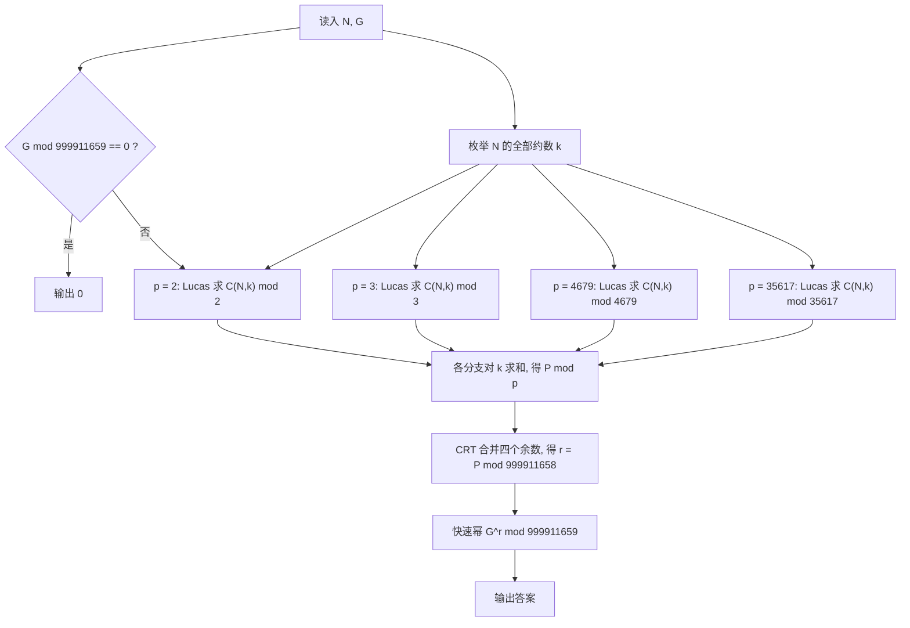

[[TOC]]

## 形式化题目

给定 $N, G$，其中 $k$ 取遍 $N$ 的全部正约数，每个 $k$ 对应 $\dfrac Nk$ 种保留字数的方案
$\dbinom{N}{N/k}$。令

$$P = \sum_{k \mid N} \binom{N}{N/k} = \sum_{k \mid N} \binom{N}{k},$$

求 $G^{P} \bmod 999911659$。约束为 $1 \leqslant G \leqslant 10^9$，$1 \leqslant N \leqslant 10^9$。

（题面描述里出现过“$9999116594$”，但输出格式段与样例都指向模数 $999911659$，
且只有 $999911659$ 是质数、才使下文的中国剩余定理分解成立，故以 $999911659$ 为准。）

样例 $N = 4$ 的约数是 $1, 2, 4$，对应方案数如下：

| $k$ | 保留字数 $N/k$ | 方案数 $\binom{N}{N/k}$ |
| :---: | :---: | :---: |
| 1 | 4 | 1 |
| 2 | 2 | 6 |
| 4 | 1 | 4 |

所以 $P = 1 + 6 + 4 = 11$，答案 $2^{11} = 2048$，与样例一致。
注意两种求和写法 $\sum_{k\mid N}\binom{N}{N/k}$ 与 $\sum_{k\mid N}\binom Nk$ 完全等价，
因为 $k \mapsto N/k$ 是约数集合上的一个置换。

## 正解

### 思路

**第一步：先解决"能不能算"。** $N$ 可以到 $10^9$，此时 $\binom{N}{N/2}$ 约有 $3 \times 10^8$
位十进制数字，$P$ 大到无法存储，$G^{P}$ 更无从下手。但题目只要答案模 $999911659$，
而**这个模数是质数**。于是当 $\gcd(G, 999911659) = 1$ 时费马小定理给出

$$G^{999911658} \equiv 1 \pmod{999911659}
\;\Longrightarrow\;
G^{P} \equiv G^{\,P \bmod 999911658} \pmod{999911659}.$$

任务立刻变成：**求 $P \bmod 999911658$，其中 $P = \sum_{k \mid N}\binom Nk$。**
（$G$ 是模数的倍数时降幂不成立，单独返回 $0$ 即可。）

**第二步：把模数减一拆开。** 试除分解得到

$$999911658 = 2 \times 3 \times 4679 \times 35617,$$

四个因子都是质数。**四者两两互素**，所以只要分别在四个模数下求出 $P$，
中国剩余定理就能唯一还原 $P \bmod 999911658$。这一步把一个"模数接近 $10^9$"的大问题，
换成了四个"模数不超过 $35617$"的小问题。

**第三步：用小质数模数反而更省事。** 大数取模的组合数通常要按
$\binom nk = \dfrac{n!}{k!\,(n-k)!}$ 写作阶乘并处理其中的 $p$ 因子（即扩展 Lucas）。
但 Lucas 定理的形式是

$$\binom{n}{k} \equiv \prod_{i \geqslant 0} \binom{n_i}{k_i} \pmod p,
\qquad n = \sum_i n_i p^i,\quad k = \sum_i k_i p^i .$$

把 $n, k$ 反复整除 $p$ 就能逐位取出 $n_i, k_i$。某一位上 $k_i > n_i$ 时该位为 $0$，
整个乘积就是 $0$——这恰好覆盖了 $p \mid \binom nk$ 的情形。所以小模数**不需要任何特殊处理**，
逐位相乘即可。

用样例 $N = 4$（真值 $P = 11$）在 $p = 2$ 下验证这一点：

| $k$ | $k$ 的 $2$ 进制 | Lucas 逐位乘积 | 值 |
| :---: | :---: | :--- | :---: |
| 1 | $001$ | $\binom{0}{1}$（第 $0$ 位超出） | $0$ |
| 2 | $010$ | $\binom{0}{0} \cdot \binom{0}{1}$（第 $1$ 位超出） | $0$ |
| 4 | $100$ | $\binom{0}{0} \cdot \binom{0}{0} \cdot \binom{1}{1}$ | $1$ |
| | | **合计** $P \bmod 2$ | $1$ |

$11 \bmod 2 = 1$ 对上了。注意不能偷懒只取一次低位：$\binom 42 = 6 \equiv 0 \pmod 2$，
而 $\binom{4 \bmod 2}{2 \bmod 2} = \binom 00 = 1$；真正的 Lucas 是**每一位都乘**，
第 $1$ 位上 $k_1 = 1 > n_1 = 0$ 令乘积归零，这才和 $6 \equiv 0 \pmod 2$ 相符。

**第四步：合并四个余数。** 设第 $i$ 个模数的余数为 $r_i$，逐项增量合并：
维护"已合并好的部分"$r \bmod M$，新模数 $p$ 到来时取

$$t = (r_i - r) \cdot M^{-1} \bmod p, \qquad r \leftarrow r + t\,M,\quad M \leftarrow M \cdot p .$$

$M$ 始终是若干不同素因子之积，与下一个 $p$ 互素，逆元必然存在。
四项合并完 $M = 999911658$，得到的 $r$ 就是需要的指数，答案即 `pow(G, r, 999911659)`。

**正确性上有四点要把住。**

1. 约数用试除配对枚举，$d$ 与 $N/d$ 各收一次，但完全平方数时中间那个约数只能记一次，
   否则 $P$ 会被多加一遍。
2. 四个模数互素，所以 CRT 的还原在 $[0, 999911658)$ 内唯一，求出的指数不多不少。
3. $G \equiv 0 \pmod{999911659}$ 是费马降幂唯一失效的情形，要单独输出 $0$。
4. Lucas 内的 $\binom{n_i}{k_i}$ 用阶乘表与逆元表 $O(1)$ 查询；
   逆元表由 `pow(fact[p-1], -1, p)` 求出末项后倒推，避免对 $p$ 个数逐个求逆元。

### 代码

@include-code(./main.py, python)

### 复杂度

记 $d(N)$ 为 $N$ 的约数个数（$N \leqslant 10^9$ 时 $d(N) \leqslant 1344$）。

- 时间复杂度：$O\!\left(\sqrt N + d(N)\log N + \log \text{MOD}\right)$。
  枚举约数 $O(\sqrt N)$；$d(N)$ 次组合数各由 Lucas 在 $O(\log N)$ 位内求出，
  四个模数是常数倍；快速幂 $O(\log \text{MOD})$；建表为固定开销。
- 空间复杂度：$O\!\left(\sum p + d(N)\right)$，即 $4679 + 35617$ 级别的两张阶乘表与逆元表，
  加上约数列表，实测峰值约 18 MB，满足 128 MB。

## 总结

题目难在"中间量太大"，全部推理都在做**分而治之**：先用费马小定理把指数从 $10^9$ 位压到
$999911658$ 以下，再把模数 $999911658$ 拆成四个素数之积（各用 Lucas 定理独立求解），
最后用中国剩余定理把四个余数拼回同一个指数。整条链路上没有一步需要真正写出巨大的组合数，
$N = 10^9$ 也只需约 $3.2 \times 10^4$ 次试除，加上 $4\,d(N)$ 次 $O(\log N)$ 的取模运算。

## 图示解析

下图是完整数据流：输入 $N, G$ 后，约数集合同时喂给四个 Lucas 分支，
四条余数经 CRT 合并成一个指数，最后交给快速幂。

观察重点有三处：约数 $k$ 只枚举一次却同时被四个分支复用；每个分支内部
$\binom Nk$ 由 Lucas 逐位分解，位数不超过 $\log_2 N \approx 30$；
CRT 是唯一的汇合点，它之后只剩一次快速幂。
