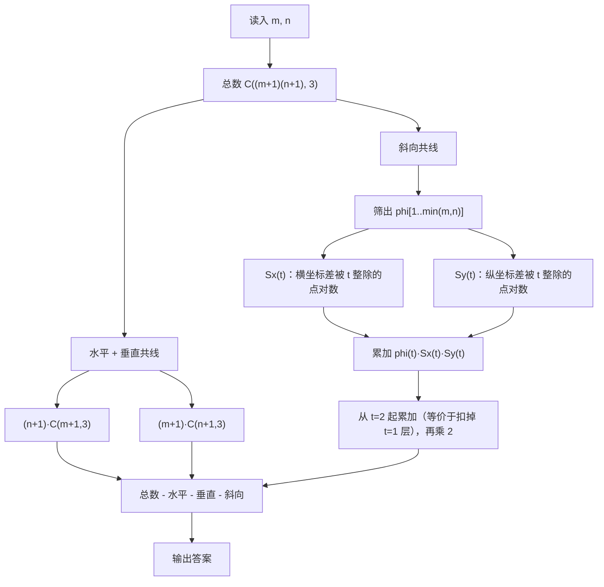

[[TOC]]

## 形式化题目

网格是一个 $m\times n$ 的方格阵列，它的**格点**（方格的顶点）共 $(m+1)(n+1)$ 个，
坐标为 $(x,y)$ 且 $0\leqslant x\leqslant m$、$0\leqslant y\leqslant n$，左下角是 $(0,0)$。

计算任务：在全部格点中任取 3 个，求三点**不共线**的取法数。

例如 $m=n=2$ 时，$\{(0,0),(2,2),(1,1)\}$ 三点共线，**不算**三角形；而
$\{(0,0),(2,0),(2,2)\}$ 不共线，是一个三角形。样例 `2 2` 的答案是 `76`。

数据范围：$1\leqslant m,n\leqslant 1000$。

## 正解

### 思路

**第一步：把"数三角形"改成"数共线三点组"。**

三点要么共线、要么不共线，两类互斥且穷尽，所以

$$\text{ans}=\binom{(m+1)(n+1)}{3}-\#\{\text{共线三点组}\}.$$

减法的好处是：**共线**这个条件比"不共线"好数得多，因为它能按直线的方向分类。
共线三点组按方向分成三类（$dy=0$、$dx=0$、$dx\cdot dy\ne0$），两两不重叠：
水平线有 $n+1$ 条、每条含 $m+1$ 个格点；垂直线有 $m+1$ 条、每条含 $n+1$ 个格点，
各条线上任取 3 点就确定一个共线组，于是前两类直接得出：

$$(n+1)\binom{m+1}{3}+(m+1)\binom{n+1}{3}.$$

第三类斜向需要用到 $\gcd$，推导见第二步。

**第二步：斜向的关键——两点之间夹了几个格点？**

任取两个格点 $A,B$，设横向差 $dx=|x_A-x_B|$、纵向差 $dy=|y_A-y_B|$，记 $g=\gcd(dx,dy)$。
一个经典结论是：**线段 $AB$ 上（含两端）共有 $g+1$ 个格点**，
也就是线段内部恰好夹着 $g-1$ 个格点。

这 $g-1$ 个内点，每一个都跟 $A,B$ 一起组成一个共线三点组。于是：

> 把 $A,B$ 当作**某条直线的两个端点**时，它们正好贡献 $g-1$ 个斜向共线三点组。

为什么强调"端点"？因为一个共线三点组里，最左和最右的两个点是**唯一确定**的
（三点不同、$x$ 互不相同，就按 $x$ 排序取首末）。所以只要按"两个端点"的角色枚举位移
$(dx,dy)$（取 $dx\geqslant1$、$dy\geqslant1$，另一侧斜向最后乘 2），就既不重也不漏。

注意位移为 $(dx,dy)$ 的端点对**不止一对**：左端点的 $x$ 有 $m+1-dx$ 种选法，
下端点的 $y$ 有 $n+1-dy$ 种选法，所以这类端点对共有 $(m+1-dx)(n+1-dy)$ 对。于是

$$\text{斜向共线数}=2\sum_{dx=1}^{m}\sum_{dy=1}^{n}(m+1-dx)(n+1-dy)\bigl(\gcd(dx,dy)-1\bigr).$$

乘 2 是因为 $dy$ 可正可负（右下与右上两种方向），而把 $dy$ 换成 $|dy|$ 后计数是对称的。

**第三步：这个双重求和是 $O(mn)$，需要降维。**

$m,n\le1000$ 时 $mn=10^6$ 次 `gcd`，虽然勉强能跑，但我们要的是与正解同阶的
$O(\min(m,n))$ 做法。关键工具是欧拉函数的经典恒等式

$$\sum_{t\mid g}\varphi(t)=g,\qquad\text{于是}\quad g-1=\sum_{\substack{t\mid g\\ t\geqslant 2}}\varphi(t).$$

把它代进双重求和，再**交换求和次序**（原来是"先枚举位移 $(dx,dy)$，再看它有哪些公约数"；
现在改成"先枚举 $t$，再数有多少端点对满足 $t\mid dx$ 且 $t\mid dy$"）。
关键是可以按横纵拆开：权重 $(m+1-dx)(n+1-dy)$ 与 $t$ 无关，所以

$$\sum_{dx,dy}(m+1-dx)(n+1-dy)\bigl(\gcd(dx,dy)-1\bigr)
=\sum_{t\geqslant2}\varphi(t)\Bigl(\sum_{t\mid dx}(m+1-dx)\Bigr)\Bigl(\sum_{t\mid dy}(n+1-dy)\Bigr).$$

定义

$$S_x(t)=\sum_{k\geqslant1,\ kt\leqslant m}(m+1-kt)
=\#\{0\leqslant x_1<x_2\leqslant m:\ t\mid (x_2-x_1)\},\qquad S_y(t)\ \text{同理}.$$

两种写法是同一个量：固定距离 $kt$ 时左端点有 $m+1-kt$ 种选法；这也正是
"两点横坐标差是 $t$ 的倍数"的有序点对数。把它写成闭式：

$$S_x(t)=c\,(m+1)-t\cdot\frac{c(c+1)}{2},\quad c=\left\lfloor\frac{m}{t}\right\rfloor .$$

**第四步：整理成最终公式。**

$t$ 只需枚举到 $\min(m,n)$：再大的 $t$ 会让 $S_x(t),S_y(t)$ 中至少一个变成 0。

$$\text{ans}=\binom{(m+1)(n+1)}{3}-(n+1)\binom{m+1}{3}-(m+1)\binom{n+1}{3}
-2\sum_{t=2}^{\min(m,n)}\varphi(t)\,S_x(t)\,S_y(t).$$

**用样例 $m=n=2$ 走一遍。** 9 个格点，$\binom{9}{3}=84$。三项分别为：

| 类别 | 代入公式 | 数量 |
| :--- | :--- | :---: |
| 水平 | $(n+1)\binom{m+1}{3}=3\times\binom{3}{3}=3\times1$ | 3 |
| 垂直 | $(m+1)\binom{n+1}{3}=3\times1$ | 3 |
| 斜向 | 只有 $t=2$ 一项：$2\times\varphi(2)\times S_x(2)\times S_y(2)=2\times1\times1\times1$ | 2 |
| 共线合计 | | 8 |
| **答案** | $84-8$ | **76** |

其中两条斜向共线三点组就是主对角线 $(0,0),(1,1),(2,2)$ 和副对角线
$(0,2),(1,1),(2,0)$；$S_x(2)=S_y(2)=1$ 表示横（纵）坐标差为 2 的点对各只有一对。

### 代码

@include-code(./main.py, python)

### 复杂度

设 $L=\min(m,n)\leqslant1000$。

- **时间复杂度**：欧拉函数埃氏筛固定到 $1000$，$O(1000\log\log 1000)$（只跑一次）；
  两条 $S$ 数组各 $O(L)$，加权求和 $O(L)$，其中 $L=\min(m,n)$。
  整体与标准 C++ 正解同阶，比"直接双重枚举 $dx,dy$ 算 $\gcd$"的 $O(mn)$ 低一个数量级。
- **空间复杂度**：$\varphi$ 表（长度 $1001$）加上两条 $S$ 数组，$O(\max(m,n))$。
  实测最坏 $m=n=1000$ 时 **0.018 s / 约 15 MB**，远低于 1000 ms / 128 MB 的限制，
  无 TLE / MLE 风险。答案是 Python 大整数，也不存在 C++ 里要用 `long long` 的溢出问题。

## 总结

本题的推导链是**补集 → 方向分类 → gcd 分层 → 欧拉函数降维**：

1. 数三角形不好数，就数共线三点组，用总数去减；
2. 共线组按方向分为水平、垂直、斜向，前两类是每行/每列的 $\binom{\cdot}{3}$；
3. 斜向的关键观察是"两点之间的内格点数 $=\gcd(dx,dy)-1$"，
   而共线三点组的两端点是唯一的，所以按位移枚举不会重复；
4. 借 $\sum_{t\mid g}\varphi(t)=g$ 把 $\gcd-1$ 改写成 $\sum_{t\mid g,t\ge2}\varphi(t)$，
   交换求和次序后，每个 $t$ 只要数"横纵差都被 $t$ 整除"的点对数，复杂度降到 $O(\min(m,n))$。

最终公式

$$\text{ans}=\binom{(m+1)(n+1)}{3}-(n+1)\binom{m+1}{3}-(m+1)\binom{n+1}{3}
-2\sum_{t=2}^{\min(m,n)}\varphi(t)\,S_x(t)\,S_y(t).$$

## 图示解析

下面的流程图给出整个计数过程。注意看中间两个分叉：水平/垂直走的是"每条线取 3 点"的
组合数，斜向走的是"$\varphi$ 加权求和"这条更长的路径，两者在最后一起被减掉。



"两端点唯一"与"$\varphi$ 加权不重不漏"的对应关系，可以用一对具体端点看清。
取 $A=(0,0)$、$B=(2,2)$，它们在 $3\times3$ 的格点阵里长这样：

```text
      x=0  x=1  x=2
 y=2    ·    ·    B
 y=1    ·    o    ·     A=(0,0)  B=(2,2)  o=(1,1)
 y=0    A    ·    ·
```

$\gcd(2,2)=2$，线段 $AB$ 内部恰好夹着 $1$ 个格点 $o$，所以 $A,B$ 作为**端点**贡献
$2-1=1$ 个共线三点组（就是 $\{(0,0),(1,1),(2,2)\}$）。换成相邻对角点 $A=(0,0)$、
$B=(1,1)$ 时 $\gcd(1,1)=1$，中间没有别的格点，贡献 $1-1=0$；
换成斜率 $\frac12$ 的 $B=(2,1)$ 时 $\gcd(2,1)=1$，同样贡献 $0$。

这组对比说明：**贡献只看 $\gcd$，与斜率的具体形式无关**——"更斜"不代表内点更多。
这正是公式里只出现 $\varphi(t)$ 和两条 $S$ 数组、不出现斜率的原因；
而 $\gcd$ 的求和又被 $\sum_{t\mid g}\varphi(t)=g$ 拆成了按 $t$ 分层的计数，
每一层只需要知道"有多少点对的坐标差能被 $t$ 整除"。
