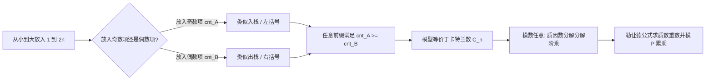

[[TOC]]

## 形式化题目

求包含 $1 \sim 2n$ 的大小为 $2n$ 的排列 $\{a_i\}$ 的数量，使得：
1. 奇数项单调递增：$a_1 < a_3 < \dots < a_{2n-1}$；
2. 偶数项单调递增：$a_2 < a_4 < \dots < a_{2n}$；
3. 相邻奇偶对满足奇数项小于偶数项：$\forall 1 \leqslant i \leqslant n,\; a_{2i-1} < a_{2i}$。

结果对给定的整数 $P$（$2 \leqslant P \leqslant 10^9$）取模。

## 正解

### 思路

#### 1. 模型转化：卡特兰数

考虑从小到大依次将整数 $1, 2, \dots, 2n$ 填入数列中：
- 集合 $A$ 存放所有奇数项 $\{a_1, a_3, \dots, a_{2n-1}\}$，共 $n$ 个数；
- 集合 $B$ 存放所有偶数项 $\{a_2, a_4, \dots, a_{2n}\}$，共 $n$ 个数。

由于要求 $a_1 < a_3 < \dots < a_{2n-1}$ 且 $a_2 < a_4 < \dots < a_{2n}$，一旦确定哪些数字进入 $A$、哪些数字进入 $B$，它们在各自集合中的下标便唯一确定（较小的数排在前面）。

再看条件 $a_{2i-1} < a_{2i}$：对于任意前 $k$ 个填入的数字（$k = 1, 2, \dots, 2n$），设当前放入 $A$ 的数字个数为 $cnt_A$，放入 $B$ 的数字个数为 $cnt_B$。
若在某一时刻出现 $cnt_A < cnt_B$（例如 $cnt_B = m$ 且 $cnt_A < m$），这意味着偶数项 $a_{2m}$ 已经确定了填入的数值，但与其配对的奇数项 $a_{2m-1}$ 还未被填入（即后面填入的数更大），必然导致 $a_{2m-1} > a_{2m}$，与条件矛盾。

因此，在构造过程的任意前缀时刻，必须恒满足：
$$cnt_A \geqslant cnt_B$$

把「数字放入 $A$」视作左括号（或入栈），「数字放入 $B$」视作右括号（或出栈），这一约束完全等价于长为 $2n$ 的合法括号匹配序列。方案数即为经典的第 $n$ 项卡特兰数（Catalan Number）：
$$C_n = \frac{1}{n+1}\binom{2n}{n} = \frac{(2n)!}{n!(n+1)!}$$

#### 2. 处理任意模数的质因数分解法

本题中模数 $P$ 是任意正整数，不保证为质数，无法直接使用费马小定理求逆元。

为此，对公式 $C_n = \frac{(2n)!}{n!(n+1)!}$ 进行质因数分解：
1. 筛出 $2n$ 以内的所有质数 $p$。
2. 利用勒让德公式（Legendre's formula）计算 $x!$ 中质因数 $p$ 的指数：
   $$E_p(x) = \sum_{k=1}^{\infty} \left\lfloor \frac{x}{p^k} \right\rfloor$$
3. 在 $C_n$ 中，质因数 $p$ 的净指数为：
   $$c_p = E_p(2n) - E_p(n) - E_p(n+1)$$
   因为 $C_n$ 为整数，必然有 $c_p \geqslant 0$。
4. 最终答案直接使用快速幂在模 $P$ 下连乘：
   $$C_n \bmod P = \left( \prod_{p \leqslant 2n} p^{c_p} \right) \bmod P$$

### 代码

@include-code(./main.py, python)

### 复杂度

- **时间复杂度**：$\mathcal{O}(n)$。
  - 筛出 $2n$ 内质数需 $\mathcal{O}(n)$；
  - 对每个质数 $p$ 计算勒让德公式耗时 $\mathcal{O}(\log_p n)$，总耗时为 $\sum_{p \leqslant 2n} \log_p(2n) = \mathcal{O}(n)$；
  - 快速幂累乘质数因子的时间为 $\mathcal{O}\left(\frac{n}{\ln n} \log P\right)$；
  - 总体在 $10^6$ 级别下运行耗时不足 0.1s。
- **空间复杂度**：$\mathcal{O}(n)$。筛法标记数组和质数列表占用空间约为数兆字节，远低于 128MB 限制。

## 总结

本题的关键在于通过「按数值大小逐步填入」的动态视角，将排列的递增条件与奇偶约束转化成「前缀中放入奇数项的元素数量必须不小于偶数项」，建立起与出入栈序列及卡特兰数的双射模型。对于不保证模数为质数的组合计数问题，先质因数分解再模下连乘是避免除法与逆元不可用时的通用方法。
