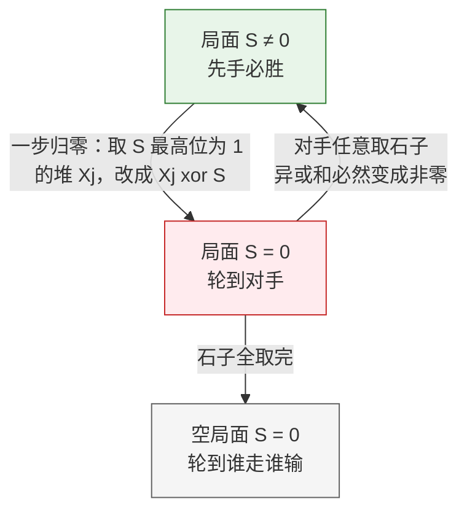

[[TOC]]

## 形式化题目

有 $N$ 堆石子，第 $i$ 堆有 $X_i$ 颗。两名玩家轮流操作，每次选择一个非空的堆，从中取走至少 $1$ 颗石子。取走最后一颗石子的人获胜（轮到某方时已无石子可取，则该方输）。

双方都采取最优策略。判断先手是否必胜：必胜输出 `win`，否则输出 `lose`。

样例：$4$ 堆，数量为 $7, 12, 9, 15$，异或和 $((7 \oplus 12) \oplus 9) \oplus 15 = 11 \oplus 9 \oplus 15 = 2 \oplus 15 = 13 \neq 0$，先手必胜，输出 `win`。

## 正解

### 思路

**朴素做法与困境。** 这是一个完全信息、无后效性的双人博弈，最自然的思路是记忆化搜索：对每个局面（用向量 $(X_1, \dots, X_N)$ 表示）判定"是否存在一步走到必败态"。存在则当前局面必胜，否则必败。但局面总数是 $\prod_{i=1}^{N}(X_i + 1)$ 个，在本题 $N \leqslant 5 \times 10^4$、$X_i \leqslant 10^5$ 的规模下是天文数字，必须找到一个能 $O(N)$ 算出的"胜负不变量"。

**从简单情形找直觉。** 只有一堆时，$X_1 > 0$ 就能一次全取完，先手必胜。两堆数量相等时，无论先手怎么取，后手都在另一堆里做对称的取法，总能取到最后一颗——先手必败。这说明胜负和"每堆数量的某种整体配对关系"有关，而二进制异或恰好是刻画这种配对关系的运算。

**Bouton 定理。** 把每堆数量写成二进制，全体按位异或，得到 **Nim 和**

$$S = X_1 \oplus X_2 \oplus \cdots \oplus X_N.$$

结论：

- $S = 0$：先手必败；
- $S \neq 0$：先手必胜。

为什么 $S \neq 0$ 时先手一步就能把局面变回 $S = 0$？设 $S$ 的最高位的 $1$ 在第 $k$ 位。异或和在这一位是 $1$，说明 $X_1,\dots,X_N$ 中在第 $k$ 位为 $1$ 的堆有奇数堆，任取其中一堆 $X_j$，令

$$X_j' = X_j \oplus S.$$

$X_j$ 与 $S$ 在第 $k$ 位都是 $1$，所以 $X_j'$ 的第 $k$ 位变成 $0$，而比第 $k$ 位更高的位不受影响——因此 $X_j' < X_j$，这一步是合法的（从第 $j$ 堆取走 $X_j - X_j'$ 颗）。新的 Nim 和为 $S \oplus X_j \oplus X_j' = S \oplus X_j \oplus (X_j \oplus S) = 0$。

为什么 $S = 0$ 时先手必败？取走若干颗石子只会把某一堆改小，而被改小的堆的某个二进制位从 $1$ 变成 $0$（更高位不变），逐位验证可知新的异或和一定不为 $0$。也就是说：**从 $S = 0$ 出发的每一步都必然到达 $S \neq 0$**，而对手处在 $S \neq 0$ 时总能一步归零。全取完的局面 $(0,0,\dots,0)$ 的 Nim 和恰为 $0$ 且轮到谁走谁输，于是"拿到 $S=0$ 局面的一方必败、对手必胜"由归纳成立。

用一张小例子看清"归零步"：$3$ 堆，数量为 $7, 12, 9$，Nim 和 $S = 7 \oplus 12 \oplus 9 = 2$。

| 堆 | 二进制 |
| --- | --- |
| $7$ | `0111` |
| $12$ | `1100` |
| $9$ | `1001` |
| **Nim 和 $S$** | **`0010`** |

$S$ 的最高位 $1$ 在第 $1$ 位（从 $0$ 数起），$12$ 和 $7$ 的这一位是 $1$。取 $12$ 这堆：$12 \oplus 2 = 14$（`1110`）$< 12$，即从 $12$ 颗的堆里取走 $2$ 颗，新局面 $7, 14, 9$ 的异或和为 $0$。先手这样走一步之后，无论对手怎么取，异或和都会重新变成非零，先手再归零……如此先手永远掌握主动。

于是答案只依赖于一次全体异或：$S \neq 0$ 输出 `win`，$S = 0$ 输出 `lose`。

### 代码

@include-code(./main.py, python)

### 复杂度

- 时间复杂度 $O(N)$：读入时对 $N$ 个数做一遍异或。
- 空间复杂度 $O(N)$：存储读入的各堆数量。

$N \leqslant 5 \times 10^4$，远低于本题 $1$ 秒的限制，Python 实现没有任何超时风险。

## 总结

本题是经典 Nim 博弈，核心是 Bouton 定理：把各堆石子数按位异或得到 Nim 和 $S$，先手必胜当且仅当 $S \neq 0$。证明的关键在于两条互补性质——$S \neq 0$ 时总能一步归零（取 $S$ 最高位为 $1$ 的那一堆，把它改成 $X_j \oplus S$），而 $S = 0$ 时任何一步都会破坏归零。由此把指数级的博弈搜索压缩成一次 $O(N)$ 的异或。

## 图示解析

这张图展示两个局面状态之间的"单向推责"：必胜方从 $S \neq 0$ 出发总能把必败局面 $S = 0$ 留给对手；对手无论怎么走都只能逃回 $S \neq 0$，直到石子被自己取完为止。观察图中 $S=0$ 节点只有"恶化"或"终局"两种出路，这正是必败态的定义。
