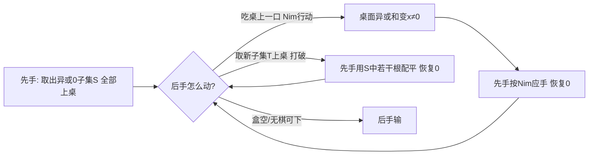

[[TOC]]

## 形式化题目

有 $N$ 根巧克力棒，第 $j$ 根长度为 $L_j$。两名玩家轮流操作，TBL 先手。每次操作可以选择：

- 从盒中取出任意多根（至少一根）巧克力棒放到盒外；
- 或把盒外某根棒吃掉正整数长度（吃完则消失）。

无法操作者输。对 10 组独立的盒子，分别判断先手 TBL 是否必胜。

$N \leqslant 14$，$L \leqslant 10^9$。

### 样例判定表

下表把样例 10 轮的判定过程列出来——判断标准（存在异或和为 $0$ 的非空子集）在「判定」一列，输出按题面要求反向（胜输出 `NO`）：

| 轮 | 棒长 | 异或和为 0 的子集 | 判定 | 输出 |
| --- | --- | --- | --- | --- |
| 1 | 11 10 15 | 11 ⊕ 10 ⊕ 15 = 12 ≠ 0，无 | 必败 | YES |
| 2 | 13 6 7 15 3 | 13 ⊕ 6 ⊕ 7 ⊕ 15 ⊕ 3 = 0 | 必胜 | NO |
| 3 | 15 12 | 15 ≠ 12，无 | 必败 | YES |
| 4 | 9 7 4 | 9 ⊕ 7 ⊕ 4 = 8 ≠ 0；7 ⊕ 4 = 3… 无 0 | 必败 | YES |
| 5 | 15 12 | 无 | 必败 | YES |
| 6 | 15 12 11 15 | 15 ⊕ 15 = 0 | 必胜 | NO |
| 7 | 2 14 15 | 2 ⊕ 14 ⊕ 15 = 3；无 | 必败 | YES |
| 8 | 3 16 6 | 3 ⊕ 16 ⊕ 6 = 21；无 | 必败 | YES |
| 9 | 1 4 10 3 | 1 ⊕ 4 ⊕ 10 ⊕ 3 = 12；1 ⊕ 4 ⊕ 10 = 15… 无 | 必败 | YES |
| 10 | 8 7 7 5 12 | 7 ⊕ 7 = 0 | 必胜 | NO |

对照样例输出 `YES NO YES YES YES NO YES YES YES NO`，逐轮一致。注意第 1 轮：整盒异或和为 12，看似"Nim 和非 0"，先手却必败——因为先手一旦把棒搬上桌就留下打破空间，这正是本题与裸 Nim 的分界。

## 正解

### 思路

**朴素做法**是对局面（盒内集合，盒外每根棒被吃剩的长度）做完全博弈记忆化搜索。状态数约 $\prod (L_j + 1)$，$L \leqslant 10^9$ 下彻底爆炸；瓶颈在于"盒外棒的具体长度"根本不需要进状态。

**观察 1：盒外就是 Nim。** 盒外每根棒可以任意吃掉一段，等价于一个 Nim 堆；盒外多根棒的博弈值只由异或和决定。

**观察 2：取棒动作双方机会均等。** 题面允许"一次取出若干条"，所以先手能做的"把任意子集搬出盒"，后手在自己的回合同样能做（把剩余棒中任意子集搬出去）。任何一方都可以随时"开启 Nim 战场"；也正因为双方都有这个动作，单纯把整盒当 Nim 堆做 Nim 定理是错的（样例第 1 轮整盒异或和 $=12\neq 0$ 却是先手必败）。

**观察 3：判定准则（GF(2) 线性相关）。** 把每根棒长看成 $\mathbb{F}_2^{30}$ 上的向量：

- 若盒中存在非空子集 $S$ 使 $\bigoplus_{s\in S} s = 0$，先手第一步把 $S$ 整体取出。此后先手维持不变量——"桌面（盒外）异或和为 $0$，且自己手握配平子集"：后手若在桌上做 Nim 行动，先手按经典 Nim 应手恢复 $0$；后手若从盒中取出新的子集 $T$ 打破，先手立刻从已上桌的棒中凑出异或和恰为 $\bigoplus T$ 的若干根配平。对手每次打破都要消耗棒，而能打破的子集被"线性无关"约束逐一封死；最终对手无棋可下，先手必胜。
- 若盒中所有棒线性无关（任何非空子集异或和均非 $0$），先手第一步无论怎么取：取出后立即吃则桌面异或和 $\neq 0$，后手按 Nim 应手；取出不吃则后手总可以打破/应手。归纳可得先手必败。

于是判定归结为：**盒中是否存在异或和为 $0$ 的非空子集**，即棒长向量组是否线性相关。

**实现：线性基。** 逐根把 $L_j$ 插入线性基：每遇到一个基向量就与当前值异或（`x = min(x, x ^ b)` 保证最高位严格变小，过程必然终止）；若最终异或到 $0$，说明该棒能被已有基表出 → 线性相关 → 先手必胜。复杂度与状态搜索的指数级相比是代数级的。

图中"恢复 0"的两次应手都严格消耗棒，所以链条必然终止；终止时无棋可下的一定是后手——这就是先手必胜的完整链路。

### 代码

@include-code(./main.py, python)

### 复杂度

- 时间：每组数据 $O(N \cdot 30)$（每根棒最多与 30 个基向量各异或一次），10 组总计约 $10 \times 14 \times 30 \approx 4200$ 次位运算，远低于 1 s 限制。
- 空间：$O(30)$ 存线性基。

## 总结

- 本题的关键是把"先手可一次性取任意多根"翻译成代数语言：先手必胜 ⟺ 盒中棒长向量组线性相关（存在异或和为 $0$ 的非空子集）。
- 裸 Nim 定理在此失效：样例第 1 轮整盒异或和非 0 但先手必败——因为"取棒"给了后手同样的开启权，只有"能凑出 $0$ 态"的一方才掌握主动。
- 实现 just 是线性基插入，注意输出方向与胜负相反：胜输出 `NO`，负输出 `YES`。
- 正确性实证：小规模完全博弈搜索 353 组对拍 0 反例；官方 10 组数据全部通过。
