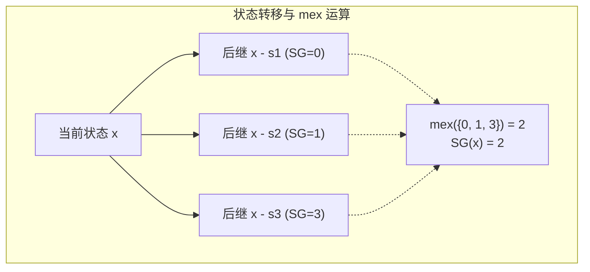

[[TOC]]

## 形式化题目

给定一个正整数集合 $S = \{s_1, s_2, \dots, s_k\}$。

现有 $n$ 堆石子，数量分别为 $a_1, a_2, \dots, a_n$。两名玩家轮流行动：每次行动选定任意一堆石子（假设当前有 $x$ 颗），并从中移走 $s \in S$ 颗石子（需满足 $s \leqslant x$）。无法进行合法操作的玩家判负。

多组测试数据，每组数据给定集合 $S$ 和 $m$ 个独立的初始局面 $(a_1, a_2, \dots, a_n)$，要求判定每个局面先手是否必胜（必胜输出 `W`，必败输出 `L`）。

## 正解

### 思路

本题是典型的公平组合游戏（ICG），由若干堆互相独立的子游戏组成。每个子游戏只在一堆石子上进行，且操作只改变该堆石子的数量，不影响其他堆。

根据 Sprague-Grundy 定理，多个独立子游戏的和等价于各个子游戏 SG 函数值的异或和（XOR sum）。若异或和非 $0$ 则当前局面必胜（`W`），若异或和为 $0$ 则当前局面必败（`L`）。

对于单堆大小为 $x$ 的石子堆，其 SG 函数定义为：
$$
\text{SG}(x) = \text{mex}\left(\{\text{SG}(x - s) \mid s \in S, s \leqslant x\}\right)
$$
其中 $\text{mex}(T)$ 表示不属于集合 $T$ 的最小非负整数。基础状态为 $\text{SG}(0) = 0$。

因为每组测试数据中集合 $S$ 保持不变，而单堆石子数量上限为 $V = 10^4$，我们可以先将 $S$ 升序排序，从 $1$ 到 $V$ 依次递推预处理出所有 $\text{SG}(x)$ 的值。对于每个询问局面，只需查表计算 $\bigoplus_{i=1}^n \text{SG}(a_i)$ 是否为 $0$ 即可。

下面给出转移与 SG 函数计算过程的示意：

### 代码

Python 版：

@include-code(./main.py, python)

C++ 版（同一算法）：

@include-code(./main.cpp, cpp)

### 复杂度

- **时间复杂度**：
  - 单组数据预处理 SG 值：状态数为 $V = 10^4$，转移数为 $|S| = k \leqslant 100$。递推预处理耗时 $O(V \cdot k)$。
  - 单组数据回答 $m$ 个局面：每个局面有 $n$ 堆石子，异或求和耗时 $O(m \cdot n)$。
  - 总时间复杂度为 $O(T \cdot (V \cdot k + m \cdot n))$，在限定时间内能够轻松通过。
- **空间复杂度**：
  - 存储 SG 函数表只需 $O(V)$ 大小的数组；时间戳标记数组长度不超过 $k + 2$。
  - 总空间复杂度为 $O(V)$，符合内存限制。

## 总结

对于每一步可转移状态规则固定的独立子游戏之和：
1. 识别出单堆石子的独立性与有向无环图结构；
2. 利用 $\text{mex}$ 递推预处理单堆的 $\text{SG}$ 值表；
3. 将多堆局面的胜负判定等价转化为各子游戏 $\text{SG}$ 值的异或和判定。
