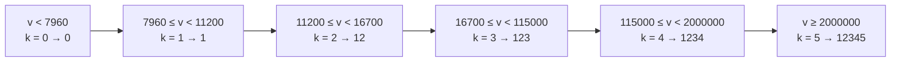

[[TOC]]

## 形式化题目

给定五个严格递增的门槛

$$T = (7960,\ 11200,\ 16700,\ 115000,\ 2000000)$$

和一个整数 $v$（$1 \leqslant v \leqslant 123456789012346$）。记 $k = \#\{i : v \geqslant T_i\}$ 为 $v$ 达到的级别数，要求输出 $v$ 本身，以及标记串

$$
\text{ans} = \begin{cases} \texttt{"0"} & k = 0 \\ \underbrace{\texttt{"12}\cdots\texttt{"}k\texttt{"}}_{k \text{ 个数字}} & k \geqslant 1 \end{cases}
$$

样例：

| 输入 $v$ | 输出 | 达到的级别数 $k$ |
| --- | --- | --- |
| `1000` | `1000 0` | 0 |
| `115000` | `115000 1234` | 4 |

注意第二个样例：$v = 115000$ 恰好等于第四档门槛，**取等号也算达到**，所以 $k = 4$ 而不是 3。

## 正解

### 思路

题面的定义是一串 `if-else`：低于第一档输出 `0`，达到第一档输出 `1`，达到第二档输出 `12`，依此类推。直接照抄也能写对，但会把门槛值和输出串各手写一遍，`1234`、`12345` 这种长串最容易抄错。

观察两件事，就能把重复书写消掉：

1. 门槛严格递增，所以「达到第几级」$k$ 就等于「有多少个门槛被跨过」，一个计数即可；
2. 输出串恰好是数字前缀：$k$ 级对应长度为 $k$ 的串 `"12...k"`，这五个串可以由 `1..5` 的数字**累加生成**，不必手写。

先从"速度 → 标记串"的区间关系看这张表：

| 速度区间 | $k$ | 输出标记串 |
| --- | --- | --- |
| $v < 7960$ | 0 | `0` |
| $7960 \leqslant v < 11200$ | 1 | `1` |
| $11200 \leqslant v < 16700$ | 2 | `12` |
| $16700 \leqslant v < 115000$ | 3 | `123` |
| $115000 \leqslant v < 2000000$ | 4 | `1234` |
| $v \geqslant 2000000$ | 5 | `12345` |

每一行的标记串都是"1 到 $k$"连起来，这就是可以用程序生成的部分。下面这张阶梯图展示 $k$ 如何随 $v$ 逐级跳变——每跨过一个门槛，标记串就多接一位数字：

图中的箭头方向就是速度增大的方向，节点内先写区间、再写级别数 $k$ 和该级别的输出。可以看到输出串只在跨门槛那一刻变化，且每次只是末尾多一个数字——这正是"前缀串"的来源。于是算法只剩两步：数门槛、查前缀表。

代码里把五个门槛放进元组 `THRESHOLDS`，用生成器表达式数出达标的个数；再用 `itertools.accumulate` 把 `"1"`、`"2"`、…累加出 `("1", "12", "123", "1234", "12345")` 作为前缀表。这样两处易错的数字各自只出现一次。

### 代码

@include-code(./main.py, python)

### 复杂度

- 时间复杂度：$O(1)$，只做 5 次比较和一次查表。
- 空间复杂度：$O(1)$，两个长度为 5 的常量元组。

## 总结

这类"分段阈值"题的通用套路是：**不要手写多分支的输出常量，而是把阈值抽成数组、把输出归纳成可生成的规律**。本题的输出串是数字前缀，用 `accumulate` 一行生成；如果规律更复杂（例如需要查表映射），同样可以把映射表集中定义在一处，让分支退化成一次下标访问。另外要牢记题面里"达到"包含取等号，边界 $v = T_i$ 归入更高一级。
