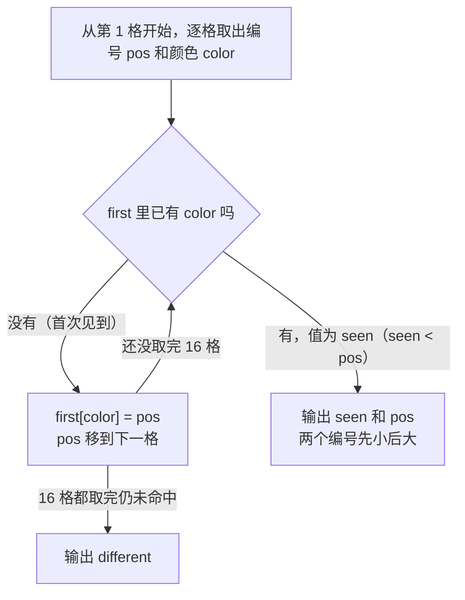

[[TOC]]

## 形式化题目

给定一个长度为 16 的字符串 $s = s_1 s_2 \cdots s_{16}$（$s_i$ 为大写字母，表示第 $i$ 格彩笔的颜色）。题面保证：**若有颜色重复，则只会出现一种重复颜色，且该颜色恰好出现 2 次**。

要求输出：

$$
\text{ans} =
\begin{cases}
\texttt{"different"}, & s_1, s_2, \ldots, s_{16} \text{ 两两不同} \\
i\ \ j \quad (i < j), & s_i = s_j \text{ 且 } s_i \text{ 恰好出现两次}
\end{cases}
$$

即：颜色各不相同就输出 `different`；否则输出那两支同色笔的编号，且必须**先小后大**。

样例 `ABCDEFAHIJPLMNOT` 中第 1 格与第 7 格都是 `A`，其余各不相同：

```
位置  1  2  3  4  5  6  7  8  9 10 11 12 13 14 15 16
颜色  A  B  C  D  E  F  A  H  I  J  P  L  M  N  O  T
      └─────────────────┘
        这两格同色 → 输出 1 7
```

注意编号从 1 开始，而 "先小后大" 意味着答案的两个数必须是升序。

## 正解

### 思路

先看最直白的做法：把所有格子两两比较，找到第一组同色的就输出编号。

```python
for i in range(16):
    for j in range(i + 1, 16):
        if colors[i] == colors[j]:
            print(i + 1, j + 1)
            return
print("different")
```

它一定是对的：题面保证同色只有一对，$i$ 从小到大、$j$ 从小到大枚举，第一次命中的就是唯一那对，而且 $i < j$ 天然满足"先小后大"。本题 $n$ 恒为 16，这个写法也是瞬时的，所以这里没有时间上的瓶颈，真正的浪费在**信息没有留下来**：扫到第 $j$ 格时，它又要和前面每一个格子重新比一遍，"这个颜色我之前见过吗"这个结论每次都被丢掉重算，比较次数是 $O(n^2)$。

要消掉这份重复劳动，只需把"见过没有"记在一张表里。从左往右扫一遍，维护一个字典

$$
\texttt{first}[c] = \text{颜色 } c \text{ 首次出现的编号}
$$

每扫到一格颜色 $c$、编号 $pos$，就问表一次：

- 表里没有 $c$ → 这是第一次见到，把 `first[c] = pos` 记下，继续往右扫；
- 表里已有 $c$ → 表里存的就是它首次出现的编号，而这个编号一定小于 $pos$，直接输出这两个编号即可。

下面这张表把样例的扫描过程逐步展开，第 4 列是每一步的结论：

| 当前编号 $pos$ | 颜色 | 表里已有该颜色吗 | 动作 |
| --- | --- | --- | --- |
| 1 | `A` | 无 | 登记 `A → 1`，继续 |
| 2 | `B` | 无 | 登记 `B → 2`，继续 |
| 3 | `C` | 无 | 登记 `C → 3`，继续 |
| 4 | `D` | 无 | 登记 `D → 4`，继续 |
| 5 | `E` | 无 | 登记 `E → 5`，继续 |
| 6 | `F` | 无 | 登记 `F → 6`，继续 |
| 7 | `A` | **已有：`A → 1`** | **命中，输出 `1 7`，结束** |

前 6 格都只是"登记"，到第 7 格才第一次命中，此时表里存的 1 就是 `A` 首次出现的位置，与当前的 7 组成了答案。

把这个判断画成流程，每一步都只有两个出口：



推导到这里，本题就归结为三条观察：

1. **只需要首次位置**：答案要求"先小后大"，而首次出现的编号是所有出现位置里最小的，记住它就够，不必存全部位置。
2. **顺序自动成立**：表是边扫边写的，命中时表里的编号一定小于当前编号，所以不需要再排序或取 `min/max`。
3. **可以提前结束**：题面说同色最多两支，第二次遇到就是最终答案；只有一直没命中，才说明 16 支颜色全不同。

于是每个格子只做一次常数时间的查表，比较次数从 $O(n^2)$ 降到 $O(n)$。

### 代码

@include-code(./main.py, python)

### 复杂度

- 时间复杂度：$O(n)$，$n = 16$ 为彩笔盒格数。每个字符最多一次字典查询加一次写入，命中重复后立即返回更早结束。
- 空间复杂度：$O(n)$，字典最多保存 16 条"颜色 → 首次编号"的记录；$n$ 固定为 16，实际是常数规模。

对比朴素的双重循环：两者在本题都是毫秒级、都远低于 1000ms 与 128MB 的限制，差别要到"找第一个重复元素"这类 $n$ 更大的一般问题上才显现。写出 $O(n)$ 的价值在于，它把问题本身的结构——"是否见过"只需查一次表——讲清楚了。

## 总结

这道题是**哈希表去重**的最小模型：给一个序列，判断有没有元素重复、重复的是哪两个。

通用套路是"用一张表把见过的东西记下来"：遍历时先查表，查到就说明重复，同时表里存的信息（这里是首次出现的编号）往往正好是题目要的答案。三处细节值得留意：

1. **表里存什么由输出决定**。本题要求"先小后大"的两个编号，所以存首次出现的位置，命中时 `(表里的值, 当前编号)` 就已经是有序的，省掉了排序。
2. **哨兵要选不会与真实取值冲突的值**。代码用 `first.get(color)` 返回的 `None` 表示"没见过"；颜色是大写字母，不可能是 `None`，判断不会混淆。
3. **编号基准不要混用**。Python 下标从 0 起而题面从 1 起，代码用 `enumerate(colors, 1)` 一次到位，避免在输出处补加 `+1` 时漏加或加错位置。
