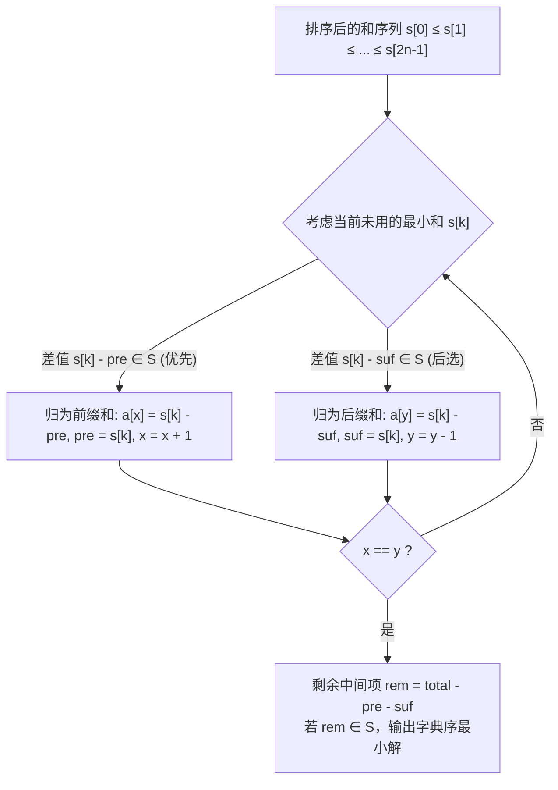

[[TOC]]

## 形式化题目

给定一个包含 $2n$ 个正整数的多重集合，它是某长度为 $n$ 的未知正整数数列 $a_1, a_2, \dots, a_n$ 的所有前缀和 $\left\{\sum_{j=1}^i a_j \mid 1 \le i \le n\right\}$ 与所有后缀和 $\left\{\sum_{j=n-i+1}^n a_j \mid 1 \le i \le n\right\}$ 打乱顺序后的并集。同时给定一个合法数字集合 $S \subseteq \{1, 2, \dots, 500\}$，已知原数列的各项均满足 $a_i \in S$。

要求还原出数列 $a_1, a_2, \dots, a_n$。若存在多组满足条件的数列，输出字典序最小的一组。

## 正解

### 思路

因为数列中每一个数 $a_i \ge 1$，所以原数列的所有前缀和序列 $P_1 < P_2 < \dots < P_n$ 与所有后缀和序列 $S_1 < S_2 < \dots < S_n$ 都是严格单调递增的。

1. **升序排序与双向归属**：
   将输入的 $2n$ 个和升序排列为 $s_0 \le s_1 \le \dots \le s_{2n-1}$。
   显然，序列中最小的未分配和，必然对应着原序列中尚未确定的最靠左的前缀和，或者最靠右的后缀和。
   我们可以维护一个向中间收缩的填数区间 $[x, y]$（初始为 $[1, n]$），以及当前已累计的前缀和 $pre$（初始为 $0$）和后缀和 $suf$（初始为 $0$）。

2. **按位推导与剪枝**：
   遍历排序后的每一个和 $s_k$：
   - 若 $s_k$ 归属于前缀和，则左端新填入的数为 $d_1 = s_k - pre$。合法条件为 $0 < d_1 \le 500$ 且 $d_1 \in S$。若满足，则令 $pre \leftarrow s_k$ 并将区间左端右移（$x \leftarrow x + 1$）。
   - 若 $s_k$ 归属于后缀和，则右端新填入的数为 $d_2 = s_k - suf$。合法条件为 $0 < d_2 \le 500$ 且 $d_2 \in S$。若满足，则令 $suf \leftarrow s_k$ 并将区间右端左移（$y \leftarrow y - 1$）。
   
   由于每个数严格在集合 $S$（最大 $500$）内，差值剪枝非常苛刻，绝大多数错误分支在第一步或第二步就会被立即剪掉。

3. **终点检测与字典序最小**：
   当左右指针重合（$x = y$）时，序列只剩下最中间一个数未填。此时整个数列的总和已被最大和 $total = s_{2n-1}$ 唯一确定，中间这个数的值必然是 $rem = total - pre - suf$。只要检验 $0 < rem \le 500$ 且 $rem \in S$，即找到一组解。
   为了保证字典序最小，搜索中对于每一个和 $s_k$，优先尝试作为前缀和填充左侧，再尝试作为后缀和填充右侧。找到的第一组解即为字典序最小解。

4. **Python 实现细节**：
   $n \le 1000$ 时递归深度达 $1000$，采用显式栈模拟深度优先搜索，将状态和已确定的左右部分压栈，可彻底避免递归深度限制，运行速度极快。

### 代码

Python 版：

@include-code(./main.py, python)

C++ 版（同一算法）：

@include-code(./main.cpp, cpp)

### 复杂度

- **时间复杂度**：排序 $2n$ 个整数的时间为 $\mathcal{O}(n \log n)$。在剪枝搜索过程中，每步差值必须落在小集合 $S$ 内，搜索树宽度极窄（绝大多数节点只有单一可行后继），平均搜索步数仅为 $\mathcal{O}(n)$，总时间复杂度为 $\mathcal{O}(n \log n)$。
- **空间复杂度**：存储排序后的前缀后缀和、集合 $S$ 以及搜索状态栈的空间复杂度均为 $\mathcal{O}(n)$。

## 总结

本题的关键在于**利用前缀和与后缀和的双向单调递增性**。将打乱的和排序后，问题转化为从两端向中间逼近的双指针决策过程。集合 $S$ 的取值范围极小，提供了强大的数值差剪枝条件，保证了深搜回溯的高效性。

## 图示解析

