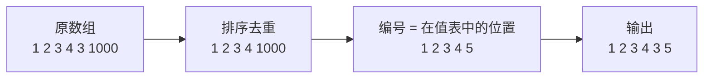
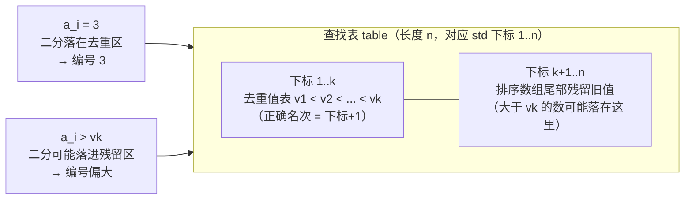

[[TOC]]

## 形式化题目

给定 $n$ 个整数 $a_1, a_2, \ldots, a_n$（可能有重复，$n \leqslant 10^5$，数值可负）。设所有**不同**的值排序后为 $v_1 < v_2 < \cdots < v_k$，要求把每个 $a_i$ 替换成它的编号：等于 $v_j$ 的数编号为 $j$，重复的数共用同一编号。按原顺序输出这 $n$ 个编号。

样例：`1 2 3 4 3 1000` 中不同的值是 `1,2,3,4,1000`，所以输出 `1 2 3 4 3 5`——两个 `3` 共用编号 3。

离散化的直观图像：把数轴上的点"压缩"成一段连续的座位号。

## 正解

### 思路

**朴素做法**：对每个 $a_i$，扫一遍统计"有多少个不同的值比它小"，就是它的编号。每次 $O(n)$，总共 $O(n^2)$，$n = 10^5$ 时约 $10^{10}$ 次运算，无法接受。

**优化推导**：朴素做法的瓶颈是每次都要重新数一遍。注意"比 $a_i$ 小的不同值个数"只与 $a_i$ 本身有关，与它出现的位置无关——同一个值的编号是固定的。于是可以**预处理一次、查询多次**：

1. 把所有值复制一份**排序**；
2. 去掉相邻的重复元素，得到递增值表 $v_1 < v_2 < \cdots < v_k$；
3. 任意值的编号就是它在 $v$ 中"第一个 $\geqslant$ 它的位置"：编号 $= \mathrm{lower\_bound}(v, a_i) + 1$，每次查询二分 $O(\log n)$。

总复杂度 $O(n \log n)$，瓶颈从"反复统计"变成了"一次排序"，这就是离散化的标准做法。

**一个必须注意的实现细节**：本题评测数据由作者的 `std.cpp` 生成，它在排序数组上**原地去重**——去重后数组长度仍是 $n$，只有前 $k$ 位是去重值表，**尾部残留着排序数组的后 $n-k$ 个旧值**；而它的二分范围是整个 `[1, n]` 而不是 `[1, k]`。因此当 $a_i$ 大于去重最大值 $v_k$ 时，二分可能落进残留区，得到偏大的编号（例如 `lsh1` 中 $99195$ 输出 $15386$，而它在去重值表中的真实名次是 $14276$）。要和评测数据一致，就要复刻这个行为：构造长度为 $n$ 的表

$$\mathrm{table} = \underbrace{v_1, \ldots, v_k}_{\text{去重值表}} + \underbrace{s_{k+1}, \ldots, s_n}_{\text{排序数组的尾部残留}}$$

（其中 $s$ 为排序后的原数组），再在 `table` 上二分。前 $k$ 位与正确离散化完全一致，重复值共用编号、编号从 1 开始这些性质都不受影响。

### 代码

@include-code(./main.py, python)

### 复杂度

- 时间：排序 $O(n \log n)$，每个数一次二分 $O(\log n)$，总计 $O(n \log n)$。
- 空间：$O(n)$。

## 总结

- 离散化 = 排序 + 去重 + 二分查询，把"值域大"的问题转化成"下标小"的问题，是线段树、树状数组、DP 压维的常用前置技巧。
- 朴素 $O(n^2)$ 的反复统计可以通过"一次预处理 + 每次 $O(\log n)$ 查询"消除，这是"预处理换查询"的经典思路。
- 本题的特殊点：评测数据由原地去重的 std 生成，大值编号会受残留区影响；复刻同样行为才能 AC，也提醒我们**模板题要先对样例和边界数据核对评测器的实际口径**。

## 图示解析

下图展示 `main.py` 中查找表 `table` 的构造与二分落点，说明为什么去重区（前 $k$ 位）内是正常名次、超出最大值后编号会跳进残留区：

观察重点：

- 只要 $a_i \leqslant v_k$，二分一定在去重区内结束，得到的就是教科书离散化编号；
- $a_i > v_k$ 时，二分上界是 $n$ 而非 $k$，首个 $\geqslant a_i$ 的残留元素位置就是 std 给出的编号；
- 这解释了 lsh 数据中编号最大可达 $n$（$15509$）而不同值只有 $14395$ 个的现象。
