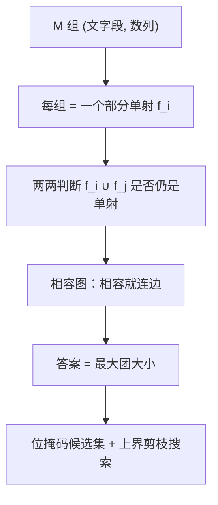

[[TOC]]

## 形式化题目

有 $N$ 个数字 $1, 2, \dots, N$ 和 $N$ 个字母（第 $1$ 到第 $N$ 个大写字母），二者之间要建立
一个**双射** $\varphi$：每个字母配一个数字，每个数字恰好被一个字母用掉。

给定 $M$ 组数据，第 $i$ 组是一对「文字段 $S_i$、数列 $A_i$」，长度都是 $L_i$，并且组内合法：

- 同一个字母在 $S_i$ 中出现多次时，对应位置的数字都相同；
- 不同字母对应位置的数字互不相同。

第 $i$ 组被**满足**，当且仅当在双射 $\varphi$ 下

$$\varphi(S_i[j]) = A_i[j] \qquad (1 \leqslant j \leqslant L_i),$$

即文字段的第 $j$ 个字母恰好配到数列的第 $j$ 项。求最多能**同时**被满足的组数。

$1 \leqslant N \leqslant 26$，$1 \leqslant M \leqslant 40$，$1 \leqslant L_i \leqslant 100$。

## 正解

### 思路

**第一步：一组数据 = 一个部分单射。** 组内合法意味着第 $i$ 组只做了一件事：
把 $S_i$ 里出现过的字母各指定一个数字。这是一个**部分单射**

$$f_i : \{\,S_i \text{ 中出现的字母}\,\} \to \{1, \dots, N\},$$

没出现过的字母在 $f_i$ 里没有定义。于是"第 $i$ 组被满足"就是"$\varphi$ 在 $f_i$ 的定义域上等于 $f_i$"。

**第二步：一堆组能同时满足，等价于它们的并还是单射。** 记 $f = \bigcup_{i \in T} f_i$。
若存在双射 $\varphi \supseteq f$，则 $f$ 必须是单射（既是函数、又是单射）；
反过来只要 $f$ 是单射，把剩下的 $N - |f|$ 个字母与剩下的 $N - |f|$ 个数字随便配对，
就补成了一个双射。所以

$$T \text{ 能被同时满足} \iff f = \bigcup_{i \in T} f_i \text{ 是一个部分单射}.$$

**第三步：冲突一定在某一对上暴露。** 合并后 $f$ 不是单射，只可能是两种情形：

1. 某个字母被指定了两个不同的数字 —— 这两个来源分属两组 $i, j$（若同属一组，则该组自己就不合法），
   于是 $f_i \cup f_j$ 已经不是单射；
2. 两个不同字母被指定了同一个数字 —— 同理，$f_i \cup f_j$ 已经不是单射。

因此 **"任意两组都相容" 就推出 "全体相容"**：集合 $T$ 合法当且仅当 $T$ 中任意一对都合法。

**第四步：建图，答案就是最大团。** 以 $M$ 组为点，$i$ 与 $j$ 之间连边当且仅当
$f_i \cup f_j$ 是单射。由第三步，$T$ 合法 $\iff$ $T$ 是这张图里的**团**。所以答案等于
**相容图的最大团大小**。判断两条边只需逐字母扫一遍：

- 公共字母上两组的数字必须相同；
- 合并后「用到的不同数字个数」必须等于「用到的不同字母个数」
  （映射是单射 $\iff$ 值域大小 = 定义域大小）。

**第五步：$M \leqslant 40$ 的最大团。** 最大团是 NP 难问题，但 $M \leqslant 40$，
一个 `unsigned long long` / Python 大整数就能表示"还能选哪些组"，直接搜索：

- 按编号从小到大决定每一组"选 / 不选"；
- 用掩码 `candidates` 记录"与已选集合全部相容、还有资格被选的组"；
  选第 $i$ 组时把 `candidates` 与第 $i$ 组的相容掩码取交；
- 剪枝：若 `已选数 + 剩余组数 <= 当前最优`，后面的组全选也追不平，直接返回。

本题的 40 组数据里有大团结构（第 9 个点是 40 组完全相容，第 10 个点是 39 组完全相容 + 1 组捣乱），
但"先一路选到底"的顺序会立刻拿到最优解，剪枝随即把其余分支全部砍掉，所以实际搜索量很小。

**样例推演。** 题面样例的三组数据给出的部分单射是

| 组 | 文字段 / 数列 | 定义域与取值 |
| :-: | :-: | :-: |
| 1 | `ACCA` / `1 3 3 1` | $A \to 1$，$C \to 3$ |
| 2 | `AAC` / `2 2 1` | $A \to 2$，$C \to 1$ |
| 3 | `BCBC` / `3 1 3 1` | $B \to 3$，$C \to 1$ |

逐对检查：

| 组对 | 公共字母 | 合并后的字母 / 数字 | 相容？ |
| :-: | :-: | :-: | :-: |
| 1, 2 | $A$：$1 \neq 2$ | — | 否（$A$ 被指定了两个数字） |
| 1, 3 | $C$：$3 \neq 1$ | — | 否（$C$ 被指定了两个数字） |
| 2, 3 | $C$：$1 = 1$ | $\{A,C,B\}$ / $\{2,1,3\}$，个数相同 | 是 |

相容图只有 $2\!-\!3$ 一条边，最大团大小为 $2$，与样例输出一致；
取 $A=2, B=3, C=1$ 时第 2、3 组被满足，正是题目提示里的那组对应关系。

### 代码

Python 版（最大团用 `functools.cache` 记忆化：候选集里取编号最小的组，选 / 不选两支取最大值）：

@include-code(./main.py, python)

C++ 版（同一算法，最大团用位掩码 + 分支限界 DFS，与 std 等价）：

@include-code(./main.cpp, cpp)

### 复杂度

设 $M$ 为组数，$\alpha = 26$ 为字母表大小。

- **建图**：每组读入 $O(L_i + \alpha)$，两两判断相容 $O(M^2 \alpha)$，即 $O(M^2 \alpha + \sum L_i)$。
- **最大团**：最坏 $O(2^M)$，是本题唯一的指数部分；$M \leqslant 40$ 时靠"上界剪枝"退化到可接受范围。
  实测官方 10 个点的搜索节点数最多为 $1.2 \times 10^5$（第 7 个点），第 9、10 个点的完全团结构只有
  $81$、$80$ 个节点。
- **实测**：C++ 版 10 个点全部在 $9\ \text{ms}$ 内跑完、峰值内存 $8.4\ \text{MB}$
  （限时 $1000\ \text{ms}$、$64\ \text{MB}$）；Python 版每点约 $0.02\ \text{s}$，
  `@cache` 的状态数最多只有 $79$ 个（记忆化把"同一候选集"的重复计算全部合并了）。
- **空间**：C++ 版除输入外只需 $O(M)$ 的掩码与 $O(M)$ 的递归栈；Python 版额外存记忆化表，
  状态数是实际搜索到的不同候选集个数，本题量级在 $10^2$ 以内。

## 总结

- **把"一组数据"读成一个部分单射**，题目就从"安排一个双射"变成了"挑一些单射拼起来"，
  不再需要关心具体是哪个双射。
- **两两相容 $\Rightarrow$ 全体相容**是本题的关键一步：任何冲突都只涉及两组，
  于是"选哪些组"变成图上的团，答案就是最大团。没有这条观察就只能对 $N!$ 个双射暴力枚举。
- **补全为双射不需要额外条件**：只要合并后是单射，剩余字母数与剩余数字数就必然相等，
  随便配对即可。这也是题目里 $N$ 只用来限定值域、算法根本用不到它的原因。
- **$M \leqslant 40$ 让最大团可以硬搜**：一个 64 位掩码存候选集，配一条
  `已选数 + 剩余组数 <= 最优` 的上界剪枝；数据里的"完全相容"结构恰好让最优解在第一条路径上就被找到，
  剪枝随即生效。Python 版用 `@cache` 记忆化候选集，把重复状态合并掉，同样很快。

## 图示解析

把整个推导串成一条流水线：每组数据压缩成一个部分单射，两两判断相容建成图，答案落在最大团上。

左边三步是建模，右边两步是实现。读图时注意两点：判断边的条件是"公共字母取值相同"
且"合并后数字个数 = 字母个数"这两条同时成立；而最大团搜索里，`candidates` 掩码始终表示
"和已经选定的组全部相容、还有资格入选的组"，一旦某组与已选集合冲突，它就从候选集里消失，
不会再被回溯到。
