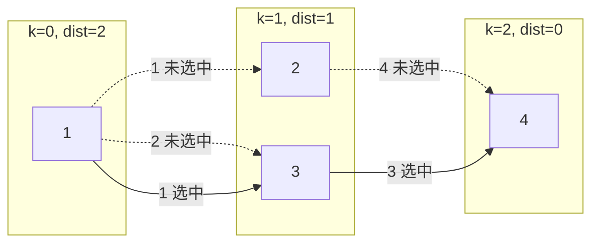

[[TOC]]

## 形式化题目

给定无向图 $G = (V, E)$，$|V| = n$、$|E| = m$，每条边 $e$ 有两个属性：长度恒为 $1$，
颜色 $c_e$（$1 \leqslant c_e \leqslant 10^9$）。一条从 $1$ 到 $n$ 的路径

$$P = (v_0 = 1, v_1, \dots, v_k = n)$$

对应颜色序列 $C(P) = (c_{v_0 v_1}, \dots, c_{v_{k-1} v_k})$。要求在所有从 $1$ 到 $n$ 的路径中：

1. **先最小化边数** $k$；
2. 在边数取到最小值 $D$ 的前提下，**最小化颜色序列的字典序**。

输出 $D$ 与这个字典序最小的颜色序列。图不保证无重边、无自环；多组数据。

这里出现了两个目标，并且是**字典序意义**下的两级目标：先把可行解集缩小到"长度 = $D$"这一层，
再在这一层里比字典序。所以问题的本质是：

$$\min_{P:\ |P| = D} C(P) \quad \text{（按字典序）},\qquad D = \text{dist}(1, n).$$

## 正解

### 思路

**第一步：把"长度"这个自由度消掉。** 一条路径的颜色序列长度等于它的边数，所以字典序比较
只发生在长度相同的两条路径之间——长度一旦不同，短的直接胜出。于是要先知道 $D$。
从 $n$ 出发做一次反向 BFS（边长全为 $1$，BFS 首次到达即最短），就得到

$$\mathrm{dist}[v] = v \text{ 到 } n \text{ 的最短边数},$$

$D = \mathrm{dist}[1]$。反向 BFS 的好处是**一次就拿到所有点离终点的距离**，而正向 BFS
只能给出离起点的距离，对"能不能走完剩下这段路"没有信息。

**第二步：字典序就是"逐位贪心"。** 长度已被钉死为 $D$，剩下的是一个逐位决策的问题：
第 $1$ 位颜色、第 $2$ 位颜色……每一位都希望尽量小。设走完前 $k$ 位后停在节点 $u$，
则剩余 $D - k$ 位必须由一条 $u \to n$ 的、长度为 $D - k$ 的路径提供，也就是要求

$$\mathrm{dist}[u] = D - k .$$

**这条等式就是全部约束**：它保证"位号 = 剩余距离"，任何满足它的节点都一定能续走到 $n$
（沿 $\mathrm{dist}$ 每次减 $1$ 的边一直走即可），因此不会走进死路。反过来，若不满足，
要么走不到 $n$，要么会超出 $D$ 位。

于是算法是：

- 维护**当前层** `cur`：所有可以作为"某条最优路径第 $k$ 个终点"的节点，它们都满足
  $\mathrm{dist} = D - k$；
- 枚举 `cur` 中所有指向 $\mathrm{dist} = D - k - 1$ 的节点的出边，取其中**最小颜色** `cmin`，
  它就是答案的第 $k+1$ 位（因为比它小的颜色在这一位没有任何可行边，而它自己一定可行）；
- 下一层 = 所有"颜色恰为 `cmin`、$\mathrm{dist}$ 恰为 $D - k - 1$"的出边终点，
  并且**每个点只入层一次**（`in_layer` 标记）。

**第三步：为什么第二位贪心不会破坏第一位？** 这是分层贪心最常见的疑问。答案是：
判定"第 $k+1$ 位能不能取到 $c$"只依赖 $\mathrm{dist}$ 与边颜色，**与前缀具体是怎么走过来的无关**。
只要当前节点 $u$ 满足 $\mathrm{dist}[u] = D - k$，那么"从 $u$ 出发，前一位取 $c$"就等价于
"存在一条从 $u$ 到 $n$ 的长度恰为 $D-k$ 的路径，且第一条边颜色为 $c$"——是个只与 $u$ 有关的谓词。
所以**前缀长度相同、位数相同**时，字典序比较逐位独立，可以在第 $k+1$ 位独立取最小值。
而所有候选节点都保证了前缀长度 $= k$、剩余距离 $= D - k$，条件齐平，逐位贪心合法。

**为什么每个点只入层一次就够？** 层号 $k$ 由 $\mathrm{dist}$ 唯一确定（$k = D - \mathrm{dist}[v]$），
一个点不可能出现在两个不同层里；同一层里重复入队也只会让出边被重复扫。加 `in_layer` 标记后，
每个点最多被扫出边一次，**总扫描量 $O(n + m)$**，与层数无关。

用题目样例走一遍（$n = 4$，$6$ 条边，其中 $1$–$3$ 有两条颜色分别为 $2$ 和 $1$ 的平行边）：

| 层 $k$ | 当前层节点 | $\mathrm{dist}$ 应为 | 候选出边（节点, 颜色） | `cmin` | 下一层 |
| :-: | --- | :-: | --- | :-: | --- |
| 0 | $\{1\}$ | 1 | $(2,1)$, $(3,2)$, $(3,1)$ | 1 | $\{2, 3\}$ |
| 1 | $\{2, 3\}$ | 0 | $(2{\to}4, 4)$, $(3{\to}4, 3)$ | 3 | $\{4\}$ |

$\mathrm{dist}[4] = 0$、$\mathrm{dist}[2] = \mathrm{dist}[3] = 1$、$\mathrm{dist}[1] = 2$，
所以 $D = 2$；答案是 `1 3`，与样例一致。

注意第 0 层的候选里 $(3,1)$ 这条边：节点 $3$ 是通过 $1$–$3$ 的**第二条平行边**（颜色 $1$）
进入第 1 层的，而不是通过颜色为 $2$ 的那条。第 1 层于是在 $\{2, 3\}$ 上取
$\min(4, 3) = 3$，得 `1 3`；如果只把节点 $3$ 按第一条扫到的边（颜色 $2$）入层，
就会以为第 0 位只能是 $2$，答案错成 `2 3`。**这说明"同一对点之间的不同颜色边各自独立成一次转移"，
平行边必须全部保留。**

**关于不连通：** 题面没有定义 $1$ 无法到达 $n$ 时输出什么，本仓库约定输出 `0` 与一个空行。
十组官方数据都不触发这个分支（`std.cpp` 与本解在此约定上一致）。

### 代码

Python 版：

@include-code(./main.py, python)

C++ 版（同一算法）：

@include-code(./main.cpp, cpp)

两份代码都是"反向 BFS + 分层贪心"：`main.py` 用 `deque` 与生成器表达式把候选取最小写成一行，
`main.cpp` 用链式前向星与手写队列，两个数组 `cur_layer` / `nxt_layer` 交替充当相邻层，
全程没有 `vector` 与 `set`，配合 `int` 邻接表把峰值内存压在 10 MB 以内。

### 复杂度

- **时间**：反向 BFS 每个点、每条边各访问一次，$O(n + m)$；分层贪心每个点只入层一次，
  出边合计也只扫一遍，$O(n + m)$。多组数据按 $\sum (n_i + m_i)$ 计。
  实测最大数据（$T = 10$，每组 $n = 10^5$、$m = 2 \times 10^5$）C++ 约 0.27 s（限时 1000 ms）。
- **空间**：邻接表存 $2m$ 条半边，$O(n + m)$，C++ 实测峰值约 8.4 MB（限时 64 MB）。
- **Python 侧风险**：`main.py` 只依赖标准库，`deque` + 生成器最坏情况约为 C++ 的 20–40 倍常数，
  在真实数据 `problem10.in`（10 组满规模）上实测约 1.9 s，**超过 1 s 限时**。
  按 `python-oj-short` 的约定，Python 短解法允许 TLE，但算法与 C++ 同阶；
  正式提交请用 `main.cpp`。

## 总结

- **两个目标要分两步拆**：颜色序列的长度等于路径边数，所以"长度最短"是硬约束，
  必须先用一次 BFS 把它算出来并钉死，之后字典序才有意义。用反向 BFS
  （从 $n$ 出发）而不是正向 BFS，是因为决策时需要的是"到终点还有多远"。
- **分层贪心的合法性来自"同一层条件齐平"**：$\mathrm{dist}[v] = D - k$ 把所有候选点
  压在同一个前缀长度、同一个剩余距离上，逐位取最小颜色才不会互相干扰；
  这一条同时排除了死路——满足等式的点一定能续走到 $n$。
- **每个点只入层一次**是复杂度的关键：层号由 $\mathrm{dist}$ 唯一决定，重复入层是纯浪费。
  加上 `in_layer` 标记后，总扫描量与层数无关，稳定 $O(n + m)$。
- **平行边必须逐条保留**：同一对点之间的不同颜色边是独立的候选转移，
  样例里 `1 3` 这个答案正是靠"第二条颜色更小的平行边"才取到的。

## 图示解析

下图画出样例的分层结构：三个子图是按 $\mathrm{dist}$ 分的层（层内节点到 $n$ 的最短距离相同），
实线箭头是最终答案 $1 \to 3 \to 4$ 用到的两条边，虚线箭头是候选但未选中的边。

从图上看三件事：节点 $1$ 到 $4$ 只有两条可能的边（$1\to 2\to 4$ 与 $1\to 3\to 4$），
所以 $D = 2$，颜色序列只有两位。第 1 位由 $1$ 的三条出边里最小的颜色决定，是 $1$；
而 $1$ 到 $3$ 之间有两条平行边，一条颜色 $2$、一条颜色 $1$，**只要有一条颜色为 $1$，
节点 $3$ 就能进入第 1 层**——这正是答案不是 $2\,3$ 的原因。第 2 位在 $\{2, 3\}$ 上竞争，
$2 \to 4$ 的颜色 $4$ 输给 $3 \to 4$ 的颜色 $3$，于是最终序列为 $1\,3$。
