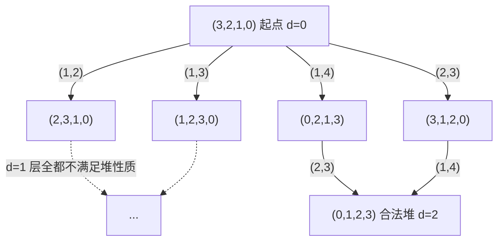

[[TOC]]

## 形式化题目

给定一棵 $N$ 个结点的二叉树，结点 $i$ 有互不相同的点权 $F_i$，以及 $M$ 种交换方式
$(u_j, v_j)$：一次操作可以任选一种方式，交换 $u_j$ 与 $v_j$ 当前持有的点权。
同一种方式可以反复使用。

要求用最少的操作次数，把点权的分布变成一棵**大根堆**：对每个非根结点 $i$，
其点权严格大于子树中所有结点的点权；等价地，$F_i > F_{p(i)}$ 对每个 $i$ 成立，
其中 $p(i)$ 是 $i$ 的父亲（根的 $p$ 为 $0$）。

求最少操作次数。数据保证有解。

把"点权的分布"看成一个排列，题目就变成一句纯图论的话：

- **状态**：把权值分配到各结点的方案，共 $N!$ 种可能；
- **边**：每一种交换方式 $(u_j, v_j)$ 都是一次"交换排列第 $u_j$、$v_j$ 个位置"，边权为 $1$；
- **起点**：题面给定的初始分布；
- **终点集合**：所有满足大根堆性质的分布（**不止一个**）；
- **答案**：起点到终点集合的最短距离。

## 正解

### 思路

**第一步：点数权没有意义，只有相对大小有意义。**

大根堆的所有条件都是形如"$F_i > F_{p(i)}$"的**不等号**，不涉及具体数值。因此可以把 $N$ 个权值
按从小到大排个名，用排名替换权值：最小的换成 $N-1$、最大的换成 $0$，得到一个序号序列
$\mathrm{rk}_i \in \{0, 1, \dots, N-1\}$。于是大根堆性质被改写成一个纯粹的下标比较：

$$\mathrm{rk}_i < \mathrm{rk}_{p(i)} \qquad (\forall\, i,\; p(i) \neq 0).$$

这一步之后，初始状态 $F_i \leqslant 100$ 的具体取值完全不参与计算。

**第二步：目标状态不唯一，所以不能"算距离到某一个目标"。**

如果题目像八数码那样有唯一目标排列，就可以直接判定可达性；但大根堆只规定了父子间的偏序，
同一棵树上合法的堆排列有很多个。比如 $N = 4$ 的链 $1 \to 2 \to 3 \to 4$，可行序号序列是
$0\,1\,2\,3$；而完全二叉树 $2,3$ 是 $1$ 的孩子时，$0\,1\,2\,3$ 与 $0\,2\,1\,3$ 都是堆。
所以正确的做法不是求到某个终点的距离，而是**把终点当成一个集合**：BFS 时凡是生成出满足
堆性质的排列，就立即接受。

**第三步：状态压缩成 64 位整数。**

$N \leqslant 16$，每个结点的序号恰好取值 $0 \sim 15$，用 **4 个二进制位**就能存下
（这正是 $N \leqslant 16$ 这个上界的来源）。把结点 $i$ 的序号放在状态的第 $4(i-1)$ 位起，
整棵树就是一个 64 位无符号整数，可以直接丢进哈希表当键：

$$\texttt{state} = \sum_{i=1}^{N} \mathrm{rk}_i \cdot 16^{\,i-1}.$$

一次交换 $(u, v)$ 就变成"取出这两段 4 位、交换后写回"，三次位运算搞定：

```text
a = (state >> su) & 15;          // u 的序号
b = (state >> sv) & 15;          // v 的序号
state' = state & ~(15 << su) & ~(15 << sv) | (b << su) | (a << sv);
```

判堆也不需要对每个结点单独查表，只需扫一遍 $N-1$ 条父子边，比较两段 4 位。

**第四步：为什么 BFS 就是答案。**

每次交换的代价都是 $1$，状态图是无权图，从起点出发的 BFS 第 $d$ 层恰好是
"用 $d$ 次交换能到达且 $d$ 次内均未到达过"的全部排列。又因为同一种方式可以重复使用，
边是无向的（交换是对合），所以状态图的连通分量就是可达集合，BFS 不会漏解。
因此**首次生成出合法堆排列时的层数就是最少交换次数**。

下面是第一组样例的状态图前三层。权值 $1,2,3,4$ 换成序号后初始排列是 $(3,2,1,0)$，
四种子树上的交换方式 $(\mathrm{u},\mathrm{v})$ 用 1 起编号。



第 1 层（$d=1$）的四个状态都不是堆：$(2,3,1,0)$ 里结点 2 的序号 $3$ 比父亲结点 1 的 $2$ 大，
$(0,2,1,3)$ 里结点 4 的 $3$ 比父亲结点 2 的 $2$ 大，另外两个同理。到第 2 层才出现
$(0,1,2,3)$，它对应权值分布 $F = (4,3,2,1)$，确实是一条链上的大根堆，于是答案是 $2$。
题面给出的方案 "先 $(2,3)$ 再 $(1,4)$" 正是图中经 $A_3$ 的那条实线路径。

### 代码

Python 版：

@include-code(./main.py, python)

C++ 版（同一算法）：

@include-code(./main.cpp, cpp)

### 复杂度

设 $S$ 为 BFS 实际访问到的状态数（可以差到 $N!$，但答案很小时只展开前若干层）：

- **时间**：每个状态枚举 $M$ 种交换、每次判堆需要 $O(N)$；由于这里在生成时判堆并立即返回，
  判堆次数是 $O(SM)$，总时间 $O(SMN + SM)$，即 $O(SMN)$。
- **空间**：哈希表 + 当前层/下一层各存 $O(S)$ 个 64 位状态，共 $O(S)$。
- **实测**：第 7 个测试点（$N = 16$，$M = 120$，答案 $3$）访问 $2\,177\,704$ 个状态，
  C++ 用时约 $10$ ms、峰值内存约 $13$ MB；Python 用时约 $0.09$ s、峰值内存约 $34$ MB。
  其余九个点访问的状态数都在 $1.3 \times 10^5$ 以内。
- **哈希风险**：`unordered_set<unsigned long long>` + `reserve(1 << 20)` 在这个状态数下负载因子
  仍在 $0.5$ 以下，实测未出现明显退化；若手写哈希也不需要，直接用库表即可。

## 总结

- **先离散化，再谈状态**。大根堆只关心相对大小，把权值换成 $0 \sim N-1$ 的序号是本题的
  第一个关键点：它不仅让"判堆"变成一次下标比较，还顺手把状态编码按到 4 位上。
- **目标是一个集合，不是一个点**。这类"到达某种性质"的题不要硬找唯一终点，
  把性质写成判据、在 BFS 里即时检查即可。
- **$N \leqslant 16$ 不是偶然**。$16 \times 4 = 64$ 位正好塞进一个 `uint64`，
  一个整数同时承担"状态 + 哈希键 + 可比较"三重角色，这是本题写法最省事的地方。
- **在生成时判堆能省一整层**。BFS 保证状态第一次被生成时的层数就是最短距离，
  因此不必等它出队再判，`vis.insert` 成功的瞬间就能检查；本题最坏的那个点因此
  把哈希表从 217 万状态降到 7 万状态，内存从 133 MB 降到 13 MB。
- **题面的样例解释第二组与数据不符**。题面写的最优方案是
  $(1,2),(1,3),(1,2),(2,4),(2,5),(2,4)$，其中第 5 步 $(2,5)$ 有误：按这个顺序执行后
  序号序列是 $(3,0,2,4,1)$，结点 2 的 $0$ 比父亲结点 3 的 $2$ 小，仍然不是堆。
  换成 $(1,2),(1,3),(1,2),(2,4),(4,5),(2,4)$ 即得到合法的 $(3,4,2,1,0)$，
  步数同样是数据里答案的 $6$。本文的代码按数据实现，输出 $6$。
