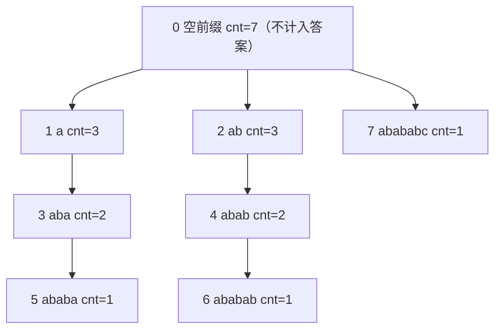

[[TOC]]

## 形式化题目

给定一个长度为 $n$ 的字符串 $s$，下标从 $0$ 起。对每个**偶数**长度 $i \in \{2, 4, \dots\}$，
记 $P_i = s[0..i-1]$ 为长度为 $i$ 的前缀，$occ(i)$ 为 $P_i$ 作为 $s$ 的连续子串出现的次数
（**允许重叠**，同一个起点只算一次）。要求

$$\text{answer} = \sum_{\substack{2 \leqslant i \leqslant n \\ i \text{ 为偶数}}} occ(i).$$

也就是：对每个偶数长度的前缀，数一数它在原串里出现了多少次（包括它自己在开头的那一次），
然后把所有这些次数相加"。$n \leqslant 200\,000$，答案最大到 $10^{10}$ 量级，
以样例 `abababc` 为例：前缀 `ab` 出现 3 次、`abab` 出现 2 次、`ababab` 出现 1 次，
合计 $3 + 2 + 1 = 6$。

## 正解

### 思路

**朴素做法与它的瓶颈。** 最直接的想法是枚举每个偶数长度 $i$，再枚举起点 $p$ 逐字符比对
$s[p..p+i-1]$ 与 $s[0..i-1]$，复杂度 $O(n^2)$ 甚至 $O(n^3)$，$n = 2 \times 10^5$ 下必然超时。
问题出在"每次比对一个前缀都要从头验证一遍内容"——而**前缀之间的内容关系**，
KMP 的前缀函数（fail 数组）早就已经算出来了。

**关键观察：出现次数 = fail 树上子树大小。** 长度为 $i$ 的前缀在位置 $p$ 处出现，
等价于说：$s[0..i-1]$ 是 $\text{prefix}_{p+i} = s[0..p+i-1]$ 的一个 border，
也就是 $i$ 是长度 $p+i$ 这个前缀的一个 border 长度。而 fail 数组给出的正是
"每个前缀的最长真 border"，把它当作**父亲指针**

$$\text{parent}(j) = fail[j], \qquad \text{parent}(0) = 0 \;(j \geqslant 1),$$

就得到一棵以空前缀 $0$ 为根的树，通常称为 **fail 树**。
沿 $fail$ 链反复跳 parent，恰好能枚举出 $j$ 的**全部** border 长度——
也就是说

$$i \text{ 是前缀 } j \text{ 的 border 长度} \iff i \text{ 是 } j \text{ 在 fail 树中的祖先（含 } j \text{ 自身）}.$$

于是"$P_i$ 出现在位置 $p$"（即 $i$ 是前缀 $p+i$ 的 border）与"$p+i$ 落在 $i$ 的子树里"
是同一件事，而 $p \mapsto$ 结束位置 $p+i$ 是一一对应的，所以

$$occ(i) = \bigl|\{\, j : i \text{ 是 } j \text{ 的祖先} \,\}\bigr| = \text{fail 树中 } i \text{ 的子树大小}.$$

**怎么算子树大小？** 每个节点先记 $cnt[i] = 1$（它自己：整串起点那一次出现），
然后自底向上把儿子并给父亲：$cnt[parent(i)] \mathrel{+}= cnt[i]$。
由于 $parent(j) = fail[j] < j$（真 border 严格短于自身），**父亲的编号一定比儿子小**，
所以只要让 $i$ 从 $n$ 倒着扫到 $1$，就天然满足"儿子先处理、父亲后处理"，
一趟 $O(n)$ 的反向循环就能完成整棵树的子树求和，不需要显式建树、也不需要 DFS。

最后把所有偶数 $i$ 的 $cnt[i]$ 加起来就是答案（$i = 0$ 表示空前缀，不参与统计）。

下表用样例 `abababc` 走一遍，$n = 7$：

| $i$ | 前缀 $P_i$ | $fail[i]$ | 子树（= $P_i$ 的出现位置集合） | $cnt[i] = occ(i)$ |
| :-: | :--- | :-: | :--- | :-: |
| 1 | `a` | 0 | $\{1, 3, 5\}$ | 3 |
| 2 | `ab` | 0 | $\{2, 4, 6\}$ | 3 |
| 3 | `aba` | 1 | $\{3, 5\}$ | 2 |
| 4 | `abab` | 2 | $\{4, 6\}$ | 2 |
| 5 | `ababa` | 3 | $\{5\}$ | 1 |
| 6 | `ababab` | 4 | $\{6\}$ | 1 |
| 7 | `abababc` | 0 | $\{7\}$ | 1 |

读这张表有两个要点。第一，**子树里的元素直接就是出现位置的结束下标**：
节点 2（`ab`）的子树是 $\{2, 4, 6\}$，正是 `ab` 三次出现的结束位置，
所以"子树大小"与"出现次数"不是巧合而是同一件事。第二，**编号越大、子树越小**：
节点 5、6、7 都是叶子，因为它们的 border 只可能是它们自己。

答案是偶数行之和 $cnt[2] + cnt[4] + cnt[6] = 3 + 2 + 1 = 6$，与样例一致。

**越界与数值范围。** $n = 2 \times 10^5$ 且 $s$ 全是同一个字符时，
$occ(i) = n - i + 1$，答案 $\approx \frac{n^2}{4} = 10^{10}$，超过 32 位整数，
C++ 里必须用 `long long`（数据点 `problem9.out` 恰为 $10000000000$）。

### 代码

Python 版：

@include-code(./main.py, python)

C++ 版（同一算法）：

@include-code(./main.cpp, cpp)

### 复杂度

- **时间**：求 fail 数组的 `while` 回跳总和为 $O(n)$（均摊分析：$k$ 每次循环至多 $+1$，
  回跳总量不超过 $+1$ 的次数），子树求和是一趟反向循环 $O(n)$，累加答案 $O(n)$，
  总计 $O(n)$。实测最大数据点（$n = 200000$）C++ 约 0.01 s，Python 短解法同量级。
- **空间**：`fail`、`cnt` 各 $O(n)$，字符串本身 $O(n)$；合计 $O(n)$。
  C++ 用全局静态数组（`MAXN = 200005`），实测峰值约 8 MB（限时 256 MB）。
- **两种语言的关系**：`main.py` 与 `main.cpp` 是同一算法的两种落地——
  Python 把 fail 表与子树求和各写成一个函数（`fail_table` / `count_even_prefixes`），
  用 `sum(occur[2::2])` 一步取走所有偶数长度；C++ 用全局数组 + `scanf("%s")`，
  手动控制 1-indexed 下标。

## 总结

- **把"内容匹配"换成"结构关系"**：本题的朴素做法反复比对字符，而 fail 数组一旦算出，
  所有前缀之间的 border 关系就被固化成了一棵树，剩下的只是树上计数，
  这正是 KMP 前缀函数的第二种典型用法。
- **出现次数 = 子树大小**："$P_i$ 出现"、"$i$ 是某个前缀的 border"、"该前缀长度对应的节点在 $i$ 的子树里"
  三者等价，这个等价关系是本题唯一需要记住的观察。
- **父亲的编号一定更小**：因为真 border 严格更短，所以 `i -> fail[i]` 天然是"小指大"的
  有向无环结构，子树求和退化成一行反向循环 `cnt[fail[i]] += cnt[i]`，
  不需要建树、不需要 DFS、不需要显式栈。
- **注意答案上界**：$n = 2 \times 10^5$ 时答案可达 $10^{10}$，`int` 会溢出，
  这类"计数求和"题一定要先估一遍上下界再选类型。

## 图示解析

下面把样例 `abababc` 的 fail 树画出来，边上标注父节点，节点里写前缀内容与它的 `cnt`
（即该前缀的出现次数）：

观察重点有三个。第一，**树是按编号递增分层的**：$fail[i] < i$，所以每条边都从小编号
指向大编号，这正是反向循环能当成"自底向上"用的原因。第二，**根节点的三个儿子**
是 `a`、`ab`、`abababc`——它们都是 fail 值为 $0$、不含非平凡 border 的前缀。
第三，答案只取偶数层：节点 2、4、6 的 $cnt$ 是 $3, 2, 1$，和为 $6$；
若错误地把根节点 $cnt = 8$ 也算进去，答案就会偏大。
