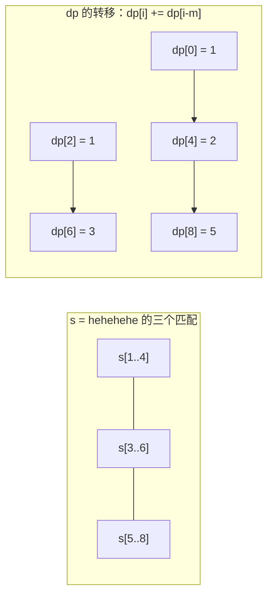

[[TOC]]

## 形式化题目

给定串 $s$（$|s| = a$）与串 $t$（$|t| = m \leqslant a$），二者只含小写字母。
记 $s$ 中所有与 $t$ 相等的子串位置为**匹配**：若 $s[i-m+1..i] = t$，就说存在一个结束于 $i$ 的匹配。

$s$ 的**一种含义**由一族匹配的集合 $S$ 确定：$S$ 中任意两个匹配的区间互不重叠
（不共享任何字符），$S$ 中全部位置按"深意"解读，其余字符按"原意"解读。
等价地，每个匹配既可以取原意，也可以取深意，但**同时取深意的两个匹配不能重叠**。

求 $s$ 的不同含义个数，对 $1000000007$ 取模。共有 $n \leqslant 10$ 组询问。

以第一组样例 $s = \texttt{hehehe}$、$t = \texttt{hehe}$ 为例，$t$ 在 $s$ 中的匹配是
$s[1..4]$ 与 $s[3..6]$，二者重叠，因此可取深意的集合只有
$\varnothing$、$\{s[1..4]\}$、$\{s[3..6]\}$ 三种，答案为 $3$，与题面一致。

## 正解

### 思路

**第一步：把"含义"翻译成计数对象。** 一个字符在同一时刻只能有一种解读，所以两个覆盖到同一字符的重叠匹配不可能同时取深意——若同时取深意，那段重叠的字符要同时属于两个 $t$，矛盾。反过来，任意一族两两不重叠的匹配都合法：把它们圈成深意、其余字符保留原意即可。于是答案就是

$$\#\{\,S \subseteq \text{所有匹配} \;\big|\; S \text{ 中任意两区间不交}\,\}.$$

**第二步：找出所有匹配。** 这是 KMP 的看家本领：先对 $t$ 求失配数组 $\mathrm{fail}[j] =$ $t$ 的前 $j$ 个字符的最长"真前缀 = 真后缀"长度，再用它在 $s$ 上扫一遍。每匹配满 $m$ 个字符就记下结束位置 $i$ 并让 $j \leftarrow \mathrm{fail}[m]$，这样重叠的匹配（如 $\texttt{hehe}$ 在 $\texttt{hehehe}$ 中的两次）一个都不会漏。

**第三步：数不重叠匹配族。** 设

$$dp[i] = \text{只保留 } s \text{ 的前 } i \text{ 个字符时的含义数},\qquad dp[0] = 1.$$

很多互不重叠的子集计数都可以按"**最靠右的那一个匹配**"分类，本题同样：考虑前 $i$ 个字符，

- 若 $s[i]$ 按原意解读（即没有任何取深意的匹配以 $i$ 结尾），方案数与 $dp[i-1]$ 一一对应；
- 若某个取深意的匹配恰好结束于 $i$，则它必然是区间 $[i-m+1, i]$（结束位置唯一决定这个匹配），而剩下那些取深意的匹配必须全部落在 $[1, i-m]$ 内，方案数为 $dp[i-m]$。

两类的并恰好覆盖全部方案、交集为空，所以

$$dp[i] = dp[i-1] + c_i \cdot dp[i-m], \qquad c_i = \begin{cases} 1, & s[i-m+1..i] = t \\ 0, & \text{否则} \end{cases}$$

答案即 $dp[a]$。转移只用到 $i-1$ 与 $i-m$，实现上用一个长度为 $a+1$ 的数组顺序推即可。

回到样例 $s = \texttt{hehehehe}$、$t = \texttt{hehe}$，匹配结束于 $4, 6, 8$，逐格填表：

| $i$ | 0 | 1 | 2 | 3 | 4 | 5 | 6 | 7 | 8 |
| :-: | :-: | :-: | :-: | :-: | :-: | :-: | :-: | :-: | :-: |
| 结束于 $i$ 的匹配 | — | — | — | — | ✓ | — | ✓ | — | ✓ |
| $dp[i-1]$ | — | 1 | 1 | 1 | 1 | 2 | 2 | 3 | 3 |
| $dp[i-m]$ | — | — | — | — | $dp[0]=1$ | — | $dp[2]=1$ | — | $dp[4]=2$ |
| $dp[i]$ | 1 | 1 | 1 | 1 | **2** | 2 | **3** | 3 | **5** |

第 4 格首次出现匹配：$dp[4] = dp[3] + dp[0] = 2$，对应"全原意"与"$s[1..4]$ 取深意"；
第 6 格 $dp[6] = dp[5] + dp[2] = 3$，第 8 格 $dp[8] = dp[7] + dp[4] = 5$，
共 $5$ 种含义，与样例第 3 组的输出一致。注意 $dp[4]$ 被加进 $dp[8]$ 时值已经是 $2$，
它同时充当了"$s[1..4]$ 取深意"与"$s[1..4]$、$s[5..8]$ 都取深意"两条链条的起点。

**实现要点。** `ends[i]` 是布尔标记，用 `char` 数组存 $10^5$ 量级的下标最省内存；
`fail`、`ends`、`dp` 都只在下标 $[0, |s|]$ 上有意义，`ends` 每轮只需清 $a+1$ 个位置。
Python 侧用 `t + '\x00' + s` 拼串后求前缀函数，一次扫描同时得到全部匹配位置，
避免手写 KMP 的两段循环。

### 代码

Python 版：

@include-code(./main.py, python)

C++ 版（同一算法）：

@include-code(./main.cpp, cpp)

### 复杂度

- **时间**：每组 KMP 为 $O(a + m)$，DP 为 $O(a)$，合计 $O(\sum (a+m))$。
  最大数据 $n = 10$、$a = m = 10^5$，总量约 $2 \times 10^6$ 次字符比较，
  C++ 实测远低于 1000 ms 限时。
- **空间**：$O(a + m)$，即 `fail`、`ends`、`dp`、两个字符串缓冲区，
  常数量级约 $10^5 \times 4$ 字节，远低于 256 MB。
- **与 C++ 解法的关系**：`main.cpp` 是同一算法的 C++ 版本，KMP 与 DP 都是朴素循环；
  Python 版本靠"拼接串 + 前缀函数"把 KMP 压成一段循环，复杂度同阶。

## 总结

- **先读题面再写代码**：本题的难点不在 KMP，而在把"含义"精确翻译成"互不重叠的匹配族"。
  样例 3 的 $5$ 种、样例 1 的 $3$ 种都只能由这个模型解释；反过来，如果误以为重叠的匹配也能
  同时取深意，样例 1 会算出 $4$ 并被判错。
- **按"最右者"分类**是计数类 DP 的通用套路。相邻位置不重叠的条件天然适合"最后一个元素"分类法：
  最右匹配的结束位置唯一，于是分类既不重也不漏，转移只需回退 $m$ 个字符。
- **模式匹配是线性 DP 的前置预处理**：KMP 的 $O(a+m)$ 让"哪些位置是匹配"变成一张 $0/1$ 表，
  之后的 DP 就与字符串无关，退化成一维递推。
- 本题是"KMP + 线性 DP 计数不重叠匹配"的模板（同型题如 HDU 5763 *Another Meaning*）。
  牢记模型后，把匹配条件从 $t$ 换成任意可判定的区间条件，同一套 DP 依然适用。
- 本仓库素材里的 `std.cpp` 与本解法同型（KMP + DP），已用它在全部 10 组真实数据上跑过，
  输出与 `.out` 逐字节一致，可作算法参照；`main.cpp` 按本 skill 的 C++ 风格重写，未照抄。

## 图示解析

下图把样例 $s = \texttt{hehehehe}$、$t = \texttt{hehe}$ 的匹配与 DP 画在一起：
上排是三个匹配区间，它们的重叠关系决定了哪些匹配能同时取深意；下排是 $dp$ 的转移依赖。

左半边可以看出：$s[1..4]$ 与 $s[3..6]$ 重叠、$s[3..6]$ 与 $s[5..8]$ 重叠，而
$s[1..4]$ 与 $s[5..8]$ 不交——所以既能单独取任何一个，也能同时取两侧这两个。
右半边的箭头是转移中唯一会带来新分支的那一项 $dp[i] \mathrel{+}= dp[i-m]$
（另一项 $dp[i-1]$ 只把前一格复制过来）：匹配结束于 $4$ 时从 $dp[0]$ 取一项、
结束于 $6$ 时从 $dp[2]$ 取、结束于 $8$ 时从 $dp[4]$ 取。起点下标恰好比结束位置小 $m$，
说明“前面那一段允许再取深意”与“末段这段取深意”之间的重叠约束已经由下标差自动截断：
$dp[4] = 2$ 被加上去时，它自己内部的那两条链条（全原意、只有 $s[1..4]$ 取深意）都合法。
