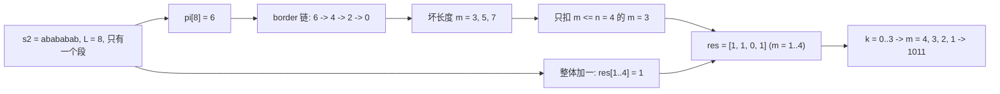

[[TOC]]

## 形式化题目

给定一个长度为 $n$ 的环形字符串 $s$（下标 $0$ 起，字符集为 $26$ 个小写字母），
把它的位置看成 $0, 1, \dots, n-1$，且认为 $n-1$ 与 $0$ 相邻。

若环上每对相邻位置的颜色都不同，称这个环是**美丽的**。一次操作允许拿走**一段连续的**
石头，长度记作 $k$，$k$ 可以是 $0$（一个都不拿）；剩下 $m = n - k$ 个石头仍然按原来的
相对顺序围成一个环。

对每个 $k \in [0, n-1]$ 回答：是否存在一种拿走恰好 $k$ 个连续石头的方案，
使得剩下的环是美丽的。把答案按 $k$ 从 $0$ 到 $n-1$ 拼成一个长度为 $n$ 的 $01$ 串输出
（第 $k$ 位为 $1$ 表示可行）。输入含多组数据，读到文件结束为止，
每组输出一行 `Case i: ` 加这个 $01$ 串。

约束：组数不超过 $6$，$1 \leqslant n \leqslant 10^6$。

注意 $k = n-1$ 时只剩 $m = 1$ 个石头，环里没有任何一对相邻的石头，
按定义"所有相邻对都不同色"是空真，因此 $m = 1$ **恒为可行**。

## 正解

### 思路

**朴素做法与它的瓶颈。** 直接按定义检查即可：枚举 $k$（等价于枚举剩下的长度 $m$），
再枚举保留下来的弧的起点，花 $O(m)$ 逐对验证相邻颜色是否不同以及首尾是否不同。
$k$ 有 $n$ 种、起点有 $n$ 种、单次检查 $O(n)$，总计 $O(n^3)$；即使把"枚举弧"改成
"枚举起点 + 增量检查"，也只有 $O(n^2)$。$n = 10^6$ 时这是 $10^{12}$ 量级，不可行。

慢的根源是**同一个字符被反复比较**：每个长度 $m$ 都要把整条弧重新扫一遍，
而"弧内部相邻是否不同"这件事其实与 $m$ 无关——相邻两个字符合法与否，
只取决于它在 $s$ 里的位置，跟这条弧取多长根本没关系。先把这一点利用干净，就能一次省掉一层循环。

**关键观察一：破环成链。** 令 $s_2 = s + s$（长度 $2n$）。因为 $m = n - k \leqslant n$，
环上长度为 $m$ 的连续弧，与 $s_2$ 中某个长度为 $m$ 的连续子串一一对应。
于是问题变成：$s_2$ 上是否存在长度为 $m$ 的子串，满足

$$\text{内部相邻位置都不同}, \qquad \text{首尾两个字符也不同}.$$

**关键观察二：相邻相同的位置是断点。** 在 $s_2$ 上，把所有满足 $s_2[i] = s_2[i-1]$
的位置 $i$ 当作**断点**，它把 $s_2$ 切成若干个**极大段**。每个段内部任意两个相邻字符都不同
（这正是"极大"的含义），所以段内任意子串都自动满足第一条约束，只剩下"首尾是否相同"要查。

**关键观察三：首尾条件等价于 border。** 设某段 $T$ 长为 $L$，考察段内长度 $m$ 的子串。
段内长度 $m$ 的子串共有 $L - m + 1$ 个，它们由起点 $p \in [0, L-m]$ 标号。
第 $p$ 个子串首尾相同的条件是 $T[p] = T[p + m - 1]$，也就是"$T$ 的从 $p$ 开始的、
长为 $m$ 的窗口两端相等"。这里有一个熟知的字符串等价：

$$T \text{ 的每个长为 } m \text{ 的子串都首尾相同}
\iff T \text{ 有周期 } m - 1
\iff T \text{ 有长度 } L - m + 1 \text{ 的 border}.$$

$L - m + 1$ 恰好就是"子串个数"，这个巧合是 KMP 能接手的原因。
于是**段内所有长为 $m$ 的子串都坏掉** $\iff$ $T$ 有长度 $b = L - m + 1$ 的 border，
反过来 $m = L - b + 1$。$T$ 的全部 border 长度就是它的 KMP 前缀函数 $\pi$ 的 border 链，
个数与 $L$ 同阶，链上的每个 $b$ 各贡献一个"坏长度"。注意这里只需要**真 border**
（$b < L$，即 $m \geqslant 2$）——$b = L$（$m = 1$）虽然形式上成立，
但 $m = 1$ 时环里没有相邻对，按题意必须判为可行，所以 $m = 1$ 从不被扣掉。

**把三段观察拼成算法。** 只维护一个数组 $res[1..n]$：$res[m]$ 表示"有多少个段可以取出
一个合法的长度为 $m$ 的弧"，$res[m] > 0$ 即可行。对每个段 $T$（长 $L$）：

1. **整体加一**：只要 $m \leqslant \min(L, n)$，段内就有长为 $m$ 的子串，先乐观地加上
   $res[m] \mathrel{+}= 1$；
2. **逐个扣掉坏长度**：沿 $\pi$ 的 border 链取出每条真 border 长度 $b$，
   令 $m = L - b + 1$，若 $m \leqslant n$ 则 $res[m] \mathrel{-}= 1$。

第 1 步的"整体加一"如果逐项写就是 $O(L)$ 次加法，所有段加起来是 $O(n)$，已经足够。
最后对每个 $k$ 输出 $res[n-k] > 0$ 的 $01$ 值即可。

**样例 `abab` 的完整推演**（$n = 4$）。$s_2 = $ `abababab`，相邻字符两两不同，
所以它整体就是一个段，$L = 8$：

| $i$（段内前缀长度） | 1 | 2 | 3 | 4 | 5 | 6 | 7 | 8 |
| :-: | :-: | :-: | :-: | :-: | :-: | :-: | :-: | :-: |
| 前缀内容 | `a` | `ab` | `aba` | `abab` | `ababa` | `ababab` | `abababa` | `abababab` |
| $\pi[i]$ | 0 | 0 | 1 | 2 | 3 | 4 | 5 | 6 |

$\pi[8] = 6$，所以 border 链是 $6 \to 4 \to 2 \to 0$，三条真 border 对应
$m = 8 - 6 + 1 = 3$、$8 - 4 + 1 = 5$、$8 - 2 + 1 = 7$；只有 $m = 3 \leqslant n$ 需要扣。
第一步对 $m \leqslant \min(8, 4) = 4$ 全部 $+1$，于是

| $m$ | 1 | 2 | 3 | 4 |
| :-: | :-: | :-: | :-: | :-: |
| 整体加一后 | 1 | 1 | 1 | 1 |
| 扣掉 $m = 3$ 后 $res[m]$ | 1 | 1 | **0** | 1 |

按 $m = n - k$ 从大到小读出：$k=0 \to m=4 \to 1$，$k=1 \to m=3 \to 0$，
$k=2 \to m=2 \to 1$，$k=3 \to m=1 \to 1$，答案是 `1011`，与样例一致。
$m = 3$ 被扣掉的原因可以直接看出来：`abababab` 里所有长度为 $3$ 的子串只有 `aba` 和 `bab`
两种，首尾分别是 `a`/`a` 和 `b`/`b`，全部首尾同色。

**几个必须照顾到的边界。**

- **全同色串**：所有相邻位置都同色，$s_2$ 处处是断点，每个段长 $1$，
  只能提供 $m = 1$，输出形如 `00...01`（数据点里 `aaaa` 给 `0001`、`rrrrr` 给 `00001`）。
- **$n = 1$**：$k$ 只有 $0$，$m = 1$，答案为 `1`（样例 `a`）。此时没有相邻对，
  与"$m = 1$ 恒可行"一致。
- **段长可能超过 $n$**：$s_2$ 的段最长可达 $2n$（例如 $s$ 全是由两种颜色严格交替时，
  $s_2$ 相邻全部不同，只有一段长 $2n$）。此时长度 $m \leqslant n$ 的弧仍然取得到，
  所以"整体加一"的上界取 $\min(L, n)$，而扣坏长度时也要判 $m \leqslant n$，
  否则会去扣一个根本不在 $res$ 定义域里的下标。

### 代码

Python 版：

@include-code(./main.py, python)

C++ 版（同一算法）：

@include-code(./main.cpp, cpp)

### 复杂度

- **时间**：每个段内部跑一次 KMP 前缀函数的均摊代价为 $O(L)$（$j$ 每次循环至多 $+1$，
  回跳总量不超过 $+1$ 的次数），"整体加一"是 $O(\min(L,n))$，border 链总长为 $O(L)$，
  三段相加仍是 $O(L)$。所有段长度之和为 $2n$，故每组数据 $O(n)$，
  最坏 $6 \times 10^6$ 的规模。实测最坏数据点 `problem10`（全同色串 + 严格交替串，
  各 $n = 10^6$，单段长 $2n$、border 链最长）C++ 约 0.06 s。
- **空间**：$s_2$ 与前缀函数数组各 $2n$、$res$ 为 $n$，均摊 $O(n)$；
  C++ 用全局静态数组（`MAXN = 10^6 + 5`），实测峰值约 10 MB（限时 256 MB）。
- **两种语言的关系**：`main.py` 与 `main.cpp` 是同一算法的两种落地。Python 用生成器
  `ring_segments` 按断点产出段、`bad_lengths` 产出坏长度，并用差分数组
  （`diff` + `itertools.accumulate`）替代"整体加一"的逐项循环；
  C++ 直接用循环对 $res$ 逐项 $+1$，因为 $O(n)$ 的加法在这个规模下毫无压力。
  两者对全部 10 个数据点的输出逐字节一致。
- **Python 的时限风险**：算法同为 $O(n)$、没有任何退化成暴力枚举的地方，
  但纯 Python 循环在 $6 \times 10^6$ 字符上实测约 3.3 s，会超过本题 1000 ms 的限时。
  这份 `main.py` 定位是教学短解法，实际提交请用同算法的 `main.cpp`。

## 总结

- **先找出与参数无关的部分**：朴素解每次换一个 $m$ 都要重扫整条弧，
  但"内部相邻是否不同色"只由位置决定、与 $m$ 无关。把与参数无关的约束提前处理掉，
  是本题从 $O(n^2)$ 掉到 $O(n)$ 的第一步。
- **环形问题的标准动作是破环成链**：因为 $m \leqslant n$，$s + s$ 上的长度 $m$ 子串
  与环上的弧一一对应，写起来只多一个长度 $2n$ 的数组。
- **"所有长为 $m$ 的子串都首尾相同"就是 border**：这句话把 $O(n)$ 个候选长度
  一次压缩成 KMP 前缀函数的一条 border 链。$b = L - m + 1$ 这个换算关系的存在，
  以及 border 链长度与 $L$ 同阶，是它能把复杂度压住的原因。
- **只统计"是否存在"，用计数比用布尔更好写**：$res[m]$ 记录"可行的段数"，
  整体加一后逐个扣坏长度，就不必为每个段维护一个布尔数组。
- **边界要单独过一遍**：$m = 1$（环里没有相邻对，恒可行）、$k = 0$（$m = n$）、
  全同色串（段长全为 $1$）、段长超过 $n$（上界要取 $\min(L, n)$）四处都容易写错。

## 图示解析

下图用样例 `abab`（$n = 4$）画出算法的两步：左边是断点切段与 KMP 的 border 链，
右边是 $res$ 数组上"整体加一、再扣坏长度"的差分过程。

观察重点有两个。第一，**border 链给出了全部坏长度，一个不多一个不少**：
链上的 $b = 6, 4, 2$ 换算成 $m = 3, 5, 7$，三者都要扣（只是 $m = 7 > n = 4$
超出取值范围的先判掉）；如果只沿链跳一步、只拿最长的 border $b = 6$，
就会漏掉 $m = 5, 7$，而这些长度在更大规模的段上同样会被用到。第二，
**扣减必须发生在加一之后**：`res` 的策略是"先乐观地认为每个 $m$ 都能取到，
再把确定坏掉的扣掉"，顺序反了就无法用最简单的整体加一实现第一步。
