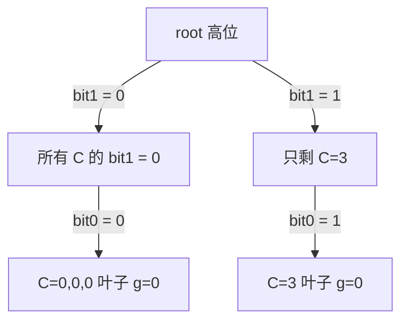

[[TOC]]

## 形式化题目

给定位数 $n$ 和 $m$ 个整数 $a_1, a_2, \dots, a_m$（$0 \leqslant a_i < 2^n$）。
先由你先选一个整数 $x \in [0, 2^n)$，然后对手**恰好选一个时刻**出手：所谓时刻是指

- $i = 0$：刚选完 $x$，还没有异或任何数；
- $i = 1, 2, \dots, m$：已经依次异或了 $a_1, \dots, a_i$。

在第 $i$ 个时刻，当前值为 $v_i = x \oplus a_1 \oplus \cdots \oplus a_i$（$i = 0$ 时 $v_0 = x$），
对手把它替换成

$$f(v) = \left(\left\lfloor \frac{2v}{2^n} \right\rfloor + 2v\right) \bmod 2^n .$$

之后继续异或剩下的 $a_{i+1}, \dots, a_m$。你要让最终值尽量大，对手要让最终值尽量小，
双方都最优。求

1. 最终值的最大值；
2. 取到这个最大值的初值 $x$ 的个数。

下文记 $\mathrm{rol}(v)$ 为把 $v$ 的 $n$ 位二进制表示**循环左移一位**（$n \leqslant 30$，
题面的 $f$ 恰好就是这个函数，推导见下）。

## 正解

### 思路

**第一步：看清对手到底做了什么。** 把 $n$ 位二进制数写成高位在前的串
$v = b_{n-1} b_{n-2} \cdots b_0$（$b_{n-1}$ 是最高位）。那么

$$\left\lfloor \frac{2v}{2^n} \right\rfloor = b_{n-1}, \qquad 2v \bmod 2^n = b_{n-2} \cdots b_0 0,$$

两者相加正好等于把最高位搬到最低位：

$$f(v) = \mathrm{rol}(v) = b_{n-2} \cdots b_0 b_{n-1} .$$

也就是**循环左移一位**。这一步是最关键的观察：题面那个带取整、取模的怪式子，
其实是一个纯粹的位重排。

**第二步：位重排与异或可交换。** 对任意 $u, v$ 都有 $\mathrm{rol}(u \oplus v) = \mathrm{rol}(u) \oplus \mathrm{rol}(v)$：
两次异或逐位独立，而循环左移只是把位的位置整体挪动，逐位运算的结果不受位置影响。

**第三步：把"时刻"化成常数。** 记前缀异或 $p_i = a_1 \oplus \cdots \oplus a_i$（$p_0 = 0$）、
后缀异或 $s_i = a_{i+1} \oplus \cdots \oplus a_m$（$s_m = 0$）。
若对手在第 $i$ 个时刻出手，则当前值 $v_i = x \oplus p_i$，之后剩下的数全部异或回去，
最终值为

$$
\mathrm{rol}(x \oplus p_i) \oplus s_i
= \mathrm{rol}(x) \oplus \mathrm{rol}(p_i) \oplus s_i
= y \oplus C_i,
\qquad y = \mathrm{rol}(x), \quad C_i = \mathrm{rol}(p_i) \oplus s_i .
$$

对手的 $m+1$ 个选择因此**完全独立于 $x$**：他只能在 $m+1$ 个常数 $y \oplus C_i$ 里挑一个最小的。

**第四步：问题化成经典模型。** 因为 $x \mapsto \mathrm{rol}(x)$ 是 $[0, 2^n)$ 上的双射
（循环移位的逆是循环右移），对 $x$ 求最大值数量等价于对 $y$ 求最大值数量。于是只需解决：

> 给定 $m + 1$ 个常数 $C_0, \dots, C_m$，选 $y$ 使 $\min_{i} (y \oplus C_i)$ 最大，
> 并统计这样的 $y$ 的个数。

**第五步：01 字典树 + 逐位 DP。** 把每个 $C_i$ 按**高位到低位**插入一棵深度为 $n$ 的
01 字典树，则"$C_i$ 的第 $k$ 位是 $0$ 还是 $1$"就是"从根往下第 $n-1-k$ 层走哪条边"。
$y \oplus C$ 的第 $k$ 位为 $1$ 当且仅当 $y$ 在该位与 $C$ 不同；字典树的每条边恰好对应
一个固定的 $(k, C_k)$。

设 $g(u)$ 表示：只考虑 $u$ 子树里剩下的那些 $C$（它们的高位已经和 $y$ 定好的高位一致），
$y$ 的剩余低位能保证的**最坏结果值**；$w(u)$ 是达到 $g(u)$ 的低位方案数。
从根（深度 $0$，对应最高位）往下按当前位的权重 $2^{n-1-\mathrm{dep}}$ 决策：

| 当前结点情况 | 该位的结论 | 转移 |
| --- | --- | --- |
| 只存在一个儿子 | 子树内所有 $C$ 的这一位相同，$y$ 取反位即可让它为 $1$ | $g(u) = 2^{k} + g(\text{唯一儿子})$，$w(u) = w(\text{唯一儿子})$ |
| 两个儿子都在，$g(c_0) \neq g(c_1)$ | 对手必然把这一位压成 $0$（总能挑到异侧子树） | 取更优的那侧：$g(u) = \max g(c)$，$w(u)$ 取对应侧的 $w$ |
| 两个儿子都在，$g(c_0) = g(c_1)$ | 同上，这一位必为 $0$，但两侧最坏值相同 | $g(u) = g(c_0)$，$w(u) = w(c_0) + w(c_1)$ |

第二个分支要解释一下：两棵子树都在时，无论 $y$ 的这一位取 $0$ 还是 $1$，对手都能
往**异侧**子树里挑一个 $C$，让这一位变成 $0$（因为异侧子树的 $C$ 在这一位与 $y$ 相反）。
所以该位对最坏值的贡献恒为 $0$，真正能"抢救"的只有低位——而低位由 $y$ 的**异侧**子树决定，
即 $y$ 选哪一侧，结果值就由另一侧子树的 $g$ 决定。两个选项互不影响，取 $\max$ 即可；
两个 $g$ 相等时，两种 $y$ 的这一位相反，$y$ 的取值集合不相交，方案数直接相加。

叶子（深度 $n$）没有剩余位，$g = 0$、$w = 1$；实现时按结点编号从大到小扫一遍就是自底向上
（子结点总是在父结点之后才被开出来，编号必然更大），无需递归。

**样例推演。** 样例 $n = 2, m = 3$，$a = (1, 2, 3)$。$p = (0, 1, 3, 0)$、$s = (0, 1, 3, 0)$，
$\mathrm{rol}$ 是 2 位循环左移，算出 $C_0 = 0$、$C_1 = 3$、$C_2 = 0$、$C_3 = 0$。逐 $x$ 对表：

| $x$ | $y = \mathrm{rol}(x)$ | 四个时刻的最终值 $y \oplus C_i$ | 对手取最小值 |
| :-: | :-: | :-: | :-: |
| 0 | 0 | 0, 3, 0, 0 | 0 |
| 1 | 2 | 2, 1, 2, 2 | **1** |
| 2 | 1 | 1, 2, 1, 1 | **1** |
| 3 | 3 | 3, 0, 3, 3 | 0 |

最大值是 $1$，$x = 1, 2$ 都取到（正是题面样例解释里的两个初值），故输出 `1` 与 `2`。

$C = \{0, 3, 0, 0\}$ 的字典树与 DP 结果：根有两个儿子（0 与 1），各自只剩一个儿子，
两个儿子的 $g$ 都是 $1$，落到"相等"分支，于是 $g(\text{根}) = 1$、$w(\text{根}) = 1 + 1 = 2$。

### 代码

Python 版：

@include-code(./main.py, python)

C++ 版（同一算法）：

@include-code(./main.cpp, cpp)

### 复杂度

- **时间**：插入 $m+1$ 个数、每个数走 $n$ 层，DP 每个结点算一次，总时间
  $O((m+1)\,n)$。$m \leqslant 10^5$、$n \leqslant 30$，约 $3 \times 10^6$ 次操作。
- **空间**：结点数不超过 $1 + (m+1)n \approx 3 \times 10^6$。C++ 用
  结构体数组（每条记录 `son[2]` 与 `dep`，12 字节）加两个 `int` 数组，实测峰值内存约 31 MB，
  在 256 MB 限制内；没有递归，栈上只放常数。
- **与 Python 版的关系**：`main.py` 是同一算法的 Python 实现，结点用
  `kids[u] = [左儿子, 右儿子]` 的列表形式存储，DP 用两个整数列表自底向上扫一遍。
  复杂度同阶，但 Python 建 $3 \times 10^6$ 个嵌套列表的开销远大于 C++，
  CPython 下最大测例可能需要数秒且内存吃紧，**存在 TLE/MLE 风险**，C++ 版是安全的正解。

## 总结

- **先化简操作**：题面里带取整与取模的式子其实只是"循环左移一位"，
  这一步让后面所有的位运算推理都变得可行。
- **找交换律**：循环移位与异或可交换，于是"每个时刻的最终值"能统一写成
  $y \oplus C_i$，对手的 $m+1$ 个选择彼此独立，不再需要模拟 $m+1$ 条不同的流水线。
- **双射换元**：$x \mapsto \mathrm{rol}(x)$ 是双射，因此对 $y$ 统计方案数等于对 $x$ 统计，
  不必把答案换回 $x$ 再数一遍。
- **字典树上的"对手取异侧"DP**：单子树时该位必然能拿到 $1$，双子树时该位必然被压成 $0$、
  只能看低位——这条规则同时给出了值的最优性和方案数的计数，
  计数之所以能简单相加，是因为两侧的 $y$ 在这一位取值相反、互不重叠。
- 复杂度只与 $m \cdot n$ 成正比，$m \le 10^5$、$n \le 30$ 都在掌握之中；
  本题的难点全在推导，不在实现。
