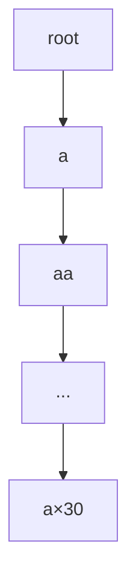
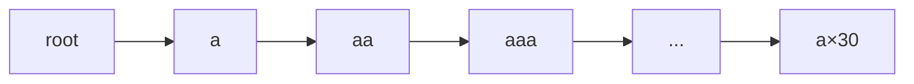

[[TOC]]

## 形式化题目

给定 $n$ 个非空小写字母串，记这些串组成的集合为 $S$。令

$$P = \{\, s[1..k] \mid s \in S,\ 1 \leqslant k \leqslant |s| \,\}$$

为「$S$ 中某个串的非空前缀」构成的集合（$S$ 里有重复串时自然去重）。
称串 $w$ 是**好**的，当且仅当存在两个非空串 $a, b$ 满足

$$w = a + b, \qquad a \in P, \quad b \in P .$$

求不同好串 $w$ 的个数。

**关键改写。** 条件只要求 $a$ 与 $b$ 各自属于 $P$，不要求它们来自 $S$ 中不同的串，
也不要求拼接结果的长度不超限。于是「好串」的全体恰是拼接集合

$$U = \{\, a + b \mid a, b \in P \,\},$$

要求的答案是**集合 $U$ 的势**，而不是二元组 $(a,b)$ 的个数——同一个串被多种切分方式
生成时只能算一次。

**样例的表格化理解。** 样例 $S = \{\texttt{ab}, \texttt{ac}\}$ 给出
$P = \{\texttt{a}, \texttt{ab}, \texttt{ac}\}$，$m = |P| = 3$，
$3 \times 3$ 个二元组恰好生成 $9$ 个互不相同的串：

| $a \backslash b$ | `a` | `ab` | `ac` |
| --- | --- | --- | --- |
| **`a`** | `aa` | `aab` | `aac` |
| **`ab`** | `aba` | `abab` | `abac` |
| **`ac`** | `aca` | `acab` | `acac` |

九格两两不同，故答案为 $9$，与样例一致。下面这个题面自带的例子则会出现碰撞：
对 $S = \{\texttt{a}, \texttt{a}, \texttt{ab}\}$ 有 $P = \{\texttt{a}, \texttt{ab}\}$，
二元组共 $4$ 个：`aa`、`aab`、`aba`、`abab`。四格互不相同，答案 $4$；
这组输入正是随仓数据 `problem3`，其 `.out` 为 `4`，与公式 $\mathrm{cnt}^2 = 4$
（此时扣除项为 $0$）吻合。另一个极端是 $S$ 为 $10^4$ 个 `a`×30 的退化情形
（随仓 `problem9`）：$P$ 只有 $30$ 个串，答案却只有 $59$，远小于 $30^2 = 900$——
重串会让「同串多切分」大量出现，正是本题的难点所在。

## 正解

### 思路

**第一步：把 $P$ 装进 trie。** 把 $S$ 中所有串插入一棵 trie，则 $P$ 中的每个串
恰好对应一个从根出发的非空路径，也就是**除根以外的每一个结点**。若 trie 的结点数为
$\mathrm{cnt}$（不计根），则 $|P| = \mathrm{cnt}$，且 $\mathrm{cnt} \leqslant 30n$。
这一步纯插入，$O(\mathrm{cnt})$。

**第二步：先写下界。** $P \times P$ 有 $\mathrm{cnt}^2$ 个二元组，每个都拼出一个好串，
所以答案不超过 $\mathrm{cnt}^2$。对每个好串 $w$，设它恰有 $k(w)$ 种不同切分
（即 $k(w)$ 个二元组 $(a,b)$ 生成它），则 $w$ 被多算了 $k(w)-1$ 次，于是

$$\mathrm{ans} \;=\; \mathrm{cnt}^2 \;-\; \sum_{w \in U}\bigl(k(w) - 1\bigr). \tag{1}$$

求和只遍历真正出现在 $U$ 里的 $w$，所以第二项就是「多算的总次数」。

**第三步：重复切分长什么样。** 设同一串 $w$ 有两种切分 $(A,B)$ 与 $(A',B')$，
且 $|A| < |A'|$。两个 $A$ 都在 $w$ 的同一头上，所以 $A$ 是 $A'$ 的前缀，
记 $x$ 为多出来的那段（非空）：

$$A' = A + x, \qquad |x| > 0 .$$

又 $A + B = A' + B' = A + x + B'$，两边削掉公共前缀 $A$，得

$$B = x + B' .$$

合起来：**较长的首段是较短首段后面接上块 $x$，较短的尾段是较长尾段前面接上同一段 $x$**。
换句话说，两次切分之间只差一段「平移块」$x$；并且 $A, A+x, x+B', B'$ 全部属于 $P$。

**第四步：把平移块归到结点上。** 取 trie 上任意一个「有属于 $P$ 的非空真后缀」的结点
$u$，即 $\mathrm{fail}[u] \neq \text{root}$。设 $f = \mathrm{fail}[u]$，则 $f$ 对应
$s_u$ 的最长真后缀且 $f \in P$，于是

$$s_u = t + f, \qquad t \text{ 是 } s_u \text{ 去掉尾部 } f \text{ 后的前缀},\quad |t| = |s_u| - |f| .$$

这里的 $t$ 就是上面那个平移块：块长由 $s_u$ 与其最长真后缀共同决定，
求法是**从 $u$ 沿父亲向上走 $|f|$ 步**，落到深度为 $|s_u| - |f|$ 的祖先上。
由于 $L \leqslant 30$，直接逐跳或做二进制提升都可以。

**第五步：数出到底多算了多少。** 在 fail 树上，$t$ 的子树大小 $\mathrm{sub}[t]$
等于「fail 链经过 $t$ 的结点个数」，也就是「以 $t$ 为后缀（允许等于 $t$）的 $P$ 内串个数」。
去掉 $t$ 自身，$\mathrm{sub}[t] - 1$ 就是**以 $t$ 为严格后缀**的 $P$ 内串个数。

把这两件事拼起来：对每个 $\mathrm{fail}[u] \neq \text{root}$ 的结点 $u$，
取出它的平移块 $t$，扣掉 $\mathrm{sub}[t] - 1$：

$$\mathrm{ans} \;=\; \mathrm{cnt}^2 \;-\; \sum_{\substack{1 \leqslant u \leqslant \mathrm{cnt} \\ \mathrm{fail}[u] \neq \text{root}}} \bigl(\mathrm{sub}[t_u] - 1\bigr). \tag{2}$$

**这个扣除在数什么。** 取某个满足 $\mathrm{fail}[u] \neq \text{root}$ 的 $u$ 及其块 $t = t_u$，
再取 $t$ 的 fail 子树中任意一个**不同于 $t$** 的结点 $v$，记 $s_v$ 中 $t$ 之前的部分为 $A$
（非空，因为 $s_v \neq t$ 且 $t$ 是 $s_v$ 的后缀；又 $A$ 是 $s_v$ 的前缀，故 $A \in P$）。那么串

$$w = A + t + f$$

至少有两种切分：$A \mid t+f$（两段分别在 $P$ 中，因为 $A \in P$ 且 $t+f = s_u \in P$）与
$A+t \mid f$（$A+t = s_v \in P$，$f \in P$）。也就是说：**每一个 $(u,v)$ 对都给出了一个
真实存在的多余切分实例**，实例总数是 $\sum_u (\mathrm{sub}[t_u] - 1)$。

注意这只证明了「每个 $(u,v)$ 都对应一个多余切分」，并没有证明这些实例互不重复、
也不证明它们覆盖了全部多余切分；与 (1) 式中 $\sum_w (k(w)-1)$ 的相等关系是下面补的实测结论。

> **诚实说明。** 上面只证明了「每个 $(u,v)$ 对都能造出一个多余切分」这一方向；
> 而「这些实例恰好不重不漏地覆盖 (1) 式中的 $\sum_w (k(w)-1)$」这一计数恒等式，
> 完整证明较长（需要讨论 $k(w)$ 个切分点构成等差数列、每个额外切分点唯一对应一个 $v$）。
> 本题采用**实测**代替：把 (2) 式与「枚举 $P \times P$ 后对每个 $w$ 数切分数」的暴力在
> $n \leqslant 4$、$|s| \leqslant 6$、字母表 $\{\texttt a\}$/$\{\texttt a,\texttt b\}$/$\{\texttt a,\texttt b,\texttt c\}$
> 上随机对拍 2 万余组，两边**逐组完全相等**；结论是 (2) 式正确。
> 同时该式与素材源 `std.cpp` 的写法等价（它把向上跳步写成一个 `while (hu2)` 循环，
> 效果同为「向上走 $|\mathrm{fail}[u]|$ 步」），而 `std.cpp` 在随仓 10 组数据上逐点与
> `.out` 相符。

**样例 $S = \{\texttt{ab}, \texttt{ac}\}$ 复核。** trie 是一条 `root → a`、`a → ab`、
`a → ac` 的形状，$\mathrm{cnt} = 3$。结点 `ab` 的后缀 `b`、结点 `ac` 的后缀 `c`
都不在 $P$ 中，故两者的 fail 都是根；结点 `a` 的 fail 也是根。
于是 (2) 式的每一项都被跳过，答案 $\mathrm{cnt}^2 = 9$。✓

**随仓 `problem3`（$S = \{\texttt{a}, \texttt{a}, \texttt{ab}\}$）复核。** trie 是链
`root → a → ab`，$\mathrm{cnt} = 2$。结点 `a` 的 fail 是根（跳过）。
结点 `ab` 的真后缀只有 `b`（不在 $P$）和空串，故 $\mathrm{fail}[\texttt{ab}] = \text{root}$，
同样跳过。两项都不扣，答案 $2^2 = 4$，与 `.out` 的 `4` 一致。✓

**随仓 `problem9`（$S$ 为 $10^4$ 个 `a`×30）复核。** trie 退化成深度 30 的一条链，
结点依次是 `a`、`aa`、…、`a`×30，$\mathrm{cnt} = 30$。结点 $\texttt{a}^k$ 的 fail 是
$\texttt{a}^{k-1}$，$f = \texttt{a}^{k-1}$，$t = \texttt{a}$（$k \geqslant 2$）。
fail 树也是一条链，$\mathrm{sub}[\texttt{a}] = 30$，故每个 $k = 2..30$ 都扣 $30-1 = 29$，
共 $29 \times 29 = 841$，答案 $900 - 841 = 59$，与 `.out` 的 `59` 一致。✓
这个例子最能说明公式的力度：$900$ 个二元组生成的不同串只剩 $59$ 个。

### 代码

C++ 版把 trie 结点聚合成 `struct Node`（含出边、父亲、深度、fail、子树大小），
BFS 求 fail 时对每条失配链暴力找可行边——链长不超过 $30$，代价可忽略；
最后倒着扫访问序累加 fail 树子树大小，再对每个结点向上逐跳取出平移块 $t$：

@include-code(./main.cpp, cpp)

Python 短解法保持同阶算法，但换了两处实现：trie 用「字典列表」表示稀疏出边；
取出祖先时用一张 $O(\mathrm{cnt} \log L)$ 的二进制提升表，把向上 $|\mathrm{fail}[u]|$ 步
压到 $O(\log L)$：

@include-code(./main.py, python)

### 复杂度

记 $\mathrm{cnt}$ 为 trie 结点数（$\mathrm{cnt} \leqslant 30n \leqslant 300000$），
$L \leqslant 30$ 为单串长度上界，$\Sigma = 26$ 为字母表大小。

- 插入：$O(\mathrm{cnt})$。
- 求 fail：每个结点沿失配链上跳，单次不超过 $L$，总计 $O(\mathrm{cnt} \cdot L)$；
  也常写成 $O(\mathrm{cnt} \cdot \Sigma)$ 的均摊上界，两者在本题取值下都远小于时限。
- fail 树子树统计：按访问序倒扫一次，$O(\mathrm{cnt})$。
- 扣除阶段：每个结点一次向上跳 $O(L)$（Python 版为 $O(\log L)$），共 $O(\mathrm{cnt} \cdot L)$。
- 综上，时间 $O(\mathrm{cnt} \cdot L) = O(n L^2) \leqslant 9 \times 10^6$。
- 空间：$O(\mathrm{cnt} \cdot \Sigma)$（`struct Node` 里出边数组 $26$ 个 `int`），
  Python 版额外维护 $O(\mathrm{cnt} \log L)$ 的倍增表。

答案量级：$\mathrm{cnt} = 3 \times 10^5$ 时 $\mathrm{cnt}^2 = 9 \times 10^{10}$，
超出 32 位，必须用 64 位整数（Python 的 `int` 天然支持）。

## 总结

- **核心转化**：好串集合 $= P \cdot P$，问题从「判定某个串好不好」变成
  「数拼接结果里有多少个互不相同的串」。
- **容斥起点**：$|P|^2$ 是二元组数，也就是答案的上界；
  差额只由**同一个串的多种切分**产生。
- **重复的结构**：两种切分必然相差一段平移块 $x$，
  即长首段 $=$ 短首段 $+ x$、短尾段 $= x +$ 长尾段。
- **fail 树的角色**：$\mathrm{fail}[u] \neq \text{root}$ 标记出「$s_u$ 有属于 $P$ 的真后缀」，
  块 $t$ 由 $u$ 去掉该后缀得到；$\mathrm{sub}[t]-1$ 恰是以 $t$ 为严格后缀的 $P$ 内串数，
  也就是该平移块带来的多余切分。
- **本题的实现坑**：向上跳的步数是 $|\mathrm{fail}[u]|$ 而**不是** $|s_u| - |\mathrm{fail}[u]|$；
  最早写错正是这一处，靠随仓数据逐点比对才发现。
- 题目来源为一本通《高手训练篇》字符串算法一节，属 AC 自动机 fail 树的计数型应用；
  与「查询词命中计数」类问题（如 1479 Keywords Search）相比，本题把 fail 树当作
  子树求和的计数工具，而不是命中标记的传播管道。

## 图示解析

下面用两条链式 trie 展示 fail 树上的扣除是怎么发生的，对应随仓 `problem9`
（$S$ 为 $10^4$ 个 `a`×30，答案 $59$）的核心结构：

trie 是深度 $30$ 的一条链，$\mathrm{cnt} = 30$。任意结点 $\texttt{a}^k$（$k \geqslant 2$）
的最长真后缀是 $\texttt{a}^{k-1}$，于是平移块恒为 $t = \texttt{a}$。
下面的 fail 树同样是链，`sub[a] = 30` 表示「30 个结点串都以 `a` 为后缀」：

每个 $k = 2..30$ 的结点都会执行一次扣减，每次扣 $\mathrm{sub}[\texttt{a}] - 1 = 29$，
共 $29 \times 29 = 841$；答案 $900 - 841 = 59$。
观察重点有两个：其一，$t$ 落在很浅的地方而 $u$ 可以很深，所以同一块会被反复扣减；
其二，链上只有 $30$ 个不同串，$\mathrm{cnt}^2 = 900$ 个二元组却只生成 $59$ 个不同串，
重复比例极高——这正是 $n = 10^4$ 全是同一串时的退化情形。

> **数据来源说明。** 素材源目录含 `data.py`（自造数据的分层生成脚本）与 `config.json`，
> 说明随仓 `data/` 的 10 个测试点是**重新生成的**，而非官方评测数据；题面亦属网络资料重建。
> 因此「随仓数据通过」只证明解在本题面模型下自洽，**不等于官方 AC**。
> 分层设计覆盖了这些边界：`problem1/2` 是 $n = 1$ 的两个极端（单字符与纯链），
> `problem3` 是重串与嵌套前缀，`problem7/8` 是 $n = 10^4$、$|s| = 30$ 的顶格
> （分别用 26 字母与 2 字母，后者 fail 链更深），`problem9` 是 $10^4$ 个同一串的退化，
> `problem10` 混入周期串与重复串对抗前缀/后缀重叠。
