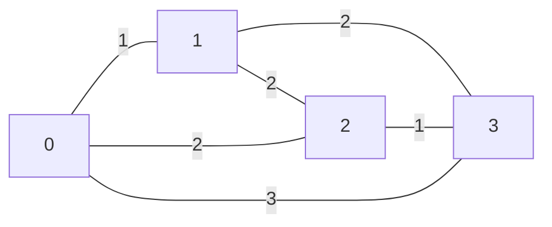

[[TOC]]

## 形式化题目

有 $n$ 个未知的 $0/1$ 变量 $x_1, x_2, \dots, x_n$。一次询问给定区间 $[i,j]$，
返回 $x_i \oplus x_{i+1} \oplus \cdots \oplus x_j$（即该区间和的奇偶性），代价为 $c[i,j]$。
要求选出一组询问，使得由这组询问的答案能够唯一确定 $x_1, \dots, x_n$，
并让总代价最小。求最小总代价。

形式化地：把每个区间 $[i,j]$ 看成一条无向边 $(i-1,\,j)$、权为 $c[i,j]$，
作用在点集 $\{0, 1, \dots, n\}$ 上。选边集 $E'$，使每个点 $i \in [1,n]$
都能通过 $E'$ 中的路径与点 $0$ 相连，最小化 $\sum_{e \in E'} w_e$。

## 正解

### 思路

**第一步：把"区间和"换成"前缀异或"。** 令前缀异或

$$S_0 = 0, \qquad S_k = x_1 \oplus x_2 \oplus \cdots \oplus x_k \quad (1 \leqslant k \leqslant n).$$

由于 $\oplus$ 是模 $2$ 加法，区间异或就是两个前缀异或的差：

$$x_i \oplus \cdots \oplus x_j = S_j \oplus S_{i-1}.$$

于是**一次询问 $[i,j]$ 给出的是 $S_{i-1}$ 与 $S_j$ 之间的异或关系**，
而且 $x_k = S_{k-1} \oplus S_k$：只要所有 $S_k$ 都确定了，所有 $x_k$ 就都确定了；
反过来，某个 $S_k$ 定不下来，$x_k$ 和 $x_{k+1}$ 就都有两种可能。
所以**目标等价于：让每一个 $S_k$ 都被唯一确定。**

**第二步：哪些 $S_k$ 能被确定？** 已知 $S_0 = 0$。把询问看成图上的边：
询问 $[i,j]$ 在点 $i-1$ 与点 $j$ 之间连一条边。若 $k$ 与 $0$ 在同一个连通块里，
沿路径把边上的异或关系乘起来，就能算出 $S_k \oplus S_0 = S_k$，即 $S_k$ 被确定；
若 $k$ 与 $0$ 不连通，那么把这一块的 $S$ 值整体同时异或 $1$，
所有询问答案都不变（每条边两端同时翻转，异或值不变），而 $S_k$ 变了，
说明 $S_k$ 无法确定。因此

> **一组询问能确定全部 $x_i$ $\iff$ 图 $(V=\{0,\dots,n\},\,E')$ 中每个点都与点 $0$ 连通。**

**第三步：连通的最小代价 = 最小生成树。** 要求 $E'$ 让 $n+1$ 个点连通，
即 $E'$ 含一棵生成树，$\sum_{e \in E'} w_e \geqslant$ 该图的最小生成树权；
而任意一棵生成树本身就让所有点连通、就是一组合法方案。
两边夹逼，答案恰为

$$\text{MST}\Bigl(K_{n+1},\; w(a,b) = c[a+1][b]\ \ (a < b)\Bigr).$$

**第四步：为什么用朴素 Prim。** 边数是 $\Theta(n^2)$，$n \leqslant 2000$ 时约 $2 \times 10^6$ 条边。
稠密图上 Prim 每次 $O(n)$ 找最近点、$O(n)$ 松弛，总复杂度 $O(n^2)$，
不需要堆，也不需要把边排出来（Kruskal 反而要 $O(n^2 \log n)$ 排序）。

以样例为例，$n = 3$，题面给的三行是
$c[1,1..3] = 1,2,3$、$c[2,2..3] = 2,2$、$c[3,3] = 1$，对应 6 条边：

| 询问 | 边 | 权 |
| :-: | :-: | :-: |
| $[1,1]$ | $(0,1)$ | 1 |
| $[1,2]$ | $(0,2)$ | 2 |
| $[1,3]$ | $(0,3)$ | 3 |
| $[2,2]$ | $(1,2)$ | 2 |
| $[2,3]$ | $(1,3)$ | 2 |
| $[3,3]$ | $(2,3)$ | 1 |

取边 $(0,1)$（1）、$(2,3)$（1）、$(0,2)$（2），三个点 $1,2,3$ 都与 $0$ 连通，
总代价 $1+1+2 = 4$，与样例输出一致。这三条边确实够用：$S_1$ 由 $[1,1]$ 直接得到，
$S_3$ 由 $[3,3]$ 得到，$S_2$ 由 $[1,2]$ 得到，四个前缀全定，$x_1..x_3$ 自然全定。

**易错点。**

- 答案是 $n$ 条边（生成树）的权之和，最大为 $n \times 10^9 = 2 \times 10^{12}$，
  必须用 64 位整数。
- 边权可以为 $0$，此时"不询问"和"询问"代价相同，生成树照常可以取零权边，
  算法不需要为 $0$ 做任何特判；全零数据答案为 $0$。
- 点集是 $n+1$ 个（$S_0$ 也算一个点），只连 $n$ 个点会漏掉 $x_1$ 或 $x_n$ 的信息。

### 代码

Python 版（用 `array` 存平铺矩阵，Prim 的松弛走切片，避免 $O(n^2)$ 的 Python 级内层循环）：

@include-code(./main.py, python)

C++ 版（同一算法，朴素 Prim）：

@include-code(./main.cpp, cpp)

### 复杂度

- **时间**：建图读入 $\Theta(n^2)$；朴素 Prim 是 $n+1$ 轮，每轮 $O(n)$ 找点、$O(n)$ 松弛，
  共 $O(n^2) = 4 \times 10^6$ 次基本操作。
- **空间**：平铺的对称邻接矩阵 $(n+1)^2$ 个整数，
  C++ 用 `int` 约 16 MB（$10^9$ 放得下 `int`），Python 用 `array('q')` 约 32 MB；
  其余辅助数组 $O(n)$。
- **Python 侧风险**：C++ 限时 1000 ms，纯 Python 的 $O(n^2)$ 常数偏大，
  $n = 2000$ 时本解法实测约 2 s（松弛已压到切片 + `min` 的 C 层，只剩找最近点是
  $O(n)$ 的 C 层扫描），可能 TLE；但算法与 C++ 同阶，没有降级成暴力。
  读入用 `sys.stdin.buffer.read().split()` 一次性分词，峰值内存约 150 MB，
  在 256 MB 限制内。

## 总结

- **区间异或 → 前缀异或 → 图上一条边**：这是本题唯一的建模步骤，
  $S_j \oplus S_{i-1}$ 与边 $(i-1, j)$ 的对应关系是整个解法的支点。
- **"能确定"= "连通"**：充分性靠沿路径累乘异或，必要性靠"连通块整体异或 1"的对称性论证；
  这一步把信息论问题翻译成纯图论问题。
- **最小连通 = 最小生成树**：任何连通子图含生成树，任何生成树都连通，两边夹逼即答案。
- **稠密图选 Prim**：$2 \times 10^6$ 条边不值得排出来，$O(n^2)$ 的朴素 Prim 最省事，
  也正好用"一维平铺矩阵 + 对称填表"避开三角形的下标换算。

## 数据说明

本题素材源目录里带有数据生成脚本 `data.py`，其建模与上文一致
（`n+1` 个点的完全图最小生成树，边 $(i-1,j)$ 权 $c[i,j]$），10 个测试点覆盖
$n = 3,5,10,50,200,500,1000,1500,2000$、全零边权、全 $10^9$ 边权等情形。
因此题面是**重建**的、并非官方原始数据，出题意图以 `data.py` 的建模为准；
`std.cpp` 与本解法的建模一致（已用真实 `data/` 逐点核对输出）。
