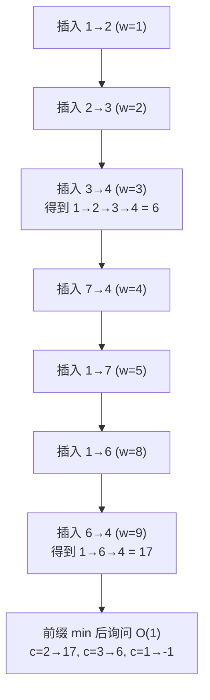

[[TOC]]

## 形式化题目

给定有向图 $G=(V,E)$，$|V| = n$、$|E| = m$，每条边 $e$ 带权 $w_e$，且**所有边权两两不同**。
对于 $q$ 组询问 $(a, b, c)$，求

$$
\min\Big\{\sum_{i=1}^{k} w_{e_i} \;\Big|\; k \leqslant c,\;
a \xrightarrow{e_1} v_1 \xrightarrow{e_2} \cdots \xrightarrow{e_k} b,\;
w_{e_1} \leqslant w_{e_2} \leqslant \cdots \leqslant w_{e_k}\Big\},
$$

即从 $a$ 走**不超过 $c$ 条边**到 $b$、途中边权**不下降**的最小边权和；不存在这样的走路时输出 $-1$。
$n \leqslant 150$，$m \leqslant 5000$，$q \leqslant 1000$，$w \leqslant 5000$。

几条从题面与数据里都能直接读出的边界约定：

- $a = b$ 且 $c \geqslant 0$ 时答案为 $0$（走 $0$ 条边，也算"不超过 $c$ 条"）；
- $c$ 没有给出上界，实测数据里出现过 $c = 10^9$，须按 64 位整数读入；
- 边权为正，"去掉走路中的环"不会让和变大，所以最优解总能取成**简单路径**，长度不超过 $n-1$。

## 正解

### 思路

**朴素做法。** 把"走路"当成状态：$\mathrm{dp}[v][\text{last}][k]$ 表示走到 $v$、最后一条边权为
$\mathrm{last}$、已用 $k$ 条边的最小和，转移时枚举所有边。状态里带边权这一维就爆了；
若退化成"以 $v$ 为起点跑一遍 Dijkstra 再检查路径是否单调"，则单调性约束根本无法用最短路刻画。

**关键观察：边权两两不同时，"不下降"等价于"按边权升序使用这些边"。**
一条合法走路上 $w_{e_1} \leqslant \cdots \leqslant w_{e_k}$，而所有边权互不相同，
所以这条不等式链其实处处取严格不等号：**走路上的边在"按 $w$ 升序排列的边表"里出现的
位置，与它在走路里出现的次序完全一致。** 于是不需要在状态里记边权，
只要**按边权升序把边一条一条"插进图里"**，插入顺序就自动等于行走顺序。

这给出了一个很像 Bellman–Ford 的过程。设

$$
f[a][v][k] = \text{从 } a \text{ 出发、在已插入的边集中走**恰好** } k \text{ 条边到达 } v \text{ 的最小边权和},
$$

初值 $f[a][a][0] = 0$，其余为 $+\infty$。插入边 $e = (u, v, w)$ 时对每个起点 $a$ 做

$$
f[a][v][k] \;\leftarrow\; \min\big(f[a][v][k],\; f[a][u][k-1] + w\big), \qquad k = n, n-1, \dots, 1 .
$$

$k$ **从大到小**枚举是关键：读到 $f[a][u][k-1]$ 时它还是"插入这条边之前"的旧值，
因此一条边在一次松弛里最多被用一次，$k$ 就精确等于走路用掉的边数。

**为什么每条边只用松弛一次就够了？** 因为合法走路的边一定互不相同：权严格递增即下标严格递增。
所以走路恰好被"按其最后一条边被插入的那一刻"完整枚举到——插入那条边时，
$f[a][u][\cdot]$ 里已经累好了这条走路的其余部分。

**询问的收尾。** 题目允许"不超过 $c$ 条"，所以对每个 $(a, v)$ 把 $k$ 做前缀最小：
$f[a][v][k] \leftarrow \min(f[a][v][k], f[a][v][k-1])$，之后 $f[a][v][k]$ 的含义变成"不超过 $k$ 条边"。
询问即 $O(1)$：$c \leftarrow \min(c, n)$（简单路径长度 $\leqslant n-1$，
$c$ 超过 $n$ 的部分永远用不上），再查 $f[a][b][c]$，被 $+\infty$ 污染过就输出 $-1$。

用题面样例验证一遍，其中起点固定为 $a = 1$。9 条边按 $w$ 升序依次是
$1{\to}2(1)$、$2{\to}3(2)$、$3{\to}4(3)$、$7{\to}4(4)$、$1{\to}7(5)$、$5{\to}8(7)$、$1{\to}6(8)$、$6{\to}4(9)$、$4{\to}5(12)$，
插入过程中 $f[1][4][\cdot]$ 的变化是

| 插入的边（升序） | 由此新得到的最优走路 | $f[1][4][1]$ | $f[1][4][2]$ | $f[1][4][3]$ |
| :-: | :-: | :-: | :-: | :-: |
| $1{\to}2\;(1)$ | $1{\to}2 = 1$ | $\infty$ | $\infty$ | $\infty$ |
| $2{\to}3\;(2)$ | $1{\to}2{\to}3 = 3$ | $\infty$ | $\infty$ | $\infty$ |
| $3{\to}4\;(3)$ | $1{\to}2{\to}3{\to}4 = 6$ | $\infty$ | $\infty$ | $6$ |
| $7{\to}4\;(4)$ | 点 $7$ 尚不可达，无 | $\infty$ | $\infty$ | $6$ |
| $1{\to}7\;(5)$ | $1{\to}7 = 5$ | $\infty$ | $\infty$ | $6$ |
| $5{\to}8\;(7)$ | 点 $5$ 尚不可达，无 | $\infty$ | $\infty$ | $6$ |
| $1{\to}6\;(8)$ | $1{\to}6 = 8$ | $\infty$ | $\infty$ | $6$ |
| $6{\to}4\;(9)$ | $1{\to}6{\to}4 = 17$ | $\infty$ | $17$ | $6$ |
| $4{\to}5\;(12)$ | $1{\to}2{\to}3{\to}4{\to}5 = 18$（终点是 $5$，不影响上表三列） | $\infty$ | $17$ | $6$ |

于是 $c=2$ 时答案 $17$、$c=3$ 时答案 $6$、$c=1$ 时 $-1$，与样例一致。
表中"$c=2$ 的答案为什么不是 $1{\to}7{\to}4 = 9$"也一目了然：那条走路的边权是 $5, 4$，
$5 > 4$ 违反不下降，DP 根本不会把它记进 $f[1][4][2]$——
$f[1][4][2]$ 只能由"边 $7{\to}4(4)$ 在边 $1{\to}7(5)$ 之后被插入"产生，
而插入顺序是按权升序，$7{\to}4$ 排在 $1{\to}7$ 前面，串不起来。

下图画出上述"按权升序插边"的骨架：每插一条边，就把它当作走路的最后一步接上去。

**两个容易写错的坑。**

1. **$k$ 的枚举方向**：正着枚举 $k$，$f[a][u][k-1]$ 可能已经在本轮被这条边更新过，
   一条边就会被反复使用（$f[a][v][k+1] = f[a][v][k] + w$ 这种"套娃"），答案会被低估。
2. **$c$ 的截断与类型**：$c$ 可以到 $10^9$，必须用 `long long` / Python 大整数读入；
   截断成 $\min(c, n)$ 才敢拿它当数组下标。

### 代码

Python 版：

@include-code(./main.py, python)

C++ 版（同一算法）：

@include-code(./main.cpp, cpp)

### 复杂度

- **时间**：预处理 $O(m \log m)$ 排序，然后每条边对每个起点做一次 $O(n)$ 的 $k$ 维松弛，
  共 $O(m n^2)$；询问 $O(1)$。代入上界 $5000 \times 150^2 \approx 1.1\times 10^8$，
  C++ 实测最慢测点（$n=150, m=5000, q=1000$）0.14 s（限时 1000 ms）。
- **空间**：$f$ 有 $(n+1)^3 \approx 3.4\times 10^6$ 个状态，
  用 `int` 存约 14 MB（答案上界 $149 \times 5000 = 745000$ 远小于 `INF = 0x3f3f3f3f`，
  不会与不可达标记混淆，所以不必开 `long long`），实测峰值 15.5 MB。
- **Python 侧**：算法与 C++ 同阶（同样是 $O(mn^2)$ 的松弛，只是把 $k$ 这一维交给
  `map` / 推导式在 C 层跑），但常数大：最大测点约 5.7 s，会超过 1 s 限时——
  属于允许的 Python TLE，算法本身没有降级；小数据（$m \leqslant 3000$）与样例都在 2.4 s 内。

## 总结

- **不下降 + 边权互不相同 = 排序后逐边插入。** 这是本题的全部出口：
  把"路径上的约束"换位成"处理顺序上的约束"，状态里那一维边权就消失了。
- **插入顺序即行走顺序，所以每条边只需松弛一次。** 注意这里**“边权两两不同”是承重的前提**：
  若两条同权边需要串接（如 $1{\to}2$、$2{\to}3$ 同为 $5$，再问 $1 \to 3, c \geqslant 2$），
  写在同一轮的松弛就会错过它们——必须对同权边的整组做多轮松弛（分层图上的 Bellman–Ford，
  见素材源 `std.cpp` 的加固写法）才能处理。本题题面保证权值互不相同，所以单轮足够；
  本文的 `main.cpp` / `main.py` 都只写单轮，与题面一致。
- **"恰好 $k$ 条" → "$O(1)$ 询问"**：$k$ 维从大到小松弛保证每条边只用一次，
  最后对它取前缀最小就换成"不超过 $k$ 条"，$q$ 组询问不再需要任何额外计算。
- **正权 + 简单路径**：由"去环不增代价"得到长度上界 $n-1$，于是 $c \geqslant n$ 时截断到 $n$，
  既省时间又避免 $c$ 过大时下标越界。
- **本题素材的可靠性说明**：随仓 `data/` 带 `data.py` 生成脚本，属于按题面自造的测试数据
  （`data.py` 里逐点写明了规模与意图），题面本身是网络重建（素材源 `std.cpp` 的注释给出了
  若干 CSDN 题解出处），因此“出题人的原始意图”与官方原题可能存在细节偏差。
  可以核实的是：10 个测点里每条边的 $w$ 确实都两两不同，与题面一致。
  本文的结论均以题面与随仓数据为准，并已用 `main.cpp` 与 `main.py` 两个实现独立跑通全部 10 个测点。

## 图示解析

### 插边顺序如何决定可行性

下图不是图结构，而是一条**处理时间线**：9 个节点就是 9 条边，箭头表示"先插哪条、后插哪条"。
一条合法走路必须在时间线上**从左往右**挑边，且挑出的边首尾相接。

- $1{\to}2{\to}3{\to}4$（权和 $6$）用到的 ①②③ 在时间线上依次出现且首尾相接，所以合法；
  它的长度是 $3$，因此 $c = 2$ 时凑不出来。
- $5+4 = 9$ 那条 $1{\to}7{\to}4$ 表面更短，但 $1{\to}7$ 是 ⑤、$7{\to}4$ 是 ④，
  在时间线上**反序**，拼不出非降权走路——这正是本题与普通最短路的分水岭。
- $1{\to}6{\to}4$ 用到 ⑦⑧，在时间线上顺序且相接，于是它是 $c = 2$ 时唯一可行的路，答案 $17$。
