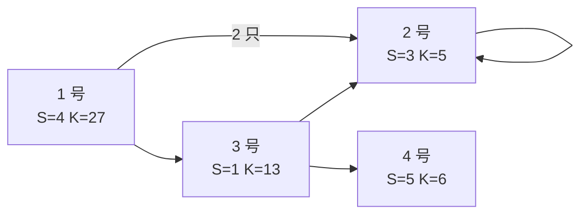

[[TOC]]

## 形式化题目

有 $N$ 种怪兽，编号 $1 \sim N$。第 $i$ 种怪兽有两条处置路线：

- **普通攻击**：消耗 $S_i$ 体力把它"打死"，但它死后会立刻产生 $R_i$ 只新怪兽，
  编号为给定的 $v_{i,1}, \dots, v_{i,R_i}$（编号可重复，同一编号可以出现多次）；
- **法术攻击**：消耗 $K_i$ 体力把它**彻底**消灭，不产生任何新怪兽。

$1$ 号怪兽入侵了村庄，其余怪兽只能由它衍生。求消灭村庄里所有怪兽所需的最小总体力。

注意"普通攻击"并不减少怪兽总量（一只换成 $R_i$ 只，而 $R_i \geqslant 1$），
所以它唯一的用处是把一只怪兽"拆"成更便宜的一批；每次普通攻击都是**加**体力，
不存在"打一下反而赚了"的负代价边。

## 正解

### 思路

**先写出方程。** 每只怪兽的处置彼此独立（$1$ 号衍生出的怪兽之间互不影响，
同时出现的同一编号怪兽也各自独立），所以可以为每种怪兽单独定义一个量：

$$f_i = \text{彻底消灭一只 } i \text{ 号怪兽以及它衍生出的一切所需的最小体力}.$$

一只 $i$ 号怪兽只有两种走法，取较小的那个：

$$f_i = \min\Bigl(K_i,\; S_i + \sum_{j=1}^{R_i} f_{v_{i,j}}\Bigr). \tag{1}$$

样例可以验算：$f_3 = \min(13, 1 + f_4 + f_2) = \min(13, 1+6+5) = 12$，
$f_2 = \min(5, 3 + f_2) = 5$（$2$ 号自环，普通攻击永远不划算），
$f_1 = \min(27, 4 + 2f_2 + f_3) = \min(27, 4+10+12) = 26$，与样例输出一致。

**难点在于它不是递推。** (1) 式右端依赖别的 $f$，而这些依赖关系可能成环：
$2$ 号怪兽死后会产生 $2$ 号自己（题面明说"一个怪兽可能经过若干次普通攻击后变回一个或更多同样的怪兽"），
样例里 $1 \to 3 \to 2 \to 2$ 就是一条环。所以不能按拓扑序一遍算完，
更不能天真地"遇到环就放弃"。

**为什么一定有解、解又是什么。** 两条关键性质：

1. **上界存在。** $f_i \leqslant K_i$ 恒成立——法术攻击总是合法的，直接把它杀干净即可。
   于是把所有 $f_i$ 都取成 $K_i$，得到的是合法解的一个**上界**。
2. **单调性。** (1) 式右端关于每个 $f$ 单调不减。于是把它看成算子 $T$，
   从 $f^{(0)} = K$ 出发反复做 $f^{(t+1)} = T(f^{(t)})$，序列单调不增且有下界，
   必然收敛到**最小不动点** $f^*$，而 $f^*$ 就是要的答案：

   - 任何真实策略的代价都满足 (1) 式（策略要么一次法术杀掉，要么先普通攻击再分别处理衍生怪），
     即每个合法策略的代价向量都是 $T$ 的一个不动点（或前不动点），故 $\geqslant f^*$；
   - 反过来，$f^*$ 是 (1) 式的最小解，按 $f^*$ 里取到 $\min$ 的那一支构造策略即为合法策略，
     代价恰好是 $f^*_1$。

  这就是"最短路"视角：$f$ 是这张**超图**（一条"边"从 $i$ 连向 $R_i$ 个儿子，代价 $S_i$）
   上的最短距离，环只是说明图不是 DAG，用 Bellman-Ford / SPFA 那套松弛照样能求。

**朴素迭代慢在哪。** 直接每轮全量扫一遍所有怪兽、把 (1) 式重算一次，
每轮代价 $O(N + \sum R_i)$，最坏要迭代很多轮。真正的浪费是：**绝大多数怪兽的 $f$ 这一轮根本没变**，
而某个 $f_u$ 变了以后，受影响的只有"会产生 $u$ 的那些怪兽"——它们的
$\sum f_{son}$ 恰好少了 $\Delta$。

**把影响面收窄。** 维护

$$\mathrm{sum}_i = S_i + \sum_{j=1}^{R_i} f_{v_{i,j}}, \qquad f_i = \min(K_i, \mathrm{sum}_i),$$

并为每个怪兽 $u$ 记一份**反向表**：哪些怪兽的死亡清单里出现了 $u$（这些怪兽叫 $u$ 的父亲）。
于是一条松弛规则就够了：

> 若 $f_u$ 下降了 $d$，则对每个父亲 $p$：$\mathrm{sum}_p \mathrel{-}= d$；
> 若这时 $\mathrm{sum}_p < f_p$，就把 $f_p$ 降到 $\mathrm{sum}_p$，并继续把 $p$ 的下降量往外传。

**初始状态与队列。** 取 $f_i = K_i$、$\mathrm{sum}_i = S_i + \sum K_{v_{i,j}}$；
凡是 $\mathrm{sum}_i < f_i$ 的怪兽（普通攻击当场就更便宜）先入队，作为第一批"下降源"。
之后队列里存的是"$f$ 刚变小的怪兽"，出队时把它攒下的下降量 $d$ 推给所有父亲。
这正是一遍 SPFA：每个 $f_i$ 只降不升，每次下降至少 $1$（都是整数），故算法必然终止。

**两个实现细节。**

- **攒量而不是丢量。** 同一只怪兽可能在出队前被连续降了多次。
  给每个点配一个 `pending[i]`，每次下降就累加进去，出队时一次性推给父亲；
  否则后一次下降量会被前一次覆盖，答案偏大。同一个点还在队列里时不要重复入队（`inq` 标记）。
- **中间量会爆 `long long`。** $f_i \leqslant K_i \leqslant 5 \times 10^{14}$，但
  $\mathrm{sum}_i$ 可能到 $\sum R_i \times 5 \times 10^{14} = 5 \times 10^{20}$，
  远超 `long long` 的 $9.2 \times 10^{18}$。C++ 里把 `sum` 声明成 `__int128`
  （只做加法和与 `f` 的比较，不参与输出），`f` 保持 `long long`。
  不能简单地把 `sum` 截断饱和：$f$ 下降后 `sum` 会一路减回去，截断会丢掉这个减量。
  Python 整数无上限，无需处理。

### 代码

@include-code(./main.py, python)

@include-code(./main.cpp, cpp)

### 复杂度

设 $M = \sum R_i$。按数据范围 $2 \leqslant N \leqslant 2 \times 10^5$、$M \leqslant 10^6$、
$1 \leqslant S_i, K_i \leqslant 5 \times 10^{14}$。建反向边与初值是 $O(N + M)$。
主循环是 SPFA：每个 $f_i$ 只下降、不上升，总下降次数 $D$ 决定总代价 $O(N + M + D)$
（每次传播沿一条反向边走一步）。$D$ 在最坏情况下没有比
Bellman-Ford 更好的界，但本题每条普通攻击都是正代价、且 $f_i$ 被 $K_i$ 死死卡住上界，
实际每个点只会被松弛常数次，10 个测试点里 C++ 最慢 $0.067$ s、Python 最慢 $0.45$ s。
空间 $O(N + M)$：反向边 $M$ 条、每个点三个数组，C++ 实测峰值 $26$ MB。

## 总结

本题的形式是"决策依赖结果、结果又有环"，属于**最短路式的方程求解**，
和 [USACO 2005 Dec] 的"牛的比赛"、SPFA 判负环同一族思路：写出方程 → 说明它是某个单调算子的最小不动点 →
用松弛法从初值往下推。三步里最容易漏掉的是中间那步：如果只看"有环"就断言不可解，
或者反过来直接按 DAG 拓扑序算，都会错。而"最小"两个字恰恰是环能被接受的原因——
$f_i \leqslant K_i$ 给了天然上界，使最小不动点存在且可由上往下迭代得到。

实现上的两个坑都来自同一个观察——**只有会产生 $u$ 的怪兽才会因 $f_u$ 变化而受影响**：
一是必须建反向边（正向边帮不上忙），二是必须把下降量**攒起来整批推**（否则丢量）。
剩下的就是纯 SPFA 模板，连"判负环"都不用写：本题没有负代价边，队列一定排空。

顺带记一笔数据类型：$f$ 的值域被 $K_i$ 卡在 $5 \times 10^{14}$，看上去 `long long` 绰绰有余，
但它是 $\sum$ 的**部分和**，而部分和的项数可以达到 $10^6$，所以 `sum` 必须用 `__int128`。
"参与比较的中间量"和"最终答案"值域不同，是这类题常见的溢出来源。

> **数据来源说明**：本题所在素材目录附带 `data.py` 生成脚本，说明随仓 `data/` 的 10 个测试点是
> **自造数据**（题面本身亦为网络重建），出题意图与原官方题目可能存在偏差；其中
> 1、2、3、5、9、10 六个结构确定的点可由闭式公式手算校验，本文解法与素材源 `std.cpp`
> 在这 10 个点上输出完全一致。

## 图示解析

### 样例的反向边与松弛顺序

样例的依赖关系（实线箭头：普通攻击 $i$ 会产生箭头指向的怪兽）：

初始 $f = (27, 5, 13, 6)$，$\mathrm{sum} = (4+5+5+13,\ 3+5,\ 1+6+5,\ 5+6) = (27, 8, 12, 11)$。
只有 $3$ 号满足 $\mathrm{sum} < f$（$12 < 13$，其余三点都是法术攻击更便宜），入队；$3$ 号降到 $12$ 后把下降量 $1$ 推给它的父亲 $1$ 号
（$\mathrm{sum}_1: 27 \to 26$），$1$ 号随即降到 $26$ 并入队；$1$ 号没有父亲，传播结束。
最终 $f_1 = 26$，与样例解释里
"普通攻击 $1$ 号（$4$）→ 法术杀两只 $2$ 号（$10$）→ 普通攻击 $3$ 号（$1$）→ 法术杀 $2$、$4$ 号（$11$）"
这条 $4+5+5+1+5+6=26$ 的路线吻合。
