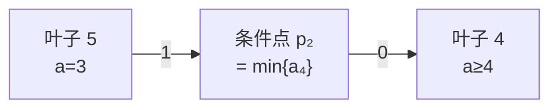

[[TOC]]

## 形式化题目

给定 $n$ 个位置上的正整数 $a_1, a_2, \dots, a_n$，每个 $a_i \in [1, 10^9]$。
输入先给出 $s$ 条已知信息 $a_{p_i} = d_i$（$p_i$ 严格递增），
再给出 $m$ 条区间信息，第 $j$ 条为 $(l_j, r_j, k_j, x_1, \dots, x_{k_j})$，
其中 $1 \le l_j < r_j \le n$、$1 \le k_j \le r_j - l_j$、
$l_j \le x_1 < x_2 < \cdots < x_{k_j} \le r_j$。它的含义是

$$
a_{x_t} > a_y \qquad \text{对一切 } t \in [1, k_j] \ \text{和一切 } y \in [l_j, r_j] \setminus \{x_1, \dots, x_{k_j}\}.
$$

也就是说：区间 $[l_j, r_j]$ 里被点名的这 $k_j$ 个数，每个都**严格大于**剩下的 $r_j - l_j + 1 - k_j$ 个数。
题目要求构造任意一组满足全部条件的 $a$；无解则输出 `NIE`，有解则先输出 `TAK`，
再输出 $n$ 个正整数。

数据范围：$1 \le s \le n \le 10^5$，$1 \le m \le 2 \times 10^5$，$\sum k \le 3 \times 10^5$。

因为所有 $a_i$ 都是整数，"严格大于"等价于"至少大 $1$"，于是每条信息都是
$a_{x_t} \ge a_y + 1$ 形式的线性不等式——这正是**差分约束**的形状。

## 正解

### 思路

#### 第一步：把所有不等式统一成"下界"

给每个位置维护一个下界 $v_i$：初始 $v_i = 1$，已知位置直接取 $v_{p} = d$。
把每条不等式 $a_u \ge a_v + w$ 记成一条有向边 $v \to u$ 权 $w$，
含义是"$u$ 的下界至少要达到 $v$ 的下界加上 $w$"。
按拓扑序把所有边推一遍

$$
v_u \longleftarrow \max\bigl(v_u,\ v_v + w\bigr),
$$

得到的 $v$ 就是每个位置**被约束逼出来的最小取值**。

#### 第二步：一条信息要连多少边

最直接的翻译是：$k$ 个 $x$ 中的每一个都大于剩下的 $r-l+1-k$ 个位置，
于是要连 $k\,(r-l+1-k)$ 条边。最坏 $10^5 \times 10^5$，直接爆炸。

引入一个辅助点 $p$ 表示"$X$ 中的最小值"，就能把"两两之间"压成"两次"：

- 每个剩下的位置 $y$ 连 $y \to p$ 权 $1$，即 $p \ge a_y + 1$（$p$ 严格大于它们）；
- $p$ 连 $p \to x_t$ 权 $0$，即 $a_{x_t} \ge p$。

传递一下就是 $a_{x_t} \ge p > a_y$，恰好是要求。
边数从 $k(r-l+1-k)$ 降到 $r-l+1$。但一条 $l=1,\ r=10^5,\ k=1$ 的信息仍有 $10^5$ 条边，
$m$ 条就是 $2 \times 10^{10}$ 条，还是不行。

#### 第三步：用线段树压缩"剩下的位置"

区间 $[l, r]$ 挖掉 $k$ 个点名的位置后，剩下的部分恰好是 $k+1$ 段**连续**空隙。
对位置建一棵线段树，先把"儿子 $\to$ 父亲、权 $0$"的边连好——
这样父亲的值天然就是它所辖区间内所有位置下界的最大值。
于是一段空隙 $[L, R]$ 只要拆成 $O(\log n)$ 个线段树节点，
每个节点往 $p$ 连一条权 $1$ 的边，就不必逐个位置连边了。

以题面样例的第二条信息 $(l,r,k)=(4,5,1,\{4\})$ 为例，空隙只有 $\{5\}$：

读作 $a_4 \ge p_2 \ge a_5 + 1 = 4$。第一条信息 $(1,4,2,\{2,3\})$ 的空隙是
$\{1\}$ 和 $\{4\}$，两个叶子分别连一条权 $1$ 边到 $p_1$，$p_1$ 再连回叶子 $2,3$。

#### 第四步：无解怎么判

推完之后只可能有三种矛盾：

1. **约束成环**：拓扑排序没能剥掉所有点。线段树内部（儿子 $\to$ 父亲）本身无环，
   所以任何环都至少经过一个条件点，而**进入条件点的边权全是 $1$**，
   环上权和 $\ge 1$，即"$a \ge a + $ 正数"，矛盾。
2. **下界越界**：某个位置的下界 $> 10^9$，超出值域。
3. **与已知值冲突**：某个已知位置被推到的下界 $> d$，和 $a_p = d$ 冲突。

三种情况任一出即 `NIE`；都不出现时，令 $a_i = v_i$ 就是一组合法解。

#### 为什么 $a_i = v_i$ 一定合法

设最终下界为 $v$。

- **$v_i \le a_i$（对任意合法解）**：沿拓扑序归纳。源点 $v = 1 \le a$；
  已知位置 $v = d = a$；对每条边 $v \to u$ 权 $w$，对应不等式
  $a_u \ge a_v + w \ge v_v + w$，所以推完仍满足 $v_u \le a_u$。
- **$a_i = v_i$ 满足每条信息**：对空隙里的任意位置 $y$，设覆盖它的那个线段树节点为 $s$。
  从叶子 $y$ 到 $s$ 全是权 $0$ 的父子边，故 $v_s \ge v_y$；而 $s \to p$ 权 $1$，
  于是 $v_p \ge v_y + 1 > v_y$；又 $p \to x_t$ 权 $0$ 给出 $v_{x_t} \ge v_p$，
  合起来 $v_{x_t} > v_y$。
- **已知位置取值精确**：检查 3 通过时 $v_p = d$（初值就是 $d$，且从未被推高）。

所以三种检查全部通过 $\iff$ 有解，算法是完备的。

#### 实现细节：边权可以不存

图上的边权只有 $0$ 和 $1$，而且恰好由**终点类型**决定：

| 边的来源 | 终点 | 权 |
| --- | --- | --- |
| 儿子 $\to$ 父亲 | 线段树节点 | $0$ |
| 空隙节点 $\to p$ | 条件点 | $1$ |
| $p \to x_t$ | 线段树叶子 | $0$ |

即：线段树节点只有权 $0$ 的入边，条件点只有权 $1$ 的入边。
代码据此省掉一份边权数组，把最坏数据（$\approx 6 \times 10^6$ 条边）的常驻内存
压进 $128$ MB。

### 代码

Python 短解法（与 C++ 同阶：同一张图、同一次拓扑排序）：

@include-code(./main.py, python)

C++ 正式解：

@include-code(./main.cpp, cpp)

### 复杂度

设 $\Sigma k = \sum_j k_j$。

- 点数：$O(n + m)$（线段树 $2n$ 量级 + 每条信息一个条件点）。
- 边数：线段树 $O(n)$ 条 + $p \to x_t$ 共 $\Sigma k$ 条 + 每段空隙 $O(\log n)$ 条，
  空隙总数为 $\Sigma k + m$，故总计
  $O\bigl(n + \Sigma k + (\Sigma k + m)\log n\bigr)$。
- 时间：建图与拓扑排序都是每条边 $O(1)$，即同阶
  $O\bigl(n + \Sigma k + (\Sigma k + m)\log n\bigr)$。
- 空间：同阶，即图的规模本身。

代入上限 $n \le 10^5$、$m \le 2\times 10^5$、$\Sigma k \le 3 \times 10^5$，
边数在 $10^7$ 以内。

## 总结

这道题的骨架是"**差分约束 + 拓扑排序**"，真正的难点在**建图**：

1. 先把"严格大于"化成"$\ge$ 加 $1$"，把构造问题变成"求每个位置的下界"。
2. 用**一个辅助点代表集合最小值**，把 $k \times (r-l+1-k)$ 条边压成 $k + (r-l+1-k)$ 条。
3. 再用**线段树把区间连边**，把"逐个位置连边"压成 $O(\log n)$ 条。
   这是"线段树优化建图"的教科书用法：点 $\to$ 区间的边用"儿子 $\to$ 父亲"的
   向上边汇聚，区间 $\to$ 点的边用线段树分解。
4. 无解判定要凑齐三条：**成环 / 越界 / 与已知值冲突**。第三条最容易漏——
   只知道 $a_p = d$ 并不等于"$v_p = d$"，还要检查它没有被其他约束推高。

关于本题的数据与样例，有两点需要如实说明：

- 素材源里带有数据生成脚本（`data.py`），说明 `data/` 是**自造数据**，
  题面本身也可能是网络重建的，与官方原题（洛谷 P3588 [POI2015] Pustynia）的
  细节可能有偏差；本题解按题面文字自行推导，未依赖任何外部题解。
- 题面样例给出的输出是 `6 7 1000000000 6 3`，而本解输出 `1 7 5 4 3`。
  两者都合法（读者可逐条核对上面两条信息），差别只在于本解取的是**每个位置的最小可行下界**，
  而样例来自另一种构造。本题是"构造任意一组解"，多解均判正确。
  另经核对：本解与素材源的 `std.cpp` 在全部 $10$ 个数据点上输出**逐字节一致**，
  且与 `data/*.out` 完全一致。
