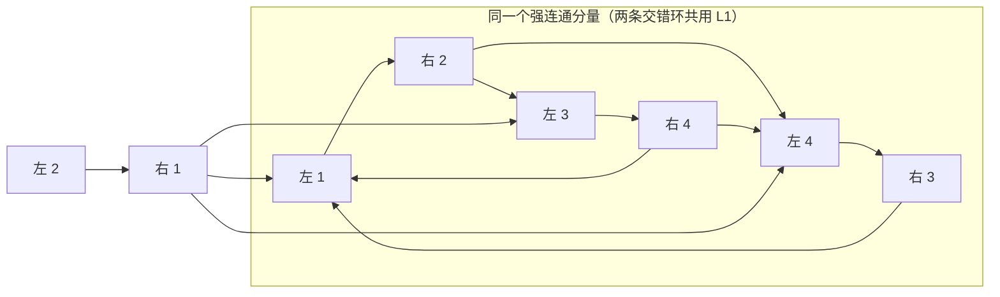

[[TOC]]

## 形式化题目

给定一个二分图 $G = (L, R, E)$，其中 $|L| = n$、$|R| = m$，且保证 $n \leqslant m$。对**每一条边** $e \in E$，判定：原图中是否存在一个大小为 $n$（即饱和整个左部）的匹配 $M$ 满足 $e \in M$。

输出一个 $n \times m$ 的 0/1 矩阵：若左部点 $i$ 与右部点 $j$ 之间**不存在**边，或存在边但没有任何大小为 $n$ 的匹配包含它，则第 $i$ 行第 $j$ 列为 `1`；否则为 `0`。也就是说**输出是判定结果的取反**：`0` 才表示"这条边可用"。

约束：$1 \leqslant n \leqslant 300$，$1 \leqslant m \leqslant 1500$，$n \leqslant m$。

注意 $n \leqslant m$ 是关键前提——它保证了"饱和左部的大小为 $n$ 的匹配"总是**左部完美匹配**：每个左部点都必须被匹配，而右部点允许有剩余。因此本题问的是"每条边能否作为左部完美匹配的一条边"，而不是笼统的"最大匹配的边"。

## 正解

### 思路

**先排除无解情形。** 如果最大匹配的大小 $< n$，那么一个大小为 $n$ 的匹配根本不存在，所有格子都输出 `1`。这一步用 Hopcroft-Karp 在 $O(E\sqrt{V})$ 内求出最大匹配即可，同时得到一个匹配 $M$（若存在大小为 $n$ 的匹配，则 $|M| = n$，它饱和左部）。

**难点在第二步：有了一个匹配，怎么判断别的边。** 朴素的"逐条边删掉再求一次最大匹配"是 $O(nm \cdot E\sqrt{V})$，$n m = 4.5 \times 10^5$，绝对不可行。必须一次性地把所有边分类。

关键观察是**交错路/交错环的翻转**：若 $M$ 是一个左部完美匹配，$M'$ 是另一个，则对称差 $M \triangle M'$ 由若干条交错路与交错环组成，其中交错路的两端必然都在"两个匹配都没盖住"的点上。由于两个匹配都饱和左部，两端就只能是**右部的自由点**（$M$ 未匹配的右部点，共有 $m - n$ 个，可能为 0）。于是：

- 若 $e$ 同时属于某个交错环 $C$（在 $C$ 上把匹配与非匹配边互换，得到的新匹配大小不变，仍饱和左部），则 $e$ 可用；
- 若 $e$ 位于某条从**右部自由点**出发的交错路上，则沿这条路径翻转前缀（或整条路径）也能把 $e$ 变成匹配边，且匹配大小不变，仍饱和左部。

这两条覆盖了全部情形，也正是经典的"边属于某个最大匹配"判定的两条判据。

**把这两条判据变成图上可达性。** 按 $M$ 定向建交错有向图 $D$：顶点是全部 $n + m$ 个点；匹配边 $u$-$v$ 建成弧 $u \to v$（左 $\to$ 右），非匹配边 $u$-$v$ 建成弧 $v \to u$（右 $\to$ 左）。在这个定向下，从右部点出发的"交错路"恰好是 $D$ 中的有向路（右部点先沿非匹配边走到左部点，再沿匹配边走到右部点，交替进行）。于是：

- 条件 (a)：$u$ 与 $v$ 在 $D$ 的**同一个强连通分量**里 $\iff$ 该边落在一条交错环上。用 Tarjan（或 Kosaraju）一次求出所有 SCC。
- 条件 (b)：$v$ 在 $D$ 中**从某个 $M$ 未匹配的右部点可达**。把所有右部自由点作为源做一次 BFS/DFS 即可。

匹配边本身当然属于 $M$，恒输出 `0`。

用样例 1 直观感受一下 $D$ 的形状。图是 $4 \times 4$：第 2 行只有一条边到右部点 1，所以任何左部完美匹配都必须含 $(2,1)$；右部点 1 因此被锁死不能再用。本仓库程序实测 Hopcroft-Karp 给出 $M = \{(1,2), (2,1), (3,4), (4,3)\}$（$n = m = 4$，没有右部自由点，条件 (b) 在本样例中不会触发），此时交错有向图 $D$ 中 $\{L1, L3, L4, R2, R3, R4\}$ 因 $L1 \to R2 \to L3 \to R4 \to L1$、$L4 \to R3 \to L1$、$R2 \to L4$ 等弧构成一个强连通分量，而 $L2$、$R1$ 各自单独成点：

逐条对照期望输出 `1000 / 0111 / 1000 / 1000`（第 1 行）：$(1,2)$ 是匹配边直接为 `0`；非匹配边 $(1,3)$、$(1,4)$ 的右端点 $R3$、$R4$ 与 $L1$ 同 SCC，满足条件 (a)，也为 `0`；非匹配边 $(1,1)$ 的右端点 $R1$ 与 $L1$ 不同 SCC，又没有右部自由点，两个条件都不满足，于是为 `1`。

（实际 $M$ 的具体取法由 Hopcroft-Karp 决定，不同取法下 $D$ 的形状会变，但上述两条判据的结论与 $M$ 的取法无关，这正是该判定成立的原因。）

**为什么结论与 $M$ 的取法无关？** 因为判据本身是对"存在某个大小为 $n$ 的匹配含 $e$"这个与 $M$ 无关的命题给出的充要刻画。可以这样理解：若存在大小为 $n$ 的匹配 $M'$ 含 $e$，取 $M \triangle M'$ 中与 $e$ 同属一个连通块的那部分——它是一个交错环（若 $e \in M$ 也成立），或是一条两端在右部自由点上的交错路（若 $e \notin M$）。前者给出条件 (a)，后者给出条件 (b)。反过来，由 (a) 沿环翻转、由 (b) 沿路翻转，都得到含 $e$ 的合法匹配。

实现要点：

1. 最大匹配用 Hopcroft-Karp，$O(E\sqrt{V})$。
2. 有向图 $D$ 的弧数恰好等于原图边数（每条边转成一条弧），上界 $n m = 4.5 \times 10^5$，链式前向星开 `460005` 足够。
3. $D$ 的顶点数只有 $1800$，Tarjan 用递归也不会爆栈。
4. 输出时**先全部填 `1`**，再把"可用"的边改写成 `0`；这样非边自动是 `1`，不需要单独处理。

### 代码

Python 版：

@include-code(./main.py, python)

C++ 版（同一算法）：

@include-code(./main.cpp, cpp)

### 复杂度

设 $E$ 为边数（$E \leqslant nm$）。Hopcroft-Karp 时间 $O(E\sqrt{n})$；建 $D$ 与 Tarjan 求 SCC 时间 $O(n + m + E)$；从自由点出发的 BFS 时间 $O(n + m + E)$；最后枚举每条边打答案 $O(E)$。总时间 $O(E\sqrt{n})$，空间 $O(n + m + E)$。顶格数据 $n = 300$、$m = 1500$、$E = 4.5\times10^5$ 时，C++ 实测远低于 1s；Python 版为同一算法，最坏点可能接近或超过 1s 限时，属该 skill 允许的 Python TLE 范围，未做算法降级。

## 总结

本题的模型是"每条边是否属于某个最大匹配"，经典结论是两条判据的并集：**同强连通分量**（交错环）或**右端点从自由右部点可达**（交错路）。把这两条落成"按匹配边定向 + Tarjan + 一次 BFS"，整道题就是 Hopcroft-Karp 加两个线性图论模板的拼接。

三个容易踩的坑：一是 $n \leqslant m$ 使问题从"最大匹配"退化为"左部完美匹配"，自由点只可能出现在右部，条件 (b) 的源集合只能是 $M$ 未匹配的**右部**点；二是无解（最大匹配 $< n$）时必须整体输出全 `1`，不能继续走后面的判定；三是**输出取反**——题面要求"不存在这样的匹配才输出 `1`"，写代码时用"先全填 `1` 再改 `0`"最不容易错。

关于数据：本题的 `data/` 由随题目附带的 `data.py` 生成（10 个点，含题面 3 个样例与若干随机/顶格点），题面文字也属于网络重建，因此**数据并非官方原始测试数据**，只是按题面约束构造的自造数据。本仓库的 `std.cpp` 与本解法思路一致（同样的 Hopcroft-Karp + SCC + 自由点可达），已在全部 10 个点上与 `main.cpp` 的实跑结果比对一致。
