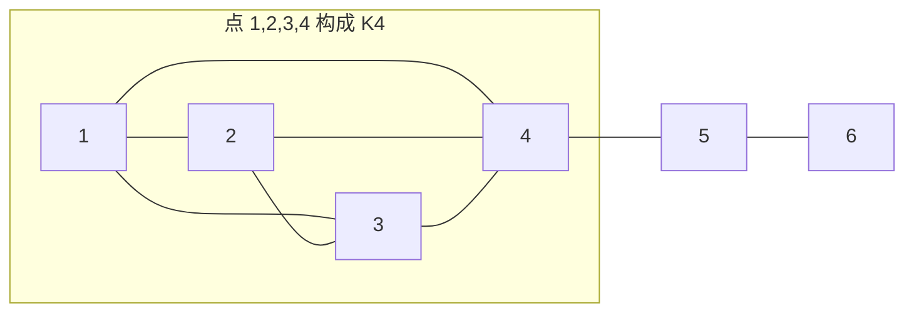

[[TOC]]

## 形式化题目

给定一张 $n$ 个点、$m$ 条边的无向图，点从 $1$ 开始编号，保证所有点的度数都不超过 $3$，
无重边无自环。把每条边的容量都看成 $1$，设 $f(i,j)$ 是 $i$ 到 $j$ 的最大流，求

$$\sum_{1 \leqslant i < j \leqslant n} f(i,j).$$

数据范围：$2 \leqslant n \leqslant 3000$，$0 \leqslant m \leqslant \left\lfloor \dfrac{3n}{2} \right\rfloor$。
输出一行一个整数。

样例 1：$n = 4$、两条边 $(1,2),(3,4)$，答案是 $2$（只有这两对点连通，各贡献 $1$）。
样例 2：$n = 6$、$m = 8$，答案是 $36$。

## 正解

### 思路

**朴素做法的规模。** 直接对每一对点跑一次最大流：点对数是 $O(n^2) \approx 4.5 \times 10^6$，
每次跑 Dinic 是 $O(m\sqrt{m})$ 量级，总代价约 $10^{11}$，无论怎么优化都不可能过。
但正因为点数 $n$ 到 $3000$ 而**度数只有 $3$**，答案的取值范围极端狭窄——这是全部突破口。

**关键观察一：流量只可能是 $0,1,2,3$。** 由最大流最小割定理，任何 $i \to j$ 的流量都不超过
"只割 $i$ 的关联边"这一个割的大小，即不超过 $\deg(i)$；同理也不超过 $\deg(j)$。于是

$$f(i,j) \leqslant \min\{\deg(i), \deg(j)\} \leqslant 3 .$$

所以 $f(i,j) \in \{0,1,2,3\}$，而

$$\sum_{i<j} f(i,j) = \sum_{k=1}^{3} \#\{(i<j) : f(i,j) \geqslant k\} = \mathrm{cnt}_1 + \mathrm{cnt}_2 + \mathrm{cnt}_3 .$$

问题从"求每对点的流量"变成了"对 $k = 1,2,3$ 各数一次点对"，每层都退化成图的结构判定。

**关键观察二：三层判定分别对应三种连通性。**

- $f(i,j) \geqslant 1$：等价于 $i,j$ 在原图中**连通**。$\Leftarrow$ 沿任一条路径推 $1$ 单位流；
  $\Rightarrow$ 不连通则割集为空、流量 $0$。→ 用并查集数连通分量内的点对数。
- $f(i,j) \geqslant 2$：等价于 $i,j$ 属于同一**边双连通分量**（$2$-边连通）。
  两条边不相交路径正是 $2$-边连通的定义（Menger 定理）；反过来若存在桥把两点分开，
  割集只有那一条边，流量至多 $1$。→ 求出所有桥，忽略桥做 flood-fill，数同一块内的点对数。
- $f(i,j) \geqslant 3$：等价于**删掉任意一条边后** $i,j$ 仍在该图的同一边双连通分量里。
  一方面 $3$ 条边不相交路径删掉一条还剩 $2$ 条；另一方面只要某条边 $e$ 一删就把 $i,j$ 分开，
  则 $e$ 与另一条分开 $i,j$ 的割边构成大小 $2$ 的割，流量至多 $2$。这就是本层的判据。

前两层各扫一遍图即可，第三层看起来需要"对每条边删一次再求边双"，也就是 $O(m)$ 次
$O(n+m)$ 的 Tarjan，总代价 $O(m(n+m)) = 4500 \times 7500 \approx 3.4 \times 10^7$，
在 3 s 的限时下完全够用。剩下的只是"如何数点对数"和"如何比较两轮划分"这两个工程问题。

**第三层怎么落地：等价类精化。** 设 $\mathrm{bel}_e(v)$ 是删掉边 $e$ 后 $v$ 所属的边双分量号。
条件"对每条边 $e$ 都有 $\mathrm{bel}_e(i) = \mathrm{bel}_e(j)$"不能直接对 $m$ 个整数数组逐对比较，
但可以把它写成一串**逐步细化**的划分：

$$\mathrm{cls}_0(v) \equiv 0, \qquad \mathrm{cls}_{k}(v) = \text{把 } \big(\mathrm{cls}_{k-1}(v),\, \mathrm{bel}_{e_k}(v)\big) \text{ 重新编号},$$

其中把二元组按字典序排序后重编号，编号相同当且仅当二元组相同。
这样的"精化"只有分裂没有合并，$m$ 轮之后 $\mathrm{cls}_m(i) = \mathrm{cls}_m(j)$
恰好等价于"每一轮都在同一分量里"，也就是 $f(i,j) \geqslant 3$，最后数一次同一类内的点对数即可。

几个可以省掉的工作量：

- **桥不必检验。** 删掉一条桥只会让划分变细（桥本来就不在任何非平凡边双块内），
  不会把原本同块的边双划分拆开，所以只对满足 $\mathrm{bel}_{-1}(u) = \mathrm{bel}_{-1}(v)$
  的非桥边跑循环。
- **类数达到 $n$ 就收工。** 全是单点时再细分也只能保持单点，此时每个类只有 $1$ 个点、
  点对数为 $0$，可以直接 `break`。
- **重编号用确定性手段，不用哈希。** Python 版把二元组压成 `cls[v]*(n+1)+bel[v]`
  当作 `dict` 的键（键互不相同，不存在冲突）；C++ 版更进一步，用两趟**计数排序**
  （先按 `bel` 稳定排序、再按 `cls` 稳定排序）把每轮压到 $O(n)$，连排序的
  $\log$ 因子和哈希表开销都省了。两边的划分结果完全一致。

**一个容易踩的边界：** $m = 0$ 时没有任何"删一条边"的检验，$\mathrm{cnt}_3 = 0$，
答案就是 $\mathrm{cnt}_1 + \mathrm{cnt}_2$（样例 1 正是这种情况：$n = 4, m = 2$ 时
$\mathrm{cnt}_1 = 2$、$\mathrm{cnt}_2 = 0$、$\mathrm{cnt}_3 = 0$，答案 $2$）。
另外 Tarjan 要求图可能不连通，必须对每个未访问的点各起一次 DFS。

### 代码

Python 版：

@include-code(./main.py, python)

C++ 版（同一算法，用计数排序做精化）：

@include-code(./main.cpp, cpp)

### 复杂度

- **时间**：本层的划分各自都是 $O(n+m)$ 的 Tarjan/flood-fill；$\mathrm{cnt}_1$ 那一层
  在 C++ 里用并查集 $O((n+m)\alpha)$、在 Python 里就是一次 flood-fill $O(n+m)$；
  $\mathrm{cnt}_3$ 最多做 $m$ 轮，总计 $O(m(n+m))$。最坏数据 $n = 3000, m = 4500$ 时约
  $3.4 \times 10^7$ 次基本操作，C++ 实测 0.20 s，远低于 3 s 限时。
- **空间**：邻接表 $O(n+m)$，Tarjan 的 `dfn/low/cur`、`bel`、`cls` 等各 $O(n)$，
  总计 $O(n+m)$，$n = 3000$ 时不到 1 MB，与 256 MB 的限值差得很远。
- **与 C++ 解法的关系**：`main.cpp` 与 `main.py` 是同一算法（三层判据、精化轮数都相同），
  只是把 Python 的 `dict` 去重换成了 C++ 的两趟计数排序、把 Python 的 flood-fill
  连通分量换成了 C++ 的并查集。
- **Python 的 TLE 风险**：算法同阶，但 CPython 的解释器常数大，$m$ 轮 Tarjan 的实测耗时
  在顶格数据（$n = 3000, m = 4500$）上约 8 s，会超过 3 s 的限时；中等规模
  （$n \leqslant 1000$）在一秒内。按 `python-oj-short` 的约定，这里允许 Python TLE，
  但**算法不允许降级**——所以 Python 版仍是 $O(m(n+m))$ 的 Tarjan 精化，
  而不是退化成枚举点对求最大流。

## 总结

- **先用割的大小卡住值域。** "度数不超过 $3$"这句约束的全部价值在于把答案从 $O(n^2)$ 个
  小整数压成 $\{0,1,2,3\}$ 四档；一旦想到"答案 $= \mathrm{cnt}_1 + \mathrm{cnt}_2 + \mathrm{cnt}_3$"，
  逐对求最大流的 $10^{11}$ 就瓦解了。
- **三层判据都是连通性的变体。** 连通（并查集）→ $2$-边连通（边双分量）→
  "删任意一条边后仍 $2$-边连通"（$m$ 次边双划分的交）。Menger 定理把"边不相交路径数"
  和"最小割大小"在每一层上对应起来，所以三个 $\geqslant k$ 的判定全都只依赖图的划分结构。
- **数点对就是数等价类。** 三层的答案都是同一句话："在某等价关系下同编号的点对数"，
  于是三处代码可以共用同一个计数函数，这也是本题代码能压得很短的原因。
- **迭代式 Tarjan。** Python 默认递归深度只有约 $1000$，$n = 3000$ 的链就会爆栈；
  用显式栈写 Tarjan 是本题 Python 版能跑通的必要条件，同时也顺手绕开了 C++ 的爆栈风险。

## 关于本题数据的说明

本题的测试数据由素材源目录里的 `data.py`（基于 cyaron 的分层生成器）自造，
而非官方原题数据，题面也属网络重建；生成器对每组数据都给出了独立的闭式期望答案，
与前文三层判据的推导一致（例如点 10 是 $n = m$ 双顶格的棱柱 $C_{1500} \times K_2$，
$3$-边连通故答案恰为理论上界 $3\binom{3000}{2} = 13\,495\,500$）。
因此 `main.cpp` 与 `main.py` 在本目录数据上的通过，只说明实现与题面的推导自洽，
不等价于官方数据 AC。

## 图示解析

三层判据在一张「稠密块 + 桥」的图上表现最清楚：块内点对流量高，跨桥点对流量掉到 $1$。

$1,2,3,4$ 四点两两相连，构成 $3$-正则且 $3$-边连通的 $K_4$，块内任意两点的流量都是 $3$
（$\geqslant 3$ 来自 $3$-边连通：删掉任意两条边仍连通；$\leqslant 3$ 来自度数只有 $3$）。
边 $4$-$5$ 与 $5$-$6$ 都是桥，所以点 $5$、$6$ 与其余四点的流量都只有 $1$。
对照三层判据：$\mathrm{cnt}_1$ 把 $5$、$6$ 也算进来（连通就有流量 $1$），
$\mathrm{cnt}_2$ 把它们排除（它们各自单独成块），$\mathrm{cnt}_3$ 则把「$K_4$ 内部」
与「只靠两条边相连」区分开——层与层之间的差就构成答案。
以这张图为例（$n=6$）：$\mathrm{cnt}_1 = \binom{6}{2} = 15$，
$\mathrm{cnt}_2 = \binom{4}{2} = 6$，$\mathrm{cnt}_3 = 6$，答案 $15 + 6 + 6 = 27$。

