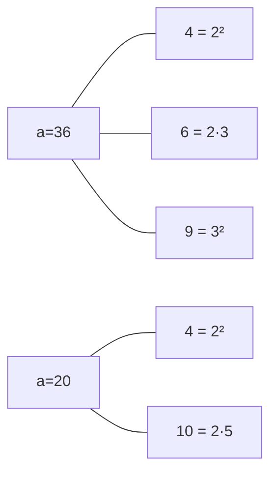

[[TOC]]

## 形式化题目

给定 $n$ 个点与点权 $a_1, \dots, a_n$（$a_i \geqslant 2$），无向图 $G$ 的边集为

$$E = \bigl\{\, \{u, v\} \;\bigm|\; u \neq v,\ \gcd(a_u, a_v) \text{ 是合数} \,\bigr\}.$$

要求恰好删除一个点 $x$，使 $G - x$ 中最大连通块的大小最小，输出这个最小值：

$$\text{ans} = \min_{1 \leqslant x \leqslant n} \ \max_{C \text{ 是 } G - x \text{ 的连通块}} |C|.$$

多组数据，$T \leqslant 10$，$n \leqslant 10^5$，$a_i \leqslant 10^7$。

以题面第一组样例 $a = (8, 4, 12, 18, 9)$ 为例，枚举删哪个点时 $G - x$ 的连通块如下
（删掉 $x$ 后 $x$ 本身消失，所以剩余块的大小之和是 $n - 1 = 4$）：

| 删除 $x$ | $1$ | $2$ | $3$ | $4$ | $5$ |
| :-: | :-: | :-: | :-: | :-: | :-: |
| $a_x$ | $8$ | $4$ | $12$ | $18$ | $9$ |
| 各连通块大小 | $4$ | $4$ | $2,\,2$ | $3,\,1$ | $4$ |
| 最大块 $|M(x)|$ | $4$ | $4$ | $\mathbf{2}$ | $3$ | $4$ |

删掉 $a_3 = 12$ 时，剩下的 $\{8, 4, 18, 9\}$ 被拆成 $\{8, 4\}$ 与 $\{18, 9\}$ 两块，
最大块降到 $2$（删其他点时都还有一块大小 $3$ 或 $4$ ），所以第一组答案是 $2$。
三组样例的答案分别是 $2 / 3 / 6$。

## 正解

### 思路

**第一步：把数论条件换成图论条件。** 直接判边需要 $O(n^2)$ 次 $\gcd$，而 $\gcd$ 是合数
这件事可以拆开看。设 $d = \gcd(a_u, a_v)$，"$d$ 是合数"等价于"$d$ 的质因数分解里
带的质因子个数（按重数计）$\Omega(d) \geqslant 2$"。$\Omega(d) \geqslant 2$ 又等价于

- 存在两个不同的质数 $p < q$ 同时整除 $d$，即 $pq \mid d$；
- 或者存在质数 $p$ 满足 $p^2 \mid d$。

把这两类数统称为**见证数**：

$$W(a) = \{\, pq \mid p < q \text{ 为质数},\ pq \mid a \,\} \cup \{\, p^2 \mid p \text{ 为质数},\ p^2 \mid a \,\}.$$

于是

$$\gcd(a_u, a_v) \text{ 是合数} \iff W(a_u) \cap W(a_v) \neq \varnothing,$$

原图的一条边变成了"两个点共享一个见证数"。

**第二步：把共享关系摊成二部图。** 建一个二部图 $H$：左侧是 $n$ 个原点（原图的点），
右侧是所有出现过的见证数（每个见证数一个点），原点 $u$ 与见证数 $w$ 连边当且仅当 $w \mid a_u$。

这个转换的关键性质是：**$H$ 中两个原点的连通性与 $G$ 中一样。**
沿着 $H$ 中一条只含原点的路径 $u_1 \to w_1 \to u_2 \to w_2 \to \cdots \to u_k$，
相邻两个原点 $u_i, u_{i+1}$ 之间夹着的 $w_i$ 同时属于 $W(u_i)$ 与 $W(u_{i+1})$，
所以 $\gcd(a_{u_i}, a_{u_{i+1}})$ 是合数，$G$ 中确实有边，路径可翻译回 $G$；
反过来 $G$ 的每条边 $(u,v)$ 取一个共享见证数，就得到 $H$ 中长度 2 的通路。
两边方向都成立，所以连通性一致。

**第三步：把"删点"也搬过去。** 删掉的是原点。注意见证数点永远不会被删掉，
于是 $G - x$ 中的连通块，与 $H - x$ 的各个连通块（只数原点）一一对应：
$G-x$ 里两个点连通 $\iff$ $H-x$ 里它们连通。问题变成：

> 在 $H$ 中删去原点 $x$，使剩余部分（只数原点）的最大连通块最小。

**第四步：一次 Tarjan 解决所有 $x$。** 在 $H$ 上跑一遍 DFS 求出
$\mathrm{dfn}$、$\mathrm{low}$、以及每个节点子树中的**原点**个数 $sz$（见证数点不计入 $sz$），
再求出每个连通块的原点总数。对原点 $x$ 分三种情况：

1. 根的儿子 $c$ 满足 $\mathrm{low}[c] \geqslant \mathrm{dfn}[x]$：$x$ 是割点，删除 $x$ 后
   这棵子树与原连通块剩余部分分开，得到一块大小 $sz[c]$；
2. 原连通块去掉 $x$ 与所有被切出的子树后，剩下的部分大小为
   $\mathrm{tot}(\text{component}) - 1 - \sum_{\text{被切出}} sz[c]$；
3. 其他连通块不受影响，大小不变。

所以

$$M(x) = \max\Bigl(\ \max_{\text{被切出}} sz[c],\ \ \mathrm{tot}[\mathrm{comp}(x)] - 1 - \textstyle\sum_{\text{被切出}} sz[c],\ \ \text{其他连通块的最大原点数}\ \Bigr),$$

答案就是 $\min_x M(x)$，其中 $M(x)$ 就是这里的最大块。
"其他连通块的最大值"用各连通块原点总数的最大 / 次大值 $O(1)$ 得到，
注意最大值并列时次大值要取最大本身（下面代码里的 `ties` 计数就是干这个的）。

**复杂度来源。** 一个 $a \leqslant 10^7$ 的数最多有 8 个不同的质因子（$2\cdot3\cdot5\cdot7\cdot11\cdot13\cdot17\cdot19 = 9\,699\,690$），
所以 $|W(a)| \leqslant \binom{8}{2} + 8 = 36$。$H$ 的点数是 $O(n)$、边数是 $O(36n)$，
分解用最小质因子筛做到单个数 $O(\log a)$。总时间

$$O\bigl(\text{maxA} \log\log \text{maxA} + \sum_t (n_t \log \maxA + 36 n_t)\bigr),$$

空间 $O(\text{maxA} + 36n)$。

### 代码

Python 版（同一算法；为了让 CPython 能跑动顶格数据，额外做了两处**不改算法**的图压缩：
点权相同且为合数的一批点合成一个权值等于点数的节点，以及剪掉度数只有 1 的见证数节点）：

@include-code(./main.py, python)

C++ 版（同一算法）：

@include-code(./main.cpp, cpp)

### 复杂度

- **时间**：线性筛 $O(\maxA)$（$\maxA = \max a_i$）；每组数据分解 $O(n \log \maxA)$，
  建图与 Tarjan $O\bigl((n + |W|) \cdot 36\bigr) = O(36n)$。$T \leqslant 10$、$n \leqslant 10^5$、
  $a_i \leqslant 10^7$ 时总规模约 $10^6$ 个原点、$3.6 \times 10^6$ 条二部边；
  邻接表用 CSR（`ofs[]` + `adj[]`）而不是指针式链式前向星，实测最坏的一组
  （$T = 10$、$n = 10^5$、全部点权都是 8 个不同质因子的小乘积，见证数打满上限 36）
   C++ 跑 0.18 s，仓库给定的 10 个点里最慢的点 9 是 0.14 s（限时 2000 ms）。
- **空间**：最小质因子表 $4 \times 10^7$ 字节（`int` 数组，$10^7 + 1$ 项，约 38 MB）
  加上 CSR 邻接表 $O(36n)$；$\max a_i = 10^7$ 的满规模数据实测峰值 112 MB，
  在 512 MB 限制内。
- **Python 侧**：核心是 `array` + 显式栈的迭代 Tarjan，与 C++ 同阶；因为常数大，
  顶格点（$T \times n = 10^6$）有 TLE 风险，属于仓库规范允许的范围，算法没有降级。
  作为代价，Python 版本额外做了两处**不改算法**的图压缩：点权相同且为合数的一批点
  合成一个权值等于点数的节点（它们是一个团，删其中一个不切分连通块），以及剪掉
  度数只有 1 的见证数节点（它们不影响连通性）。实测仓库 10 个真实点中最慢的点 8 为 3.3 s。

## 总结

- **$\gcd$ 为合数可以"降维"成共享见证数**：$d$ 是合数 $\iff$ $d$ 含 $pq$ 或 $p^2$，
  于是"两数互质以外还有更细的差别"变成"两个集合有交"，边就在集合之间铺开了。
- **交集关系天然适合二部图**：原点—见证数二部图把 $O(n^2)$ 条潜在线性化到 $O(36n)$ 条，
  并且**完全保住了连通性**（路径来回翻译都成立）。
- **删点问题不要真的删点**：见证数点不会被删，所以只要在原图上做一次 Tarjan，
  用 $\mathrm{low}[c] \geqslant \mathrm{dfn}[x]$ 判割点、用子树原点数 $sz[c]$ 算块大小，
  就能 $O(1)$ 地得到每个 $x$ 的答案。
- **"其他连通块"要靠最大 / 次大判重**：最大值并列时次大值仍然等于最大值，写代码时
  必须带一个"最大者出现次数"才不出错。
- 本题素材源带数据生成脚本 `data.py`，说明 `data/` 是自造的，题面也属于网络重建（与官方页的
  时限 / 样例一致），出题意图与原题可能有偏差；素材源的 `std.cpp` 已编译并于 10 个点上
  与 `main.cpp` 逐一比对，结果完全一致，本题解可以放心按它核对。

## 图示解析

下图画的是二部图转换。左侧方框是原点（点权标在旁边），右侧圆角框是见证数，
一个原点连到它所有权见数；两个原点共享见证数就等价于原图中有边。

对照样例第二组：$36$ 与 $20$ 的 $\gcd$ 是 $4 = 2^2$，是合数，两者通过见证数 $4$ 连通；
$36$ 与 $45$ 的 $\gcd$ 是 $9 = 3^2$，也是合数，它们通过见证数 $9$ 连通；
而 $36$ 与 $231 = 3 \cdot 7 \cdot 11$ 的 $\gcd$ 是 $3$（质数），
$231$ 的见证数是 $\{21,33,77\}$、$36$ 的见证数是 $\{4,6,9\}$，交集为空，
在原图里就不相邻。把三组样例逐点铺开后可以看到，
题目给的三个答案 $2 / 3 / 6$ 都对应"删掉某个点后最大块被切小"的位置，
这正是 $\mathrm{low}$ 条件筛出来的那些点；读代码时把「被切出去的最大子树」与
「剩下的主体」两项对应上，是理解这段 Tarjan 的关键。
