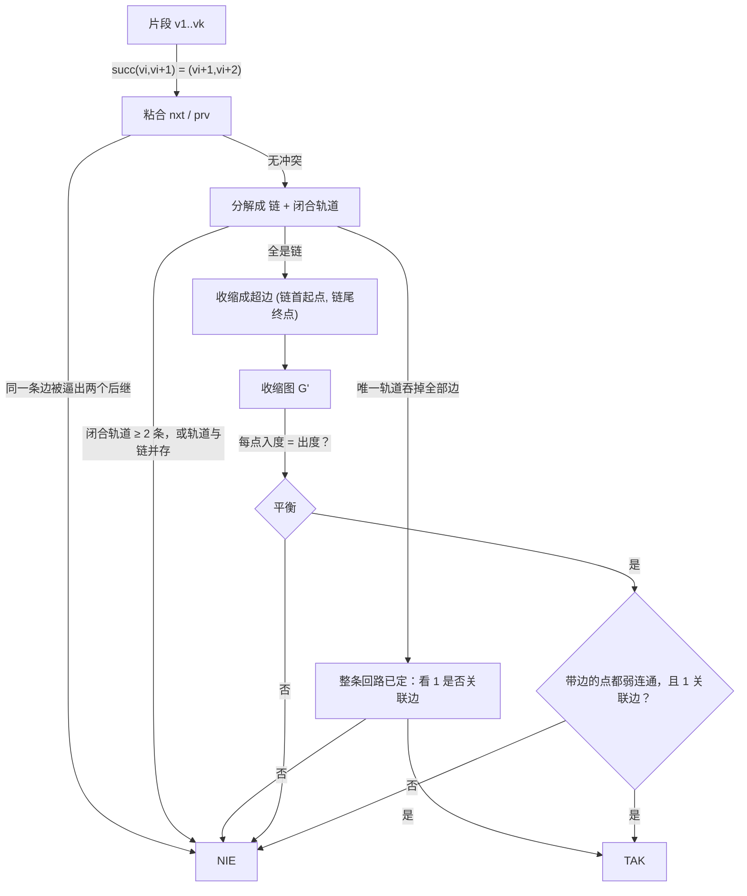

[[TOC]]

## 形式化题目

给定有向图 $G=(V,E)$，$V=\{1,\dots,N\}$，每对 $(a,b)$ 至多出现一次。再给定 $t$ 个顶点序列
（片段）$v_1 v_2 \cdots v_k$，它要求边 $(v_1,v_2),(v_2,v_3),\dots,(v_{k-1},v_k)$ 在路线里
**紧接着依次出现**（走过 $v_i v_{i+1}$ 之后必须立刻走 $v_{i+1}v_{i+2}$，中间不许插别的边）。

求是否存在一条从路口 $1$ 出发、回到路口 $1$、恰好把每条边各走一次的闭合路线（即欧拉回路），
使每个片段都被完整连续地包含其中。

形式化地：路线是全体 $m$ 条边的一个排列 $e_1,\dots,e_m$，令 $e_i=(s_i,t_i)$，要求

$$
t_i = s_{i+1}\;(1 \leqslant i < m), \qquad t_m = s_1 = 1 ;
$$

并定义环状后继 $\mathrm{succ}(e_i) = e_{i+1}$（下标模 $m$），要求对每个片段 $v_1\cdots v_k$ 都有

$$
\mathrm{succ}\big((v_j, v_{j+1})\big) = (v_{j+1}, v_{j+2})
\qquad (1 \leqslant j < k-1).
$$

注意 $\mathrm{succ}$ 是**环状**的，片段允许跨过路线的收尾相接处。

## 正解

### 思路

**片段其实是在点名规定后继。** 一条闭合路线 $e_1 \cdots e_m$ 定义了唯一的环状后继
$\mathrm{succ}(e_i)=e_{i+1}$（下标模 $m$）；由于每条边恰好被走一次，$\mathrm{succ}$ 是全体 $m$ 条边上的
**一个置换**，又是单环——也就是"把全部边串成一个圈"的那种置换。片段 $v_1\cdots v_k$ 要求的
正是 $\mathrm{succ}((v_j,v_{j+1}))=(v_{j+1},v_{j+2})$，即它**硬性指定了某些边的后继是谁**。
两条片段若对同一条边指定了不同的后继、或对同一条边指定了不同的前驱，就自相矛盾。

**怎么记录这个指定。** 对每条边 $e$ 记 `nxt[e]`、`prv[e]`：片段要求 $e$ 后面紧跟 $f$ 时令
`nxt[e] = f`、`prv[f] = e`。因为 `nxt`、`prv` 各自至多有一个值，任何人来改写都要先比对，
不一致立刻判 `NIE`。同一片段内若同一条边出现两次，也直接 `NIE`（边只能走一次）。

**被指定的边必然分解成「链」和「环」。** `nxt` 是部分函数，沿 `nxt` 走只有两种归宿：
走到一条没有后继的边（**链**），或者绕回自己（**环**，即闭合轨道）。这两种形状的可行性完全不同：

- **链**：整条链在路线里必须连着走，它对外只暴露链首的起点与链尾的终点，
  所以收缩成一条「超边」$\big(s(\text{链首}),\,t(\text{链尾})\big)$。
  链中间被穿过的点进一次、出一次，度数天然平衡，收缩后**不需要**再为它们记账。
- **环**：它已经在自己那批边上闭合成圈。而 $\mathrm{succ}$ 必须是**覆盖全部 $m$ 条边**的单环，
  所以闭合轨道能成立的前提是它自己就吞掉全部边——这时整条路线被唯一确定，
  只要路口 $1$ 在这条回路上（即有边与 $1$ 关联）就输出 `TAK`。
  一旦出现**两条**闭合轨道，或者闭合轨道之外还残留着链，轨道就会在自己的边集里绕圈、
  永远接不上其余街道，直接 `NIE`。

**收缩图上判欧拉回路。** 全是链时，收缩得到多重图 $G'$。原问题等价于：
$G'$ 上是否存在一条恰好经过每条超边一次的闭合路线，且该路线经过路口 $1$。判据是两条：

1. **平衡条件**：每个点出度 = 入度（每条超边给起点一次出、给终点一次入）；
2. **连通条件**：所有**带边的点**落在同一个弱连通块里（忽略方向）。

满足这两条时，任意一个带边的点都可以当作路线起点（回路可以整体旋转），
所以"从 $1$ 出发"只额外要求路口 $1$ **关联着街道**——它必须真的在路线上。

下面用题面样例走一遍。片段是 `1 5 6`、`3 4 3`、`4 3 6 4`、`5 6 2`。

| 片段 | 逼出的后继指定 |
| :-: | :-- |
| $1\,5\,6$ | $\mathrm{succ}(1\to5)=5\to6$ |
| $3\,4\,3$ | $\mathrm{succ}(3\to4)=4\to3$ |
| $4\,3\,6\,4$ | $\mathrm{succ}(4\to3)=3\to6$，$\mathrm{succ}(3\to6)=6\to4$ |
| $5\,6\,2$ | $\mathrm{succ}(5\to6)=6\to2$ |

没有冲突，也没有闭合轨道。粘合结果是三条链（$1\to5\to5\to6\to6\to2$、$4\to3\to3\to6\to6\to4$）
加四条单边，共 $5$ 条超边：

| 超边 | 起点 | 终点 |
| :-: | :-: | :-: |
| $1\to5 \to 5\to6 \to 6\to2$ | 1 | 2 |
| $1\to3$ | 1 | 3 |
| $4\to1$ | 4 | 1 |
| $3\to4$ | 3 | 4 |
| $2\to1$ | 2 | 1 |

逐点检查：$1$ 出 $2$ 入 $2$，$2$ 出 $1$ 入 $1$，$3$ 出 $1$ 入 $1$，$4$ 出 $1$ 入 $1$，
全部平衡；五个端点 $1,2,3,4$ 彼此可达，路口 $1$ 有边关联。输出 `TAK`。

再看冲突长什么样：若同时给出 `1 2 3` 和 `1 2 4`，边 $1\to2$ 被要求后继是 $2\to3$ 又是 $2\to4$，
`nxt[1->2]` 被两次赋了不同值，立刻 `NIE`——这正是数据点 `problem3` 的构造。

### 代码

Python 版：

@include-code(./main.py, python)

C++ 版（同一算法）：

@include-code(./main.cpp, cpp)

### 复杂度

- **时间**：读入 $O\big(N + M + \sum k\big)$；把「顶点对 $(a,b)$」定位到边编号，C++ 版把 $M$ 条边
  按编码 $a\cdot(N+1)+b$ 排序后二分，片段每走一步一次二分，共
  $O\big(M\log M + (\sum k)\log M\big)$；Python 版用 `dict` 把编码直接映射到边号，
  这一步是 $O\big(M + \sum k\big)$。粘合、链/环收缩、度数统计、连通搜索都是 $O(N+M)$。
  合计 $O\big(M\log M + (\sum k)\log M\big)$；在 $M \leqslant 2\times 10^5$、
  $\sum k \leqslant 10^6$ 下余量充足。
- **空间**：`nxt`、`prv`、`stamp`、`unitOfEdge` 各 $O(M)$，度数数组与邻接表 $O(N+M)$，
  总计 $O(N+M)$。
- **实测**：C++ 在最大的 `problem10`（$N=5\times10^4$、$M=162370$、$t=10^4$、$\sum k \approx 7.6\times10^5$）
  上 0.17 s / 峰值约 8 MB；Python 同点 0.44 s。两者都远离 1 s / 256 MB 的限制。
- **与 C++ 解法的关系**：`main.cpp` 与 `main.py` 是同一算法的两种落地，
  差别只在"顶点对 $\to$ 边编号"这一步用二分还是用哈希，整体复杂度同阶。

## 总结

- **把"依次经过"读成"指定后继"**：题面说的是片段要连着走，落到实现上就是对环状后继
  $\mathrm{succ}$ 的硬性赋值；不理解这一点就会误把它当成"这些边都出现过"的弱约束。
- **粘合关系是部分函数**：每条边至多一个后继、一个前驱，所以粘合结果必然是链 + 闭合轨道，
  冲突检测退化成一次比对。
- **收缩只保留端点**：链中间被穿过的点进一次出一次，天然平衡、不用记账；
  这是把长度 $O(\sum k)$ 的片段压进普通欧拉回路判定的关键。
- **闭合轨道的可行性完全不同**：$\mathrm{succ}$ 必须是覆盖全部边的单环，所以闭合轨道
  要么吞掉全部边、要么就是无解（两条轨道、或轨道与链并存都不行）。
  忽略这一支，只做度数平衡就会放过假解，这是本题与裸欧拉回路判定的实质差别。
- **欧拉回路两条老规矩**：出入度相等 + 忽略方向连通（只查带边的点）。
  加上"起点是 $1$"，就要求路口 $1$ 确实关联着街道。

## 图示解析

下图画出「片段 → 粘合 → 链/环分流 → 收缩超边 → 欧拉回路判定」这条主线。



观察重点有三处：一是左侧两条直奔 `NIE` 的支路，说明本题判定不止"数度数"一步；
二是中间「收缩成超边」只用到链首起点与链尾终点，因为链内部被穿过的点在度数上自平衡；
三是右侧最后一道判定缺一不可——平衡保证能回到起点，弱连通保证所有边都能被走到，
而"1 关联边"保证起点真的能选在路口 1。

> **关于素材与数据。** 本仓库 `new_ROJ/problems/1737/` 下带有数据生成脚本 `data.py`，
> 10 个测试点由它自造：TAK 点都是"从 1 出发回到 1、线性包含全部片段"的显式构造，
> NIE 点分别是片段弧缺失、粘合冲突、度数失衡、弱连通断开。因此数据全部落在「链」这一支，
> 没有构造出与闭合轨道相关的判定点。同目录 `std.cpp` 与本文解法在思想上同源，
> 但它**把残余的闭合轨道一律当作自环超边处理**，没有检查轨道是否吞掉了全部街道。
> 能把这个差别区分开的最小反例是：
>
> ```
> 4 4
> 4 3
> 4 2
> 2 4
> 3 4
> 1
> 4 2 4 3 4
> ```
>
> 片段把 $2\to4,\;4\to3,\;3\to4$ 锁成一条闭合轨道，而轨道之外还剩着边 $4\to2$
> ——轨道在自己的边集里绕圈，永远接不上剩下那条边。`std.cpp` 判 `TAK`，本文解法判 `NIE`，
> 穷举小规模欧拉回路的暴力程序确认 `NIE`。本文解法按题面"从第一个路口出发并回到第一个路口"
> 独立推导，下文的结论均已用该暴力程序对拍验证。
