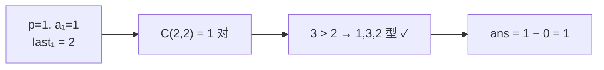

[[TOC]]

## 形式化题目

给定一个长度为 $N$ 的序列 $a_1, \dots, a_N$，其中所有 $a_i$ **互不相同**（题面【提示】进一步保证它是 $1, \dots, N$ 的一个排列）。求三元组 $(i, j, k)$ 的个数，满足

$$i < j < k, \qquad a_i < a_k < a_j .$$

也就是：按位置 $i<j<k$ 取三个数，它们的**大小顺序是 $1, 3, 2$**（最小的在最前，最大的在中间，次小的在最后）。输入只有 $N$ 和这 $N$ 个数，输出一个整数。$N \leqslant 200000$，答案上界为 $\binom{N}{3} \approx 1.33 \times 10^{15}$，必须用 64 位整数。

## 正解

### 思路

最直接的做法是枚举 $i<j<k$ 三个下标，$O(N^3)$；即使用"固定 $i, j$ 再统计右侧落在区间 $(a_i, a_j)$ 内的个数"这类改进，也至少 $O(N^2)$。$N = 2 \times 10^5$ 时都不可行。注意到题目只问**个数**，不要求给出具体三元组，于是可以试着把计数摊到每个位置上去。

先看一个"错位"的现象：如果固定 $p$ 当三元组里**最小的那个元素**，那么它右侧比它大的元素有 `last` 个，任取两个就能凑出一个 $a_p < a_q, a_p < a_r$ 的对。这样的对共有 $\binom{\text{last}}{2}$ 个，而其中每一个的大小关系只有两种：

- $a_q < a_r$：大小顺序是 $1,2,3$（递增三元组），**不符合**；
- $a_q > a_r$：大小顺序是 $1,3,2$，**正是**我们要数的。

所以只要能从 $\binom{\text{last}}{2}$ 里减掉 $1,2,3$ 型的个数即可。而 $1,2,3$ 型的个数很好数：对每个**中间元素** $q$，左侧比它小的个数 $pre_q$ 决定起点 $i$ 的选择数、右侧比它大的个数 $last_q$ 决定终点 $k$ 的选择数，两者相乘。于是

$$\text{ans} = \sum_{p=1}^{N} \binom{last_p}{2} - \sum_{q=1}^{N} pre_q \cdot last_q .$$

两个求和都只是标量累加，可以合并进同一遍循环，**每个位置算一次**。这就是经典的 132 计数恒等式。

现在只剩"怎么求 $pre_p$ 和 $last_p$"。$pre_p$ 是"左侧比 $a_p$ 小的个数"，一个树状数组（下标放名次、记录已扫过的位置里每个名次出现几次）正序扫描一遍就能得到。

关键在于 $last_p$ 不需要第二遍扫描。因为**所有 $a_i$ 互不相同**，比 $a_p$ 小的数在全序列里恰好有 $\text{rank}(a_p) - 1$ 个，其中 $pre_p$ 个落在左边，剩下的必然全在右边；右侧一共只有 $N - p$ 个元素，扣掉"右侧比它小的"，剩下的就是"右侧比它大的"：

$$last_p = (N - p) - \bigl(\text{rank}(a_p) - 1 - pre_p\bigr).$$

这一步把两次树状数组扫描压成了一次。代入恒等式，每个位置 $p$ 的贡献是

$$\binom{last_p}{2} - pre_p \cdot last_p,$$

累加起来就是答案。若输入是 $1..N$ 的排列，名次就是数值本身，连离散化都可以省掉；下面的代码仍做了离散化（或直接用值作下标），这样下标恒落在 $1..N$ 内，与题面【提示】之外的数据也不冲突。

用题面样例 $a = (1,3,2)$ 走一遍：$p=1$ 时 $pre_1 = 0$，$last_1 = (3-1) - (1-1-0) = 2$，贡献 $\binom{2}{2} - 0 = 1$；$p=2$ 时 $pre_2 = 1$，$last_2 = (3-2) - (3-1-1) = 0$，贡献 $0$；$p=3$ 同理为 $0$。总计 $1$，与样例一致。

### 代码

Python 版：

@include-code(./main.py, python)

C++ 版（同一算法）：

@include-code(./main.cpp, cpp)

### 复杂度

时间 $O(N \log N)$（一遍正序扫描，每个位置一次前缀查询 + 一次单点修改，外加 $O(N \log N)$ 的排序），空间 $O(N)$。$N = 2 \times 10^5$ 时 C++ 实测 0.04 s、峰值 8.3 MB；CPython 在顶格随机数据上实测约 0.22 s，均远低于 1 s / 256 MB 的限制。两个实现算法完全同阶，Python 版没有做任何降级。

## 总结

本题是"树状数组 + 组合恒等式"的入门应用。核心有三点：一是**把计数摊到每个元素上**，用"以 $p$ 为最小元素"的方式把三元组分成 $1,2,3$ 型与 $1,3,2$ 型两类，再用 $\binom{last_p}{2}$ 减去 $1,2,3$ 型的个数；二是**利用元素互不相同**，从"左侧更小个数"和全局名次反推出"右侧更大个数"，把两次树状数组扫描压成一次；三是**数据类型**，答案上界 $1.33 \times 10^{15}$ 必须开 `long long`（Python 整数天然无上限）。

注意本题素材源中的 `data/` 由随题的 `data.py` 用固定种子自行生成（并非官方数据），题面也是按网络题面重建的，因此出题意图与官方原题可能存在偏差；上面的解法按题面定义严格推导，已用暴力枚举对拍验证：$N \leqslant 7$ 的全部 $5913$ 个排列加 $200$ 组 $N \leqslant 60$ 的随机排列，共 $6113$ 组，`main.cpp` 与 `main.py` 均与暴力结果完全一致。
