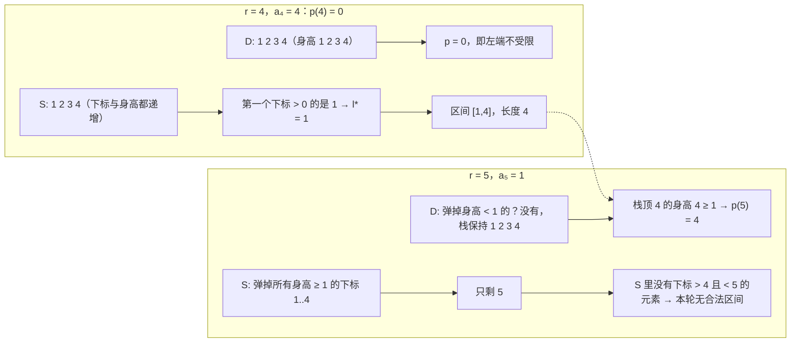

[[TOC]]

## 形式化题目

给定长度为 $n$ 的身高序列 $a_1, a_2, \dots, a_n$（$2 \leqslant n \leqslant 10^5$，$1 \leqslant a_i \leqslant 2^{32}-1$），
求最长的区间 $[l, r]$（$l < r$），满足

$$
a_l < a_k \quad (l < k \leqslant r), \qquad a_r > a_k \quad (l \leqslant k < r).
$$

第一条说 $a_l$ 是区间内的**严格最小值**，第二条说 $a_r$ 是区间内的**严格最大值**。
两条合起来自动蕴含 $a_l < a_r$（取 $k = r$ 即得），也正是题面里
"$B$ 高于 $A$、中间的身高不能和 $A$ 或 $B$ 相同"三句话的合写：
中间的身高既不小于 $A$ 又不等于 $A$，只能严格大于 $A$；对 $B$ 同理。

若不存在这样的区间则输出 $0$。因为长度 $1$ 的区间只有一个端点、谈不上"最矮且最高"，
答案只能是 $0$ 或 $\geqslant 2$。

## 正解

### 思路

**朴素做法。** 枚举所有 $O(n^2)$ 个区间，每个区间扫一遍检查两条不等式，
总复杂度 $O(n^3)$；$n = 10^5$ 时不可行。瓶颈很清楚：区间是二维的，
而"最小/最大"这种约束天然可以从**固定一端**开始消掉一个维度。

**固定右端 $r$。** 此时第二条不等式 $a_r > a_k\;(l \leqslant k < r)$ 只和 $l$ 有关，
把它改写成"左边哪些下标不能当 $l$"：

$$
p(r) = \max\{\,k < r : a_k \geqslant a_r\,\} \quad(\text{不存在时记 } 0),
$$

那么 $a_r$ 是 $[l, r]$ 内严格最大值 **当且仅当** $l > p(r)$——
因为 $p(r)$ 右边（不含 $p(r)$ 本身）到 $r-1$ 的所有身高都 $< a_r$。

**再看第一条。** 定义 $q(l) = \min\{k > l : a_k \leqslant a_l\}$（不存在记 $+\infty$），
即 $a_l$ 右方第一个不高于它的位置。第一条不等式等价于 $r < q(l)$：
在 $l$ 右边直到 $r$ 的所有身高都 $> a_l$。

于是问题变成：**固定 $r$，求最小的 $l$ 使得 $l > p(r)$ 且 $q(l) > r$。**
（$l$ 越小，区间 $r - l + 1$ 越长。）

**关键观察：满足 $q(l) > r$ 的 $l$ 构成一个单调栈。** 维护一个身高严格递增的栈 $S$，
遇到 $a_r$ 就把栈里所有 $\geqslant a_r$ 的下标弹掉，再压入 $r$。按 $r$ 从小到大归纳可得

$$
S_r = \{\,l \leqslant r : q(l) > r\,\},
$$

且 $S_r$ 中的下标随栈深递增、身高也随栈深递增。两边的方向是反的：
弹栈条件是"身高 $\geqslant a_r$"，弹掉的正是不再满足 $q(l) > r$ 的下标；
而留下的下标都满足 $a_l < a_r$，即 $q(l) > r$。

**二分求最优左端。** $S_r$ 的下标递增，所以"$S_r$ 中第一个 $> p(r)$ 的下标"
用一次 `upper_bound` 就能取到，它就是 $r$ 对应的最优左端 $l^*$：

- 因为 $l^* > p(r)$，$a_r$ 是 $[l^*, r]$ 的严格最大值；
- 因为 $l^* \in S_r$，$a_{l^*}$ 是 $[l^*, r]$ 的严格最小值；
- 任何 $l < l^*$ 的候选要么 $\leqslant p(r)$（破坏第二条），要么 $\notin S_r$（破坏第一条）。

枚举所有 $r$ 取最大值即可。$p(r)$ 同样用一个身高非增的栈 $D$ 维护：
遇到 $a_r$ 弹掉所有 $< a_r$ 的下标，此时栈顶就是左边最后一个 $\geqslant a_r$ 的位置。

**样例走一遍。** $a = (1, 2, 3, 4, 1)$（下标从 1 开始）：

| $r$ | $a_r$ | $p(r)$ | $S_r$（下标） | $l^*$ | 区间长度 |
| :-: | :-: | :-: | :-: | :-: | :-: |
| 1 | 1 | 0 | 1 | — | 1（长度 1，不合法） |
| 2 | 2 | 0 | 1, 2 | 1 | 2 |
| 3 | 3 | 0 | 1, 2, 3 | 1 | 3 |
| 4 | 4 | 0 | 1, 2, 3, 4 | 1 | **4** |
| 5 | 1 | 4 | 5 | — | 1（不合法） |

$r = 4$ 时 $l^* = 1$，区间 $[1, 4]$ 就是样例答案 $4$；$r = 5$ 时
$p(5) = 4$（$a_4 = 4 \geqslant a_5 = 1$），$S_5 = \{5\}$，找不到 $l < 5$，
所以最后一头牛无法延长任何区间。

**为什么不能只用一个栈？** 两个栈的弹栈条件不同（$D$ 弹 $< a_r$、$S$ 弹 $\geqslant a_r$），
处理的是两件相反的事：$D$ 找"左边最后一个挡住 $a_r$ 的大个子"，
$S$ 维护"右边界还能延伸的左端集合"。$S$ 的下标单调性让二分成立，
而 $S$ 的身高单调性保证了"$S$ 中 $\geqslant$ 某值的位置"可以靠下标定位。

### 代码

Python 版：

@include-code(./main.py, python)

C++ 版（同一算法）：

@include-code(./main.cpp, cpp)

### 复杂度

- **时间**：每个下标最多被 $D$、$S$ 各压入弹出一次，弹栈总代价 $O(n)$；
  每个 $r$ 额外做一次 `upper_bound`，共 $O(n \log n)$。
  $n = 10^5$ 时实际运算量约 $n \log_2 n \approx 1.7 \times 10^6$ 次比较，
  C++ 实测 $0.01$ s 量级（含进程启动，限时 1000 ms）。
- **空间**：两个栈各 $O(n)$，加上原数组，总空间 $O(n)$；
  `check_sample.py` 实测 C++ 峰值内存 $8.3$ MB，Python 峰值约 $18$ MB
  （限时 128 MB）。
- **值域**：身高上限 $2^{32}-1$ 超出 `int`，C++ 侧必须用 `long long` 读入，
  Python 侧原生大整数不需要处理。
- **与 C++ 解法的关系**：`main.py` 与 `main.cpp` 是同一算法的两个语言版本，
  都用"两个单调栈 + 一次二分"，复杂度同为 $O(n \log n)$。
  Python 用 `bisect_right` 代替手写二分，常数更小；$n = 10^5$ 实测 $0.05$ s，
  不存在本题特有的 TLE 风险。

## 总结

- **固定一端消掉一个维度**：区间问题先想"枚举 $r$，$l$ 的最优值能不能 $O(\log n)$ 求出来"。
- **"严格最值"翻译成位置条件**：$a_r$ 是 $[l, r]$ 的最大值 $\iff l > p(r)$；
  $a_l$ 是 $[l, r]$ 的最小值 $\iff r < q(l)$。两条不等式各自退化成一个下标阈值。
- **单调栈存的是"可行集合"**：$S_r = \{l \leqslant r : q(l) > r\}$ 这个集合恰好是
  一个身高严格递增的栈，下标递增让"第一个 $> p(r)$ 的元素"能用二分取出。
- **相等元素必须按题面处理**：弹栈条件是 $\geqslant a_r$（不是 $> a_r$），
  这样相等的身高会互相排斥，符合"中间不能和 $A$、$B$ 相同"的要求；
  写成严格不等号会把全相等的序列误判成有解。
- 答案可能是 $0$（例如 $a = (2, 1)$ 或全相等），也可能是 $n$（严格递增），
  长度 $1$ 的区间要显式排除。
- **素材与数据说明**（如实注明）：题面与数据取自仓库内 `new_ROJ/problems/1747/`
  （题面标注来源"信息学奥赛一本通 · 高手训练篇 · 数据结构"，判题 OJ 为 roj.ac.cn），
  素材目录带有数据生成脚本 `data.py`，说明 `data/` 是按题面**自造**的，
  出题意图与官方原题可能存在偏差；素材自带的 `std.cpp` 与本解法思路一致
  （同为"两个单调栈 + 二分"），已编译并在 10 个测试点上逐点比对，答案全部一致。

## 图示解析

下图重演样例 $a = (1,2,3,4,1)$ 在 $r = 4$ 与 $r = 5$ 两个时刻的两个栈。
$D$ 是身高非增栈，栈顶给出 $p(r)$；$S$ 是身高严格增栈，栈内都是"右边界还能延伸到 $r$
的合法左端"。

读图要点有三处。第一，两个栈的弹栈条件相反：$D$ 弹"身高更矮的"，
所以它总能留住左边最大的那个"拦路者"；$S$ 弹"身高不更矮的"，
所以它留下的下标身高严格递增，且 $a_l$ 是 $(l, r]$ 上的最小值。
第二，$r = 5$ 时 $S$ 被清到只剩自己，说明身高 $1$ 既压不住前面任何一头牛
（不满足"左端最矮"），又会被前面最高的 $4$ 挡住（不满足"右端最高"），
所以最后一头牛对答案零贡献。第三，每个下标在 $D$、$S$ 里各进出一次，
这就是总复杂度 $O(n \log n)$ 里那个 $O(n)$ 的来源，$\log$ 只来自每轮的二分。
