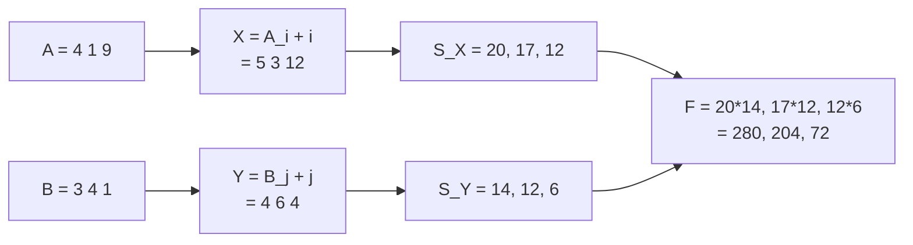

[[TOC]]

## 形式化题目

给定长度 $n$ 的数组 $A, B$（下标从 $1$ 起，$0 \leqslant A_i, B_i \leqslant 10^7$），用它们生成 $n \times n$ 矩阵

$$C_{ij} = A_i B_j + i B_j + A_i j + i j .$$

一个矩阵的**价值**定义为其中最大元素的值。对每个 $k = 1, 2, \dots, n$，定义 $F[k]$ 为

> $C$ 中所有 $k \times k$ **连续**子矩阵（行窗 $[i, i+k-1]$、列窗 $[j, j+k-1]$）的价值之和。

求 $F[1], F[2], \dots, F[n]$ 对 $10^9+7$ 取模的结果。

$n \leqslant 100000$。暴力枚举每个 $k$ 的每个子矩阵是 $O(n^4)$ 级别的，必须另找结构。

## 正解

### 思路

**第一步：把矩阵"拆开"。** 题面给的 $C_{ij}$ 四项看起来毫无规律，但把 $A_i$ 的两项、$B_j$ 的两项各归一类就能看出它是完全平方的展开形式：

$$C_{ij} = A_iB_j + iB_j + A_i j + ij = (A_i + i)(B_j + j).$$

令 $X_i = A_i + i$、$Y_j = B_j + j$，则 $C_{ij} = X_i Y_j$，整个矩阵是一个"外积矩阵"。

**第二步：行列分离。** 题目保证 $A_i, B_i \geqslant 0$ 且下标从 $1$ 起，所以 $X_i, Y_j \geqslant 1$ 恒正。正数乘积有一个关键性质：

$$\max_{p \in \text{行窗}} \max_{q \in \text{列窗}} X_p Y_q = \Big(\max_{p \in \text{行窗}} X_p\Big) \cdot \Big(\max_{q \in \text{列窗}} Y_q\Big).$$

两个因子都取最大时乘积才最大，行与列的选择互不干扰。于是

$$F[k] = \Big(\sum_{i=1}^{n-k+1} \max(X_i, \dots, X_{i+k-1})\Big) \times \Big(\sum_{j=1}^{n-k+1} \max(Y_j, \dots, Y_{j+k-1})\Big) = S_X[k] \cdot S_Y[k].$$

问题化归为一个经典子问题：**给定数组，对每个 $k$ 求所有长度 $k$ 子区间最大值之和**，两个数组各做一遍即可。

**第三步：$S[k]$ 的贡献计数。** 直接对每个 $k$ 单调队列扫一遍是 $O(n^2)$，$n = 10^5$ 时是 $10^{10}$，不行。改换视角：不看"区间"看"元素"，让每个元素去统计自己当了多少次区间最大值。

为了不重不漏，规定每个区间由它**最靠右的那个最大值**代表。用单调栈求出

- $L[i]$：$i$ 左侧最近的满足 $X_{L[i]} > X_i$ 的位置（严格大于，不存在则为 $0$）；
- $R[i]$：$i$ 右侧最近的满足 $X_{R[i]} \geqslant X_i$ 的位置（大于等于，不存在则为 $n+1$）。

这两侧口径一严一松，正好保证"每个区间恰有一个最右最大值"。记 $a = i - L[i]$、$b = R[i] - i$，那么 $i$ 是区间 $[s, e]$ 的最右最大值当且仅当

$$L[i] < s \leqslant i \leqslant e < R[i],$$

也就是 $s$ 有 $a$ 种选择、$e$ 有 $b$ 种选择。现在数长度恰为 $k$ 的区间个数：设 $e = i + r$（$0 \leqslant r < b$），则要求 $s = e - k + 1 \geqslant i - a + 1$，即 $r \geqslant k - a$；同时 $r \leqslant k - 1$ 与 $r \leqslant b - 1$ 也要满足。综合起来

$$\mathrm{cnt}_i(k) = \#\{r : \max(0, k-a) \leqslant r \leqslant \min(k-1,\, b-1)\} = \min(k,\, a,\, b,\, a+b-k),$$

要求 $1 \leqslant k \leqslant a+b-1$，否则为 $0$。

**第四步：把 $\mathrm{cnt}_i(k)$ 变成 $O(1)$ 次区间加。** 设 $m = \min(a, b)$、$M = \max(a, b)$，上式关于 $k$ 分三段是线性的：

$$\mathrm{cnt}_i(k) = \begin{cases} k, & 1 \leqslant k \leqslant m,\\ m, & m < k \leqslant M,\\ a + b - k, & M < k \leqslant a+b-1.\end{cases}$$

对固定的 $i$ 这是三条"关于 $k$ 的直线"，而我们要的是**所有 $i$ 叠加后**在每个 $k$ 上的值。开两个差分数组：

- `slope[k]`：$k$ 的系数之和；
- `const[k]`：常数项之和。

于是最终 $S[k] = \big(\text{slope 的前缀和}\big) \cdot k + \big(\text{const 的前缀和}\big)$。第一段斜率 $+1$、截距 $0$，只需 `slope` 区间加 $X_i$；第二段斜率 $0$、截距 $m$，只需 `const` 区间加 $X_i \cdot m$；第三段斜率 $-1$、截距 $a+b$，则 `slope` 区间加 $-X_i$、`const` 区间加 $X_i \cdot (a+b)$。每个 $i$ 只做 $O(1)$ 次区间加，最后前缀和扫一遍就得到全部 $k$ 的答案。

注意全程可以在模 $10^9+7$ 下运算：$S_X[k]$、$S_Y[k]$ 都只需知道模值，乘积 $S_X[k] \cdot S_Y[k] \bmod (10^9+7)$ 就是 $F[k]$——模运算对加法、乘法封闭，不必担心"最大值之和"与取模的交换性（取模只作用在最终求和结果上，不参与比较）。

下面用样例展示前两步的分离：

以样例的 $k=2$ 为例验证计数口径：$X = [5, 3, 12]$ 的长度 $2$ 窗口是 $[5,3]$ 与 $[3,12]$，最大值 $5 + 12 = 17$；$Y = [4, 6, 4]$ 的两个窗口最大值是 $6 + 6 = 12$（两个窗口最大值都是 $6$，因为 $Y_2 = 6$ 同时属于它们）；$17 \times 12 = 204$，与样例一致。

### 代码

Python 版：

@include-code(./main.py, python)

C++ 版：

@include-code(./main.cpp, cpp)

### 复杂度

- 时间：每个数组一次单调栈 $O(n)$ + 每个位置 $O(1)$ 次差分区间加 + 一次前缀和，两个数组共 $O(n)$。
- 空间：$L, R$、栈、两个差分数组与原数组均为 $O(n)$。

$n = 10^5$ 时数据量很小，$1000\ \mathrm{ms}$ / $128\ \mathrm{MB}$ 限制下 C++ 有极大余量。

### 正确性要点与边界

1. **正数前提不能省。** 若允许 $A_i$ 为负，$X_i$ 可能非正，"乘积取最大 = 两因子分别取最大"就不成立。本题 $A_i, B_i \geqslant 0$ 且 $i \geqslant 1$，故 $X_i, Y_j \geqslant 1 > 0$，这一步是合法的。
2. **去重口径一严一松。** $L$ 用"严格大于"、$R$ 用"大于等于"，否则大量并列值（例如 $A \equiv B \equiv 10^7$ 时 $X$ 严格递增，或 $A_i = B_i = 10^7 - i$ 时 $X \equiv 10^7$ 全相等）会被重复计数或漏计。两处口径写反不会影响题目样例（样例的 $X$ 无并列），但会在有并列值的数据上算错——实测把两处口径互换后，测试点 3、7、8、10 的答案立即改变，其中点 10（$X_i \equiv 10^7$ 全相等）是最极端的一例。
3. **差分数组要开到 $n+3$。** 区间右端点可达 $a+b-1 \leqslant 2n-1$，在 `d[r+1]` 处会越界写入，数组必须留出余量；同时 `add_range` 需处理 $l > r$ 的空区间。
4. **取模位置。** 差分区间加时 $X_i$ 要先对 $10^9+7$ 取模，减法写成加 $MOD$ 再取模；`const` 上的量 $X_i \cdot (a+b)$ 中 $a+b$ 可到 $2 \times 10^5$，$X_i$ 可到 $1.1 \times 10^7$，乘积约 $2 \times 10^{12}$，C++ 需用 `long long`（Python 无此问题）。
5. **输出格式。** 一行 $n$ 个整数，用空格分隔、行尾换行，注意不要在行末多输出空格（多数判题器容忍，但严格比较的判题器会判错）。

## 总结

- **先化简再优化。** 四项展开式其实是 $(A_i+i)(B_j+j)$，识别出"外积矩阵"后，$n \times n$ 个元素的最大值问题就塌缩成两个一维问题，这是本题最关键的一步，也是唯一需要"看出"的地方。
- **正数乘积可分离极值。** $\max (X_p Y_q) = \max X_p \cdot \max Y_q$ 只在两个因子恒正时成立；题面刻意给出 $0 \leqslant A_i, B_i$ 正是为了让这一步合法，反过来看也是题面在暗示解法。
- **从"枚举区间"转向"枚举元素"。** 对每个 $k$ 扫一遍是 $O(n^2)$，改让每个元素统计自己被多少个窗口计入，就把 $O(n)$ 个元素的贡献分别变成 $O(1)$ 次区间加，这是"所有子区间极值之和"这类题的通用套路。
- **单调栈的口径决定计数是否唯一。** $L$ 严格大于、$R$ 大于等于，才能让每个区间恰有一个"最右最大值"来代表；并列值越多，这个细节越致命。
- **分段线性函数用差分数组承载。** 贡献函数 $\min(k, a, b, a+b-k)$ 是"上凸的折线"，两段斜率变化 + 一段常数，用 `slope` / `const` 两个差分数组即可一次求出全部 $k$，不需要任何数据结构。

> **关于本题数据的说明**：仓库素材源中带有测试数据生成脚本（`data.py`，依赖 `cyaron`），说明 `data/` 下 10 个测试点是由标程**自造**的，并非官方原始数据；题面也属于网络重建版本。因此上述「分层设计」描述的是本仓库数据的构造意图，出题意图与官方原题可能存在偏差，题解结论以题面公式与数据范围为准（已用 `main.cpp` / `main.py` 与全部 10 个测试点逐点比对一致）。
