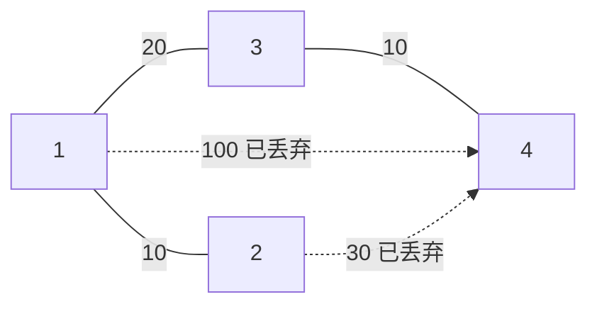

[[TOC]]

## 形式化题目

给定无向连通图 $G = (V, E)$，$|V| = n$，$|E| = m$，每条边 $e$ 有非负权 $w(e)$（$0 \leqslant w \leqslant 10^9$），
权值就是这条路的过路费。对一条路径 $P$，定义它的费用为

$$\mathrm{cost}(P) = \max_{e \in P} w(e),$$

即路径上最贵的那一段决定总费用。每次询问给出 $S, T$，求

$$f(S, T) = \min_{P:\, S \to T} \max_{e \in P} w(e),$$

也就是所有 $S \to T$ 路径中费用最小的那个值。题目保证图连通，所以答案总是存在；
$S = T$ 时停在原地，费用为 $0$。

把边权看成"通行门槛"，$f(S,T)$ 的含义是：找到最小的阈值 $X$，使得只保留权 $\leqslant X$ 的边时
$S$ 与 $T$ 仍然连通。这正是**最小瓶颈路**（minimax path）模型。

数据范围：$1 \leqslant n \leqslant 10^4$，$1 \leqslant m \leqslant 10^5$，$1 \leqslant q \leqslant 10^4$，
$0 \leqslant w \leqslant 10^9$（$w$ 可以为 $0$，也可以有重边与自环）。

## 正解

### 思路

**朴素做法一：每个询问直接跑一次"最小瓶颈路"。** 把边按权值排序后从小到大加边，
用并查集判断 $S$、$T$ 何时连通，第一次连通时加入的边权就是答案。单次询问 $O(m \log m + m\alpha)$，
$q$ 次就退化到 $O(q\,m \log m)$，在 $q = m = 10^5$ 量级上完全不可行。

**朴素做法二：每个询问二分答案。** 二分阈值 $X$，只保留 $w \leqslant X$ 的边做一次 BFS 判断 $S,T$ 是否连通。
单次 $O((n + m)\log W)$，总量约 $10^4 \times 30 \times 1.1 \times 10^5 \approx 3 \times 10^{10}$，同样过不去。

**瓶颈在哪？** 两种做法都在"每个询问重新处理整张图"。但这张图是**固定**的，
$q$ 次询问问的是同一张图上的 $q$ 对点，所以应该先把图压缩成一份与询问无关的结构。

**关键观察：最小生成树就是最小瓶颈生成树。** 也就是

$$\text{任意一棵 MST 上 } u \to v \text{ 路径的最大边权} = f(u, v).$$

用 Kruskal 的过程证明最直观。按边权升序加边，设 $e^{*}$ 是**第一次让 $u$ 与 $v$ 连通**的那条边，
它的权为 $w^{*}$（这个值正是朴素做法一算出的答案）。分两步夹逼：

- **答案 $\geqslant w^{*}$。** 在只保留权 $< w^{*}$ 的边的子图里 $u$ 与 $v$ 不连通，
  而 MST 上的 $u \to v$ 路径也是原图里的一条 $u \to v$ 路径，它的每条边都不在"权 $< w^{*}$"的子图里，
  于是这条路径上必有一条权 $\geqslant w^{*}$ 的边，最大边权 $\geqslant w^{*}$。
- **答案 $\leqslant w^{*}$。** 加入 $e^{*}$ 之后，$u$ 与 $v$ 在"只用权 $\leqslant w^{*}$ 的边"这个子图里已经连通，
  所以 MST 中 $u \to v$ 的路径只用权 $\leqslant w^{*}$ 的边，最大边权 $\leqslant w^{*}$。

两式合并即得 MST 路径的最大边权恰为 $w^{*} = f(u,v)$。这也顺带解释了为什么 $f$ 与"选哪棵 MST"
无关：只要图连通，任意 MST 都给出同样的 $w^{*}$。

**于是问题被拆成两块：**

1. **建图：** Kruskal 求出一棵 MST，$O(m \log m)$，这一步与 $q$ 无关；
2. **询问：** 在树上回答"两点路径的最大边权"。树上路径最值用**倍增 LCA**：
   预处理 $up_k[v]$（$v$ 向上跳 $2^k$ 步的祖先）与 $mx_k[v]$（这 $2^k$ 步路径上的最大边权），
   每次询问先按深度差把较深的点抬上来，再让两点同步上跳直到停在 LCA 的下一层，
   沿途对 $mx$ 取 $\max$ 即可，$O(\log n)$。

边界与细节：

- **自环与重边**：Kruskal 加边时两端点已经同属一个连通块就直接跳过，自环（$u = v$）天然被跳过；
  重边里只有最小的那条有机会进 MST，其余被跳过，不影响答案。
- **$w = 0$ 的边**：排序后最先被加进去，答案可以是 $0$。
- **$S = T$**：空路径的最大值定义为 $0$，直接输出 $0$（不要走"LCA 时取到某条边"的分支）。
- **数据保证连通**，所以不需要处理"不连通"的情形；代码里把未访问点的祖先默认指向根，
  只是防止越界。
- **深链爆栈**：MST 可能是 $n = 10^4$ 的链，定向时用显式栈迭代 DFS，不用递归。

### 代码

Python 版：

@include-code(./main.py, python)

C++ 版（同一算法）：

@include-code(./main.cpp, cpp)

### 复杂度

- **时间**：Kruskal 排序 $O(m \log m)$；树上定向 $O(n)$；倍增表 $O(n \log n)$；
  每次询问 $O(\log n)$，共 $O(m \log m + (n + q)\log n)$。
  在 $n = 10^4, m = 10^5, q = 10^4$ 的顶格随机点上实测：`main.cpp` 约 0.03 s
  （限时 1000 ms），`main.py` 约 0.1 s（Python 3.14）——两者是同阶算法，Python 只是常数更大。
- **空间**：C++ 侧 `edge` 数组 $10^5 \times 16\text{B}$、倍增表 $15 \times 10^4 \times 16\text{B}$，
  实测峰值 8.3 MB（限时 256 MB）；Python 侧用列表存同样的表，峰值约 59 MB。
- **与朴素做法的关系**：朴素做法一把"加边到连通"这一步按询问重复了 $q$ 次，
  正解把它换成一次性建 MST；朴素做法二把"连通性判定"按二分重复了 $\log W$ 次，
  正解把它换成倍增表上的 $O(\log n)$ 跳转。两条路都指向同一个结论：瓶颈在"重复处理整张图"。

## 总结

- **最小生成树 = 最小瓶颈生成树**，这是本题的全部：$\min \max$ 型的路径问题不需要对每个询问重跑图，
  只要一次 MST，剩下的都是树上路径最值。结论的证明用 Kruskal 的加边时刻夹逼最干净。
- **把 $q$ 次询问的公共部分提出来预处理**，是"多询问 + 固定图"这类题的标准套路；
  正解的预处理 $O(m\log m)$ 与询问 $O(q\log n)$ 是分开的两段，互不干扰。
- **倍增表存两样东西**：祖先 `up[k][v]` 和路径最值 `mx[k][v]`。$mx$ 的合并式
  $mx_k[v] = \max(mx_{k-1}[v], mx_{k-1}[\,up_{k-1}[v]\,])$ 与 `up` 完全同构，
  凡是"沿路径可合并的区间信息"都能这样挂上去（最大、最小、和、$\gcd$ 都一样）。
- **边界要单独想一遍**：自环、重边、$w = 0$、$S = T$、链状 MST 的深递归，
  这五处任何一个漏掉都会在数据里翻车。
- **验证**：题面样例与随仓 `data/` 的 10 个测试点全部通过；另外把 `main.py`、`main.cpp`
  分别与 $O(n^3)$ 的最小瓶颈闭包暴力（`f[i][j] = min_k max(f[i][k], f[k][j])`）
  在 400 / 200 组小随机图上对拍（含 $n = 1$ 自环、重边、$w = 0$、$S = T$），结果完全一致。
- 本题素材源附带了数据生成脚本，`data/` 是自造的分层数据（边界点、小/中随机、顶格随机、
  以及一条权值为 $i$ 的链加大量 $10^9$ 补边的特殊结构），题面亦为网络重建，
  与官方原始数据的分层方式可能不同；素材源的 `std.cpp` 与本文算法一致（MST + 倍增 LCA），
  这里按题面独立实现，并逐点跑过 `data/` 的全部 10 个测试点。

## 图示解析

以题面样例为例（$n = 4$，边 $1\!-\!2:10$、$1\!-\!3:20$、$1\!-\!4:100$、$2\!-\!4:30$、$3\!-\!4:10$）：
按权值升序加边，$1\!-\!2$（$10$）与 $3\!-\!4$（$10$）先进，$1\!-\!3$（$20$）把两块拼起来，
此时 4 个城市已连通，剩下的 $1\!-\!4$（$100$）、$2\!-\!4$（$30$）全部跳过。

询问 $1 \to 4$：MST 上路径是 $1 \to 3 \to 4$，最大边权 $\max(20, 10) = 20$；
原图里更直接的 $1 \to 4$ 要走 $100$ 的边，反而更贵，这正是"最大边权最小"与"边权和最小"的差别。
询问 $4 \to 1$ 走同一条路径，答案同为 $20$——$f$ 是对称的，路径反向不改变最大值。
