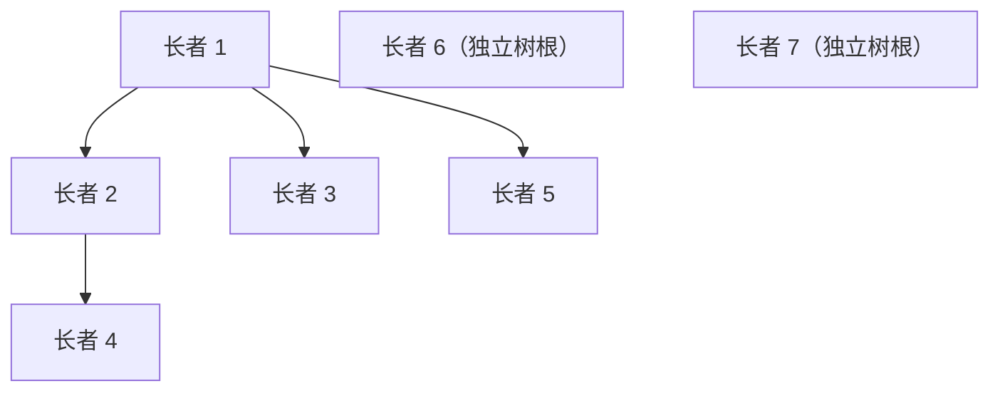

[[TOC]]

## 形式化题目

编号 $1..n$ 的点同时扮演"长者"和"球长"两个角色，每个点 $i$ 附一份名单
$B_i \subseteq \{1, 2, \dots, i-1\}$（元素互不重复）。点 $i$ **管辖**的球长集合 $S_i$ 由两条规则定出：

- $i \in S_i$：长者管辖自己；
- 对 $j \neq i$：$i$ 管辖 $j$ 当且仅当 $\forall k \in B_i,\ j \in S_k$，即
  $S_i = \{i\} \cup \bigcap_{k \in B_i} S_k$，并约定 $B_i = \varnothing$ 时 $S_i = \{i\}$。

给定 $m$ 个询问，第 $i$ 个询问给出一个长者集合 $T_i$，求
$\left| \bigcup_{t \in T_i} S_t \right|$——被 $T_i$ 中至少一位长者直接或间接管辖的球长个数。

约束：$n, m \leqslant 200000$，$\sum |B_i| \leqslant 2000000$，询问的 $\sum sz_i \leqslant 2000000$。

**关于 $B_i = \varnothing$ 的约定。** 若把 $B_i = \varnothing$ 当成"条件空真"（$i$ 管辖所有球长），
则样例里长者 1 会管辖全部 7 个球长，$S_2 = \{2\} \cup S_1$ 也就成了全集，
询问 $\{2,3\}$ 的答案会是 7 而不是样例声明的 3。所以"空名单"只能理解为 $S_i = \{i\}$，
这也与题面"长者管辖自己"一句一致。

## 正解

### 思路

**第一步：$S_i$ 是链，管辖关系是一片森林。**

先看 $S_i$ 内部的结构。管辖关系自反（$i$ 管辖 $i$）、传递（$i$ 管辖 $j$、$j$ 管辖 $l$ 时对
$\max(i,j)$ 归纳即可得 $i$ 管辖 $l$），且显然有 $i$ 管辖 $j \Rightarrow i \geqslant j$。

> **引理.** 同一个 $S_i$ 中任意两个球长可以比较：若 $a, b \in S_i$，则 $a$ 管辖 $b$ 与 $b$ 管辖 $a$ 至少有一个成立。

反证：取"同时管辖两个不可比球长"的最小下标 $i$。由 $i \geqslant j$ 知这两个球长都不等于 $i$，
故 $B_i \neq \varnothing$；又由传递性，每个 $k \in B_i$ 也都同时管辖这两个球长，而 $k < i$，
与 $i$ 的最小性矛盾。

于是把管辖关系画成偏序的 Hasse 图（只连"直接管辖"的边，即把每个点连向 $S_i$ 中除自己外
最大的那个点），每个点至多有一个前驱，图形就是**一片森林**，而 $S_i$ 恰好是**森林中从根到 $i$ 的整条路径**。

**第二步：$parent(i) = B_i$ 的集合 LCA。**

有了森林，$S_i = \{i\} \cup \bigcap_{k \in B_i} S_k$ 里的交集就是"若干条根路径的公共部分"：
$B_i$ 中的点同在一棵树里时，交集是根到它们集合 LCA 的路径，于是

$$parent(i) = \max\left(\bigcap_{k \in B_i} S_k\right) = \operatorname{LCA}(B_i);$$

若 $B_i$ 中的点分属不同的树（交集空）或 $B_i$ 为空，则 $i$ 自成一棵新树的根。

又因为 $B_i \subseteq \{1, \dots, i-1\}$，按 $i$ 递增处理时 $B_i$ 的点早已就位，
新点只会作为**叶子**挂到已有点下面，已有结点的祖先关系不会变，
所以可以边建森林边把倍增表一起维护好，逐个用 $LCA$ 合并 $B_i$ 的元素即可求出 $parent(i)$。

**第三步：询问 = 若干条根路径的并。**

把询问的点集 $T$ 按**真正的 DFS 先序** $dfn$ 排序（注意：按 $i$ 递增建树的次序只是拓扑序，
不是合法 DFS 序——父亲 2 的儿子 4 会因为 $4 > 3$ 排在叔叔 3 的后面），排序后同一棵树的点连成一段。
逐条加入根路径，有恒等式

$$\left| \bigcup_{t \in T} \text{rootpath}(t) \right|
= \sum_{t \in T} dep(t) - \sum_{\text{相邻且同树}} dep\big(\operatorname{LCA}(t_{j-1}, t_j)\big)
+ (\text{涉及的树棵数}).$$

它的来源是：$dfn$ 序下相邻的两点"关系最近"，第 $j$ 条根路径与前面所有路径的并集的公共部分
恰好是 $\text{rootpath}\big(\operatorname{LCA}(t_{j-1}, t_j)\big)$，这段前缀在前面已经数过一遍，
减掉 $dep(\operatorname{LCA})$ 即可；跨树的两条路径不相交，只把"树棵数"多计一次，
最后每棵树的根（$dep = 0$）补上。

以题面样例为例：名单与建出的森林如下。

| $i$ | $B_i$ | $parent(i)$ | $dep(i)$ | $S_i$ |
| :-: | :-: | :-: | :-: | :-: |
| 1 | $\varnothing$ | 无（树根） | 0 | $\{1\}$ |
| 2 | $\{1\}$ | 1 | 1 | $\{1,2\}$ |
| 3 | $\{1\}$ | 1 | 1 | $\{1,3\}$ |
| 4 | $\{2\}$ | 2 | 2 | $\{1,2,4\}$ |
| 5 | $\{2,3\}$ | $\operatorname{LCA}(2,3)=1$ | 1 | $\{1,5\}$ |
| 6 | $\varnothing$ | 无（新树根） | 0 | $\{6\}$ |
| 7 | $\{2,6\}$ | 2 与 6 不同树 ⇒ 新树根 | 0 | $\{7\}$ |

把样例的三个询问代进恒等式，$dfn$ 序为 $1,5,3,2,4,6,7$：

| 询问 $T$ | 按 $dfn$ 排序后 | $\sum dep$ | 减掉的 $\sum dep(\text{LCA})$ | 树棵数 | 答案 |
| :-: | :-: | :-: | :-: | :-: | :-: |
| $\{2,3\}$ | $3,2$ | $1+1=2$ | $\operatorname{LCA}(3,2)=1$，减 0 | 1 | **3** |
| $\{3,5\}$ | $5,3$ | $1+1=2$ | $\operatorname{LCA}(5,3)=1$，减 0 | 1 | **3** |
| $\{4,5\}$ | $5,4$ | $1+2=3$ | $\operatorname{LCA}(5,4)=1$，减 0 | 1 | **4** |

三个答案与题面输出一致，也能与题面"$\{4,5\}$ 可以采访 $1,2,4,5$"的说明对上
（$S_4 = \{1,2,4\}$、$S_5 = \{1,5\}$）。

### 代码

Python 版（倍增 LCA + 同一恒等式）：

@include-code(./main.py, python)

C++ 版（同一算法：森林 + 倍增 LCA + 虚树恒等式）：

@include-code(./main.cpp, cpp)

### 复杂度

- **时间**：建森林时 $B_i$ 的元素要逐个与当前集合 LCA 合并，单次倍增 LCA 为 $O(\log n)$，
  共 $O\!\left(\sum |B_i| \log n\right)$；求 $dfn$ 一趟迭代 DFS 为 $O(n)$；
  询问按 $dfn$ 排序 $O(\sum sz_i \log sz_i)$，相邻两两求 LCA $O(\sum sz_i \log n)$。
  顶格数据（$n = m = 2 \times 10^5$、$\sum|B| = \sum sz = 2 \times 10^6$）实测
  C++ 0.35 s / 23.6 MB（限时 2000 ms、限内存 128 MB）。
- **空间**：倍增表 $O(n \log n)$（`up[18][n+1]`，$2 \times 10^5$ 规模下约 29 MB）、
  森林与 $dfn$ 各 $O(n)$，单个询问的缓冲区 $O(\max sz_i)$，均不依赖 $m$。
- **与 C++ 解法的关系**：`main.py` 是同一套算法（森林 + 倍增 LCA + 虚树恒等式），
  复杂度同阶；Python 侧常数大，顶格两个点实测约 3.4 s、峰值内存约 96 MB，
  在 2000 ms / 128 MB 的限制下有 TLE/MLE 风险，但解法没有降级。

## 总结

- **把"管辖"看成偏序，$S_i$ 就是链。** 一上手不要去想"间接管辖"的闭包，先证明
  $S_i$ 是链：任意两个被同一人管辖的球长可比，这条引理让 Hasse 图退化成森林，
  于是 $S_i$ = 根路径、$parent(i)$ = 集合 LCA，两个关键量同时落地。
- **集合 LCA 要逐个合并，不能用 $dfn$ 的 $\min / \max$。** $B_i$ 的元素分属不同树时交集为空
  （$i$ 自成一棵新树），同树时也只能把当前 LCA 与新元素两两合并，共 $O(\log n)$ 步。
- **建树的次序不是合法 DFS 序。** $B_i \subseteq \{1, \dots, i-1\}$ 保证 \(parent\) 先于儿子出现，
  但"哥哥"可能比"叔叔"晚建出来，所以求 $dfn$ 必须重新做一次真正的 DFS，
  否则虚树恒等式里"同树的点连成一段"这个前提不成立。
- **根路径并的经典恒等式**：$dfn$ 排序后 $\sum dep - \sum dep(\text{LCA 相邻同树点}) + \text{树棵数}$，
  一条式子同时处理跨树（不相交、只多一棵树）和同树（减掉重复前缀）两种情形。
- **数据与来源说明**：本题素材源自带数据生成脚本 `data.py` 与自研标程 `std.cpp`，
  「采访计划」在公开网络上没有找到题解，$B_i = \varnothing$ 的约定也是由样例反推的，
  因此题面为网络重建、`data/` 为自造数据，出题意图与官方原题可能有偏差。
  本仓库的 `main.cpp` / `main.py` 都只按上面的模型独立推导实现，另用
  「按定义直接求 $\bigcap S_k$」的暴力在小数据上对拍（$n \leqslant 80$、$B_i$ 含交集与跨树情形、
  共 650 组）全部一致，样例也逐行对上；但**这不等于官方数据 AC**。
