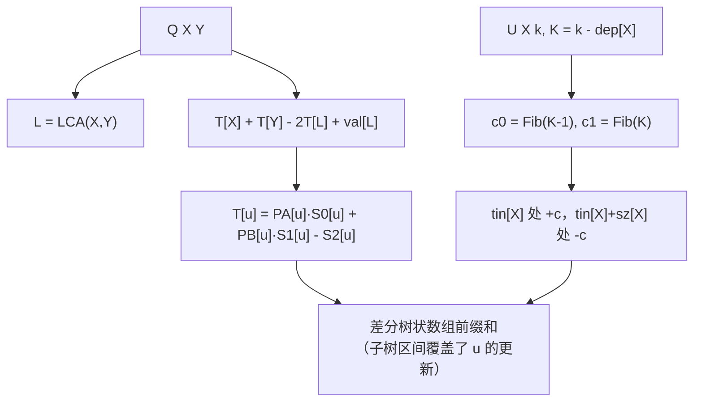

[[TOC]]

## 形式化题目

给定一棵以 $1$ 为根的有根树 $T$，共 $n$ 个节点，初始每个点的权值均为 $0$。
Fib 序列定义为 $Fib(1)=Fib(2)=1$，且对 $i \geqslant 3$ 有 $Fib(i)=Fib(i-1)+Fib(i-2)$。
维护 $m$ 次操作：

- `U X k`：对 $X$ 子树内每个节点 $v$（含 $X$ 自己），设 $v$ 到 $X$ 的边数为 $D$，
  令 $val[v] \mathrel{+}= Fib(k+D)$；
- `Q X Y`：求 $X$ 到 $Y$ 的唯一简单路径上所有节点（含端点）的权值和，模 $10^9+7$ 输出。

其中 $n,m \leqslant 10^5$，$1 \leqslant X,Y \leqslant n$，$1 \leqslant k \leqslant 10^{15}$。

## 暴力解法

### 思路

按题面直译即可。每个点存一个权值数组 `val[1..n]`。

- 修改：从 $X$ 出发 DFS 整棵子树，向下传一个距离 $D$，把 $Fib(k+D)$ 加到 `val[v]`。
  由于 $X$ 到子树内任一点 $v$ 的路径必过 $X$，**只用深度差就能得到 $D$**，
  不需要真的记路径。
- 询问：先把 $X$、$Y$ 提到同一深度，再一起往上跳，途中把经过的点权加起来，
  跳到同一个点后它是唯一被重复计数的点，减掉一次即可。

`Fib` 的项要现算：$k$ 最大 $10^{15}$，$k+D$ 可能很大，不能线性递推，
用倍增 $O(\log(k+D))$ 求出 $\big(Fib(t),Fib(t+1)\big)$ 即可；
$k$ 很小时 $k+D$ 仍非负，所以这一版还不需要处理负下标。

### 代码

@include-code(./brute.cpp, cpp)

### 复杂度

单次修改 $O(\text{子树大小})=O(n)$，单次询问 $O(n)$，总计 $O(nm)$
（每次算 $Fib$ 另有 $O(\log k)$ 的倍增代价）。
$n=m=10^5$ 时是 $10^{10}$ 量级，必然超时。

### 瓶颈

表面看瓶颈是"子树/路径要逐个点跑"，但真正的障碍在修改的那一项：

$$Fib(k+D) = Fib\big((k - dep[X]) + dep[v]\big)$$

对同一次修改而言，**系数 $k-dep[X]$ 是常数，但被加的值随每个点的深度 $dep[v]$ 变化**，
每个点是不同的数。所以既不能整体打一个"加常数"的懒标记，
也不能整体打一个"乘常数"的懒标记——每个叶子要加的数都不一样。
这就是本题不能用"子树加常数 + 路径求和"套模板的原因。

## 正解

### 思路

**关键观察：斐波那契加法公式把"变化的加数"变成"两个固定序列的线性组合"。**
Fibonacci 有恒等式（对全体整数都成立）

$$Fib(a+b) = Fib(a)\cdot Fib(b+1) + Fib(a-1)\cdot Fib(b).$$

取 $a = k - dep[X] = K$（一次修改内的常数）、$b = dep[v]$（点自身的静态属性），得到

$$Fib(k + D) = Fib(K)\cdot Fib(dep[v]+1) + Fib(K-1)\cdot Fib(dep[v]), \qquad D = dep[v]-dep[X].$$

观察重点在于：$Fib(dep[v])$ 与 $Fib(dep[v]+1)$ 只依赖深度，**永远不会随操作改变**；
$Fib(K)$、$Fib(K-1)$ 只依赖本次操作，对子树内所有点都一样。
于是"给区间内每个点加一个各不相同的数"被拆成了两件事——
在子树区间上整体加 $c_1 \cdot \big(Fib(dep[v]+1)\big)$ 与 $c_0 \cdot \big(Fib(dep[v])\big)$，
两个加数序列都是预先算好的静态序列，同一操作内系数统一。

**第二步：把"各类更新的加权和"沉淀成每个点上的三个累计量。**
对每个点 $v$，维护三个数：$S_0[v] = \sum c_0$、$S_1[v] = \sum c_1$、$S_2[v] = \sum d$，
其中求和范围是**所有子树区间覆盖 $v$ 的更新**，$d = c_0\,PA[faX] + c_1\,PB[faX]$
（$PA[w],PB[w]$ 是根到 $w$ 上 $Fib(dep)$、$Fib(dep+1)$ 的前缀和，$faX$ 是修改点 $X$ 的父亲）。
此时点权就是

$$val[v] = Fib(dep[v])\cdot S_0[v] + Fib(dep[v]+1)\cdot S_1[v].$$

"子树是 DFS 先序中的连续区间"这一性质让 $S_0,S_1,S_2$ 可以统一维护：
一次更新在 $tin[X]$ 处 $+c$、在 $tin[X]+sz[X]$ 处 $-c$（区间差分），
某点 $v$ 的 $S[v]$ 就是差分数组在 $tin[v]$ 处的前缀和。
三个累计量下标一致、总是一起增删，用一个三元差分树状数组即可。

**第三步：询问不需要真的爬路径。** 记
$T[u] = \sum_{v \in \text{根} \to u} val[v]$（根到 $u$ 的点权前缀和）。
路径 $X \to Y$ 拆成"根到 $X$"与"根到 $Y$"两条链删除重复部分，设 $L = \mathrm{LCA}(X,Y)$：

$$T[X] + T[Y] = \text{路径和} + 2\,T[L] - val[L] \;\Longrightarrow\; \text{路径和} = T[X] + T[Y] - 2T[L] + val[L].$$

**最后一步化归：$T[u]$ 也能用上面那三个累计量一次算出来，不必逐点求和。**
把 $val$ 的定义代进 $T[u]$，交换求和顺序：
更新 $(X,k)$ 对 $T[u]$ 的贡献只在 $u \in X$ 子树时非零，而那时路径 $X \to u$ 上的
$\sum Fib(dep[v])$ 恰好等于 $PA[u] - PA[faX]$（$PB$ 同理），于是

$$T[u] = PA[u]\cdot S_0[u] + PB[u]\cdot S_1[u] - S_2[u].$$

$PA[u],PB[u]$ 是静态的，$S_0[u],S_1[u],S_2[u]$ 是一次树状数组前缀查询，
所以单点 $T$ 值 $O(\log n)$ 拿到，$val[L]$ 复用 $L$ 的那次查询结果即可。
每次询问只查 $3$ 个点（$X$、$Y$、$L$）、每次更新只做 $2$ 次差分修改。

**Fib 系数怎么算。** $K = k - dep[X]$ 可能为负（$k$ 很小、$X$ 很深时），
需要负下标延拓 $Fib(-p) = (-1)^{p+1}Fib(p)$，它由 $Fib(m+2)=Fib(m+1)+Fib(m)$ 双向外推得到。
$p \leqslant 10^{15}$ 不能线性递推，用倍增：
由 $Fib(2i)=Fib(i)\big(2Fib(i+1)-Fib(i)\big)$、$Fib(2i+1)=Fib(i)^2+Fib(i+1)^2$
自顶向下 $O(\log p)$ 求出 $\big(Fib(p),Fib(p+1)\big)$。

| 符号 | 含义 | 何时算 |
| --- | --- | --- |
| $dep[v]$ | 根的深度取 $0$（到根的边数） | 预处理 |
| $Fib(dep[v])$、$Fib(dep[v]+1)$ | 点 $v$ 的两条静态序列值 | 预处理（线性递推到 $n+1$） |
| $PA[w]$、$PB[w]$ | 根到 $w$ 上两条静态序列的前缀和 | 预处理 |
| $K = k - dep[X]$ | 单次更新的特征量 | 每次 `U` |
| $c_0 = Fib(K-1)$、$c_1 = Fib(K)$ | 单次更新的两个系数 | 每次 `U`（倍增） |
| $d = c_0 PA[faX] + c_1 PB[faX]$ | 差分的第三维修正值 | 每次 `U` |
| $S_0,S_1,S_2$ | 覆盖当前点的更新的三类累加和 | 差分树状数组查询 |

### 代码

Python 版：

@include-code(./main.py, python)

C++ 版（同一算法）：

@include-code(./main.cpp, cpp)

### 复杂度

- **时间**：预处理含两张倍增表与 Fib 前缀和，$O(n\log n + n)$；
  每次 `U` 做两次差分树状数组修改与一次倍增求 Fib，$O(\log n + \log k)$；
  每次 `Q` 做三次前缀查询与一次 LCA，$O(\log n)$。
  总计 $O\big((n+m)\log n + m\log k\big)$，比"树链剖分 + 线段树"的 $O(m\log^2 n)$ 更省。
  $n=m=10^5$ 的大数据点上实测：C++ 每个点 $\leqslant 0.14$ s（含编译后运行，限时 2000 ms），
  Python 每个点 $\leqslant 1.2$ s，均无 TLE 风险。
- **空间**：倍增表 $O(n\log n)$，其余数组 $O(n)$；`main.cpp` 把每个点的静态属性聚成
  `struct Node`、差分树状数组的同一位置聚成 `struct BitNode`，不写平行数组，
  实测峰值内存 $\leqslant 20$ MB，远小于 512 MB。

## 总结

- **恒等式是破局点**：$Fib(a+b)=Fib(a)Fib(b+1)+Fib(a-1)Fib(b)$ 把"每个点加不同值"
  变成"两个静态序列按统一系数相加"，这是本题从 $O(nm)$ 走向 $O(\log)$ 的唯一入口。
- **静态属性与操作参数分离**：凡是只随操作变化的量（$c_0,c_1$）放差分树状数组，
  只随点变化的量（$Fib(dep)$、$PA$、$PB$）预处理成常数，两者相乘即得答案。
- **子树 = 连续区间 → 差分**；**路径 = 两条根链 − 重复段 → 前缀和 + LCA**。
  这两条是树上区间问题的通用降维手法，本题把"点权累加"换成了"线性组合的累加"。
- **负数下标的 Fib 是最大的实现陷阱**：$k<dep[X]$ 时 $K<0$，
  必须用 $Fib(-p)=(-1)^{p+1}Fib(p)$；否则小 $k$ 的数据点会整点 WA。
- 本题素材源带自造数据生成脚本（`data.py`，含链、菊花、毛毛虫、随机树四种形态与
  $k=1$ 的负数分支探针），题面为网络重建版本，出题意图与原题可能略有偏差。
  随仓 `std.cpp`（树链剖分 + 线段树）与本题解同一数学依据，实测在全部 10 个数据点上一致，
  可互为参照。

## 图示解析

下面用样例的第一次更新 `U 1 1`（$X=1$，$K=1-dep[1]=1$，故 $c_0=Fib(0)=0$、
$c_1=Fib(1)=1$）说明"一条更新如何影响询问"：树为 $1$ 的孩子 $\{2,3\}$、
$2$ 的孩子 $\{4,5\}$，深度分别是 $0,1,1,2,2$。

| 节点 $v$ | $dep[v]$ | $D$ | 加上的值 | $Fib(dep[v])$ | $Fib(dep[v]+1)$ | $c_0Fib(dep)+c_1Fib(dep+1)$ |
| --- | :-: | :-: | :-: | :-: | :-: | :-: |
| 1 | 0 | 0 | $Fib(1)=1$ | 0 | 1 | $0\cdot 0+1\cdot 1=1$ |
| 2 | 1 | 1 | $Fib(2)=1$ | 1 | 1 | $0\cdot 1+1\cdot 1=1$ |
| 3 | 1 | 1 | $Fib(2)=1$ | 1 | 1 | $0\cdot 1+1\cdot 1=1$ |
| 4 | 2 | 2 | $Fib(3)=2$ | 1 | 2 | $0\cdot 1+1\cdot 2=2$ |
| 5 | 2 | 2 | $Fib(3)=2$ | 1 | 2 | $0\cdot 1+1\cdot 2=2$ |

两种算法逐行对齐：第 4 列是暴力做法"按距离算"的结果，第 7 列是正解"两个静态序列的
统一系数组合"算出的结果，数值完全一致。差别在于第 7 列只用到了点自己的深度系列值，
不需要知道 $X$ 是谁、也不需要 $D$，因此一次区间加权就把整棵子树处理完了。

图的上半部分是询问的化归链：路径和 → 三个根链前缀和 + LCA 处的点权 →
单点 $T$ 用静态前缀和乘上树状数组查询结果表示。下半部分是更新的入口：
先由 $K$ 求出两个系数，再把它们作为区间差分的增量注入同一棵树状数组。
两半唯一交汇的地方就是那个差分树状数组——更新只在区间两端各记一笔，
询问只查三个点的前缀和，这就是"单次操作与树的大小无关"的原因。
