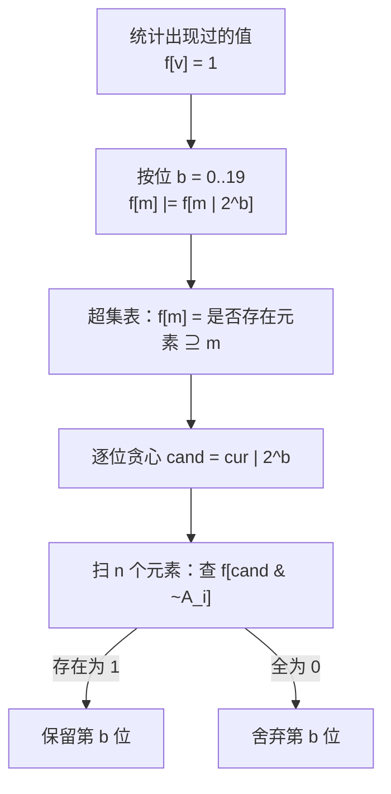

[[TOC]]

## 形式化题目

给定长度为 $n$ 的正整数序列 $A_1, A_2, \dots, A_n$（$1 \leqslant A_i < 2^{20}$）和一个算子的
编号 $c$，求

$$
\max_{1 \leqslant i < j \leqslant n} (A_i \mathbin{op} A_j), \qquad
op = \begin{cases}
\text{按位与} & c = 1\\
\text{按位异或} & c = 2\\
\text{按位或} & c = 3
\end{cases}
$$

多组数据：第一行 $T$，之后每组两行（`n c` 与 $n$ 个整数），每组输出一行答案。
范围 $T \leqslant 6$，$2 \leqslant n \leqslant 10^5$，单组时限 1500 ms、内存 128 MB。

需要注意算子的**编号顺序与直觉不同**：$c = 2$ 是异或、$c = 3$ 才是或，误记会直接错。

朴素做法枚举 $\binom{n}{2}$ 个数对，单组 $O(n^2)$，$n = 10^5$ 时是 $5 \times 10^9$ 次位运算，
必然超时。突破口在于 $A_i < 2^{20}$：**二进制位数 $B = 20$ 很小、值域 $2^{20}$ 有限**，
所以可以围绕"位"而不是围绕"数对"来设计算法。三个算子的性质各不相同，分开处理。

## 正解

### 思路

#### 情形 $c = 1$：按位与

按位与"同为 1 才为 1"，所以答案掩码的每一位都要求**至少两个数**在该位上同时为 1。
更一般地，对任意候选掩码 $\text{cand}$：

> 存在 $i \neq j$ 使 $(A_i \operatorname{and} A_j) \supseteq \text{cand}$ $\iff$
> 至少两个下标满足 $\text{cand} \subseteq A_k$（即 $A_k \operatorname{and} \text{cand} = \text{cand}$）。

必要性显然；充分性同样显然：取这两个元素配对，它们的 AND 含 $\text{cand}$ 的全部 1。

这条性质对 $\text{cand}$ 是**单调**的：把 $\text{cand}$ 的某位清零只会让条件更容易成立。
于是可以套标准的"从高位到低位贪心构造答案"：设已确定的高位集合为 $cur$，
尝试把第 $b$ 位置 1 得到 $\text{cand} = cur \mid 2^b$，若可行就保留这一位。单调性保证
贪心不会因为先前选错了高位而错过更优解——这正是 01-Trie 之上、更朴素的"逐位确定"套路。

可行性判定就是数一数有多少个 $A_k$ 含 $\text{cand}$，扫一遍序列、数到 2 就收工：

$$
ans_1 = \text{贪心结果}, \qquad \text{每轮 } O(n)
$$

单组共 $O(Bn) \approx 2 \times 10^6$ 次操作，非常轻。

#### 情形 $c = 2$：按位异或

异或"相异为 1"，是和"前缀相同/相异"绑定最深的一种运算，标准做法是 **0-1 Trie（二进制字典树）**：
把数按二进制从高位到低位插入，形成一棵深度 $B$ 的二叉树，每个节点对应一个二进制前缀。
查询 $A_i$ 时从根往下走，若第 $b$ 位想走的分支（与 $A_i$ 的第 $b$ 位相反）存在，
就走过去并把答案的第 $b$ 位置 1，否则被迫走另一分支。这样按高位优先的顺序，
每步都做了"这一步能挣的最大值"的最优选择，得到的即是与 $A_i$ 异或最大的元素。

要让 $i \neq j$，只需**边查询边插入**：对第 $i$ 个数先查询（此时树上只有 $A_1 \dots A_{i-1}$），
再插入 $A_i$。这样树上任何一次查询匹配到的必然是不同下标，无需额外过滤，
也无"自己和自己异或得 0"的干扰。

单组复杂度 $O(Bn)$，Trie 节点数 $\leqslant Bn \approx 2 \times 10^6$。

#### 情形 $c = 3$：按位或

或运算的单调性方向与与运算一致（或的结果只增不减），所以仍可逐位贪心：

> 存在 $i \neq j$ 使 $(A_i \operatorname{or} A_j) \supseteq \text{cand}$
> $\iff$ 存在某个下标 $i$，使 $\text{cand}$ 中 $A_i$ 缺的那些位能被**另一个**元素补齐。

记 $t_i = \text{cand} \operatorname{and} \lnot A_i$（$A_i$ 在 $\text{cand}$ 上缺的位），则条件等价于
"存在 $i$，使某个元素包含 $t_i$（即 $t_i \subseteq A_j$）"。两个要点：

1. $t_i$ 与 $A_i$ 的位**完全不相交**（$t_i$ 只取 $A_i$ 为 0 的位），所以 $t_i \neq 0$ 时，
   包含 $t_i$ 的那个元素一定不是 $A_i$ 自己，自匹配天然被排除；
2. $t_i = 0$ 时 $A_i$ 自己就覆盖了整个 $\text{cand}$，任取另一个下标即可，题面保证 $n \geqslant 2$。

于是只需要一张"**是否存在元素包含掩码 $m$**"的查询表。这正是 **SOS DP（高维后缀和）**
的经典场景：设 $f[m] = 1$ 当且仅当值 $m$ 出现过，按位做

$$f[m] \leftarrow f[m] \;\text{or}\; f[m \mid 2^b] \qquad (m \text{ 的第 } b \text{ 位为 } 0)$$

一遍之后 $f[m]$ 就表示"是否存在元素是 $m$ 的超集"。预处理 $O(B \cdot 2^B)$，
之后每一位判定只需扫 $n$ 个元素、每个元素一次 $O(1)$ 查表，贪心本身 $O(Bn)$。

**一个必须避开的错解。** 容易想当然地认为"或的最大值一定由最大值和次大值配对得到"，
这是错的。反例 $A = \{10, 5, 12\}$：最大值 $12$ 与次大值 $10$ 得 $12 \operatorname{or} 10 = 14$，
而 $10 \operatorname{or} 5 = 15$ 更大——恰是"把高位的 1 让出去、换来低位全 1"更划算。
测试数据第 5 组专门放了这组定向反例。所以必须老老实实做逐位贪心（或等价地枚举每个元素
作为一端再贪心另一半），不能只看最大两个数。

### 代码

C++ 逐算子实现（与运算逐位贪心、异或走 0-1 Trie、或用 SOS + 贪心）：

@include-code(./main.cpp, cpp)

Python 同算法短解法。异或一档改用"前缀集合"写法：第 $b$ 轮只取每个数的高 $B - b$ 位前缀，
若存在两个前缀 $p$ 与 $p \oplus \text{cand}$ 同时出现，说明这一位可以要。
或用 `int` 承载 $2^{20}$ 位的超集标记，做 SOS 时整块位并行。

@include-code(./main.py, python)

### 复杂度

设 $B = 20$ 为值域位数，$V = 2^B$ 为值域大小。

| 情形 | 时间 | 空间 |
| --- | --- | --- |
| $c = 1$ 与 | $O(Bn)$ | $O(n)$ |
| $c = 2$ 异或 | $O(Bn)$ | $O(Bn)$（Trie 节点） |
| $c = 3$ 或 | $O(B \cdot 2^B + Bn)$ | $O(2^B)$ |

代入 $n = 10^5$：与和异或约 $2 \times 10^6$ 次位运算，或约 $2 \times 10^7$ 次（SOS 主导），
$T = 6$ 组全顶格也只有约 $1.3 \times 10^8$，在 1500 ms 下余量充足。内存方面
Trie 节点数组约 $2 \times 10^6 \times 8$ B $= 16$ MB，超集表 $2^{20}$ 字节 $= 1$ MB，
都远低于 128 MB。

Python 侧最重的部分是或运算的 SOS：本解把 $2^{20}$ 位标记表压进一个 `int` 做位并行，
每轮量级相当于一次 $2^{20}$ 位的与、右移、或，再配合 `any` 逐元素查表。
实测本机（CPython 3.14.7 / Apple M4 Pro）：最坏输入（$T = 6$、每组 $n = 10^5$、$c = 3$）
整体 0.55 s，单组约 0.09 s；$c = 2$ 的六组顶格数据 0.35 s。运行时间充裕，
预期不会触发 1500 ms 时限，但 CPython 在不同评测机上的常数波动较大，
保守起见仍应知悉本解依赖大整数位运算这一非平凡常数因子。

## 总结

本题的骨架是"**按位独立 + 单调性贪心**"，三个算子各配一件值域工具：

- 与：判定谓词"至少两个元素包含 $\text{cand}$"，直接扫序列数个数即可，$O(Bn)$；
- 异或：0-1 Trie，边查边插保证下标不同，$O(Bn)$；
- 或：$t_i$ 与 $A_i$ 位不相交这一观察把"配对"化归为"查某个掩码是否被元素包含"，
  用 SOS 高维后缀和一次预处理、$O(Bn)$ 判定。

三个情形的共同点是：都把"$\binom{n}{2}$ 个数对"替换成了"$B$ 个二进制位上的独立决策"。
这正是 $A_i < 2^{20}$ 这一条件（位数少、值域可用数组铺开）给出的自由度——
若无此条件，$c = 1, 3$ 的这两个判定就没有了可以铺开的值域表。

最后提醒两个实现坑：一是题面 $c$ 与算子的对应顺序（$2$ 是异或、$3$ 是或）容易记反；
二是"或的最大值取最大两个数"是错解，反例 $\{10, 5, 12\}$ 中 $10 \operatorname{or} 5 = 15$ 才是答案。

## 关于本题数据

本目录的测试数据由素材源自带的 `data.py` 分层生成（转写为本题解时未改动），
题面亦为网络重建版本，与 OJ 原站的官方数据、出题意图可能存在差异。
`data.py` 的期望值由“手推断言 + 结构断言”而非独立暴力程序核对，
因此本页的正确性依据以 runner 实测结果与区间/结构断言为准；
另外用 $O(n^2)$ 暴力程序对素材源 `std.cpp` 做了 300 组固定种子随机对拍（含重复值、
极端值域、全同值等构造），`std.cpp` 与暴力完全一致，可以认为本题的素材源实现可靠。
