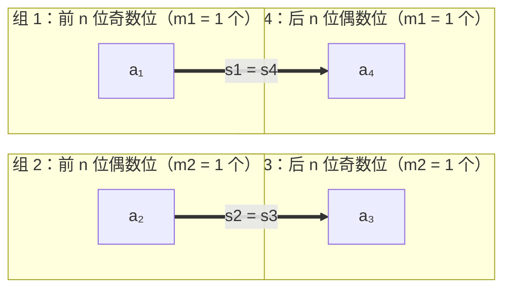

[[TOC]]

## 形式化题目

给定正整数 $n$ 与数字集合 $S \subseteq \{0, 1, \dots, 9\}$，求长度为 $2n$ 的序列 $a_1 a_2 \cdots a_{2n}$ 的个数（每位 $a_i \in S$，允许前导 $0$），满足

$$\sum_{i=1}^{n} a_i = \sum_{i=n+1}^{2n} a_i \quad \text{或者} \quad \sum_{k=1}^{n} a_{2k-1} = \sum_{k=1}^{n} a_{2k}$$

答案对 $999983$ 取模。数据范围：$n \leqslant 1000$，$|S| \leqslant 10$。

记两个事件为

- $A$：前 $n$ 位之和 $L$ 等于后 $n$ 位之和 $R$；
- $B$：奇数位之和 $O$ 等于偶数位之和 $E$。

要求的就是 $|A \cup B|$。

## 正解

### 思路

**暴力为什么不行。** 直接枚举 $2n$ 位有 $|S|^{2n}$ 种填法，$n = 1000$ 时是天文数字。就算用容斥 $|A \cup B| = |A| + |B| - |A \cap B|$，若想一次 DP 同时记录 $L, R, O, E$ 四个量，状态是四维的，同样不可承受。突破口在于：这四组和的约束**高度退化**，可以解耦成彼此独立的两两相等。

**单事件 $|A|$ 的计数。** $L, R$ 各自只依赖前 $n$ 位、后 $n$ 位，两段彼此独立。设

$$f(k, s) = \#\{\text{用 } S \text{ 中数字构成 } k \text{ 位，数位和恰为 } s\}$$

则先定前 $n$ 位和为 $s$（$f(n, s)$ 种），后 $n$ 位和也必须为 $s$（$f(n, s)$ 种），于是

$$|A| = \sum_s f(n, s)^2$$

$B$ 只是把「前 $n$ 位 / 后 $n$ 位」换成「奇数位 / 偶数位」，各 $n$ 个位置，是同一件事，故 $|B| = |A|$。

**交集 $|A \cap B|$ 的解耦（本题关键）。** 把 $2n$ 位按「前半 / 后半」与「奇数位 / 偶数位」切成四组：

| 组 | 位置 | 个数 | 和 |
| --- | --- | --- | --- |
| 1 | 前 $n$ 位中的奇数位 | $m_1 = \lceil n/2 \rceil$ | $s_1$ |
| 2 | 前 $n$ 位中的偶数位 | $m_2 = \lfloor n/2 \rfloor$ | $s_2$ |
| 3 | 后 $n$ 位中的奇数位 | $m_3$ | $s_3$ |
| 4 | 后 $n$ 位中的偶数位 | $m_4$ | $s_4$ |

四个组的位置个数是确定的：区间 $[1, n]$ 内的奇数下标有 $\lceil n/2 \rceil$ 个（组 1），偶数下标有 $\lfloor n/2 \rfloor$ 个（组 2）；区间 $[n+1, 2n]$ 内的偶数下标有 $n - \lfloor n/2 \rfloor = \lceil n/2 \rceil$ 个（组 4），奇数下标有 $\lfloor n/2 \rfloor$ 个（组 3）。也就是**无论 $n$ 奇偶**都有 $m_1 = m_4 = \lceil n/2 \rceil$、$m_2 = m_3 = \lfloor n/2 \rfloor$（可直接代入 $n = 2$、$n = 3$ 各数一遍验证）。

两条条件分别写成

$$L = R \iff s_1 + s_2 = s_3 + s_4, \qquad O = E \iff s_1 + s_3 = s_2 + s_4$$

两式相减，消掉 $s_1, s_4$：

$$(s_1 + s_2) - (s_1 + s_3) = (s_3 + s_4) - (s_2 + s_4) \implies s_2 - s_3 = s_3 - s_2 \implies 2(s_2 - s_3) = 0$$

在整数上 $s_2 = s_3$，代回任一式得 $s_1 = s_4$。反过来若 $s_1 = s_4$ 且 $s_2 = s_3$，两式显然成立。于是

$$L = R \ \wedge\ O = E \iff s_1 = s_4 \ \wedge\ s_2 = s_3$$

**这一步让问题彻底解耦**：组 1 与组 4 各有 $m_1 = \lceil n/2 \rceil$ 个位置、只要求和相等，组 2 与组 3 各有 $m_2 = \lfloor n/2 \rfloor$ 个位置、只要求和相等，而这两对位置互不相交、互不约束。所以

$$|A \cap B| = \Big(\sum_u f(m_1, u)^2\Big) \cdot \Big(\sum_v f(m_2, v)^2\Big)$$

**答案。** 由容斥

$$\text{Ans} = \big(2|A| - |A \cap B|\big) \bmod 999983$$

举 $n = 2, S = \{1, 2\}$ 复核：$f(1, \cdot)$ 在 $s = 1, 2$ 处为 $1$；$f(2, 1) = 1, f(2, 2) = 2, f(2, 3) = 1$，$\sum_s f(2, s)^2 = 1 + 4 + 1 = 6$。$m_1 = m_2 = 1$，$f(1, \cdot)$ 的平方和 $= 1^2 + 1^2 = 2$，交集 $= 2 \times 2 = 4$，答案 $= 2 \times 6 - 4 = 8$，与题面「合法的好数字有 $8$ 个」以及列出的 $1111, 1122, 1212, 1221, 2112, 2121, 2211, 2222$ 完全一致。再看题面样例 $n = 2$、$S = \{0, 1, \dots, 9\}$（输入串 `0987654321`）：用 $2$ 个数字凑出和 $s$ 的方案数依次是 $1, 2, \dots, 9, 10, 9, \dots, 1$（$s = 0 \dots 18$），故 $\sum_s f(2, s)^2 = 2(1^2 + \dots + 9^2) + 10^2 = 570 + 100 = 670$；而 $\sum_s f(1, s)^2 = 10$，交集 $= 10 \times 10 = 100$；答案 $= 2 \times 670 - 100 = 1240$，与【输出样例】完全一致。

### 代码

@include-code(./main.py, python)

Python 版本用的是同一套公式，但把「背包 DP」写成**多项式幂**：$f(k, \cdot)$ 的生成函数正是 $\big(\sum_{d \in S} x^d\big)^k$，而多项式乘法可以用大整数乘法打包完成（每个系数占 8 字节的槽，槽内不进位），于是 $O(n^2)$ 的 DP 变成几次快速幂里的整数乘法，$n = 1000$ 时在 CPython 里也是瞬间出结果。按背包 DP 逐位递推的 C++ 完整版本：

@include-code(./main.cpp, cpp)

### 复杂度

- 时间：背包 DP 按位递推，第 $k$ 位枚举 $9k$ 个和、每个和枚举 $|S|$ 个数字，总计 $O(n \cdot 9n \cdot |S|) \approx 9 \times 10^7$ 次基本运算，$n = 1000$ 时轻松跑进 $1000 \text{ ms}$。
- 空间：只保留三个快照（$f(\lceil n/2 \rceil, \cdot)$、$f(\lfloor n/2 \rfloor, \cdot)$、$f(n, \cdot)$）加一个滚动数组，$O(9n)$ 个 `int`，约 $36$ KB，远小于 $128$ MB。
- Python 版把 DP 换成多项式快速幂 + 大整数卷积，复杂度降为 $O(n \log n)$ 量级的整数乘法，空间同为 $O(9n)$。

## 总结

本题的骨架是「容斥 + 背包计数」，但真正的难点在交集。把 $2n$ 位按前后半、奇偶位切成四组后，两条线性条件相减就逼出 $s_2 = s_3$、$s_1 = s_4$，原本耦合的四维约束退化成两组互不相干的「等长序列和相等」。于是整道题只剩一个原语：给定段长 $k$，求两段 $k$ 位数位和相等的配对数 $\sum_s f(k, s)^2$。这个原语由数位和分布 $f(k, s)$ 的 $0/1$ 背包给出，答案就是

$$2\sum_s f(n, s)^2 - \Big(\sum_u f(\lceil n/2 \rceil, u)^2\Big)\Big(\sum_v f(\lfloor n/2 \rfloor, v)^2\Big) \pmod{999983}$$

实现上要注意三点：集合要去重（题面给的是「集合」）；$n$ 为奇数时 $\lceil n/2 \rceil \neq \lfloor n/2 \rfloor$，快照别混；$n = 1$ 时 $\lfloor n/2 \rfloor = 0$，$f(0, 0) = 1$ 的退化情形要显式处理。

## 数据说明

本题素材源（`new_ROJ/problems/1778/`）附带了数据生成脚本 `data.py`，说明 `data/` 是**按题面重建的自造数据**、题面本身也是网络重建，与官方一本通原题的口径可能存在偏差，使用数据时需留意。数据生成脚本用了一套**解析可证的锚点**（$|S| = 1$ 时答案恒为 $1$；$n = 1$ 时答案 $= |S|$）加题面给定的两个锚点（$n=2, S=\{0,\dots,9\} \to 1240$；$n=2, S=\{1,2\} \to 8$），其余点（$n = 7, 100, 500, 999, 1000$）的期望值只是标程输出的回归锚点，并非独立复算。本次交付用**独立写的暴力枚举**（枚举 $2n$ 位、直接判定两条件）在 $n \leqslant 4$、六种集合上复核了本题解法与题面定义一致（含 $n=2,S=\{1,2\} \to 8$），并让 `main.cpp`、`main.py` 逐点跑过 `data/` 的全部 $10$ 个点，均与 `.out` 相同。

## 图示解析

下图画出 $n = 2$、$S = \{1, 2\}$ 时四组位置的配对关系：组 1 与组 4 各 $m_1 = 1$ 个位置配对（和相等），组 2 与组 3 各 $m_2 = 1$ 个位置配对，两对彼此独立。

当 $n = 2$ 时 $L = a_1 + a_2$、$R = a_3 + a_4$、$O = a_1 + a_3$、$E = a_2 + a_4$，两条件相减立刻得到 $a_2 = a_3$，再代回得 $a_1 = a_4$——正是上图两条独立配对边。于是交集计数 $=$ （$a_1 = a_4$ 的选法数）$\times$（$a_2 = a_3$ 的选法数）$= (\sum_u f(1,u)^2)^2 = 4$（$S = \{1,2\}$ 时）。
