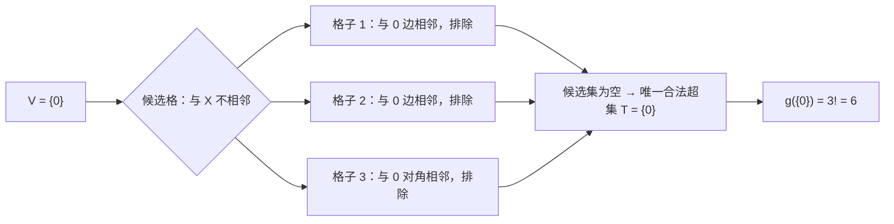
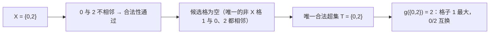
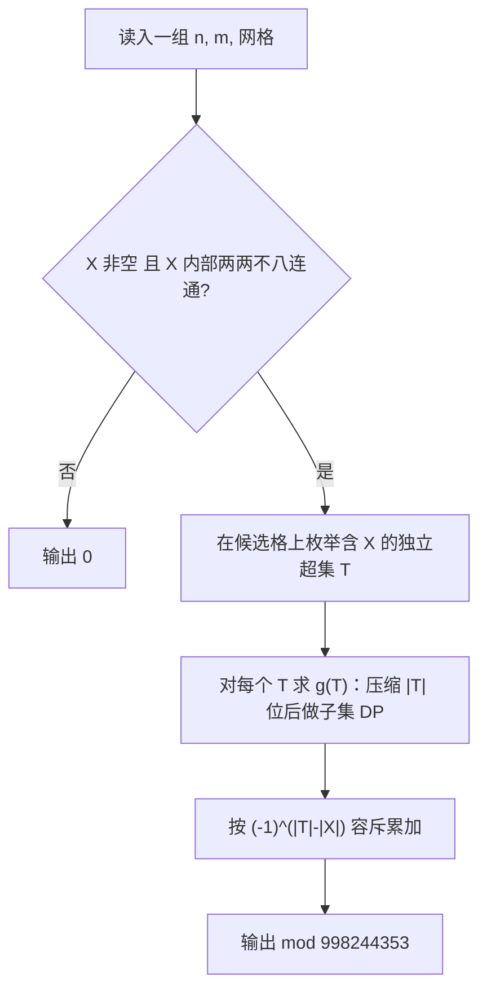

[[TOC]]

## 形式化题目

在一个 $n \times m$ 的网格里填入 $1 \sim nm$ 的一个排列 $A$，每个格子恰好填一个数、每个数恰好用一次。
定义格子 $v$ 是**山谷**，当且仅当

$$A_v < A_u \quad (\forall\, u \in N(v)),$$

其中 $N(v)$ 是 $v$ 的八连通邻居集合（上、下、左、右与 4 条对角线，共最多 8 个格子）。
给定一个由 `.` 与 `X` 组成的字符矩阵 $G$，记 $V = \{\,v : G_v = \texttt{X}\,\}$。要求统计满足

$$\{\,v : v \text{ 是山谷}\,\} = V$$

的排列 $A$ 的个数，答案对 $998244353$ 取模。输入为多组数据（读到文件结束），
每组先给 $n, m$，再给 $n$ 行长度为 $m$ 的字符串；每组输出一行答案。

数据规模：$1 \leqslant n \leqslant 4$，$1 \leqslant m \leqslant 7$（故 $N = nm \leqslant 28$），数据不超过 5 组。
两个样例分别是 `1 3 / X.X` 答案为 2、`2 2 / X. ..` 答案为 6。

## 正解

### 思路

**朴素做法与瓶颈。** 直接爆搜 $(nm)!$ 个排列显然不可行；按数字 $1 \sim nm$ 的顺序填格子、
用 $2^{nm}$ 状压记录已占用集合，状态数也有 $2^{28} \approx 2.7 \times 10^8$，何况还有多组数据。
更麻烦的是题面要求的是**双向**条件：`X` 的位置必须是山谷，`.` 的位置必须**不是**山谷。
在 DP 过程中同时照顾“必须”和“必须不是”，很难直接做。

**观察一：山谷集合必是八连通独立集。** 若 $u, v$ 八连通相邻且都是山谷，则 $A_u < A_v$ 与
$A_v < A_u$ 同时成立，矛盾。所以合法的山谷集合在八连通图上必然两两不相邻。
两个直接推论：

1. 输入的 `X` 中一旦出现相邻两格，答案立刻为 $0$；同样，山谷集合不可能为空——
   全局最小值所在的格子必然小于它所有邻居，无邻居时（$n = m = 1$）也恒为山谷。
2. 规模极小。$4 \times 7$ 的国王图最大独立集大小为 $\lceil 4/2 \rceil \times \lceil 7/2 \rceil = 8$，
   所以任何合法山谷集合最多 8 个格子。

**观察二：用容斥把“恰好”换成“至少”。** 设 $g(T)$ 为“$T$ 中每一格都是山谷、其余格子不作要求”
的排列数（$T$ 非独立集时 $g(T) = 0$）。于是恰好以 $V$ 为山谷集合的答案就是

$$\mathrm{Ans} = \sum_{\substack{T \supseteq V \\ T \text{ 为八连通独立集}}} (-1)^{|T| - |V|}\, g(T).$$

这一步把“`.` 必须不是山谷”从约束变成了容斥系数，是整道题的枢纽。
由于 $V$ 已被固定、能继续加进去的格子又必须与 $V$ 及其已选格都不相邻，
**合法的超集 $T$ 数量很少**（$4 \times 7$ 中 $X$ 为单角格时也只有 4749 个），
完全可以逐个枚举、逐个求 $g$。

**观察三：$g(T)$ 是偏序的线性扩张计数，可在 $2^{|T|}$ 上做子集 DP。**
把排列看成格子的一个全序（第 $i$ 个位置填 $i$），“$t \in T$ 是山谷”就等价于
“$t$ 排在自身与它全部邻居之前”。于是计数对象是：$t$ 先于 $N(t)$ 中每一格。

固定 $T$ 的内部先后顺序 $\sigma = (t_1, t_2, \dots, t_k)$，再把 $k$ 个山谷格之外的
$N - k$ 个格子插进这个序列。格子 $u \notin T$ 唯一的约束是“排在它在 $T$ 中最后一个邻居之后”，
设这个位置为 $h(u)$（无 $T$-邻居则无约束）。**按 $h(u)$ 从大到小依次插入**时，
插第 $j$ 个有约束格子时，序列中已有的全部元素都排在 $t_{h(u_j)}$ 之后，
可用位置数恰为 $k - h(u_j) + j$，连乘起来就是那一组的方案数。用
$C(Y) = \#\{\,u \notin T : N(u) \cap T \subseteq Y\,\}$（$Y$ 是山谷内部顺序的前缀集合）表示，
$h$ 相同的格子归为一组、每组有 $C_h - C_{h-1}$ 个，于是 $\sigma$ 这一支的贡献为

$$\prod_{h=1}^{k} \frac{(N - h - C_{h-1})!}{(N - h - C_h)!}.$$

对 $\sigma$ 求和就可以用前缀集合 $Y$ 作状态：

$$dp[Y \cup \{s\}] \mathrel{+}= dp[Y] \cdot \frac{(N - |Y| - 1 - C(Y))!}{(N - |Y| - 1 - C(Y \cup \{s\}))!},$$

初始 $dp[\varnothing] = 1$，最终 $g(T) = dp[T] \cdot \dfrac{N!}{(N - F)!}$，
其中 $F = C(\varnothing)$ 是在 $T$ 中完全没有邻居的格子数（它们随处可插）。

**转移系数的直观解释。** 设已填好山谷前缀 $Y$、当前网格里“允许被填”的格子共 $C(Y) + |Y|$ 个
（$|T| = k$ 里的 $|Y|$ 个已填山谷，外加所有 $T$-邻居已全在 $Y$ 内的非 $T$ 格子）。
要从 $Y$ 走到 $Y \cup \{s\}$，新解锁 $C(Y \cup \{s\}) - C(Y)$ 个格子，其中 $s$ 本身必须排在
最前，于是可选的相对排法数正是
$\dfrac{(N - |Y| - 1 - C(Y))!}{(N - |Y| - 1 - C(Y \cup \{s\}))!}$——
与上面的式子完全一致，只是换了个说法。$C(\cdot)$ 用子集和（zeta）变换在 $O(2^k k)$ 内一次求出。

**枚举超集 $T$。** 只有“不在 `X` 上、且与 `X` 中任何格子都不相邻”的格子才可能被加进 $T$；
在它们上面做一次选/不选的 DFS，选中一格就把它在候选集内的邻居封掉，产出的每个后缀都自动
与 $X$ 拼成独立集，按 $|T| - |X|$ 的奇偶带上正负号累加即可。
样例 `1 3 / X.X` 得到 2、`2 2 / X. ..` 得到 6，与题面一致。

### 代码

Python 版：

@include-code(./main.py, python)

C++ 版（同一算法）：

@include-code(./main.cpp, cpp)

### 复杂度

- **时间**：枚举合法超集 $T$ 的次数为 $S$（$4 \times 7$ 中最多约 $5 \times 10^3$），
  每个 $T$ 的代价是 $O(2^{|T|} \cdot |T| + N \cdot 2^{|T|})$，$|T| \leqslant 8$、$N \leqslant 28$。
  单组数据总代价约 $10^5 \sim 10^6$ 次基本运算，配合预处理好的阶乘表，
  C++ 实测毫秒级，Python 版也在限时内（限时 1000 ms）。
- **空间**：阶乘表 $O(N)$，每个 $T$ 的 DP 数组只有 $2^{|T|} \leqslant 256$ 项，总占用不到 1 MB
  （限时 256 MB）。
- **与 C++ 版的关系**：`main.py` 与 `main.cpp` 算法完全同阶，只是 Python 用 `@cache`
  缓存邻接表、用生成器枚举超集后缀；两者都靠同一容斥公式与同一子集 DP。

## 总结

- **先看约束的互斥性**：两个相邻格子不可能同时是山谷，这一句就把“合法集合是独立集、
  规模 $\leqslant 8$”两件事一起定下来，是后面一切枚举能够成立的前提。
- **“恰好”难写就换“至少”**：把“`.` 必须不是山谷”交给容斥，$g(T)$ 的约束只剩单向下界
  约束，立刻变成偏序计数，这是本题最值得记住的一步。
- **偏序计数按“最后一个前驱”插入**：把 $T$ 的内部顺序固定后，其余格子只需记住自己
  最后一个 $T$-邻居的位置；按该位置从大到小插入，可用位置数就是闭式的
  $k - h + j$，于是求和可以折叠成前缀集合上的子集 DP。
- **$C(Y)$ 用子集和变换一次算完**：$C(Y) = \#\{u : N(u) \cap T \subseteq Y\}$ 是“按子集累加”
  的标准形式，$O(2^k k)$ 预处理后就只剩查表。

## 补充说明

本题素材来自信息学奥赛一本通·高手训练篇（五、动态规划）。该题的素材源目录中带有数据生成脚本
（`data.py`，用 `std.cpp` 产出 `.out`），说明随仓测试数据是**自造重建**的，题面也可能为网络重建版本，
与官方原题在细节上可能有偏差。上面给出的算法与 `main.cpp` / `main.py` 均为独立实现，
已用该数据集的 10 个测试点逐点核对通过；但这只说明它与随仓数据一致，
不等价于官方数据的正确性保证。

## 图示解析

### 样例 `2 2 / X. ..` 的完整展开

网格按行优先编号：

```text
0 1
2 3
```

$X = \{0\}$，所以 $V = \{0\}$。候选格必须满足“不在 `X` 上、且与 `X` 中任何格都不八连通”：
格子 $1$、$2$ 与 $0$ 边相邻，格子 $3$ 与 $0$ **对角相邻**，三个格子全被排除，候选集为空。
于是枚举出的合法超集只有 $T = \{0\}$ 一个，容斥只剩一项 $g(\{0\})$。

$g(\{0\})$ 的数法：要求格子 $0$ 严格小于它的邻居 $1, 2, 3$，即 $0$ 必须是四格中的最小值。
最小值在排列里是唯一的，$0$ 的位置由排列本身决定，剩下的 $1, 2, 3$ 在三格上自由排列，
共 $3! = 6$ 种。把 $4$ 个格子 $1 \sim 4$ 的排列按“山谷集合”分类可以验证这一点：

| 山谷集合 | 排列个数 |
| :-: | :-: |
| $\{0\}$ | 6 |
| $\{1\}$ | 6 |
| $\{2\}$ | 6 |
| $\{3\}$ | 6 |

四类各 6 种、合计 $24 = 4!$，没有“两个山谷”的类（相邻格不可能同时为山谷），
所以 $\mathrm{Ans} = 6$，与题面样例一致。



### 样例 `1 3 / X.X` 的完整展开

网格编号 $0, 1, 2$，$X = \{0, 2\}$。两个 `X` 相距 2 格、不相邻，独立性检查通过。
$0$ 的邻居只有 $1$，$2$ 的邻居也只有 $1$，所以候选格列表为空，合法超集也只有 $T = \{0, 2\}$。

$g(\{0,2\})$ 要求“$0$ 是山谷”且“$2$ 是山谷”：两个条件都只要求自己小于格子 $1$，
即格子 $1$ 填的数最大，$0$ 与 $2$ 分掉剩下的两个数，共 $2$ 种，
与题面输出 2 一致。这里可以看清 $g(T)$ 与“恰好”的区别：$g$ 只管 $T$ 内每一格是山谷，
不禁止别的格子也当山谷；本题候选格为空，两类恰好重合，所以 $g$ 就是答案。



### 整体流程



枚举树的分支因子很小：候选格的每一个选择都会把它周围的邻居封掉，
$4 \times 7$ 中 $X$ 取单角格时合法超集最多约 $4749$ 个，再加上 $|T| \leqslant 8$
的位数上限，整棵树的总代价被压在 $10^6$ 以内。
